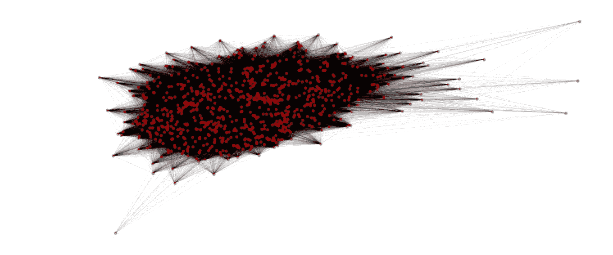
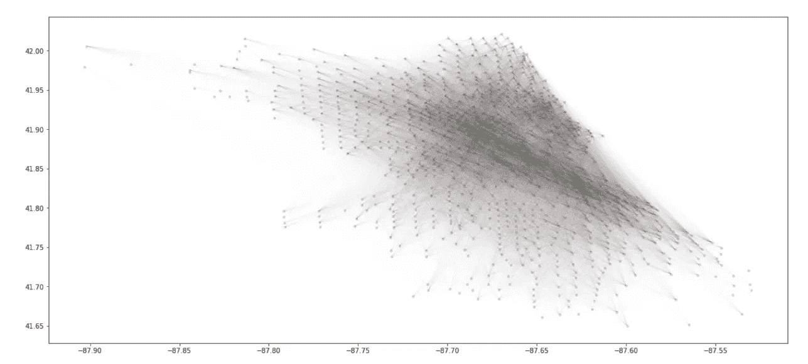
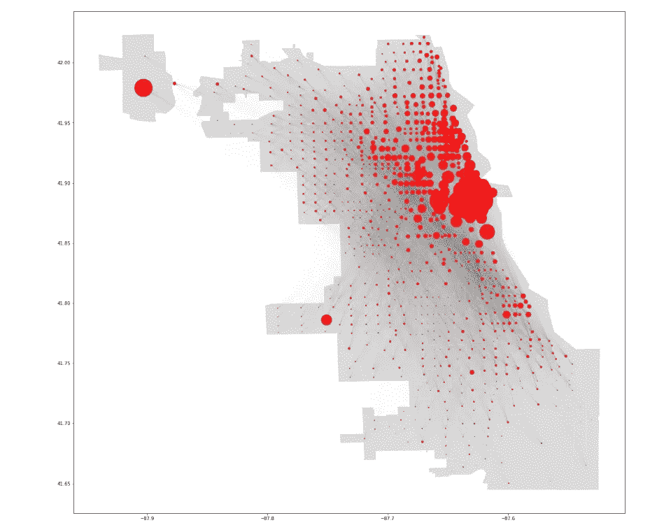
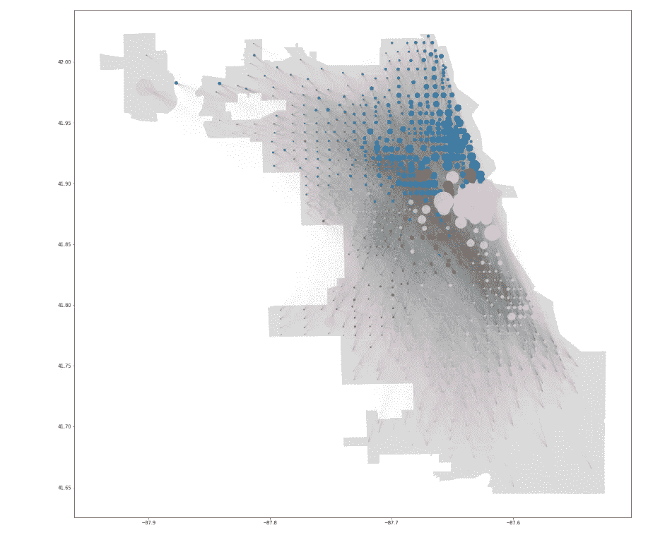

# 基于芝加哥拼车数据的网络分析和社区聚类

> 原文：<https://towardsdatascience.com/network-analysis-and-community-clustering-using-chicago-ride-share-data-1f21a4fb71cd?source=collection_archive---------27----------------------->

这个项目的灵感来自于对“智能城市”发展的兴趣，以及最近在芝加哥市在线数据门户网站上发布的拼车数据。收集、集中和发布数据的智能城市是深入分析社区和资源状况的运动的一部分。考虑到城市人口的增长，了解如何利用这些数据来制定决策和计划以改善城市生活变得越来越重要。

该项目的目标是利用芝加哥的公共拼车数据，以便更好地了解这些拼车发生在哪里，以及特定地理区域如何通过拼车连接起来。我通过以下步骤完成了这个目标 **:**

1.**从芝加哥的开放数据平台获取、清理和分析公开可用的拼车数据**

2.**使用拼车数据对芝加哥人口普查区域进行网络分析并进行可视化**

3.**使用聚类技术识别基于拼车的底层社区**

**数据清理和探索性分析包括以下步骤:**

1.  **访问数据集**
2.  **删除在芝加哥之外开始/结束的游乐设施**
3.  **统计每个
    上下车地点发生的乘车次数(唯一路线)**
4.  **为每个人创建经纬度坐标图
    人口普查区域**

**使用的拼车数据集可以在这里访问:**[https://data . cityofchicago . org/Transportation/Transportation-Network-Providers-Trips/m6dm-c72p](https://data.cityofchicago.org/Transportation/Transportation-Network-Providers-Trips/m6dm-c72p)

完整的数据集可以作为平面文件下载，或者通过调用芝加哥数据门户 API 来访问，如下所示:

Example of the API request result

根据芝加哥的数据门户，任何位置字段中的空值都表示该旅程发生在芝加哥以外。由于该数据无法估算，所有相对于坐标为空值的乘坐(行)都将被删除。

Example of the network analysis data-set created using the above code

为了以后在芝加哥的地图上绘制网络，我们需要一个每个独特的人口普查区域和相应的经纬度坐标的列表。创建该坐标图的方法如下所示。

**使用 Networkx**
进行网络分析在数据集清理完毕并准备就绪的情况下，使用 Networkx 软件包将每个人口普查区域位置可视化为图表中的一个节点，节点(边)之间的连接用黑线表示。

This is a non-directional graph representation of how Chicago census tracts are connected via ride-sharing. Not pretty right?

原始的图形表示几乎没有任何洞察力。通过使用每个普查区域的纬度/经度，我们可以用一种在地理上更像芝加哥的方式来绘制网络的节点。

Great! At least now we can see the graph taking shape. Notice the concentration of rides overlapping in the center of the city.

通过读取公开的芝加哥形状文件以及之前创建的坐标地图，我能够在实际的城市地图上可视化这个图形。我还添加了一个基于每个普查区域的总乘坐量的加权方案，以更好地了解每个区域有多少乘坐开始或结束。

With this we can clearly see that the majority of the rides take place in or around the Loop, a major urban area in Chicago. Also notice In the top left and mid left two large red circles representing Chicago’s two airports.

**使用 Louvain 模块性的社区聚类**
随着网络的建立，可以使用算法来对网络进行聚类，以便基于共乘数据来识别形成社区的位置。虽然一个芝加哥人可能能够回答这个问题，但我很好奇，仅凭互联网上公开的拼车数据，我能多快了解一个我从未去过的城市的交通状况。

选择的方法来自一篇名为“大型网络中社区的快速展开”的论文根据该论文，与社区外的节点相比，该方法试图最大化每个社区中节点之间的链接数量。它首先将每个节点随机分配到一个社区，然后将每个节点移动到一个新的社区，直到模块性最大化。这就创建了这样的社区，其内部的链接比与属于其他社区的节点的链接更紧密。幸运的是，这个方法是 Networkx 内置的。

The clustering seen here intuitively made sense. There are clear distinctions between the Loop and surrounding nodes, downtown and uptown Chicago. It was interesting to see that both airports were clustered along with the high volume nodes in the Loop. I can assume that’s because many travelers are heading to downtown hotels from these airports.

**我学到了什么？** 城市收集的数据在合适的人手里可以成为有力的工具。我无需踏足芝加哥，就能看到拼车是如何将某些社区联系在一起的，以及大多数拼车是在哪里发生的。看看社区聚类的结果是否会随着一天或一年的时间而变化，这将是一件有趣的事情！需要注意的一点是，拼车政策的变化会对城市的各个部分产生不同的影响。虽然有些人一直在谈论拼车作为老化的公共交通基础设施的补充的好处，但这里的网络集群清楚地表明，一些社区从拼车中获得的好处很少。

我想做的下一件事是将时间序列预测方法应用于这些社区群中的每一个，以观察我能多好地预测乘车量。希望其他城市能向芝加哥学习，投资于他们自己的开放数据平台，以便在城市规划和政策制定方面做出明智的、有数据支持的决策。

我迄今为止使用这个数据集进行的所有分析的完整代码可以在我的 [github](https://github.com/brhirsch/mlguild_capstone/) 上找到。

[1]Vincent D . Blondel，Jean-Loup Guillaume，Renaud Lambiotte 和 Etienne Lefebvre，[大型网络中社区的快速展开](https://iopscience.iop.org/article/10.1088/1742-5468/2008/10/P10008/pdf) (2008)， *J. Stat .机甲战士。* (2008) P10008