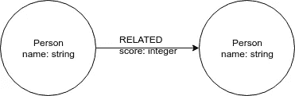
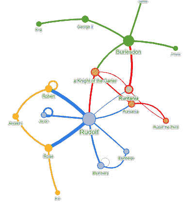

# 用 Spacy 和 Neo4j 对《证大囚徒》的网络分析

> 原文：<https://towardsdatascience.com/network-analysis-of-prisoners-of-zenda-book-with-spacy-and-neo4j-b0839a640105?source=collection_archive---------21----------------------->

多年来，互联网已经成为一种社交网络:联系和关系隐藏在众目睽睽之下——等待被发现。由于数据量巨大，这种关系很难用肉眼发现。然而，这并不意味着它们不存在或者不可能找到它们。

这篇博客的想法是在我和来自 [Signalfish.io](https://www.signalfish.io/) 的[杰瑞米·戴维斯](https://uk.linkedin.com/in/jeremydavies)进行头脑风暴时产生的。他们在生产中使用 SpaCy、Neo4j 和 Golang 来提供精选的新闻提要。SpaCy 具有实体识别系统。它提供了一个默认的 NLP 模型，可以识别各种命名实体，包括个人、组织等等。Neo4j 是一个原生图形数据库，从头开始设计用于处理关系和图形。

《T4 权力网》的分析给了我巨大的启发。如果我没记错的话，安德鲁·贝弗里奇在《权力的游戏》一书中用文本中人与人之间的距离来推断人与人之间的关系。我决定用 Spacy 和 Neo4j 做一些类似的事情。

## 要求

*   [空间](https://spacy.io/)
*   [Neo4j](http://neo4j.com)
*   [Neo4j 图形算法](https://neo4j.com/docs/graph-algorithms/3.5/)

## 议程

*   预处理文本
*   从文本中提取关系
*   导入到 Neo4j
*   运行 Louvain 和 Pagerank 算法
*   结果可视化

## 数据

我在找一些没有版权的书，这样每个人都可以遵循这个教程。一路走来，我发现了古腾堡项目，该项目提供大部分版权过期的免费书籍。我们将使用安东尼·霍普写的《曾达的囚徒》一书。

## 图形模型

图模型由带有标签 Person 的节点组成。每个人可以有一个或多个与其他人相关的关系。每个关系都有一个属性分数。在我们的例子中，它代表了两个人在文本中的互动次数。另一个需要注意的重要事情是，我们将把这些关系视为无向的。查看此[文章](https://dzone.com/articles/modelling-data-neo4j)了解更多详情。



Graph model

## 预处理

古腾堡计划很好地为我们提供了《曾达的囚徒》一书的文本版本。我们将获取文本文件，删除特殊字符，并将文本分成章节。

```
# [https://www.gutenberg.org/ebooks/95](https://www.gutenberg.org/ebooks/95) Prisoner of Zelda# Fetch the data
target_url = 'https://www.gutenberg.org/files/95/95-0.txt'
import urllib.request
data = urllib.request.urlopen(target_url)
raw_data = data.read().decode('utf8').strip()# Preprocess text into chapters 
import re
chapters = re.sub('[^A-z0-9 -]', ' ', raw_data).split('CHAPTER')[1:]
chapters[-1] = chapters[-1].split('End of the Project Gutenberg EBook')[0]
```

我们准备运行 Spacy 的命名实体识别。为了简化我们的分析，我们将只使用这本书的第一章。否则，我们将需要拿出一些名称映射系统，因为有时会使用一个人的全名，有时不会。这需要更多的手动方法，我们将在这里避免。

我们还将在文本中用单个单词的 id 替换人名，以简化我们的算法。

```
# import spacy and load a NLP model
import spacy
nlp = spacy.load("en_core_web_lg", disable=["tagger", "parser"])# Analyze the first chapter
c = chapters[0]
# Get a list of persons 
doc=nlp(c)
involved = list(set([ent.text for ent in doc.ents if ent.label_=='PERSON']))
# replace names of involved in the text
# with an id and save the mapping
decode = dict()
for i,x in enumerate(involved):
    # Get mapping    
    decode['$${}$$'.format(i)] = x
    # Preprocess text
    c = c.replace(x,' $${}$$ '.format(i))
```

这是一个非常简单的 SpaCy 操作演示。我们只分析了一小段文字。如果你想分析更大的数据集，你应该使用 *nlp.pipe(texts)* 函数。在[文档](https://spacy.io/usage/processing-pipelines#processing)中了解更多信息。

正如前面我们的图模型所描述的，下面是它的 cypher 查询。

```
save_query ="""
    MERGE (p1:Person{name:$name1})
    MERGE (p2:Person{name:$name2})
    MERGE (p1)-[r:RELATED]-(p2)
    ON CREATE SET r.score = 1
    ON MATCH SET r.score = r.score + 1"""
```

该算法设计简单。如果一对人在文本中相距不到 14 个单词，我们就推断出他们之间的关系。配对之间这种出现的次数被存储为关系的属性。

该算法遍历搜索人的单词。当它找到一个单词时(请记住单个单词的 id 系统)，它会检查接下来的 14 个单词以查找任何其他人。

```
# Get an array of words
ws = c.split()
l = len(ws) 
# Iterate through words
for wi,w in enumerate(ws):
    # Skip if the word is not a person
    if not w[:2] == '$$':
        continue
    # Check next x words for any involved person
    x = 14
    for i in range(wi+1,wi+x):
        # Avoid list index error
        if i >= l:
            break
        # Skip if the word is not a person
        if not ws[i][:2] == '$$':
            continue
        # Store to Neo4j
        params = {'name1':decode[ws[wi]],'name2':decode[ws[i]]}
        session.run(save_query, params)
        print(decode[ws[wi]],decode[ws[i]])
```

## 图形算法

我们将在分析中运行 [PageRank](https://neo4j.com/docs/graph-algorithms/current/algorithms/page-rank/) 和 [Louvain](https://neo4j.com/docs/graph-algorithms/current/algorithms/louvain/) 算法。Pagerank 是通常用于表示图中节点的重要性的中心性度量。Louvain 算法是一种社区检测算法，它在我们的图中找到社区。

Neo4j 图形算法引擎区分有向和无向图。我们必须使用参数 *direction: 'BOTH'* 来告诉引擎将关系视为无向关系。

```
pagerank ="""
CALL algo.pageRank('Person','RELATED',{direction:'BOTH'})
"""
louvain = """
CALL algo.louvain('Person','RELATED',{direction:'BOTH'})
"""
with driver.session() as session:
    session.run(pagerank)
    session.run(louvain)
```

## 形象化

我认为对于小型网络来说，一张图片胜过 1000 个字。我们将使用 [NeovisJS](https://github.com/neo4j-contrib/neovis.js/) 来可视化我们的分析结果。可视化的代码是无耻地从马克·李约瑟的 [Neo4j 图表笔记本](https://github.com/neo4j-graph-analytics/graph-algorithms-notebooks)库中复制的。

**NeovisJS 配置**

我们需要为生成 NeovisJS 可视化的函数提供一个配置文件。它由 Neo4j 的连接参数(主机、用户、密码)和定义可视化的三个参数组成。

可视化参数:

*   cypher:定义要从 Neo4j 获取的(子)图的 Cypher 查询
*   labels_json:定义节点的可视化(标题、大小和颜色)
*   relationships_json:定义关系的可视化(标题，大小)

```
cypher = "MATCH (p1:Person)-[r:RELATED]->(p2:Person) RETURN *"labels_json = {
    "Person": {
        "caption": "name",
        "size": "pagerank",
        "community": "community"
    }
}relationships_json = {
    "RELATED": {
        "thickness": "score",
        "caption": False
    }
}generate_vis(host, user, password, cypher, labels_json, relationships_json)
```

**结果**



鲁道夫似乎是第一章的主角。另一个重要人物是伯利斯顿。有趣的是，他和鲁道夫没有任何关系。右角是鲁道夫三世。我不知道这和鲁道夫是不是同一个人，因为我没读过这本书。在这个示例中，一些手动的名称清理会有所帮助。我们可以在图表中找到四个社区，它们的规模都差不多。

## 数据丰富

这仅仅是我们所能实现的开始。我们可以添加 SpaCy 在我们的文本中找到的其他类型的标签。例如，让我们将组织添加到我们的图表中。我们简单地看一下课文中的组织，检查一下人物的前五个和后五个单词。数字 5 是完全随意选择的，你可以使用任何你认为最有效的数字。

**数据预处理**

```
c = chapters[0]
doc = nlp(c)# Define the mapping
persons = list(set([ent.text for ent in doc.ents if ent.label_=='PERSON']))
orgs = list(set([ent.text for ent in doc.ents if ent.label_=='ORG']))
decode_org = dict()
decode_person = dict()# Replace person with an id
for i,p in enumerate(persons):
    decode_person['$${}$$'.format(i)] = p
    c = c.replace(p,' $${}$$ '.format(i))# Replace organizations with an id
for i,o in enumerate(orgs):
    decode_org['&&{}&&'.format(i)] = o
    c = c.replace(o,' &&{}&& '.format(i))
```

我们将像以前一样使用类似的 cypher 查询，只是现在我们存储的是个人和组织之间的关系。

```
save_org_query = """MERGE (p:Person{name:$person})
MERGE (o:Organization{name:$org})
MERGE (p)-[r:PART_OF]->(o)
ON CREATE SET r.score = 1
ON MATCH SET r.score = r.score + 1"""
```

运行算法并存储到 Neo4j

```
ws = c.split()
l = len(ws)
for wi,w in enumerate(ws):
    # Skip if the word is not a organization
    if not w[:2] == '&&':
        continue
    # Check previous and next x words for any involved person
    x = 5
    for i in range(wi-x,wi+x):
    # Avoid list index error
        if i >= l:
            break
        # Skip if the word is not a person
        if (ws[i][:2]!='$$') or (i==wi):
            continue
        # Store to Neo4j
        params = {'org':decode_org[ws[wi]],'person':decode_person[ws[i]]}
        session.run(save_org_query, params)
        print(decode_org[ws[wi]],decode_person[ws[i]])
```

组织对结果并不感兴趣，但是使用这种技术，您可以存储您喜欢的 NLP 引擎返回的所有不同类型的标签。这允许您构建一个知识图，表示任何给定文本中实体之间的关系。我们还可以使用不同的相似性度量，如 Jaccard 指数或重叠相似性来推断实体之间的关系。

另外，你可以在这里找到 Ipython 笔记本的所有代码。

*如果你对更多的网络分析感兴趣我推荐:*

[](https://neo4j.com/graph-algorithms-book/?utm_source=tbgraph)