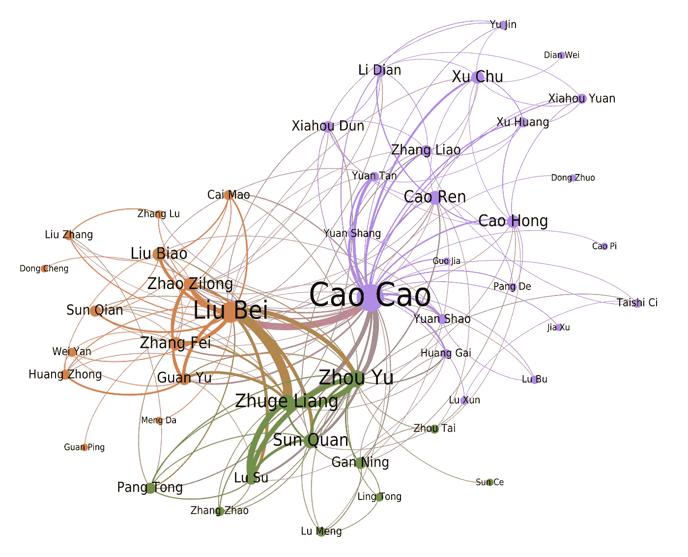
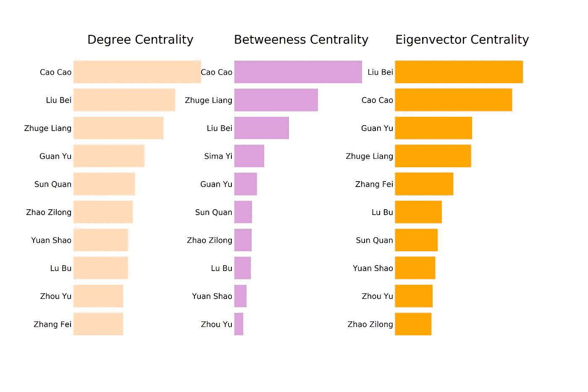

# 《三国演义》的网络分析

> 原文：<https://towardsdatascience.com/network-analysis-of-the-romance-of-three-kingdoms-5b1c1b84601d?source=collection_archive---------28----------------------->


最近，我发表了一篇关于 14 世纪小说《三国演义》的社交网络的文章。在文章中，我讨论了在分析小说人物的互动时出现的社会网络。此外，通过使用中心性测量，我确定了谁是最有影响力的人物。这篇文章是非技术性的，我的分析中的一些细节被省略了。

在这里，我提出了分析背后的代码，并进一步讨论了小说的社会网络的技术细节。此外，这段代码可以(稍加修改)用于对其他小说或文本进行类似的分析。

我的分析受到了 Andrew Beveridge 和 Jie Shan 对《权力的游戏》的[网络分析的启发。两部文学作品都有错综复杂的情节和大量的人物。这使得《三国演义》成为这种分析的一个很好的候选。](https://networkofthrones.wordpress.com/)

# 预处理

在开始分析《三国演义》之前，我必须做出一些初步的决定。

*   第一个决定是在我的分析中包含哪些字符。这部小说中出现了一千多个人物。为了让读者能够更密切地跟踪这些角色，只选择了 70 个角色。为了选择字符，我使用了以下步骤。首先，我选择了名字在整部小说中出现次数最多的 100 个角色。然后，我列出了在关于这部小说的网站和文章中出现最多的人物，在系列中出现的人物，甚至一些我个人认为重要的人物。我比较了这些列表，手动选择了哪些字符将保留在我的最终列表中。
*   我做的另一个决定是分章节分析这部小说。这部小说的篇幅很大。它包括 120 个章节，英语翻译版本包含超过 50 万字。我决定，为了更好地跟踪人物的互动，在分析全文之前，我应该把小说分成几组章节，并分别分析每一组。由于章节长度相似，我决定创建 30 个章节的组，总共 4 个组。最后，我还处理了整部小说，得到了所有人物的宏大网络。

通过使用 bash 脚本，我将 30 个一组的章节连接到单独的文件中，再加上一个包含全文的文件。接下来，我创建了 python 脚本，它将一个文本文件作为输入，并生成一个图形对象作为输出。然后，我可以用像 [Gephi](https://gephi.org/) 这样的工具进一步处理图形，以创建漂亮的网络可视化。


The network for chapters 1–30

我们首先导入文件并删除所有特殊字符，因为初始文本中有很多特殊字符

```
import rewith open(infile, 'r') as file:
    data = file.read().replace('\n', ' ')text = re.sub('[^A-Za-z0–9]+', ' ', data)
```

接下来，我们需要从文本中创建一个标记列表。Python 的`nltk`库可以很容易地为我们做到这一点。此外，我们从令牌中删除了停用词

```
import nltkstopWords = nltk.corpus.stopwords.words('english')def wordTokens(text, stop_words):

    wtokens = nltk.word_tokenize(text.lower())
    wtokens = [w for w in wtokens if w not in stop_words]return wtokens
```

因为我们在文本中寻找的名字都由两个单词组成，所以我们想要创建二元模型。在`nltk`的帮助下，这又变得非常简单

```
bigrm = nltk.bigrams(tokens)
bigrms = list(bigrm)
```

如果有一个单词的名字或两个以上单词的名字，我们可以通过包含初始标记以及三元模型或任何其他 n 元模型来概括代码。

最后，我们从字符列表中创建元组，以便直接与二元模型进行比较

```
def char_tuple_f(chars_list):
    char_tuples_list = []
    for char in chars:
        tup = tuple(char.split(" "))
        char_tuples_list.append(tup)return char_tuples_list
```



The network for chapters 31–60

# 计数交互

我们的最终目标是分析角色之间的互动。但是什么才算互动呢？在这里，我跟踪贝弗里奇和山，统计了两个角色的名字出现在小说中时，彼此之间的 15 个单词以内的互动。实际上，单词的数量，即字符的“单词距离”，本身也是一个变量。在对不同的值进行试验后，15 似乎是一个产生良好结果的值。

我们用字符的名字作为关键字创建一个字典。每个键的值都是一个所有索引的`numpy`数组，其中人物的名字出现在二元模型列表中。

```
def indices_dic(char_tuples, bigr):
    dic = {}
    for tup in char_tuples:
        char_name = " ".join(tup)
        indices = [i for i, x in enumerate(bigr) if x == tup]
        dic[char_name] = np.array(indices)

    return dic
```

然后，对于上述字典中的每个字符，我们取该字符的索引与其他字符索引的差。如果这种差异低于某个阈值(通常是 15)，我们就认为这是角色之间的一次交互。这里，`numpy`的向量化显著加快了代码的速度。最后，我们将每个角色的所有交互添加到一个字典中。

我们只考虑有 3 次以上互动的角色。这样做的原因如下。有时候，一个段落/行尾的人物名字和下一个段落/行首的人物名字可能会出现在我们的阈值内，即使这些人物之间并没有真正的互动。这种情况通常随机发生，并且对于相同的字符，它们发生三次以上的概率很低。另一方面，如果两个角色真正地相互作用，他们将有超过 3 次的相互作用

```
def links_dic_f(indices_dic, threshold):

    link_dic = {}
    for first_char, ind_arr1 in indices_dic.items():
        dic = {}
        for second_char, ind_arr2 in indices_dic.items():
            if first_char == second_char:
                continuematr = np.abs(ind_arr1[np.newaxis].T - 
                         ind_arr2) <= threshold
            s = np.sum(matr)
            if s > 3:
                dic[second_char] = s
        link_dic[first_char] = dic

    return link_dic
```

这部分代码可能还可以进一步优化。然而，对于我所分析的文本的大小，代码几乎是即时运行的，我不觉得需要进一步优化。


The network for chapters 61–90

因为我们在小说的所有部分都使用了相同的角色列表，所以在某些部分，一些角色可能没有出现，或者没有与任何人互动。这已经在交互字典中考虑到了，但是我们也想把它们从字符列表中删除。这样，我们的图中就不会出现没有边的孤立节点。

```
def remove_zero_link_chars(inter_dic, chars_list):
    rem_set = set()
    for key in inter_dic:
        if inter_dic[key] == {}:
            rem_set.add(key)

    fin_list = [char for char in chars_list if char not in rem_set]
    return fin_list
```

# 创建图表

现在我们有了一个包含所有角色互动次数的字典，我们准备创建一个代表角色网络的图。我们将使用`networkx`库来创建图表。`networkx`期望图的节点作为一个列表。我们已经有了，这是我们的角色列表。此外，它期望图的边作为两个节点的元组加上边的权重值给出。我们如下创建这些元组

```
def edge_tuples_f(link_dic):
    edges_tuples = []
    for key in link_dic:
        for item, value in link_dic[key].items():
            tup = (key.title(), item.title(), value)
            edges_tuples.append(tup)return edges_tuples
```

当我们有两个列表时，用`networkx`创建图表是非常简单的

```
import networkx as nxG = nx.Graph()
G.add_nodes_from(node_chars)
G.add_weighted_edges_from(edges_tuples)
```

最后，我们想要检测存在于我们的图中的社区。社区是我们的图的子集，其成员相互之间的交互多于与其他社区成员的交互。社区检测背后的算法超出了本文的范围。尽管如此，我们想要展示 python 模块`community`可以只用一行代码就完成这一点。我们将这个分区作为属性添加到图的节点中。Gephi 稍后可以使用它来对节点进行分组。

```
import communitypartition = community.best_partition(G)
nx.set_node_attributes(G, partition, ‘group’)
```

我们将图表导出为一个`.gexf`文件

```
nx.write_gexf(G, outfile)
```

使用 Gephi，我们可以生成图形的美丽可视化。在 Gephi 中创建网络的要点是我使用了 Force Atlas 布局。此外，我使用社区组的节点颜色和边的数量来确定节点的大小。


The network of the full text

# 中心性

为了找到小说中最有影响力的人物，我们研究了中心性测量。我们计算了三种不同的中心性。

*   **度中心性**定义为每个节点的边数。一个节点，或者在我们的例子中的一个字符，有更多的边，被认为更有影响力
*   **中间中心性**显示一个节点在两个其他节点的最短路径内被发现的次数。实际上，它确定了角色
*   **特征向量中心性**根据节点的连接来衡量节点的重要性，但与其他重要节点的连接比与不重要节点的连接贡献更大。它识别与强大角色交互的角色。

我们使用这三个中心来计算一个角色的重要性。由于我们不能直接比较不同的中心性，最终，我们的断言将是定性的。然而，对于小说中的人物，我们认为与重要人物有联系的人比与次要人物有联系的人更有影响力。因此，我们认为特征向量中心性比其他两个中心性更能决定一个字符的重要性。此外，在我们的计算中，特征向量中心性考虑了边的权重。

`networkx`库包括计算所有三个中心性的算法。我们用每个节点的中心性创建一个`pandas`数据帧。

```
def calc_centralities(graph):

    dgc = nx.degree_centrality(graph)
    dgc = pd.DataFrame.from_dict(dgc, orient='index', columns=["DGC"])
    btc = nx.betweenness_centrality(graph)
    btc = pd.DataFrame.from_dict(btc, orient='index', columns=["BTC"])
    evc = nx.eigenvector_centrality(graph, weight='weight')
    evc = pd.DataFrame.from_dict(evc, orient='index', columns=["EVC"])df = pd.concat([dgc, btc, evc], axis=1)

    return dfdf = calc_centralities(G)
```

最后，我们为所有三个中心创建了一个包含前 10 个角色的图

```
import matplotlib.pyplot as pltdef plot_centrality(centr, df, title, n, col_list):

    ax = plt.subplot(1, 3, n)
    s = df.sort_values(centr, ascending=False)[:10]
    x = list(s[centr].index)[::-1]
    y = list(s[centr])[::-1]

    for i, v in enumerate(y):
        bars = plt.barh(x[i], v, color=col_list[n-1])

    plt.title(title, size=22)
    ax.get_xaxis().set_visible(False)
    ax.spines['top'].set_visible(False)
    ax.spines['bottom'].set_visible(False)
    ax.spines['right'].set_visible(False)
    ax.spines['left'].set_visible(False)
    ax.tick_params(axis='y', length = 0, labelsize=14)col_list = ["peachpuff", "plum", "orange"]
fig, ax = plt.subplots(1,3, figsize=(15, 10))
plot_centrality("DGC", df, 'Degree Centrality', 1, col_list)
plot_centrality("BTC", df, 'Betweeness Centrality', 2, col_list)
plot_centrality("EVC", df, 'Eigenvector Centrality', 3, col_list)plt.savefig(figfile_centr, dpi=300)
```

当然，对于图中的一种颜色，我们使用“桃子色”，这让我想起了[在桃花源](https://en.wikipedia.org/wiki/Oath_of_the_Peach_Garden)的誓言。



Centrality measures for the full text of the novel

完整的`jupyter`笔记本可以在[这里](https://github.com/dmanolidis/three-kingdoms)找到。分析的结果可以在这篇[文章](/the-network-of-three-kingdoms-df6f8f8a1263)中找到。