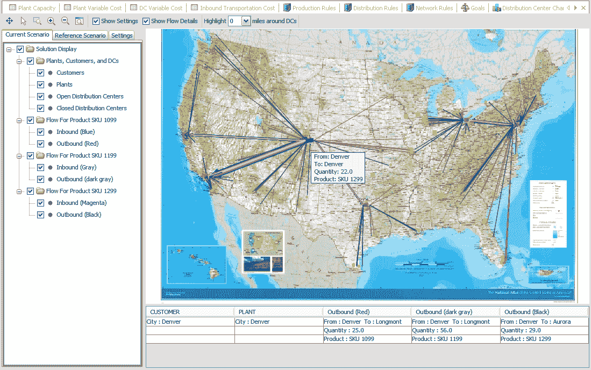
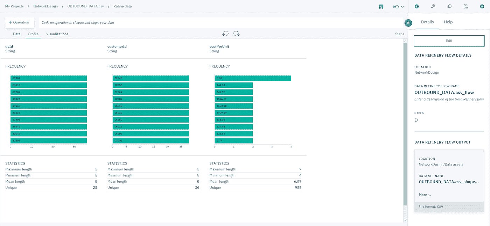
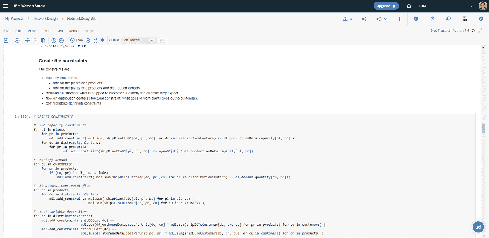
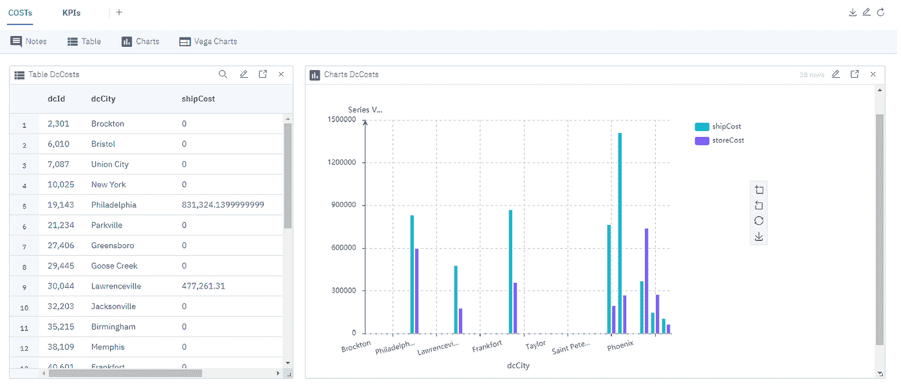
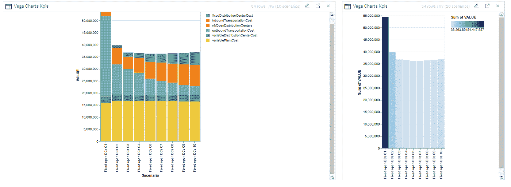
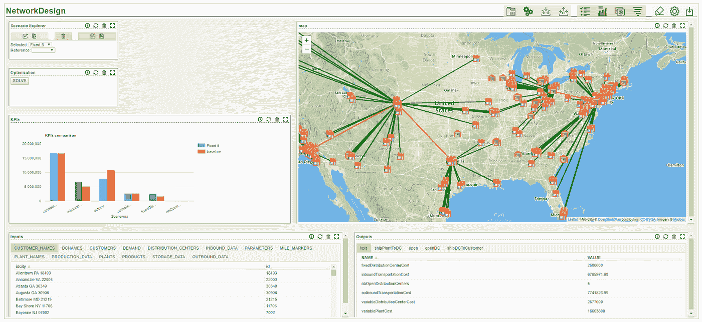

# 决策优化的网络设计

> 原文：<https://towardsdatascience.com/network-design-with-decision-optimization-3c7fcade523?source=collection_archive---------16----------------------->

Watson Studio 是一个平台，提供数据科学家创建、调试和执行所有类型的模型所需的一切，以使用人工智能(AI)解决业务问题。在本帖中，一个常见的供应链问题，即网络设计，被用来展示如何将不同的体验结合起来，以支持完整的端到端流程。

# 网络设计问题

[网络设计](https://en.wikipedia.org/wiki/Network_planning_and_design)是应用决策优化的常见问题。它帮助许多不同行业的公司设计他们的运营网络，从零售商的供应链到水或能源供应商的物理网络。

一个常见的需求是决定在一组可能的候选节点中使用哪个节点子集。你可能想开一些新的配送中心，有多种选择。打开哪一个？不同的地点有不同的固定成本和可变成本。此外，一方面，这些位置与工厂和/或供应商之间的距离，另一方面，与客户和/或商店之间的距离，将对运输成本产生重大影响。

这也是一个很好的问题示例，它包括[不同类型的数据，这将需要不同类型的科学](/data-types-for-data-sciences-65dcbda6177c):除了了解您现有的网络，并准确捕捉不同的节点和链路特征(边际成本、容量等)，您还需要知道预计流经该网络的流量，为此，还需要预测技术。最后，即使知道什么必须流动也是不够的:您将需要决策优化来利用所有这些数据，以及定义不同约束和目标的模型公式，以找出要选择的最佳位置。

# 旧演示

前段时间，在 [ILOG](https://fr.wikipedia.org/wiki/ILOG) ，我们卖了一个产品叫 Logic Net Plus，专门解决这类问题。它包括专用的预定义数据和优化模型，这有好有坏:好是因为它为那些不知道如何开始处理这个问题的人提供了最佳实践，坏是因为那些想要进行精确数据或优化建模的人不适合现有的配置功能。

[Logic Net Plus 2.0](https://www.researchgate.net/figure/Supply-chain-network-optimization-LogicNet-Plus-20-commercial-supply-chain-optimization_fig1_228656529)

同样在 ILOG，然后是 IBM，通过[决策优化中心](https://www.ibm.com/us-en/marketplace/ibm-decision-optimization-center) (DOC)，我们进行了解决类似问题的演示。DOC 是一个开发和部署业务线应用程序的平台。它包含所有你需要的，优化功能，数据管理和用户界面，但没有具体的数据或优化模型。然而，创建网络设计数据和优化模型以及创建网络设计应用程序非常容易。

[Decision Optimization Center](https://www.ibm.com/us-en/marketplace/ibm-decision-optimization-center)

[Decision Optimization Center](https://www.ibm.com/us-en/marketplace/ibm-decision-optimization-center)

# 如何使用沃森工作室/沃森机器学习的决策优化来管理这个问题？

本节将向您逐步展示 Watson Studio 和 Watson Machine Learning 中的新决策优化功能，这些功能可以帮助您解决这类问题。

**准备数据和需求预测**

如你所知，使用人工智能和数据科学的第一步是捕获和组织数据。例如，在这里，您需要连接到一个数据库来导入工厂、产品和客户，以及候选的新配送中心。

您通常还需要使用机器学习技术从历史数据中提取一些额外的运营数据来扩展它。例如，您需要根据历史数据预测所有产品和客户组合的需求。

这些部分在这篇文章中没有广泛涉及，但 Watson Studio 提供了许多工具来完成这项工作，如数据连接、数据精炼和自动 AI 或 SPSS 流。

Data Refinery

在这种情况下，来自旧的 IBM 决策优化中心供应链演示的数据(已知的和预测的)被重用。

该网络由工厂、配送中心和客户组成。一种或几种产品可以在这个网络中流动，问题的目的是规定在这个供应链中使用哪个(些)决策中心。给出了工厂的产量和客户的需求(根据历史数据预测)。还可以获得关于网络中不同节点和链路的不同成本和容量的一些数据。

**创建第一个笔记本**

你可以做的第一件事是创建一个 Jupyter Python 笔记本，并开始制定一个优化模型来解决这个问题。在这里可以看到关于这个[的介绍。](https://medium.com/@AlainChabrier/decision-optimization-generally-available-in-watson-studio-notebooks-514f718b957b)

在前面演示的模型中，新配送中心的固定成本和可变成本，以及不同的运输和存储成本，共考虑了五种不同的成本。

[Initial notebook](https://dataplatform.cloud.ibm.com/analytics/notebooks/v2/367a30b5-52e2-478f-8b9e-c02d2cbf49a1/view?access_token=41d932b68e4a0b6e31130b171a9cbf143a577b7d818957040a4e1d1bc582b9c1)

在 Watson Studio 中，使用 **docplex** 包创建一个新的 Jupyter 笔记本，导入已经上传到项目中的数据并开始制定优化模型是非常简单的。还预装了解决该问题的 CPLEX 库。

由此产生的笔记本可在[这里](https://dataplatform.cloud.ibm.com/analytics/notebooks/v2/367a30b5-52e2-478f-8b9e-c02d2cbf49a1/view?access_token=41d932b68e4a0b6e31130b171a9cbf143a577b7d818957040a4e1d1bc582b9c1)获得。您可以将它复制到您的项目中并运行它。

在数据初始化单元中，客户和产品的数量是有限的，因此问题足够小，可以在 Watson Studio 中的任何可用环境中解决。为了解决更大的模型，您将需要**‘Python 3.6+DO’**环境，其中包含无限的 CPLEX 功能。

在笔记本中，一些额外的**叶子** python 包也被用来在地图上表示解决方案。

**使用模型构建器**

在该模型中，要打开的节点数量受最小值和最大值的约束。因此，为不同的值创建不同的场景，以查看对不同成本和 KPI 的影响，并以图形方式显示这些影响，可能会很有意思。

在 Watson Studio 中，一个[决策优化模型构建器](https://medium.com/ibm-watson/decision-optimization-model-builder-now-in-open-beta-on-watson-studio-public-45db16628e5b)可用于这类用例。在模型构建器中，您可以遵循 3 个简单的步骤来导入数据、运行模型和探索解决方案。在这种情况下，您可以直接从同一项目中导入相同的数据，然后从之前的笔记本中导入模型公式。仅此而已。

Model Builder

在模型构建器中，您现在还可以创建可视化，以一种易于理解的方式显示模型的结果。例如，您可以看到每个配送中心的不同成本，就像最初的演示一样，如下所示:

然后，您可以创建不同的方案，并在参数表中为每个方案修改新配送中心的数量限制，并解决这些问题。

每个单独的场景都可以在可视化中进行探索，但是也可以配置比较图表来对它们进行比较。

这种创建和解决多个场景以更好地理解最佳解决方案的过程被称为**假设分析**。决策优化可以清楚地确定成本，以及多一个或少一个配送中心对成本的影响。您还可以探索每个值的最佳解决方案。

**以编程方式创建多个场景**

在实践中，您可能希望自动化创建修改的场景并解决它们的过程。在 Watson Studio 中，使用另一个非常简单的 Python 笔记本就可以轻松做到这一点。

笔记本使用 **dd_scenario** 包访问原始场景 1，并根据需要多次复制。对于每个新场景，通过修改输入表参数和重新求解来更改限制。

参见笔记本代号[这里](https://dataplatform.cloud.ibm.com/analytics/notebooks/v2/62ccb4b3-c3b0-4e5b-a332-9fe45a3ce9a8/view?access_token=d08acfd7a04e292f916918288f189babf3a0d2ad013d91541a36b97b2106e9d9)。

运行此笔记本后，所有新的场景将自动出现在模型构建器和可视化中。

The cost split by KPIs and for each possible value of number of new nodes..

**部署优化模型**

在基于主题专家的反馈对模型公式进行多次迭代改进之后，经验证的模型可以用于生产。

为此，您可以将模型部署到 WML 并获得一个 web 服务入口点，您可以轻松地将它插入到您的应用程序中。

**原型化一个 LoB 应用**

模型的验证和实际生产应用程序开发的准备需要一些用户界面，业务用户可以使用这些界面来理解模型的结果。

我贡献了一些代码(do-ws-js)，可以让你基于部署在 Watson Machine Learning 上的 Watson Studio 模型轻松创建一个 Node JS 应用程序，包括 do 和 ML 模型。

你可以在这里得到这个代码[。](https://github.com/IBMDecisionOptimization/do-ws-js)

使用这个框架，您可以非常容易地部署基于优化的 LoB 应用程序原型，重用已部署的优化模型、场景数据和可视化。在这种情况下，只有地图需要十几行 Javascript 代码。

Deployed prototype application

点击查看此应用的运行[。](https://ws-do-ucp-demo-app.eu-gb.mybluemix.net/?workspace=networkdesign)

*请注意，该应用程序部署在小型基础架构上，可能无法正确扩展。*

网络设计只是众多需要决策优化来完成数据科学家工具箱以解决业务问题的应用之一。

alain.chabrier@ibm.com

[https://www.linkedin.com/in/alain-chabrier-5430656/](https://www.linkedin.com/in/alain-chabrier-5430656/)

[https://twitter.com/AlainChabrier](https://twitter.com/AlainChabrier)