# 网络的网络——逆图形的神经符号方法

> 原文：<https://towardsdatascience.com/network-of-networks-a-neural-symbolic-approach-to-inverse-graphics-acf3998ab3d?source=collection_archive---------9----------------------->

许多人一旦熟悉了深度学习和神经网络，他们的第一个想法就是，“如果我们制作一个神经网络的网络会怎么样？”。这是一个完全有效的想法，一个被以许多不同方式探索的想法。人们发现这种方法最常见的地方是在自动机器学习( [AutoML](https://www.ml4aad.org/automl/) )中，其中小块迷你网络被重新组合，以找到理想地适合一些机器学习问题的完整神经架构。我在这篇文章中想要探索的既非常类似于 AutoML，又非常不同。我的目标是传达一个想法，而不是呈现公式。如果你对细节感兴趣，你可以在我们的论文“通过终身元学习改进的逆图形的神经符号架构”(【https://arxiv.org/abs/1905.08910】T2)中找到。

那么，如果我们可以为计算机视觉设计一个网络，其中每个节点代表一些对象，连接指示哪些对象是另一个对象的一部分，会怎么样呢？如果这个网络遇到一个新的对象，简单地把它作为一个节点添加到网络中会怎么样？它可能看起来像这样:

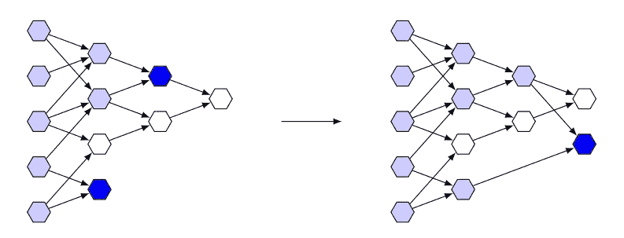

A Network that grows with each new object it sees, by connecting it to other objects that make up its parts.

当然，在某种意义上，我们当前的卷积神经网络(CNN)在内部做着非常类似的事情。通过重新训练它们，你可能也能学到更多的东西。但是，如果大部分网络没有做任何新的事情，为什么要重新培训呢？在什么情况下，我们需要扩大神经网络以适应更多的对象类型？上图似乎表明可能有一种替代方法。

# 生成语法

让我们后退一步。后退了一大步。让我们看看相反的情况。如果我们想基于一个单词生成一个图像，比如*【房子】*呢？嗯，我们来看看这个*房子是由什么构成的。大概一个*【屋顶】*和一些*【底层】*。还有*【底楼】*是什么做的？多个*【墙】s* ，一个*【门】*和【窗】s 。一切都是由某种东西构成的。这个过程可以用生成语法来概括，我们把放在括号里的单个事物称为符号**。***

***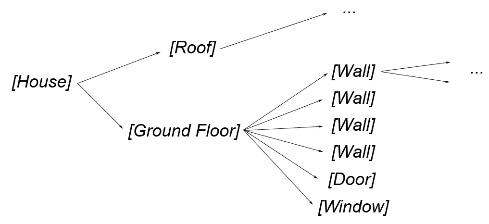***

***A partial parse-tree of a generative grammar for a [House].***

***嗯，这看起来有点像我们之前的网络，只是反过来而已…我们会谈到这一点。但是首先，我们将探索如何从*【房子】*到一个真实的房子的全图。有一组极其原始的图形元素，从中我们可以画出任何东西。最基本的显然是像素，但我们不会去那么深(虽然你可以)。再高一点，假设你只用*【正方形】【圆形】和*【三角形】就能画出整个世界，那么我们的房子会是什么样子呢？*****

***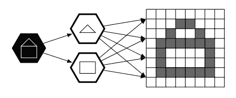***

***A [House] drawn from a starting symbol using triangles and squares.***

***酷毙了。我们能控制这个过程吗？当然可以！每个元素可以有**属性**来控制它的绘制方式。一个*【房屋】*有一个*位置*、*大小*和*旋转*来控制渲染过程。把它们想象成游戏引擎中一个物体的属性。我们还可以包括更复杂的属性，例如*多老*或*多黄*，也就是形容词。***

***此外，一栋*的房子可以有多层。这样我们就可以决定一个*【房屋】*应该画成*【屋顶】【底层】*还是*【屋顶】【地板】【底层】*。这些不同的可能性被称为语法的规则。****

# ****基元****

****让我们暂时集中在一个*【方】*上。它有自己的属性，但我们仍然需要一种方法将它绘制到屏幕上。因此，我们引入了一个渲染函数来完成这个任务。这对于我们选择的原语来说相当容易。我们将这个渲染函数称为**解码器**，因为它基本上将属性解码成实际的像素。****

****显然，等级中较高的每个符号也需要某种解码器，将它自己的属性转换成对后面的符号有效的属性。例如，规则*【房屋】→【屋顶】【底层】*的解码器将获取位于中心的房屋位置，并计算屋顶和底层的中心位置。****

****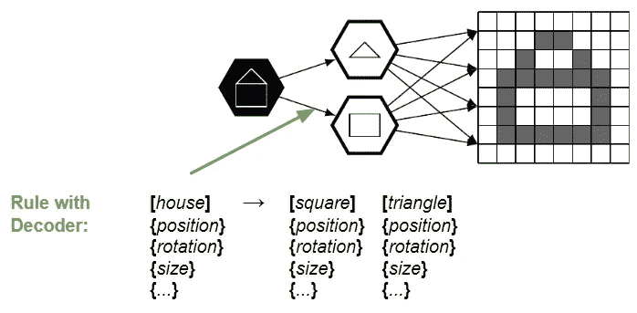****

****非常好。我们可以画图像。与我们实际想要做的正好相反…所以，让我们把整个事情翻转过来。****

****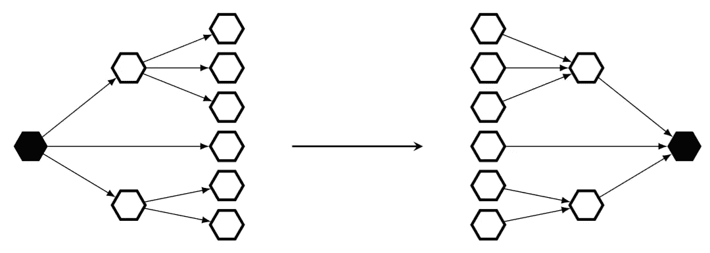****

****“Flipping” the Parse-Tree around.****

****但是我们必须翻转更多的东西，而不仅仅是连接。首先，我们必须反转解码器，使其成为一个**编码器**。****

# ****原始胶囊****

*****【三角形】*的编码器接收像素值，并试图找到该三角形的有效属性。很简单。让我们用一些回归模型，然后把它代入。我们甚至可以自己生成所有的训练数据，因为我们知道如何使用属性来绘制三角形。****

****但这还不够好。如果显示的是一个圆形而不是三角形的图片会怎么样？回归模型不在乎，只会产生怪异的属性。我们需要一种方法来验证图像确实是一个三角形。****

****不如，我们用回归模型产生的属性，绘制一个三角形，然后检查这些图像是否一致。如果一开始就是一个三角形，我们就应该达成一致，否则就不是！****

****所以，我们先编码，然后解码..那只是一个**自动编码器**！不完全是，因为我们手工制作了解码器。但仍然…我们只是添加了一个小的**一致函数**，这给了我们一个图像是三角形的概率。****

****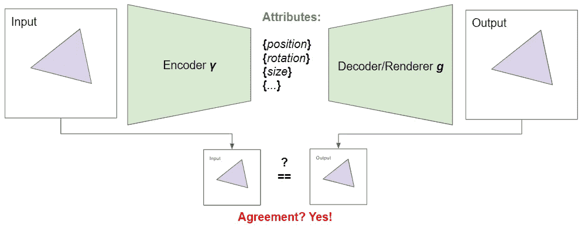****

****A look at the internals of a primitive capsule. An example of agreement (a [Triangle] capsule shown a triangle).****

****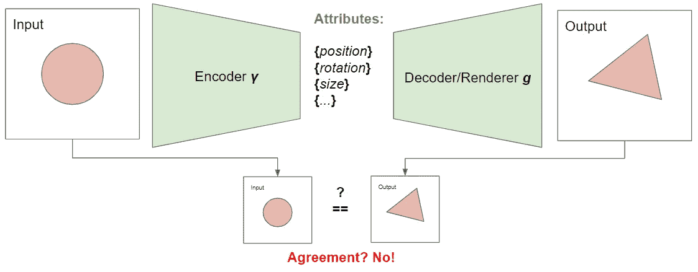****

****An example of disagreement (a [Triangle] capsule shown a circle).****

****我们现在两者都有了，所有的属性和来自协议的概率。干净利落。让我们称这个倒置的符号及其所有内部部件(编码器、解码器、协议函数……)为**胶囊**。更确切地说是一个**原语包**，因为它代表了图形原语。这些原始的胶囊遵循简单的规则:**如果我们可以渲染它，我们可以将其** … 至少去渲染成产生相同图像的东西。****

# ****语义胶囊****

****对于胶囊的下一层，事情有点复杂。这些函数从原语容器中获取原语，并检查它们是否是对象的正确部分。****

****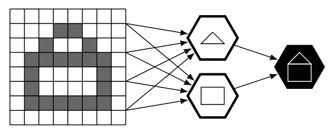****

****A Semantic Capsule ([House]) activating based on the output of the Primitive Capsules ([Triangle] and [Square])****

****我们不知道解码器是如何获取原始胶囊的输出并告诉我们一个对象的属性的。因此，我们不能训练一个编码器…如果我们假装知道编码器是什么样的呢？看起来很奇怪，对吧…但是想想我们的*【房子】*，它是由一个*【三角形】*作为屋顶，一个*【正方形】*代表底层。在向前传递的过程中，我们知道正方形和三角形的所有属性。整个房子的大小可以看作是它的各个部分的大小之和。对于房子的位置和旋转，我们只取正方形和三角形的平均值。同样的过程也适用于所有其他属性，比如颜色，我们可以取平均值。一个旧的底层(1.0)加上一个新的屋顶(0.0)，看上去就像一个中年的房子(0.5)。这是一个粗略的想法:我们假设，至少在开始时，我们的编码器类似于一个均值函数。****

****显然，有了这样一个一般的均值函数，*【三角形】**【正方形】*的任何一个**构型**都会构成一个有效的*【房子】*。我们不想那样。让我们再次创建一个具有协议功能的编码器-解码器对。这一次，我们需要训练解码器而不是编码器，但我们将在真实的房子上训练它。现在，每次将正方形和三角形的配置传递给*【House】*胶囊时，它都会对其进行编码，然后尝试根据这些属性重建房子。如果结果与原始结果有些一致，那么它就是一所房子。否则就不是。****

****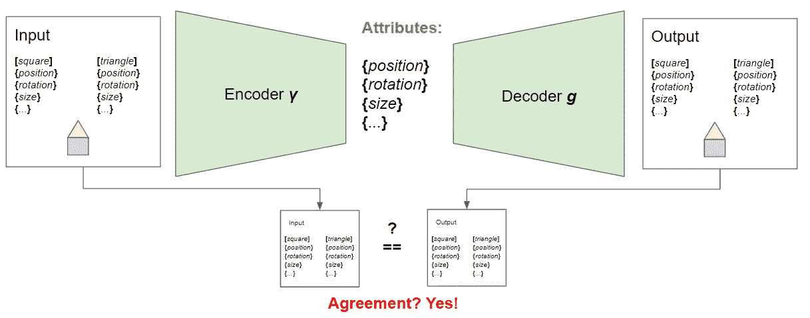****

****A look at the internals of a semantic capsule.****

****让我们将这种检查部件配置，即语义一致性的封装称为**语义封装**。****

# ****按指定路线发送****

****现在，我已经提到了这些符号可以有多种不同的产生规则(一栋一层或两层的房子，等等。).我们需要一些方法来处理我们的胶囊。如果我们允许每个胶囊有多个这样的编码器-解码器对，并检查哪一个最适合当前图像，会怎么样？好啊，我们走吧！让我们称每一个这样的可能对为**路线**。我们将整个过程称为**协议路由**。****

****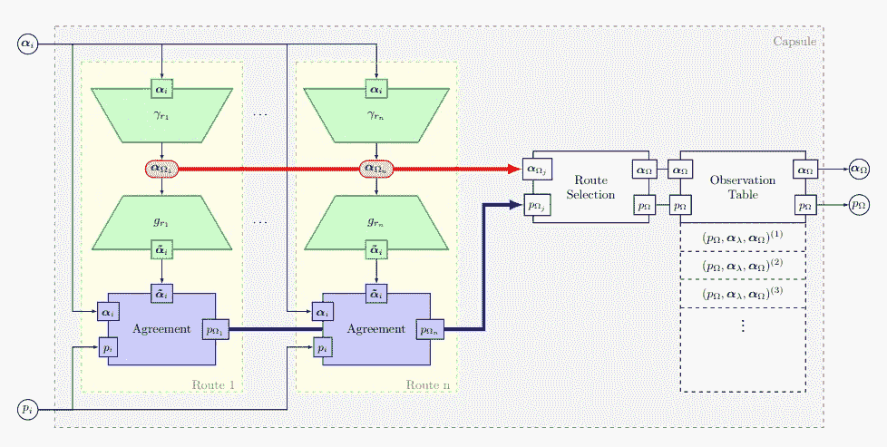****

****Detailed look at the internals of a Capsule (Primitive and Semantic). Note the different routes highlighted in yellow.****

****(这就是为什么我们称这些东西为胶囊。匹配输入并找到正确路线的想法是基于 [*Sabour、Frosst 和 Hinton*](https://arxiv.org/abs/1710.09829) *介绍的胶囊架构。然而，这里展示的胶囊有点不同，我们称它们为* ***神经象征胶囊*** *以免混淆*****

****每一个胶囊本质上都是一个神经网络的小容器。****

# ****终身元学习****

****接下来，您可能已经注意到，这里展示的每个胶囊都是独立于其他胶囊的。你是对的！训练一个胶囊对其他的没有影响。我们可以随意添加和移动胶囊(当然要检查属性是否匹配)。不如我们让整个网络随着它遇到的每一个新对象而成长吧！****

****首先，我们需要找到一种方法来确定网络何时真正遇到了它不理解的东西。因为它是基于语法的，所以这很容易。每次单个胶囊激活和检测一个对象时，都有一些“根”对象，即代表整个图像的一个对象。在语法术语中，这被称为一个**公理**。在我们的胶囊网络中，这个“根”不需要在最高层。如果图像只包含一个*【屋顶】**【房屋】*胶囊不会激活，但*【屋顶】*仍将是完全代表图像的“根”。我们将把这个**观察到的**“根”也称为公理。****

****然而，多个这样的公理可以在单个图像中激活。拿一个*【房屋】*和一个*【车库】*来说，这两个都已经激活，但是没有共享一个共同的父级。因此，我们似乎有两个我们不允许的公理。如果发生这种情况，这意味着我们遇到了一个新的对象或场景，所有这些公理都只是其中的一部分，例如*【房子】*和*【车库】*是*【庄园】的一部分。*****

****考虑一个不同的例子，让我们再来看看我们已经学会如何检测*【豪斯】*的网络。它知道如何处理底层。但是如果有更多呢？如果有五个额外的*【楼层】*激活呢？那么*【房子】*胶囊就不会激活。当然，它可以为底层加上五层中的一层生成一些属性，但是它的协议功能会注意到屋顶的位置不合适。我们必须添加一个新的胶囊作为这些激活胶囊的新公理，比如一个*【apparent】*胶囊。****

********

****Slightly different example of capsules activating (blue), but there is a shared axiom missing (left). This is rectified by adding a new capsule that acts as the parent to all previously dangling capsules (right).****

****然而，请注意，我们并不停留在不同的物体上，而是描述场景。*【办公室】**【新加坡乌节路】**【棒球赛】*，全部完全有效。想象一张有 10 栋房子的图片。我们会有 10 次活动。这又一次违反了“只有一个公理”的规则。于是，我们创建了一个叫做*【镇路场景】*。****

****当然，这个决定需要一些创造力。为 now 胶囊或属性命名仍然是一项人工任务。然而，胶囊网络所能做的是提出一个问题，网络会用元学习来回应。像下面这样:****

****问:“**这些地板和屋顶看起来像房子，但它是什么？***(【房屋】没有激活，即使存在多个【楼层】和【屋顶】)*****

****现在，这会引发人类不同的反应。每个表示不同的元学习过程。****

****答 1:“**是一栋房子。***(元学习为现有[豪斯]胶囊训练新路线)*****

****A.2: " **这是一个明显的事实。***(元学习训练一个新的【表观】胶囊)*****

******这是一栋老房子。** " *(元学习继续用[House]胶囊的新数据训练现有属性“old”)*****

****b . 2:“**是个有钱人的房子。***(元学习为现有的【宅】囊训练一个新属性“富”)*****

****如果我们收集了足够多的人类决策，我们可以为胶囊网络训练一个决策矩阵。然后，一旦它学习了足够多的响应，网络就可以自己做出这些决定，并改进它原来的问题，甚至自己回答它！****

****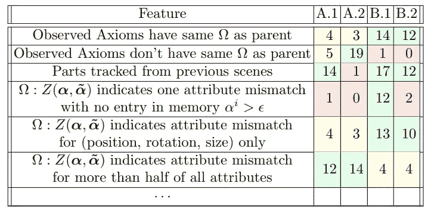****

****An excerpt of a decision matrix. Each of those features says something about the current activations in the network, the details of which are unimportant at this point. For all features that evaluate to “True”, the values on the right are added up and the column with the highest value is equal to the decision (A.1 — B.2). Training this matrix simply means adding “1” to the column that was chosen by the human for the rows that evaluate to “True”.****

****但是我们用什么来训练这些新加入的胶囊，路线或者属性呢？用它刚刚收到的数据？当然，但这还不够，不是吗？我们 T12 扩充 T13 数据怎么样！在我们的情况下，这实际上很容易。毕竟我们可以访问所有的属性。移动设备(增加设备的位置属性和产生的楼层/屋顶符号)并不能改变设备的事实，我们这样做可以产生大量的数据。旋转或调整大小也不会改变间隔。我们可以对几乎所有的属性都这样做。如果每个楼层都有一个*旧的*或*黄的*属性，我们可以一次将它们全部转移并增加训练集。对于一个*旧的*外观，我们会假设所有的地板和屋顶都是*旧的，*，但它仍然是一个外观。****

****显然，我们会在粗略的扩充中犯错误，但这是一个开始。考虑到我们只有一张照片，聊胜于无。单枪匹马很难，即使我们在作弊。****

****现在，下一次电视网看到一个节目，它会……也许会理解它。但是，当网络遇到相同类型的图像时，我们总是可以添加更多的训练数据，再次使用我们的增强策略。这不是太密集的计算，因为我们隔离了每个胶囊，不需要重新训练网络的其余部分。而且，慢慢地，它会明白…这整个元学习过程非常像教一个蹒跚学步的孩子什么是对象。和初学走路的孩子一样，这是主观的，很大程度上取决于父母教什么和以什么顺序教。例如，以下面两个以不同方式训练的胶囊网络为例，但是得出相同的结论:****

****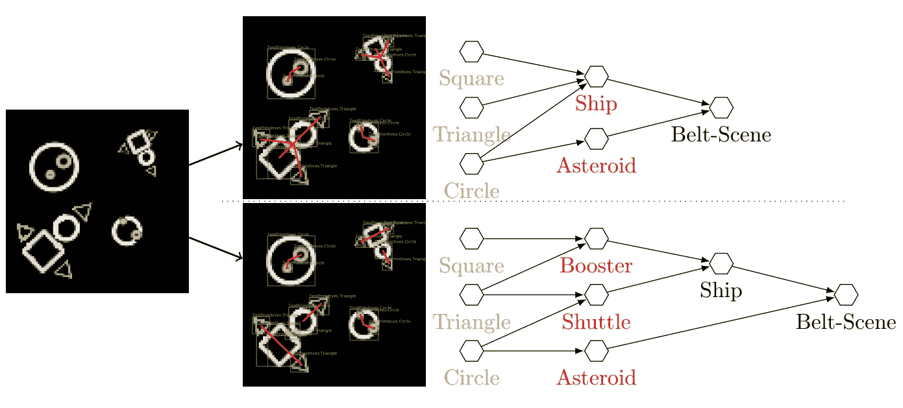****

****Two capsule networks meant to train for an asteroids like environment, but both end up with a different network configuration.****

****差别是微妙的，但随着时间的推移，这两个网络将会越来越相互背离。****

****我们现在有一个完整的网络，可以检测各种对象，随着时间的推移学习检测新的对象，甚至给我们它的属性。****

****但是我们也可以做一些其他的事情！我们能****

*   ****生成场景的语义网络！即底层语法的解析树。****
*   ****重复使用胶囊网络，并简单地在其上扩展！不需要重新培训旧的东西，允许一些联合学习。****
*   ****反向使用胶囊网络(作为原始语法)并用它生成图像！它只是一个引擎盖下的反向图形引擎。****
*   ****使用属性来分割图像！我们知道所有的尺寸和位置。****
*   ****生成图像的基本描述！毕竟一个胶囊的符号只是一个名词(*【屋】*，…)，一个定语只是一个介词(位置，旋转，…)，一个形容词(老，黄，…)或者一个动词(后面的部分探讨)，它们的量级可以解释为一个副词(0.0 =不，非常= 1.0，…)****
*   ****做简单的风格转移！使用多个规则/路线，一个*【门】*可以被绘制成一个正方形(抽象)或一个实际的门(真实)，这将自动转移到任何一个有*【门】*作为其一部分的对象。****
*   ****做物理！有人做过逆向模拟吗？****

# ****结论****

****我已经忽略了在论文中找到的很多细节[，比如网络和语法如何处理遮挡，元学习代理如何在网络上扩展，避免使用同一胶囊的多个副本的“观察表”等等。但是我希望我能够传达一个大概的意思。](https://arxiv.org/abs/1905.08910)****

****在下一部分，我想探索物理学如何使用这种方法([https://arxiv.org/abs/1905.09891](https://arxiv.org/abs/1905.09891))以及胶囊网络如何从一个逆向图形引擎演变为一个逆向模拟引擎，希望有一天以一个逆向游戏引擎结束。****

****是的。到目前为止，大多数结果都不令人印象深刻，如果这甚至可以扩展到真实图像，而不是目前正在处理的 MSPaint 级别的输入，还有待证明。Kosiorek 等人。艾尔。基于类似的原理开发了一种不同的方法，称为“堆叠胶囊自动编码器”([https://arxiv.org/abs/1906.06818](https://arxiv.org/abs/1906.06818))，如果你对这种东西感兴趣，绝对值得一试！****

****我的主要希望是，这种略有不同的方法既有趣，又可能给你一些可以探索的想法，通过融入更多老式的象征方法。****