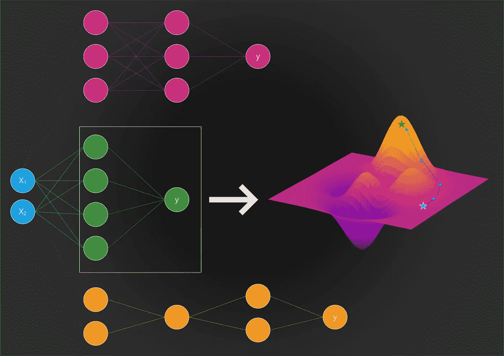
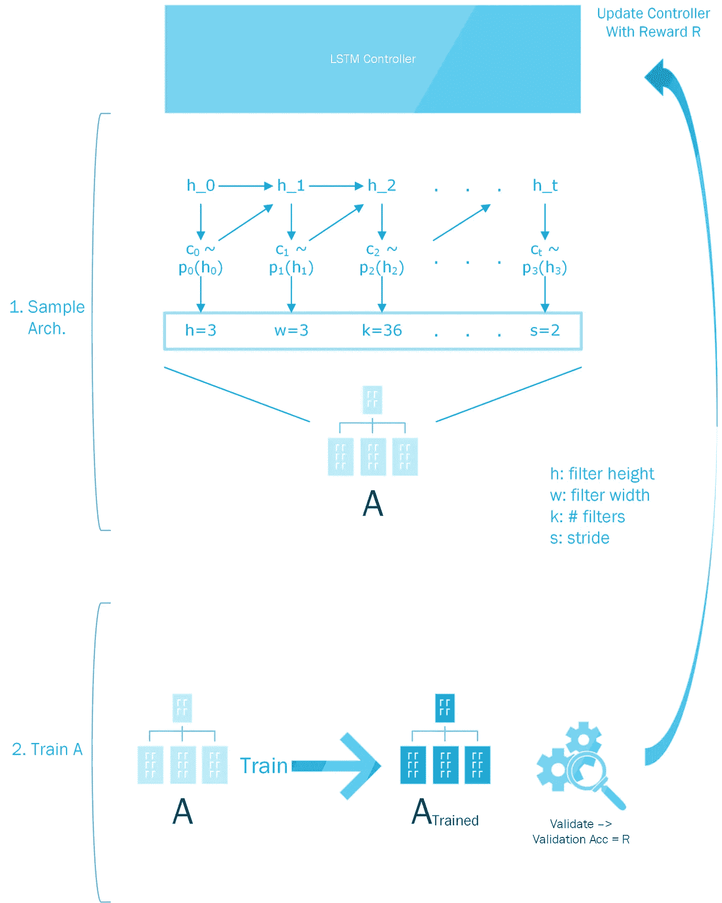
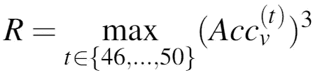
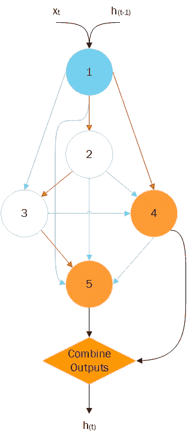
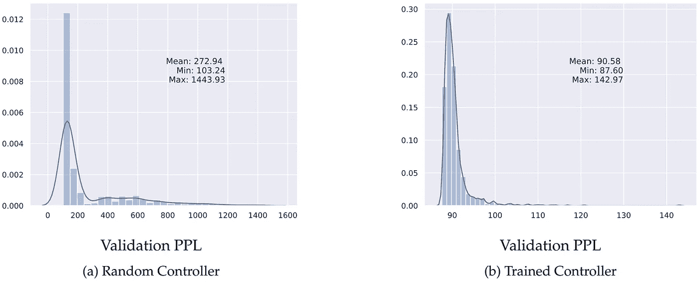
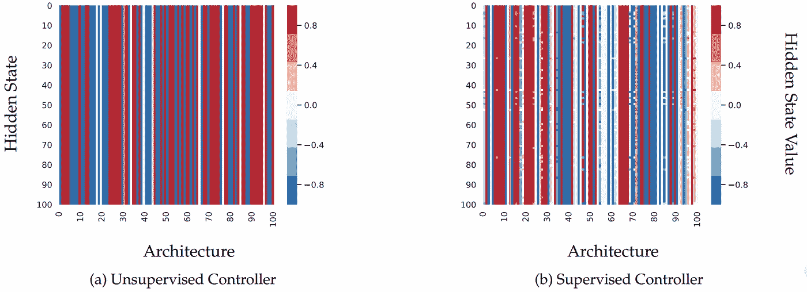
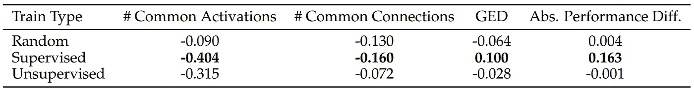

# 神经结构搜索——限制和扩展

> 原文：<https://towardsdatascience.com/neural-architecture-search-limitations-and-extensions-8141bec7681f?source=collection_archive---------11----------------------->

在过去的几年里，研究人员和公司一直试图通过提供预先训练的计算机视觉或机器翻译模型，让非专家更容易获得深度学习。将预先训练的模型用于另一个任务被称为迁移学习，但它仍然需要足够的专业知识来在另一个数据集上微调模型。这个过程的完全自动化允许更多的用户从 ML 迄今为止取得的巨大进步中受益。

这被称为 AutoML，它可以涵盖预测建模的许多部分，如架构搜索和超参数优化。在本文中，我将重点讨论前者，因为最近出现了大量为给定数据集搜索“最佳”架构的方法。所展示的结果基于与 Jonathan Lorraine 的合作。

## 神经结构搜索的重要性

作为旁注，请记住，只要该层中有足够的神经元( [UAT](https://en.wikipedia.org/wiki/Universal_approximation_theorem) )，仅具有单个隐藏层和非线性激活函数的神经网络就能够表示任何可能的函数。然而，这样一个简单的架构，虽然理论上能够学习任何功能，但并不代表人类视觉皮层中发生的分层处理。神经网络的架构使其具有归纳偏差，不使用卷积的浅宽网络在图像分类任务方面明显不如深卷积网络。因此，为了让神经网络进行归纳而不过度适应训练数据集，找到具有正确归纳偏差的架构非常重要(不管这些架构是否受大脑的启发)。

# 神经结构搜索(NAS)概述

NAS 是谷歌的一个鼓舞人心的作品，导致了几个后续作品，如[【ENAS】](https://arxiv.org/abs/1802.03268)、[【PNAS】](https://arxiv.org/abs/1712.00559)和[飞镖](https://arxiv.org/abs/1806.09055)。它涉及使用强化学习(RL)来训练递归神经网络(RNN)控制器，以自动生成架构。然后，这些架构的权重经过训练，并在验证集上进行评估。它们在验证集上的表现是控制器的奖励信号，然后控制器增加生成表现良好的架构的概率，并降低生成表现不佳的架构的概率。对于非技术读者来说，这基本上是一个人手动调整神经网络，学习什么工作得好，并将其自动化的过程。自动创建神经网络架构的想法并不是由 [NAS](https://ai.google/research/pubs/pub45826) 提出的，因为使用遗传算法等方法的其他方法很早以前就存在了，但 NAS 有效地使用 RL 来有效地搜索一个大得无法彻底搜索的空间。下面，在我继续讨论该方法的局限性及其更高效的继任者 ENAS 以及一种有趣的故障模式之前，我们将更深入地分析 NAS 的组件。再次比较文本时，可以更好地理解接下来的 2 小节。下图显示了如何对架构进行采样和训练:

Diagram of how NAS Works

## LSTM 控制器

控制器通过对预定义的时间步长做出一系列选择来生成架构。例如，当生成卷积架构时，控制器开始仅创建其中有 6 层的架构。对于每一层，控制器只需做出 4 个决定:过滤器高度、过滤器宽度、过滤器数量和步幅(即 24 个时间步长)。假设第一层被编号为 0，那么在特定层𝒍的判决𝑪被采样为:

*   滤镜高度是𝑪_{𝒍,h} ~ p_{𝒍 x 4)
*   滤波器宽度为𝑪_{𝒍,w} ~ p_{𝒍 x 4+1)
*   过滤器的数量是𝑪_{𝒍,f} ~ p_{𝒍 x 4+2)
*   步幅是𝑪_{𝒍,s} ~ p_{𝒍 x 4+3)

注意，在时间步长𝒕，p_𝒕 = f_𝒕(h_𝒕)的概率分布只是在该时间步长的隐藏状态的线性函数，随后是 softmax。由于控制器是 LSTM，其在初始时间步长 h_0=[0，0，…，0]的隐藏状态被设置为全 0 的向量。每个采样决策都有一组预设的值，例如[24，36，48，64]的过滤器数量(看起来像一个概率网格搜索)。最终，层数增加，因此需要 LSTMs 提供的动态计算。希望 LSTM 的隐藏状态会记住过去的选择，并偏向未来时间步长的概率分布，以将这些选择考虑在内。

## 训练样本架构

在创建了给定的架构之后，对其进行有限次数(50)的训练，并观察验证准确度 Acc_v。有趣的是，由于在过去 5 个时期观察到的最大验证准确性被立方化，并被视为用于使用策略梯度更新控制器参数的奖励，因此涉及了一点神秘的奖励成形:

Reward Shaping Used by NAS

当我稍后讨论 ENAS 时，需要注意的重要一点是，经过训练的架构的权重被丢弃，每次架构被采样时，它们都被随机初始化。由于架构选择如此简单，所有被抽样的架构的记录，以及它们的验证准确性都被保留。

## 选择最佳架构

采用在控制器训练期间观察到的最佳性能架构，并且在诸如学习速率和权重衰减的一些基本超参数上执行网格搜索，以便实现接近 STOTA 的性能。

# 高效建筑搜索(ENAS)概述

从深度学习专家到外行人，NAS 没有被所有人使用的原因是由于其昂贵的计算复杂性。事实上，它需要大约 32，000 个 GPU 小时，这使人想知道为什么不聘请专家来设计一个架构，而不是投入这么多资源来自动搜索一个。创建 ENAS 就是为了解决这个问题。

## 重量共享

ENAS 没有丢弃在训练过程中采样的所有架构的权重，而是使用了一个不断更新的共享参数池。这意味着当架构 100 被采样时，它被初始化为具有已经提供合理精度的权重，尤其是与随机权重相比。这将寻找具有出色性能的架构所需的 GPU 时间从 32，000 小时减少到大约 50 小时！

这一点可以通过下图得到最好的理解。回想一下，在 NAS 示例中，我展示了如何创建一个完整的 CNN 架构。在这里，我将重点关注一个复发细胞。ENAS 上下文中的单元本质上只是一个有向无环图(DAG)。DAG 中的节点数量是预先指定的，因此只需学习连接。DAG 可以被认为是一个计算图，其边表示将信息从一个节点传输到另一个节点的矩阵乘法，节点表示不同的“隐藏状态”。

通过为每个节点选择以下内容来构建 DAG:

*   在该节点使用的激活函数，即[tanh，sigmoid，ReLU]
*   当前节点要连接到的前一个节点，即在节点 4，可能的选择是[1，2，3]

下图中的采样 DAG 由红色箭头表示。剩余的蓝色箭头不是示例体系结构的一部分，只是显示了创建包含 5 个节点的 DAG 时可能出现的一些其他连接。未填充的蓝色节点表示内部节点，橙色节点表示叶节点。叶节点通过平均(或潜在的一些其他机制)来组合它们的输出，并且这被认为是当前时间步长 h_{t}处整个递归单元的隐藏状态。黑色箭头表示硬编码连接(即这里没有选择)。例如，单元总是将当前时间步 x_{t}的特征和前一时间步 h_{t-1}的单元隐藏状态作为输入。

How ENAS Samples DAGs

因为有一个矩阵与 DAG 中的每条边相关联，所以共享参数池就是所有这些矩阵的集合。

# 为什么这些方法做得这么好

虽然由 NAS 或 ENAS 提供的架构(以及它们的学习权重)在图像分类和语言建模任务上给出了优异的性能，但不清楚这是否是由于搜索方法。

## 建筑搜索的基本事实

首先，如果不训练每一个可能的架构，并对每个架构执行广泛的超参数搜索，就不可能知道给定数据集的最佳架构。这使得很难说控制器是否真正有效地探索了可能的架构空间，或者它是否仅仅是重新创建了过去提供了高验证准确性的架构。有一个熵参数使控制器在每个时间步输出的概率分布更加均匀，从而增加探索，但这种探索本质上是随机的，或者它倾向于对已经被认为是最好的架构进行轻微的改变。如果我们所关心的是达到某种程度的精度，这可能不是问题，但是对于良好的性能可能有另一种解释。

## 谁决定搜索空间

管制员在每个时间步做出的决定极其有限。它们相当于从一组选项中进行选择，这些选项在过去已经被认为对递归或卷积架构非常有效。例如，滤波器宽度的选项为[1，3，5，7]，这是在 [ResNets](https://arxiv.org/pdf/1512.03385.pdf) 或 [DenseNets](https://arxiv.org/pdf/1608.06993.pdf) 等模型中使用的标准值。因此，搜索空间本身存在偏差，很难对表现不佳的架构进行采样。显然，拥有更细粒度的选择会增加搜索算法的样本复杂性，但是如果我们真的相信搜索算法的有效性，我们就不会将它局限于使用我们人类认为有效的值，因为这可能会阻止发现更有效的架构。

## 与随机搜索的比较

在我们的实验中，以及由 [Sciuto 等人](https://arxiv.org/pdf/1902.08142.pdf)和 [Li 和 Talwakar](https://arxiv.org/pdf/1902.07638.pdf) 同时进行的那些实验中，使用基于 RL 的控制器与随机搜索来探索体系结构的空间似乎没有什么好处。我们将重点放在 ENAS 的宾夕法尼亚树库语言建模任务，其目标是生成一个循环细胞。如下图所示，当从受过训练的控制器中采样 1000 个体系结构时，与从未受过训练的控制器中采样 1000 个体系结构相比，受过训练的控制器确实做得更好，但这可以用权重共享方案来解释，而不是控制器探索搜索空间的能力。一个训练有素的控制器对一组不那么多样化的体系结构进行采样，因为根据定义，它必须是有偏差的。这意味着当在训练期间更新共享参数时，它们必须对较少的架构有效。另一方面，随机控制器对更多不同的架构进行采样，因此共享参数被更新以试图对太多架构有效，但最终不会对任何给定架构特别有效。

Trained vs Untrained Controller Performance

## 控制器正在学习什么

如果使用基于 RL 的控制器并不一定比随机搜索更好，那么控制器在学习什么？深度学习以产生无法解释的黑盒模型而闻名，尽管对于图像分类、对象检测甚至分割等任务，有一些技术可以可视化神经网络关注的输入图像中的什么特征，尽管结果要有所保留，如 [Adebyo 等人](https://arxiv.org/pdf/1810.03292.pdfhttps://arxiv.org/pdf/1810.03292.pdf)所示。至少，我们可以预期控制器的循环性质会基于过去的决策来偏向未来的决策。这在 ENAS 不会发生。这种对架构决策的无条件采样是有问题的，因为可能存在需要节点之间特定连接模式的高效单元，并且如果不能以过去的决策为条件，则不能发现这种模式。

下图显示了 100 个采样架构的 RNN 控制器的隐藏状态(每一行对应于单个架构的控制器隐藏状态)。请注意，在(a)中，所有的行都是相同的，即使采样的架构是不同的，这表明控制器不会在其隐藏状态中对架构选择进行编码。

Controller Hidden State Visualization

有可能强迫记忆过去的决定吗？我们通过在用于训练控制器的原始损失上增加一个正则化项来研究这一思想:这是一个自我监督的目标，要求控制器能够再现它所看到的过去的体系结构。明确地

*   经过 5 个时期的训练后，每个时期采样并存储 1000 个架构(最多 10，000 个)。一旦该缓冲器满了，每个时期随机替换 100 个架构
*   在第 10 个时期，添加一个监督惩罚，用于从体系结构的内存缓冲区中重建 100 个体系结构的随机样本。在控制器训练的每一步，这个损失被加到策略梯度损失上:L=L_{PG}+L_{Sup}

这种正则化的工作方式类似于使用 RNNs 以自回归的方式进行语言建模:每个时间步的目标是预测下一个时间步的架构选择。这里似乎有点先有鸡还是先有蛋的问题。如果我们要求控制者重新构建架构，而这些架构在每个时间步的选择并不首先取决于过去的时间步，那么我们不就是在强化这种行为吗？事实上，这并不重要，因为我们试图给控制器记忆和再现序列的能力，这至少迫使控制器的隐藏状态包括过去的选择。上图中的(b)显示了这种正则化的效果，很明显，控制器的隐藏状态现在至少在不同的采样架构之间有所不同。

为了确认这种正则化实际上使得控制器嵌入在架构之间提供了有意义的相似性，我们将架构嵌入之间的 L2 距离与架构相似性的各种直观概念相关联，例如激活函数的数量或采样 Dag 之间的共同连接。如下表所示，正则化给出了最好的 Spearman 相关性，但仍然很低。在控制器中实施架构记忆的不那么特别的方式可能有助于增加更多的相关性。

Spearman Correlation Between Architecture Distance and Other Stats

## 未来方向

目前比较架构的方式过于简单。仅仅考虑验证集的性能就忽略了许多我们可能希望模型拥有的有用属性。例如，有可能偏向体系结构搜索，以生成对敌对干扰更健壮的体系结构，或者更适合修剪的体系结构。为了赋予架构搜索方法这种能力，以某种方式量化特定架构可以学习的功能空间将是有用的。这样做允许使用更有趣的“更好”的概念，因为许多架构给出了类似的验证准确性，但是即使 A_{1}的性能比 A_{2}稍差，也可能它有其他我们认为 A_{2}没有的属性。随着最近对机器学习社区的关注，例如增加隐私和减少偏见，需要产生满足这些要求的架构的更智能的架构搜索技术。