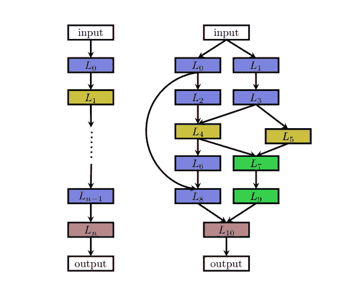
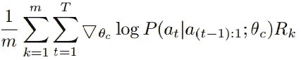

# 神经架构搜索(NAS)——深度学习的未来

> 原文：<https://towardsdatascience.com/neural-architecture-search-nas-the-future-of-deep-learning-c99356351136?source=collection_archive---------3----------------------->

## 作为初学者，你需要知道的是

(本博客的修订版可以在 [**这里找到**](https://theaiacademy.blogspot.com/2020/05/neural-architecture-search-nas-future.html) )

我们大多数人可能都听说过 ResNet 的成功，她是 2015 年 ILSVRC 图像分类、检测和定位奖的获得者，也是 2015 年 COCO MS 检测和分割奖的获得者**。这是一个巨大的建筑，到处都是跳跃连接。当我使用这个 ResNet 作为我的机器学习项目的预训练网络时，我想“怎么会有人提出这样的架构呢？''**

Large Human Engineered Images Classification Architectures([image source](https://arxiv.org/pdf/1512.03385.pdf))

不久之后，我得知许多工程师和科学家凭借他们多年的经验建造了这个建筑。更多的是直觉而不是完整的数学会告诉你“我们现在需要一个 5x5 滤波器来实现最佳精度”。对于图像分类任务，我们有很好的架构，但对于其他任务，我们必须花费大量精力来寻找一种具有合理性能的架构。如果我们能够像学习机器学习模型的参数一样自动化这个架构建模任务，那当然会更好。

神经架构搜索(NAS)，自动化架构工程的过程，即找到我们的机器学习模型的设计。我们需要为 NAS 系统提供数据集和任务(分类、回归等)，它将为我们提供体系结构。且当通过所提供数据集进行训练时，对于给定的任务，该架构将在所有其他架构中表现最佳。NAS 可以被视为 AutoML 的一个子领域，与超参数优化有很大的重叠。要了解 NAS，我们需要深入了解它在做什么。它通过遵循**搜索策略**从**所有可能的架构**中找到一个架构，这将**最大化性能**。下图总结了 NAS 算法。

Dimensions of NAS method([reference](https://arxiv.org/pdf/1808.05377.pdf))

它有 3 个独立的维度:搜索空间、搜索策略和性能评估。

**搜索空间**定义了**NAS 方法原则上可能发现什么样的神经架构。它可以是链状结构，其中层(n-1)的输出作为层(n)的输入。也可以是跳接的现代复杂架构(多分支网络)。**

****

**A chain-like and multi-branch network ([image source](https://arxiv.org/pdf/1808.05377.pdf))**

**有时人们确实想使用手工制作的外部建筑(宏观建筑),带有重复的主题或单元。在这种情况下，外部结构是固定的，NAS 只搜索单元体系结构。这种类型的搜索被称为微搜索或小区搜索。**

****

**left: The cell architecture right: cells are put in the handcrafted outer structure([source](https://arxiv.org/pdf/1808.05377.pdf)).**

**在许多 NAS 方法中，微观和宏观结构都以分层的方式进行搜索；它由几个层次的主题组成。第一层由一组基元操作组成，第二层由通过有向非循环图连接基元操作的不同基元组成，第三层基元编码如何连接第二层基元，依此类推。**

**为了解释**搜索策略**和**性能估计，**三种不同的 NAS 方法将在以下部分讨论。**

****强化学习****

**强化学习是代理(程序)面临的问题，它必须通过与动态环境的试错交互来学习行为，以最大化某些回报。代理(根据由θ参数化的某个策略执行某个动作。然后，该代理根据对所采取行动的奖励来更新策略θ。在 NAS 的情况下，代理产生模型架构，*子网络* ( *动作)。*然后在数据集上训练模型，模型在验证数据上的表现作为奖励。**

****

**The controller plays the role of an agent and accuracy is taken as the reward([reference](https://arxiv.org/pdf/1611.01578.pdf))**

**通常，递归神经网络(RNN)被视为控制器或代理。它产生字符串，并随机地从该字符串构建模型。**

****

**RNN predicts filter height, filter width, stride height, stride width, and the number of filters for one layer and repeats in a form of string. Each prediction is carried out by a softmax classifier and then fed into the next time step as input. The RNN stops after generating a certain number of outputs. ([image source](https://arxiv.org/pdf/1611.01578.pdf))**

**上图显示了这种 RNN 的输出示例。卷积神经网络的每一层的超参数重复产生一定次数。然后根据 RNN 的输出建立模型，然后对模型进行训练并计算验证精度。**

**在这里，RNN 的参数充当了代理人的策略θ。生产管柱(高度、过滤器宽度、步幅高度等)是代理的动作。在这种强化方法中，模型在验证集上的表现是代理人的回报。RNN 以某种方式更新其参数θ，使得所提出的架构的预期验证精度最大化。**

**通过策略梯度方法训练 RNN，迭代更新策略θ。主要目标是最大化预期精度，即**

****

**这里 **R** 是模型的精度， **a_1: T** 是 RNN( the action)生产的长度为 **T** 的字符串， **θ** 是 RNN 的参数。**

**由于 J(θ)不可微，采用策略梯度法迭代更新θ。更新函数看起来像这样**

****

**这是原始方程的近似值。用采样代替 J(θ)的期望项。该更新方程的外部求和用于该采样，即从 RNN 采样的***【m】***个模型，并取其平均值。**P(a _ t | a _(t1):1；θc)，**是根据 RNN 用参数 **θ** ( [参考](https://arxiv.org/pdf/1611.01578.pdf) ) **预测的策略 **θ或**，给定从 **1 到(t-1)** 的所有动作，在时间**t**采取动作 **a_t** 的概率。****

****

**Example of strings produced by RNN to create a model([reference](https://arxiv.org/pdf/1611.01578.pdf))**

**编码跳过连接有点棘手。为此，每层的 RNN 生成一个名为**锚点**的输出。锚点**点**用于指示跳过连接。在层 *N，*处，锚点将包含*N-1*基于内容的 sigmoids，以指示需要连接的先前层。**

****渐进式神经架构搜索(PNAS)****

**PNAS 做了一个小区搜索，如本教程的搜索空间部分所讨论的。他们从块中构造单元，并通过以预定义的方式添加单元来构造完整的网络。**

****

**Hierarchy of model architecture([reference](https://cs.jhu.edu/~cxliu/slides/pnas-talk-eccv.pdf))**

**细胞以预定的数量串联起来形成网络。并且每个单元由几个块(原始论文中使用的 5 个)形成。**

****

**([image source](https://cs.jhu.edu/~cxliu/slides/pnas-talk-eccv.pdf))**

**这些块由预定义的操作组成。**

****

**structure of a block. The **Combination** function is just an element-wise addition (reference)**

**图中所示的操作在原始文件中使用，可以扩展。**

****

**the complete structure of a Cell([reference](https://cs.jhu.edu/~cxliu/slides/pnas-talk-eccv.pdf))**

**左侧显示了一个完整的示例。甚至在这个单元或微搜索中，总共有 10 个⁴有效组合要检查以找到最佳单元结构。**

**因此，为了降低复杂性，首先只构建只有一个块的单元。这很容易，因为在上述操作中，只有 256 个不同的单元是可能的。然后，选择前 **K 个**表现最好的单元来扩展 2 个块单元，并且重复直到 5 个块。**

**但是对于一个合理的 **K** 来说，要训练的 2 挡候选人太多了。作为这个问题的解决方案，训练了一个“廉价的”代理模型，它只需通过读取字符串(*单元格被编码为字符串*)来预测最终性能。这种训练的数据是在构建、训练和验证单元时收集的。**

**例如，我们可以构建所有 256 个单块单元，并测量它们的性能。并用这些数据训练代理模型。然后使用该模型预测 2 个块单元的性能，而无需训练或测试它们。当然，代理模型应该能够处理可变大小的输入。然后选择由模型预测的前 K 个最佳性能的 2 个块单元。然后对这两个块单元进行训练，对“代理”模型进行微调，将这些单元扩展到 3 个块，并进行迭代，直到得到 5 个块单元。**

****

**Steps in PNAS (reference)**

****差异化架构搜索(DARTS)****

**神经架构的搜索空间是离散的，即一个架构与另一个架构至少有一层或该层中的一些参数不同，例如， *5x5* 滤波器与 *7x7* 滤波器。在这种方法中，连续松弛被应用于这种离散搜索，这使得能够进行直接的基于梯度的优化。**

**我们搜索的单元可以被视为有向非循环图，其中每个节点 ***x*** 是潜在表示(例如卷积网络中的特征图)，并且每个有向 ***边(I，j)*** 与一些操作 **o(i，j)** (卷积、最大池化等)相关联，这些操作变换*并且在节点**处存储潜在表示*****

******

***每个节点的输出可以通过左边的等式计算。节点是这样枚举的，从节点*到***x(j)***再到 **i < j** 有一条 ***边(I，j)*** 。****

****在连续松弛中，而不是在两个节点之间进行单一操作。使用每个可能操作的凸组合。为了在图中对此进行建模，在两个节点之间保留了多条边，每条边对应一个特定的操作。而且每条边还有一个权重 ***α*** 。****

********

****continuous relaxation of the discrete problem([reference](https://arxiv.org/pdf/1806.09055))****

****现在 **O(i，j)** 节点 x(i)和 x(j)之间的运算是一组运算的凸组合 **o(i，j)** 其中 **o(。)** ϵ **S** ，其中 s 是所有可能操作的集合。****

********

******O(i，j)** 的输出由左式**计算。******

****训练和验证损失分别用 ***L_train*** 和 ***L_val*** 表示。这两个损耗不仅由架构参数 **α** 决定，还由网络中的权重**‘w’**决定。架构搜索的目标是找到最小化验证损失的**α∫*****L _ val*(w∫，α∫)**，其中通过最小化训练损失来获得与架构相关的权重**‘w∫’**。****

******w∫**= arg min***L _ train*(w，α∫)**。****

****这意味着一个以 ***α*** 为上层变量，以 ***w*** 为下层变量的双层优化问题:****

*******α****= arg min***L _ val*(w∫(α)，α)******

****s . t .**w∫(α)**= arg min***L _ train***(w，α)****

****训练后，一些边的一些α变得比其它边大得多。为了导出该连续模型的离散架构，在两个节点之间，保留具有最大权重的唯一边。****

********

****a) Operations on the edges are initially unknown. b) Continuous relaxation of the search space by placing a mixture of candidate operations on each edge c) some weights increases and some falls during bilevel optimization d) final architecture is constructed only by taking edges with the maximum weight between two nodes. ([reference](https://arxiv.org/pdf/1806.09055))****

****当这些细胞被发现时，它们就被用来构建更大的网络。****

****还有许多其他方法也用于神经结构搜索。他们取得了令人印象深刻的成绩。但是，我们仍然对回答“为什么一个特定的架构工作得更好？”这个问题知之甚少。我想我们正在回答这个问题。****