# 神经协同过滤

> 原文：<https://towardsdatascience.com/neural-collaborative-filtering-96cef1009401?source=collection_archive---------0----------------------->

## 基于神经网络的增压协同过滤

在信息爆炸的时代，推荐系统在缓解信息过载方面发挥着关键作用，已被许多在线服务广泛采用，包括电子商务、流媒体服务和社交媒体网站。这些推荐系统的主要组成部分是带有隐式反馈的**协同过滤(CF)** 。**矩阵分解**是协同过滤最常用的变体。它使用用户-项目矩阵的固定内积来学习用户-项目交互。**神经协同过滤(**[**NCF**](https://www.comp.nus.edu.sg/~xiangnan/papers/ncf.pdf)**)**用一种神经架构代替用户项内积。通过这样做，NCF 试图实现以下目标:

1.  NCF 试图在其框架下表述和概括 MF。
2.  NCF 试图通过多层感知器来学习用户与物品的交互。

让我们从推荐系统的基础开始。

1.  ***协同过滤*** 基于用户过去的交互对项目的用户偏好进行建模。
2.  ***矩阵分解(MF)*** 将用户/项目表示为潜在特征的向量，这些特征被投影到共享的特征空间中。在这个特征空间中，用户-项目交互可以使用用户-项目潜在向量的内积来建模。MF 的这种普通实现可以通过将其与基于邻居的模型集成、将其与项目内容的主题模型组合并将其扩展到用于特征的一般建模的因式分解机器来增强。
3.  ***隐性反馈*** 通过观看视频、产品购买、点击间接反映用户的喜好。使用隐性反馈的好处是更容易收集，而且是过剩的。缺点是没有现成的负面反馈。
4.  ***显性反馈*** 由评分和点评组成。这是一种直接反馈，负面反馈或产品的可能性很容易通过评级获得。

尽管矩阵分解对于协同过滤是有效的，但是它的性能受到交互函数的简单选择- ***内积*** 的阻碍。通过在交互作用函数中引入用户项目偏差项，可以提高其性能。这证明了潜在特征(内积)的简单乘法可能不足以捕获用户交互数据的复杂结构。

这就要求设计一个更好的、专用的交互功能来模拟用户和项目之间的潜在特征交互。***【NCF】***神经协同过滤旨在通过:-

1.  通过神经网络架构对用户-项目特征交互进行建模。它利用一个 ***多层感知器(MLP)*** 来学习用户-项目交互。这是对 MF 的升级，因为 MLP 可以(理论上)学习任何连续函数，并且具有高水平的非线性(由于多层),使得它非常适合学习用户-项目交互函数。

2.将 MF 作为 NCF 的特例进行推广和表达。由于 MF 在推荐领域非常成功，这样做会给 NCF 更多的信任。

在下一节中，我们将正式定义推荐问题，并创建一个基本模板来解决它。

# 问题陈述

给定一组用户 U = { *u* = 1，…，U}，一组项目 I = { *i* = 1，…，I}，以及用户过去对项目 O = ( *u，I，y* )的偏好日志，我们的目标是向每个用户 U 推荐一个排序的项目列表，该列表将最大化她/他的满意度。 *y* 可以是 1(情况 1)也可以是 0(情况 2)。

*案例 1: O* 观察到的条目:
表示用户 u，与物品 I 有过交互，但不代表 u 喜欢 I。

*案例 2:* 未观察条目:
这并不意味着用户 u 不喜欢项目 I。未观察条目可能只是缺失数据。

> 使用隐式反馈的一个缺点是负面反馈的自然稀缺性。

直观地说，推荐算法估计 ***Y*** 中未观察条目的分数，用于对项目进行排序。

从形式上讲，他们计算

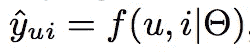

Equation 1

***y(u，i):*** 用户 u 与项目 I 交互的预测得分
***theta:*** 模型参数
***f(交互函数):*** 将模型参数映射到预测得分

为了计算***θ，*** 需要优化一个目标函数。推荐系统的两个最流行的损失函数是逐点损失和成对损失。

1.  **逐点损失**遵循回归框架，通过最小化预测得分 *y_(u，i)* 和目标值 *y(u，I)之间的平方损失。*为了说明负反馈，要么将所有未观察到的条目视为负面实例，要么将一些未观察到的条目采样为负面实例。
2.  ***成对损失*** 旨在将观察到的条目排列得高于未观察到的条目。它通过最大化观察到的条目和未观察到的条目之间的差额来实现这一点。

总之，成对损失最大化了观察到的和未观察到的条目之间的差额，而逐点损失旨在最小化预测得分和目标得分之间的损失。

> NCF 框架使用神经网络来参数化交互作用函数 *f* 以估计 *y_carat(u，I)。它支持成对学习和逐点学习。*

# 矩阵分解

MF 通过用户-项目潜在向量的标量积来模拟用户-项目交互。用数学术语来说，它表示如下

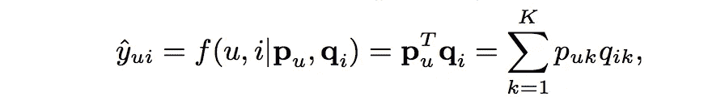

Equation 2

在哪里

***【y _ carat(u，i)* :** 预测得分(看等式 1)
***p(u)*:**潜在向量为用户 u
***q(I)*:***潜在向量为项
***K:*** 潜在空间的维度*

*图 1 中的例子示出了由使用简单且固定的内积来估计低维潜在空间中复杂的用户-项目交互所引起的 MF 的可能限制。在浏览图 1 时，请记住以下两个条件。*

1.  *当 MF 将用户和项目映射到相同的潜在空间时，用户之间的相似性可以通过他们潜在向量之间的角度的内积或余弦来测量。*
2.  *Jaccard 系数是 MF 需要恢复的基本事实(2 个用户的相似性)*

*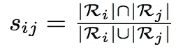*

*Jaccard coefficient*

*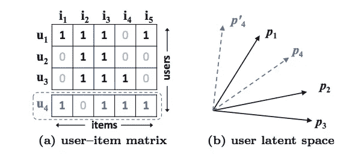*

*Figure 1: Let us first focus on the first three rows (users) in Figure 1a. It is easy to have s23(0.66) > s12(0.5) > s13(0.4). As such, the geometric relations of p1, p2, and p3 in the latent space can be plotted as in Figure 1b. Now, let us consider a new user u4, whose input is given as the dashed line in Figure 1a. We can have s41(0.6) > s43(0.4) > s42(0.2), meaning that u4 is most similar to u1, followed by u3, and lastly u2\. However, if an MF model places p4 closest to p1 (the two options are shown in Figure 1b with dashed lines), it will result in p4 closer to p2 than p3, which unfortunately will incur a large ranking loss.*

*解决这个问题的一个方法是使用大量的潜在因子 K。但是增加 K 会不利地损害泛化能力。*

> *NCF 通过使用深度神经网络(DNN)从数据中学习相互作用函数来克服这一限制。*

# *NCF 建筑*

*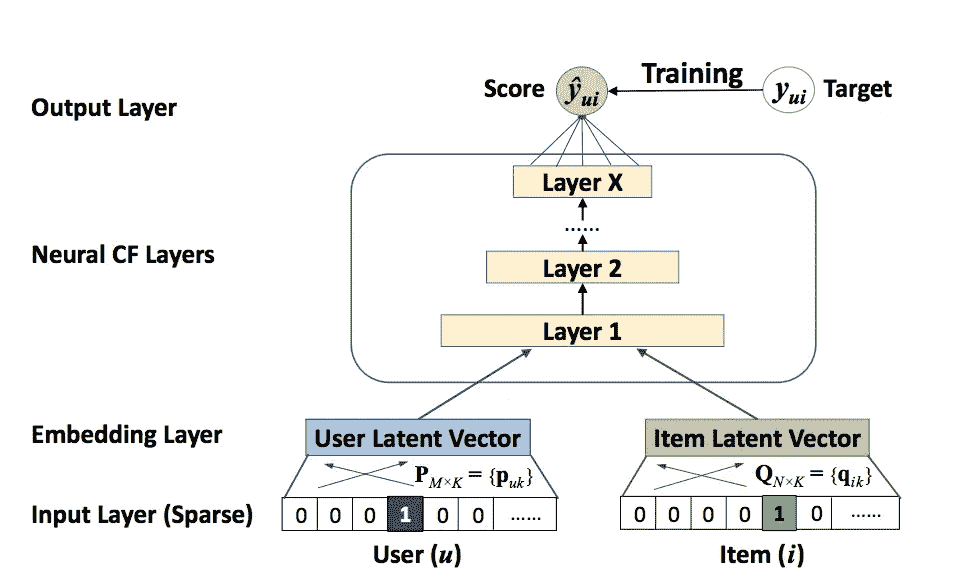*

*Figure 2: Neural Collaborative Filtering framework*

1.  *输入层二进制化用于用户和项目标识的稀疏向量，其中:
    项目(i): 1 表示用户 u 已经与项目(i)
    用户(u):进行了交互，以标识用户*
2.  *嵌入层是将稀疏表示投影到密集向量的全连接层。获得的用户/项目嵌入是潜在的用户/项目向量。*
3.  *神经 CF 层使用多层神经架构来将潜在向量映射到预测分数。*
4.  *最终输出层通过最小化逐点损失/成对损失来返回预测得分。*

*NCF 以如下方式修改等式 1:*

**

*Equation 3: NCF’s construct to calculate user-item interaction*

*在哪里*

****P:*** 潜在因素矩阵 for users(Size = M * K)
***Q:***潜在因素矩阵 for items(Size = N * K)
***Theta(f):***模型参数*

*由于 ***f*** 被公式化为 MLP，它可以展开为*

*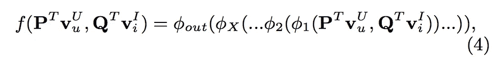*

*Equation 4: Modeling user-item interaction*

*在哪里*

****【Psi(out)***:输出层的映射函数
***Psi (x):*** 第 x 个神经协同过滤层的映射函数*

> *等式 4 充当 NCF 的得分函数。*

## *NCF 损失函数*

*逐点平方损耗方程表示为*

*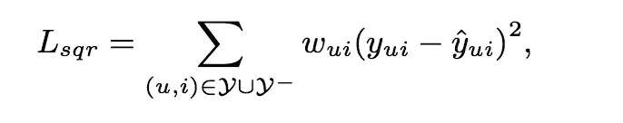*

*其中 ***Y:***Y 中观察到的交互
***y 中的负:*** 所有/未观察到的交互
***w(u，I):****训练实例的权重(超参数)**

**如果我们假设观察值来自高斯分布，就可以解释平方损失，但在我们的情况下这是不正确的。加上预测分数 ***y_carat*** 应该返回[0，1]之间的分数，以表示给定用户-项目交互的可能性。简而言之，我们需要一种概率方法来学习逐点 NCF，这种方法特别关注隐式数据的二进制属性。**

> **NCF 在输出层使用逻辑/概率单位函数来解决上述问题。**

**利用上述设置，似然函数被定义为:**

****

**取似然函数的负对数**

**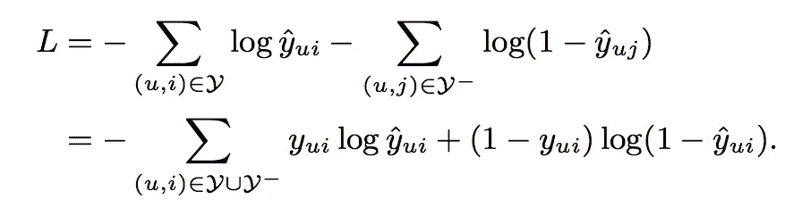**

**也就是交叉熵损失/对数损失。**

> **通过采用概率处理，NCF 将推荐问题转化为二元分类问题**

**为了说明负面实例 ***y-*** 是从未观察到的交互中均匀采样的。**

**在下一部分，我们可以看到 GMF(NCF 的一个组成部分)是如何推广 MF 框架的**

## **广义矩阵分解(GMF)**

**NCF 的预测输出可以表示为**

**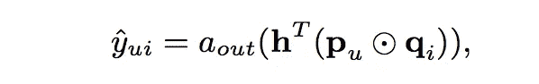**

**Equation 5**

**其中
***a-out*** :激活函数
***h:*** 输出层的边缘权重**

**我们可以使用 **a-out 和 h** 来创建 GMF 的多种变体。**

**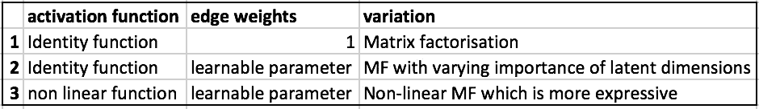**

**从上表可以看出，身份激活函数和边权重为 1 的 GMF 确实是 MF。另外两种变化是通用 MF 的扩展。GMF 的最后一个变化是在 NCF 使用乙状结肠作为激活。**

> **NCF 使用具有 sigmoid 的 GMF 作为激活函数，并且从具有对数损失的数据中学习 h(边权重)。**

**在下一部分，我们将解释 NCF 如何尝试使用 MLP 来建模用户-项目交互**

## **多层感知器(MLP)**

**NCF 是多模态深度学习的一个例子，因为它包含来自两条路径的数据，即用户和项目。将它们组合起来最直观的方式是通过连接。但是简单的向量拼接没有考虑用户-项目交互，并且不足以对协同过滤效果建模。为了解决这个问题，NCF 在串联的用户-项目向量(MLP 框架)上添加了隐藏层，以学习用户-项目交互。这赋予了该模型很多灵活性和非线性来学习用户-项目交互。这是对 MF 的升级，它在 MF 上使用了固定的元素级产品。更准确地说，MLP 将等式 1 修改如下**

**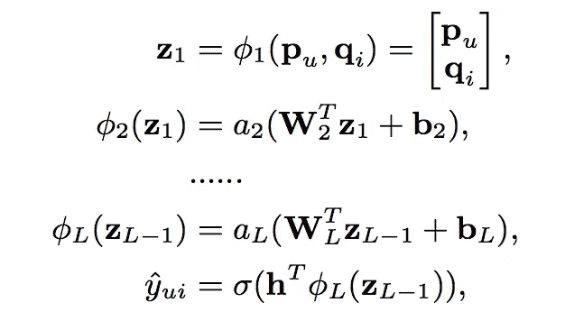**

**Equation 6**

**其中:
***W(x)*** :权重矩阵
***b(x)*** :偏置向量
***a(x)*** :第 x 层感知器的激活函数
***p:*** 用户的潜在向量
***q:*** 某项的潜在向量**

> **NCF 使用 ReLU 作为其 MLP 部分的激活功能。**

**由于多个隐藏层，与它们的潜在向量的固定元素方式的乘积(MF 方式)相比，该模型具有足够的复杂性来学习用户-项目交互。**

## **纽姆夫:GMF 和 MLP 的融合**

**NCF 由 GMF 和 MLP 两部分组成，具有以下优势**

1.  ****GMF** 应用线性内核来模拟用户-项目交互，就像香草 MF**
2.  ****MLP** 使用多个神经层来分层非线性相互作用**

**NCF 将这些模型结合在一起，以叠加它们的理想特征。NCF 在将 GMF 和 MLP 的输出馈送到 NeuMF 层之前，将它们连接起来。**

**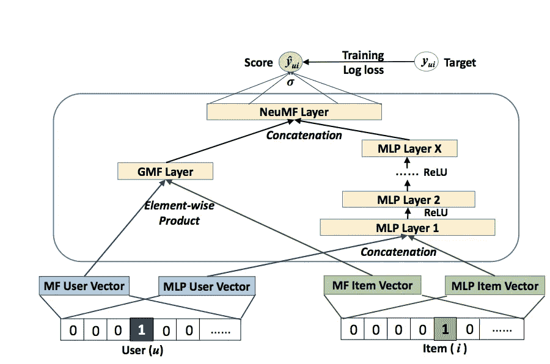**

**需要注意的要点**

1.  **GMF/MLP 有单独的用户和项目嵌入。这是为了确保它们都独立地学习最优嵌入。**
2.  **GMF 通过用户项目向量的元素式乘积来复制普通 MF。**
3.  **MLP 将用户项目潜在向量的串联作为输入。**
4.  **GMF 和 MLP 的输出在最终的 NeuMF(神经矩阵分解)层中连接。**

**等式 1 的得分函数被建模为**

**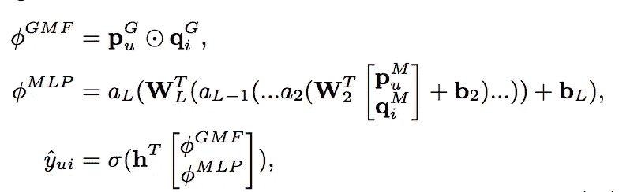**

*****G:***GMF
***M:***MLP
***p:***用户嵌入 ***q:*** 项目嵌入**

**该模型通过 ***NeuMF(神经矩阵分解)*** 层结合了 MF 的线性和 DNNs 的非线性，用于对用户项潜在结构进行建模。**

**由于 NeuMF 的非凸目标函数，基于梯度的优化方法只能找到局部最优解。这可以通过良好的权重初始化来解决。为了解决这个 ***NCF*** 用预先训练好的模型初始化 GMF 和 MLP 。有两种方法可以做到这一点**

1.  **随机初始化
    1。用随机初始化训练 GMF+MLP 直到收敛。
    2。使用模型参数 1 初始化 NCF。
    3。对于输出层，两个模型的权重连接为**
2.  **GMF + MLP 从零开始**

**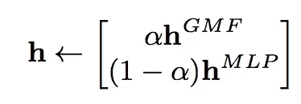**

**其中
***h(GMF)*** :预训练的 GMF 的 h 向量
***h(MLP)*** :预训练的 MLP 的 h 向量
***alpha:*** 超参数确定两个预训练模型之间的权衡**

1.  **GMF + MLP 从零开始
    1。 ***自适应矩估计(Adam)*** 通过对频繁的参数执行较小的更新和对不频繁的参数执行较大的更新来适应每个参数的学习速率。对于
    两种模型，Adam 方法的收敛速度都比普通 SGD 快，并且减轻了调整学习速率的痛苦。
    2。在将预先训练的参数输入 NeuMF 后，我们用普通的 SGD 而不是 Adam 来优化它。Adam 需要保存动量信息以更新参数。因为预训练网络的初始化不存储动量信息。**

**这就完成了 NCF 的理论。**

## **Python 示例**

**这个程序段使用来自[这个](https://github.com/microsoft/recommenders)库的 NCF 实现。首先，按照[和](https://github.com/microsoft/recommenders)中给出的步骤安装推荐库。**

**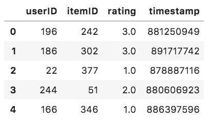**

**df.head()**

**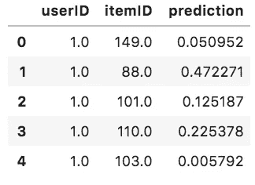**

**predictions.head()**

# **结论**

**NCF 学习了一个概率模型，强调隐含数据的二进制属性。我们讨论了如何在 NCF 下表达和推广 MF(使用一般矩阵分解{GMF})。NCF 通过使用多层感知器(MLP)来学习用户-项目交互功能，探索了 DNNs 在协同过滤中的应用。最后，我们讨论了一种新的神经矩阵分解模型 NeuMF，它在 NCF 框架下集成了 MF 和 MLP；它结合了 MF 的线性和 MLP 的非线性的优点来建模用户项目的潜在结构。最后一部分包含一个 NCF 的工作实例。所用代码摘自 [Github](https://github.com/microsoft/recommenders/blob/master/notebooks/02_model/ncf_deep_dive.ipynb) 的 ncf_deep_dive 笔记本。这个库包含许多例子，非常有用。我强烈建议你仔细阅读。**

# **参考**

1.  **[NCF 论文](https://arxiv.org/abs/1708.05031)**
2.  **[微软推荐库](https://github.com/microsoft/recommenders)**
3.  **[原作者代码](https://github.com/hexiangnan/neural_collaborative_filtering)**