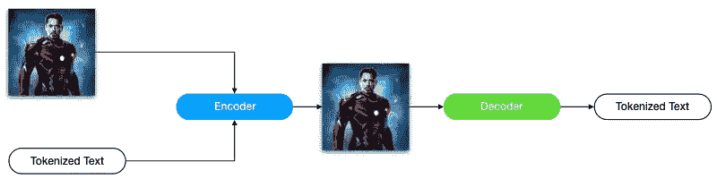
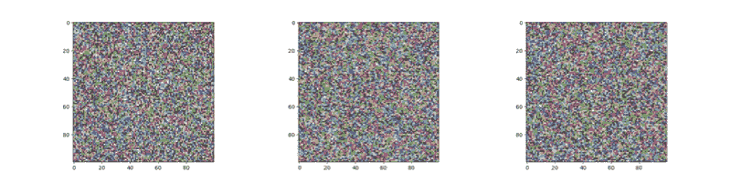
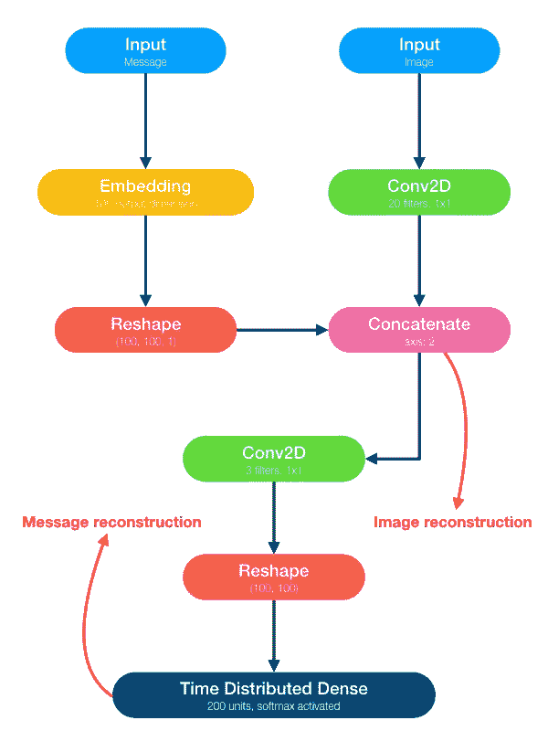
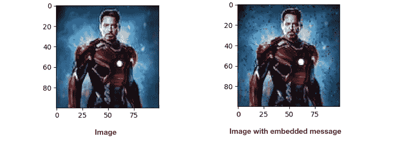

# 神经密码术

> 原文：<https://towardsdatascience.com/neural-cryptography-7733f18184f3?source=collection_archive---------17----------------------->

几年来，加密一直是建立安全连接的方式。它是安全的，计算效率高，几乎每个平台都支持。但是加密的缺点是加密的信息是没有意义的。它是一堆没有意义的比特或字符，任何人都无法解释。在本文中，我们想要设计和训练一个神经网络。它加密和解密信息，而密码是人类可以理解的。更具体地说，每个密码都是一个图像，信息就嵌入其中。给定新图像，网络的另一部分可以从图像中提取信息(句子)。



The whole idea.

网络分为两部分:

1.  编码器:它获取图像和标记化的文本，并将标记化的文本嵌入到图像中。
2.  解码器:它获取编码器的输出(新图像)并从中提取标记化的文本。

我们使用随机生成的图像，因为网络必须与任何图像一起工作。消息也是如此。我们使用随机整数来表示标记化的消息，而不是实际文本。有希望的是，一个融合的模型可以在实际的图像和文本上运行。

为了生成随机图像，我们使用:

随机生成图像的一些示例如下:



Randomly generated images.

下面的代码用于生成随机字符消息:

一个随机句子的例子是:

```
@\x8eUÍbâºq÷3\x8b¸|¼Ó\x91æíÃtÉ/LO¤_
```

现在，我们可以创建一个生成器，它总是生成一批新的随机图像和消息。

数据现在准备好了。我们现在可以实现我们的模型了。输入图像大小为(100，100)，而文本长度为 100。首先，我们使用一个 2D 卷积层，其内核大小为(1，1)，滤波器计数为 20，由图像上的 ReLU 激活。然后，我们将序列的每个元素(字符)嵌入到一个新的一百维空间中。嵌入序列的大小现在是(100，100)。接下来，我们将嵌入的序列附加到第三个轴中的图像上。新张量的形状是(100，100，21)。具有三个滤波器的(1，1)卷积层现在用于从新张量重建图像。之后，我们用一个滤波器将重建图像输入到(1，1)卷积层。输出的形状是(100，100，1)。我们可以假设这是一个一百个字符的序列，在一个一百维的空间中。随后，我们使用一个全连接层，然后激活 softmax，将每个字符映射到字典空间。我们期望该模型将每个字符(令牌)重建为一个热点向量。下图显示了模型。



以下代码是该模型的 Keras 实现:

经过所有的努力，我们现在可以训练模型了:

经过 512 个历元的训练，该模型具有合理的精度。在 100%重建字符时，图像重建的绝对误差之和为 0.01。在测试模型之前，我们还需要两个函数来将句子编码和解码成 ASCII 码。

**注意:**任何其他字符编码都可以代替 ASCII。

是时候用真实世界的数据来检验这个模型了。我们必须选择一个句子和一个形象。我们从维基百科中选择以下句子:

> 安东尼·爱德华“托尼”斯塔克是小罗伯特·唐尼在 MCU 系列电影中塑造的一个角色

对于图像，我们从文章开始就使用相同的托尼·斯塔克的图像。以下代码用于嵌入和提取消息:

解码后的句子是:

> 安东尼·爱德华“托尼”斯塔克是小罗伯特·唐尼在 MCU 系列电影中塑造的一个角色

这与输入完全相同。这些图像(包含和不包含嵌入消息)是:



在两个图像之间，像素中的平均颜色变化是 1.67，这是正常人眼无法分辨的。

## 结论

我们训练了一个网络，它可以通过对图像进行人眼不可见的微小改变，将任何信息嵌入任何图像。感谢您阅读我的文章。我希望它值得你花时间。我还不能说出它的任何应用，因为这只是出于我的好奇。