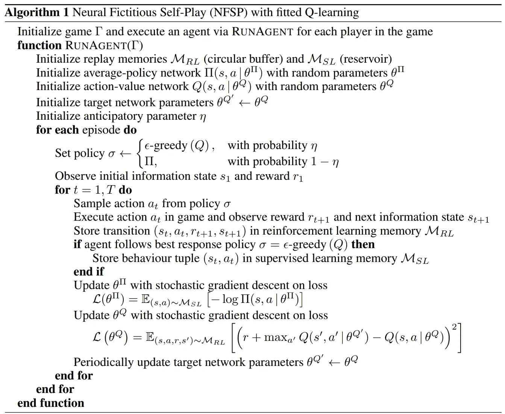

# 神经虚拟自我游戏

> 原文：<https://towardsdatascience.com/neural-fictitious-self-play-800612b4a53f?source=collection_archive---------22----------------------->

## 不完全信息博弈中的深度强化学习

Photo by [Paweł Czerwiński](https://unsplash.com/@pawel_czerwinski?utm_source=medium&utm_medium=referral) on [Unsplash](https://unsplash.com?utm_source=medium&utm_medium=referral)

**更新**:学习和练习强化学习的最好方式是去 http://rl-lab.com

## 介绍

本文基于 Heinrich & Silver 的一篇科学论文，该论文介绍了第一种可扩展的端到端方法，用于在没有先验知识的情况下学习近似纳什均衡**。**

## **重要提醒**

*   **虚拟游戏:是一种在两人零和游戏中寻找纳什均衡的迭代方法。它的问题是，它适用于标准形式的游戏，这是表格，不捕捉时间或顺序。详情可以在“[虚拟玩法简介](/introduction-to-fictitious-play-12a8bc4ed1bb)”一文中找到。**
*   **虚拟自我游戏:是一种利用扩展形式的游戏，通过整合时间/序列来解决虚拟游戏问题的方法。它还使用强化学习来寻找最佳反应的近似值，并使用监督学习来更新平均策略。证明了它能收敛到一个纳什均衡。更多详情请见文章"[虚构的自我扮演](/fictitious-self-play-30b76e30ec6a)"**

## **不完美信息博弈**

**在不完全信息下，玩家根本不知道其他玩家选择的行动。然而，他们知道其他玩家是谁，他们可能的策略/行动是什么，以及这些其他玩家的偏好/收益。因此，在**不完全信息中关于其他参与者的信息是完全的**。**

**另一方面，在不完全信息博弈中，参与者可能知道也可能不知道其他参与者的一些信息，例如他们的“类型”、策略、收益和偏好。**

**国际象棋是一个拥有**完全信息**的游戏的例子，因为每个玩家可以随时看到棋盘上的所有棋子。其他完美信息博弈的例子包括井字游戏、跳棋、[无限象棋](https://en.wikipedia.org/wiki/Infinite_chess)和[围棋](https://en.wikipedia.org/wiki/Go_(game))。**

**纸牌游戏中，每个玩家的牌对其他玩家是隐藏的，例如扑克和桥牌，是**不完全信息**游戏的例子。**

## **储层取样**

**储层采样是一种对长度为 N 的数据流进行采样的算法，使得选择数据项的概率为 1/N，即使 N 是未知的并且存储器大小是有限的并且小于 N，因此在采样之前不是所有的流数据都可以被缓冲。
总之，该算法工作，例如对于第 ***与第*** 项，我们旋转一个带有 ***i*** 槽的轮盘，该轮盘仅包含一个获胜槽。如果获胜的位置被选中，那么我们将从样本中提取该项目。可以证明这种方法对于每个要选择的项目都有 1/N 的概率。**

## **预期动态**

**预期动力学是一种能够使学习游戏动力学的稳定性发生质的变化的方法。在一般和多人游戏的情况下，这意味着收敛到混合策略纳什均衡。更多细节可以在“[一般进化博弈中的预期学习](http://citeseerx.ist.psu.edu/viewdoc/download?doi=10.1.1.409.9085&rep=rep1&type=pdf)”一文中找到。**

**这项技术背后的想法是将**预期的** **修正**引入到动作中。理解它最简单的方法，就是想象向一个移动的目标射击。你通过瞄准目标前方一段距离来修正你的射击。**

**所以你引入了一个预期修正参数。在神经虚构自我发挥的情况下，这个参数是一个叫做“η”的概率。**

## **神经虚拟自我游戏**

**神经虚拟自我游戏(NFSP)将神经网络引入虚拟自我游戏。
它使用两个独立的网络 Q(s，a | θ(Q))和π(s，a |θ(π))以及分别分配给它们的两个存储缓冲器 Mrl 和 Msl:**

*   **Mrl 是一个循环缓冲区，以**

****

*   **Msl 是一个以[s(t)，a(t)]状态和时间步长 t 的动作的形式存储最佳行为的库。**
*   **Q(s，a | θ(Q))是一个神经网络，使用非策略强化学习从 Mrl 中的数据预测动作值。这个网络近似于最佳反应策略，β = ε-greedy(Q)，以概率ε选择一个随机行动，以概率(1-ε)选择使 Q 值最大化的行动。**
*   **π(s，a |θ(π))，是一个将状态映射到动作概率的神经网络，定义了智能体的平均策略，π=π。换句话说，它试图从 Msl 中以前的最佳反应行为的历史中使用监督学习来再现最佳反应行为。**

**所以现在我们有两个神经网络来预测行为。
Q(s，a | θ(Q))通过利用过去的经验，另π(s，a |θ(π))通过从最佳反应的历史中抽取。但是代理必须在每个回合使用一个动作，并且必须从这些网络中选择一个动作。
原则上，代理应该使用 it is average 策略π，并使用 Q 生成最佳响应，该最佳响应将被馈入 Msl 以训练其平均策略网络π(s，a |θ(π))。
然而有一个问题！Q 如何从自己的行动中产生经验？请记住，Q 生成β = ε-greedy(Q)并将其馈送给π(s，a |θ(π))，π将使用监督学习来训练其权重θ(π)。所以从π采样的动作不是β，这对于 Q 的体验来说是有问题的，因为它没有观察到其即时动作的结果。**

**似乎解决这个问题的最佳方式是通过使用预期参数η，使得它以概率η使用ε-greedy(Q ),以概率(1-η)使用π。**

**最终算法的主要步骤如下:**

*   **定义策略σ，使得它是ε-贪婪的(Q)概率为η，π概率为(1-η)。**
*   **从σ **，**中获取动作，在游戏中执行，观察奖励 r(t+1)和下一个状态 s(t+1)以及 Mrl 中的转移[s(t)，a(t)，r(t+1)，s(t+1)]。**
*   **如果σ是ε-greedy(Q)，则存储[s(t)，a(t)]在 Msl 中。**
*   **用 Msl 训练π(s，a |θ(π))**
*   **使用 Mrl 来训练 Q(s，a | θ(Q))**
*   **定期更新目标网络权重θ(Q') ← θ(Q)**

**具体算法如下:**

****

## **结论**

**Heinrich & Silver 认为，NFSP 是第一个端到端的深度强化学习方法，它从自我博弈中逼近不完全信息博弈的纳什均衡。NFSP 是可扩展的，不需要预先的领域知识。他们表明，在一个小型扑克游戏中，NFSP 可靠地收敛到近似纳什均衡，而 DQN 的贪婪和平均策略没有。NFSP 从零开始学习了一种策略，这种策略可以在现实世界规模的不完全信息游戏中与超人程序竞争，而无需使用明确的先验知识。**

## **参考**

**Heinrich & Silver 的《[不完全信息博弈中自我博弈的深度强化学习](https://arxiv.org/pdf/1603.01121.pdf)》。**

**[“一般进化游戏中的预期学习](http://citeseerx.ist.psu.edu/viewdoc/download?doi=10.1.1.409.9085&rep=rep1&type=pdf)”格达尔·阿尔斯兰和杰夫·s·莎玛**

**“[完美信息](https://en.wikipedia.org/wiki/Perfect_information)”——维基百科**

**[油藏取样](https://en.wikipedia.org/wiki/Reservoir_sampling)——维基百科**