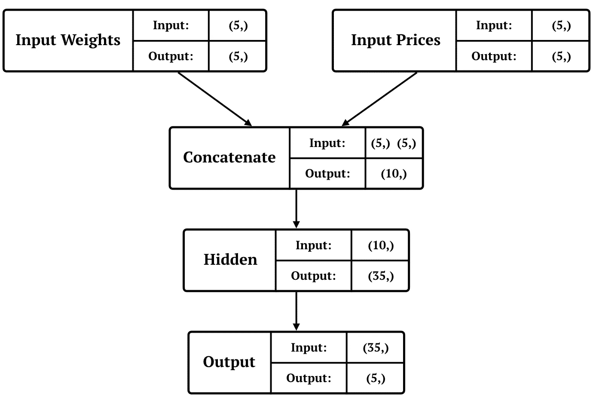
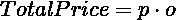
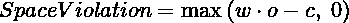
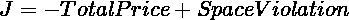
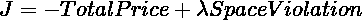

# 神经背包

> 原文：<https://towardsdatascience.com/neural-knapsack-8edd737bdc15?source=collection_archive---------8----------------------->

## 用神经网络求解背包问题

在数据科学的某些情况下，需要对模型的输出运行特定的算法来获得结果。有时，它就像找到最大输出的索引一样简单，而其他时候，则需要更高级的算法。您可以在运行推理后运行算法。然而，设计一个可以在内部运行算法的模型有一些好处。使用神经网络解决背包问题不仅有助于模型在内部运行背包算法，而且允许模型被端到端地训练。

## 什么是背包问题？

我可爱的计算机算法老师用这个故事给我解释了背包问题。想象一个小偷在抢劫。有一些物品可供抢劫。每个项目都有自己的重量和价值。小偷有一个容量确定的背包，该背包指示他(或她)能够携带的最大重量。小偷的利润是通过对所选物品的价值求和来计算的。我们的目标是最大化利润，同时保持所选物品的重量总和小于背包的容量。

据[维基百科](https://en.wikipedia.org/wiki/Knapsack_problem):

> 给定一组项目，每个项目都有一个重量和一个值，确定集合中要包含的每个项目的数量，使总重量小于或等于给定的限制，并且总值尽可能大。它的名字来源于一个人面临的问题，他被一个固定大小的背包所束缚，必须在里面装满最有价值的物品”

在本文中，我们尝试使用神经网络来解决背包问题。

## 数据

第一步是准备数据。我们使用随机整数来表示物品的重量、价格和背包的容量。创建问题后，我们使用蛮力来寻找最优解。

一个生成背包问题；

```
Weights:  [13, 10, 13, 7, 2]
Prices:   [8, 7, 9, 6, 4]
Capacity: 27
Optimum solution: [0, 1, 1, 0, 1]
```

标准化输入是每个机器学习项目的一部分，因为它有助于模型更好地概括。为了标准化每个背包问题:

*   将价格除以问题的最高价格。
*   用重量除以容量。
*   从输入中删除容量，因为它现在包含在权重中。

先前创建的背包问题的规范化形式:

```
Weights:  [0.48, 0.37, 0.48, 0.26, 0.07]
Prices:   [0.89, 0.44, 1.00, 0.67, 0.44]
Optimum solution: [0, 1, 1, 0, 1]
```

数据集由一万个用于训练的样本和两百个用于测试的样本组成。

## 模型

我们为此任务选择的模型是一个相当简单的模型。它有两个输入和一个输出。首先，输入被连接在一起。结果进入由 sigmoid 非线性激活的两个连续的密集层。第二密集层的输出是模型的输出。在 Keras 中实施该模型:

下图显示了模型的体系结构:



Model architecture

## 衡量标准

背包问题需要除二进制分类精度之外的度量来进行评估。我们引入的第一个指标叫做“**定价过高**”。顾名思义，它评估所选项目的价格和最优解之间的平均差异。它在 Keras 框架中实现如下:

另一个重要的指标是使用的容量超过背包的容量。“**空间违规**是所选物品重量之和与背包容量之间的正差值。它可以在 Keras 中实现如下:

## 监督方法

在监督方法中，我们将权重和价格输入到模型中，并期望最优解作为输出。在此过程中，模型使用交叉熵损失函数进行训练。

在使用监督方法训练模型之后，我们在 512 个时期之后获得了以下结果。

```
Model results(Train/Test):
Loss:               0.24 / 0.24
Binary accuracy:    0.89 / 0.89
Space violation:    0.04 / 0.06
Overpricing:        0.06 / 0.08
```

不幸的是，有监督的方法有两个基本问题:

*   最佳解决方案是强制开始训练。
*   我们对*空间违规*和*定价过高*没有任何控制。

我们将尝试在无监督的方法中解决这些问题。

## 无监督方法

我们希望在不计算最优解的情况下训练模型。因此，我们需要一个新的损失函数。相应地，我们随后将 ***w*** ， ***p*** ， ***c*** ，**，**o 定义为物品的重量，物品的价格，背包的容量和模型的产量。首先，我们需要最大化所选商品的价格总和。它可以通过以下方式计算:



同时，我们希望我们的选择不超过背包的容量。该值可以通过以下公式表示:



最后，我们要最大化 ***总价*** 同时最小化 ***空间违例*** 。这可以通过以下方式制定:



为了控制 ***空间违逆*** ，我们在第二项中加入了 **λ** 系数。最终损失公式为:



我们可以像这样在 Keras 中实现新的损失:

使用这个损失函数，我们以无监督的方式训练神经网络。

**注 1:** 背包损耗的 Keras 实现中 **λ** 参数命名为 ***cvc*** 。

**注 2:** 虽然我们收到了最优解(y_true)作为函数自变量，但我们并不使用它来计算损失。我们也不能省略参数，因为在损失函数中接收预测和预期输出是一个 Keras 约束。

**注 3:** 当我们归一化数据时，背包的容量等于 1。

在用非监督方法训练模型之后，我们在 512 个时期之后得到以下结果。

```
Model results(Train/Test):
Loss:               -1.83 / -1.75
Binary accuracy:    0.89 / 0.89
Space violation:    0.05 / 0.06
Overpricing:        0.12 / 0.14
```

增加***CVC****(**λ**)的值会在更少的空间内造成违规和套印。增加太多也会降低二进制精度。我发现它的合理值可能是 5.75。*

# *结论*

*如前所述，我们使用神经网络解决了背包问题，而梯度可以通过网络。因此，我们的模型可以使用反向传播算法的任何变体进行端到端的训练。*

*这篇文章可以用在推荐系统中，特别是那些在保持空间使用率的同时推荐多个项目的系统(比如横幅广告)。*