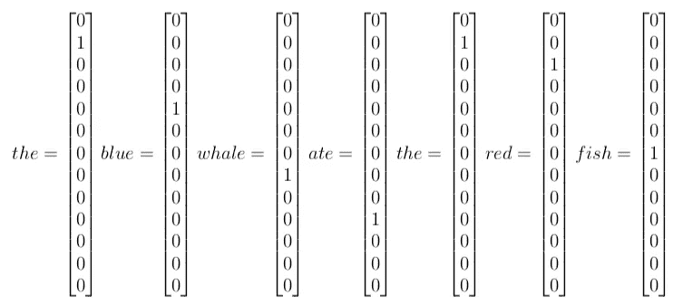
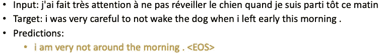
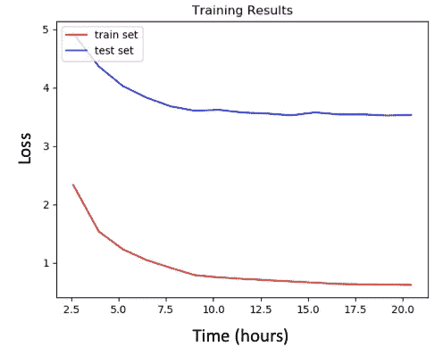
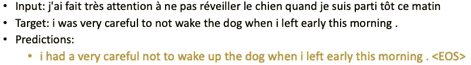

# 神经机器翻译

> 原文：<https://towardsdatascience.com/neural-machine-translation-15ecf6b0b?source=collection_archive---------2----------------------->

## 注意使用编码器解码器结构的神经机器翻译指南。包括在 Google Colaboratory 中使用 PyTorch 的详细教程。

Image from pixabay.com

机器翻译(MT)是计算语言学的一个分支，致力于将文本从一种语言翻译成另一种语言。随着深度学习的力量，神经机器翻译(NMT)已经成为执行这项任务的最强大的算法。虽然谷歌翻译是 NMT 领先的行业范例，但全球的科技公司都在向 NMT 进军。这种最先进的算法是深度学习的一种应用，其中翻译句子的大规模数据集用于训练一个能够在任何两种语言之间翻译的模型。随着近年来的大量研究，目前行业中正在研究和部署多种 NMT。编码器解码器结构是 NMT 的一个较老且较成熟的版本。这种体系结构由两个递归神经网络(RNNs)组成，这两个网络一前一后用于创建翻译模型。当与[注意力机制](https://arxiv.org/pdf/1508.04025.pdf)的力量相结合时，这种架构可以取得令人印象深刻的结果。

这篇文章分为两个不同的部分。第一部分包括 NMT 和编码器解码器结构的简要说明。接下来，本文的后半部分提供了一个教程，让您有机会自己创建一个这样的结构。这段代码教程很大程度上基于关于 NMT 的 [PyTorch 教程](https://pytorch.org/tutorials/intermediate/seq2seq_translation_tutorial.html)，并做了一些改进。最值得注意的是，这个代码教程可以在 GPU 上运行，以获得明显更好的结果。

在我们开始之前，假设如果你正在阅读这篇文章，你至少对[神经网络和深度学习](https://skymind.ai/wiki/neural-network)有一个大致的了解；特别是前向传播、损失函数和反向传播的概念，以及[训练和测试集](/train-validation-and-test-sets-72cb40cba9e7)的重要性。

*如果你有兴趣直接跳到代码，你可以在我的* [*GitHub 页面上找到本文概述的 Google Colab 教程的完整 Jupyter 笔记本(或者 Python 脚本)用于这个项目*](https://github.com/qlanners/nmt_tutorial) *。*

# NMT 及编解码结构简述

任何 NMT 模型的最终目标都是将一种语言的句子作为输入，并将翻译成不同语言的句子作为输出返回。下图是一个翻译算法(比如 Google Translate)的简单表示，它的任务是将英语翻译成西班牙语。

Figure 1: Translation from English to Spanish of the English sentence “the cat likes to eat pizza”

在深入研究上图中经常用作算法的编码器/解码器结构之前，我们首先必须了解如何克服任何机器翻译任务中的一大障碍。也就是说，我们需要一种方法来将句子转换成可以输入到机器学习模型中的数据格式。本质上，我们必须以某种方式将文本数据转换成数字形式。

为了在机器翻译中做到这一点，每个单词都被转换成一个热编码向量，然后该向量可以被输入到模型中。一个热点编码向量是除了在对应于特定单词的单个索引处为 1 之外，在每个索引处为 0 的简单向量。这样，每个单词都有一个不同的热编码向量，因此我们可以用数字表示来表示数据集中的每个单词。

创建这些向量的第一步是为输入语言中的每个唯一单词分配一个索引，然后对输出语言重复这个过程。在为每个独特的单词分配一个独特的索引时，我们将为每种语言创建一个词汇表。理想情况下，每种语言的词汇表应该简单地包含该语言中的每个独特的单词。然而，鉴于任何一种语言都可能有几十万个单词，因此词汇表通常会被删减为我们正在处理的数据集中最常见的 N 个单词(其中 N 是任意选择的，但根据数据集的大小，范围通常在 1，000 到 100，000 之间)。

为了理解我们如何使用词汇表为数据集中的每个单词创建一个热编码向量，考虑一个只包含下面表 1 中的单词的小型词汇表。

Table 1: Mini-vocabulary for the English language

给定这个表，我们给小词汇表中的每个单词分配了一个惟一的索引 0-12。表中的<sos>和<eos>标记被添加到每个词汇中，分别代表句子的开始和结束。它们被 NMT 模型用来帮助识别句子中的关键点。</eos></sos>

现在，假设我们想要将句子“蓝鲸吃了红鱼”中的单词转换成它们的一个热编码向量。使用表 1，我们将这样做，如下图 2 所示。

Figure 2: One Hot Encoding vectors for the sentence “the blue whale ate the red fish”

正如您在上面看到的，每个单词都变成了一个长度为 13 的向量(这是我们的词汇量的大小),并且除了表 1 中分配给该单词的索引处的 1 之外，全部由 0 组成。

通过为输入和输出语言创建词汇表，我们可以在每种语言的每个句子上执行这种技术，以将任何翻译句子的语料库完全转换成适合机器翻译任务的格式。

现在，了解了我们如何用数字的方式表示文本数据，让我们看看这个编码器/解码器算法背后的魔力。在最基本的层面上，模型的编码器部分获取输入语言中的一个句子，并根据这个句子创建一个*思维向量*。这个*思维向量*存储了句子的意思，并随后被传递给解码器，该解码器以输出语言输出句子的翻译。这个过程如下图所示。

Figure 3: Encoder Decoder structure translating the English sentence “the cat likes to eat pizza” to the Spanish sentence “el gato le gusta comer pizza”

在上述架构中，编码器和解码器都是递归神经网络(RNN)。在这个特别的教程中，我们将使用长短期记忆(LSTM)模型，这是一种 RNN。然而，其他 RNN 架构，如 GRU，也经常使用。在基本层面上，rnn 是专门设计来处理时间/文本数据的神经网络。这篇文章将给出 RNNs 如何在 NMT 环境中工作的高级概述，但是，如果您还不熟悉它们，我强烈建议您进一步研究这些概念。关于 RNNs 和 lstm 的更全面的解释，请参见[这里的](https://colah.github.io/posts/2015-08-Understanding-LSTMs/)，关于 lstm 在语言翻译方面的更深入的文章，请参见[这里的](http://citeseerx.ist.psu.edu/viewdoc/download?doi=10.1.1.248.4448&rep=rep1&type=pdf)。

在编码器的情况下，输入句子中的每个单词在多个连续的时间步骤中被分别输入到模型中。在每个时间步 *t* ，模型使用来自在该时间步*输入到模型的单词的信息更新隐藏向量 *h* ，。*这个隐藏向量用于存储关于输入句子的信息。以这种方式，由于在时间步 *t=* 0 还没有字被输入到编码器，编码器中的隐藏状态在该时间步作为空向量开始。我们用图 4 中的蓝框表示这种隐藏状态，其中下标 *t* =0 表示时间步长，上标 E 对应于编码器的隐藏状态(而不是解码器的 D)。

Figure 4: Encoder hidden vector at t=0

在每个时间步长，这个隐藏向量从该时间步长的输入单词中获取信息，同时保留它已经从先前的时间步长中存储的信息。因此，在最后的时间步，整个输入句子的含义被存储在隐藏向量中。这个在最后一个时间步长的隐藏向量就是上面提到的*思想向量*，然后输入到解码器中。对英语句子“猫喜欢吃比萨饼”进行编码的过程如图 5 所示。

Figure 5: Encoding of the sentence “the cat likes to eat pizza”

在上图中，蓝色箭头对应于权重矩阵，我们将努力通过训练来增强权重矩阵，以实现更准确的翻译。

此外，请注意编码器的最终隐藏状态如何成为思想向量，并在 *t* =0 处用上标 D 重新标记。这是因为编码器的这个最终隐藏向量变成了解码器的初始隐藏向量。通过这种方式，我们将句子的编码含义传递给解码器，由解码器翻译成输出语言的句子。然而，与编码器不同的是，我们需要解码器输出一个长度可变的翻译句子。因此，我们将让我们的解码器在每个时间步输出一个预测字，直到我们输出一个完整的句子。

为了开始这个翻译，我们将输入一个<sos>标签作为解码器中第一个时间步长的输入。就像在编码器中一样，解码器将在时间步长 *t* =1 时使用<sos>输入来更新其隐藏状态。然而，解码器将使用额外的权重矩阵来创建输出词汇表中所有单词的概率，而不是仅仅前进到下一个时间步。这样，输出词汇中概率最高的单词就会成为预测输出句子中的第一个单词。解码器的第一步，从“猫喜欢吃比萨饼”翻译成“el gato le gusta comer pizza ”,如图 6 所示。为了简单起见，输出词汇表仅限于输出句子中的单词(但实际上是由整个输出词汇表中的数千个单词组成)。</sos></sos>

Figure 6: First step of the Decoder

现在，假设单词“el”被赋予最高的概率，这个单词成为我们输出的预测句子中的第一个单词。我们继续使用“el”作为下一个时间步的输入，如下图 7 所示。

Figure 7: Second step of the Decoder

我们以这种方式处理整个句子，直到遇到如图 8 所示的错误。

Figure 8: Translation error in Decoder

正如你所看到的，解码器预测“pizza”是翻译句子中的下一个单词，而实际上它应该是“comer”。当在测试集上测试模型时，我们不会做任何事情来纠正这个错误，并且会允许解码器使用这个不正确的预测作为下一时间步的输入。然而，在训练过程中，我们将保留“pizza”作为句子中该点的预测单词，但强制我们的解码器输入正确的单词“comer”作为下一时间步的输入。这是一种被称为[教师强制](https://machinelearningmastery.com/teacher-forcing-for-recurrent-neural-networks/)的策略，有助于加快培训过程。如下图所示。

Figure 9: Teacher-forcing

现在，由于解码器必须输出可变长度的预测句子，解码器将继续以这种方式预测单词，直到它预测句子中的下一个单词是<eos>标签。一旦预测了这个标签，解码过程就完成了，我们剩下的是输入句子的完整预测翻译。对输入句子“猫喜欢吃比萨饼”的思想向量进行解码的整个过程如图 10 所示。</eos>

Figure 10: Decoding of the sentence “the cat likes to eat pizza”

然后，我们可以将预测翻译的准确性与输入句子的实际翻译进行比较，以计算损失。虽然有几种损失函数，但最常用的是交叉熵损失。该损失函数的公式详见图 11。

Figure 11: Cross-Entropy Loss function

本质上，这个损失函数所做的是对模型在输出句子的每个位置给予正确单词的负对数可能性求和。假设负对数函数在输入为 1 时的值为 0，并且随着输入接近 0 而呈指数增加(如图 12 所示)，则模型在句子中的每个点给出正确单词的概率越接近 100%，损失就越低。

Figure 12: Graph of the function y = -log(x)

例如，假设上面输出句子中正确的第一个单词是“el”，并且我们的模型在该位置给出了单词“el”相当高的概率，则该位置的损失将相当低。相反，由于在时间步长 *t* =5 的正确单词是“comer”，但是我们的模型给单词“comer”的概率相当低，所以在该步骤的损失会相对较高。

通过对输出句子中每个单词的损失求和，获得句子的总损失。该损失对应于翻译的准确性，较低的损失值对应于较好的翻译。训练时，将一批中几个句子的损失值加在一起，得到总的一批损失。然后，该批量丢失将用于执行小批量梯度下降，以更新解码器和编码器中的所有权重矩阵。这些更新修改了权重矩阵，以略微提高模型翻译的准确性。因此，通过反复执行这个过程，我们最终构建了能够创建高质量翻译的权重矩阵。

*如果您不熟悉批量和/或小批量梯度下降的概念，您可以在这里* *找到这些概念的简短解释* [*。*](https://machinelearningmastery.com/gentle-introduction-mini-batch-gradient-descent-configure-batch-size/)

正如在引言中提到的，注意机制是一个不可思议的工具，它极大地增强了 NMT 模型创建准确翻译的能力。虽然有许多不同类型的注意力机制，其中一些你可以在这里阅读，本教程中建立的模型使用了一个相当简单的全局注意力实现。在这种注意力方法中，在每个时间步，解码器“回顾”编码器的所有隐藏向量，以创建记忆向量。然后，它使用这个记忆向量，连同解码器中的隐藏向量，来预测翻译句子中的下一个单词。在这样做的时候，解码器利用了来自编码器的有价值的信息，否则这些信息会被浪费掉。这个过程的可视化表示如图 13 所示。我建议阅读本段中的链接文章，以了解更多关于计算内存向量的各种方法，从而更好地理解这一重要概念。

Figure 13: Attention mechanism for time-step t=1 in Decoder

*注意:注意力机制非常强大，最近有人提出(并证明)当单独使用时(即没有任何 RNN 架构)会更有效。如果你对《NMT》感兴趣，我建议你去看看《变形金刚》，尤其是读读《***》这篇文章。**

# ***编码教程(Python)***

*在开始本教程之前，我想重申一下，本教程主要来自 PyTorch 教程“[序列到序列网络的翻译和注意](https://pytorch.org/tutorials/intermediate/seq2seq_translation_tutorial.html)”。然而，本教程在许多方面都进行了优化。最值得注意的是，该代码允许将数据分成批次(从而允许我们利用 GPU 的增强并行计算能力)，可以将数据集分成训练集和测试集，并且还添加了在各种格式的数据集上运行的功能。*

*在我们深入学习代码教程之前，先做一点设置。如果你想在 GPU 上运行模型(强烈推荐)，本教程将使用 Google Colab 提供免费使用具有 GPU 功能的 Jupyter 笔记本电脑的机会。如果你有其他方法来使用 GPU，那么也可以随意使用。否则，你可以看看其他各种免费的在线 GPU 选项。代码可以在 CPU 上运行，但是任何模型的能力都会受到计算能力的限制(如果您选择这样做，请确保将 batch-size 改为 1)。*

*要开始，导航到[谷歌联合实验室](https://colab.research.google.com)并登录谷歌账户开始。从这里，导航到文件> New Python 3 Notebook 来启动 Jupyter 笔记本。打开新笔记本后，我们首先需要启用 GPU 功能。为此，导航至页面左上角，选择编辑>笔记本设置。从这里，在“硬件加速器”下的下拉菜单中选择 GPU*

**

*Figure 14: Enabling GPU capabilities on Google Colab*

*我们现在有了一个具有 GPU 功能的 Jupyter 笔记本，可以开始创建一个 NMT 模型了！首先，我们将导入所有必需的包。*

*现在，运行下面的代码来检查是否启用了 GPU 功能。*

*如果返回 TRUE，则 GPU 可用。现在，在我们开始做任何翻译之前，我们首先需要创建一些准备数据的函数。以下函数用于清理数据，并允许我们删除过长的句子或输入句子不是以特定单词开头的句子。*

*现在，使用将清理数据的函数，我们需要一种方法来将清理后的文本数据转换为一个热编码向量。首先，我们创建一个 *Lang* 类，它将允许我们为输入和输出语言构建一个词汇表。*

*接下来，我们创建一个 *prepareLangs* 函数，它将获取翻译句子的数据集，并为数据集的输入和输出语言创建 *Lang* 类。*

*这个函数能够处理包含在两个独立文件或一个文件中的输入和输出句子。如果句子在两个单独的文件中，每个句子必须用换行符隔开，并且文件中的每一行必须相互对应(即组成一个句子对)。例如，如果您的输入文件是 english.txt，输出文件是 espanol.txt，那么这些文件的格式应该如图 15 所示。*

**

*Figure 15: Format for dataset stored in two separate files.*

*另一方面，如果输入和输出句子存储在一个文件中，句子对中的每个句子必须用制表符分隔，每个句子对必须用换行符分隔。例如，如果您的单个文件名是 data.txt，那么该文件的格式应该如图 16 所示。*

**

*Figure 16: Format for dataset stored in one single file.*

**注意:为了使这个函数同时处理一个和两个文件，file_path 参数必须是元组格式，如果数据存储在两个文件中，则元组中有两个元素，如果数据存储在单个文件中，则元组中有一个元素。**

*使用一个为输入和输出语言准备语言词汇表的函数，我们可以使用上述所有函数来创建一个函数，该函数将获取输入和目标句子的数据集，并完成所有预处理步骤。因此， *prepareData* 函数将为每种语言创建 *Lang* 类，并根据指定的传递参数完全清理和修整数据。最后，这个函数将返回两个语言类，以及一组训练对和一组测试对。*

*虽然我们已经为每种语言创建了一个词汇表，但是我们仍然需要创建一些函数来使用这些词汇表将句子对转换成它们的 Hot 编码向量表示，或者将它们转换成它们的 Hot 编码向量表示。*

*NMT 与正常的机器学习没有什么不同，因为[小批量梯度下降是训练模型](https://machinelearningmastery.com/gentle-introduction-mini-batch-gradient-descent-configure-batch-size/)最有效的方式。因此，在我们开始构建我们的模型之前，我们想要创建一个函数来 *batchify* 我们的句子对，以便我们可以对小批量执行梯度下降。我们还创建了函数 *pad_batch* 来批量处理变长句子的问题。这个函数本质上是将< EOS >标签附加到每个较短句子的末尾，直到批中的每个句子长度相同。*

*至此，我们已经创建了所有必要的函数来预处理数据，并最终准备好构建我们的编码器解码器模型！对编码器/解码器架构和注意力机制有了大致的了解后，让我们深入研究创建这些框架的 Python 代码。我不会解释编码器和解码器的每个方面，而是简单地提供代码，如果您对代码的各个方面有任何问题，请参考 [PyTorch 文档](https://pytorch.org/docs/stable/nn.html)。*

*现在，为了训练和测试模型，我们将使用以下函数。下面的 *train_batch* 函数对单个训练批次执行一次训练循环。这包括完成通过模型的正向传递以创建该批中每个句子的预测翻译，计算该批的总损失，然后对该损失进行反向传播以更新编码器和解码器中的所有权重矩阵。*

**train* 函数只是对批次列表中的每个批次重复执行 *train_batch* 函数。这样，我们可以传递所有训练批次的列表，以通过训练数据完成一个完整的时期。*

*以下 *test_batch* 和 *test* 功能与 *train_batch* 和 *train* 功能基本相同，除了这些测试功能是对测试数据执行的，不包括反向传播步骤。因此，这些函数不更新模型中的权重矩阵，并且仅用于评估训练数据的损失(即，准确性)。反过来，这将帮助我们跟踪模型在训练集之外的数据上的表现。*

*在培训期间，能够以更定性的方式跟踪我们的进展也很好。 *evaluate* 函数将允许我们通过返回我们的模型对给定输入句子做出的预测翻译来这样做。并且*evaluate _ random*函数将简单地预测从测试集(如果我们有)或训练集中随机选择的指定数量的句子的翻译。*

*下面的几个助手函数将绘制我们的训练进度，打印内存消耗，并重新格式化时间测量。*

*最后，我们可以将所有这些函数放入一个主函数中，我们称之为 *train_and_test* 。该函数将采用相当多的参数，但是将完全训练我们的模型，同时以指定的间隔评估我们在训练集(和测试集，如果存在的话)上的进展。此外，一些参数将指定我们是否希望将输出保存在一个单独的。txt 文件，创建一个损失值随时间变化的图表，并允许我们保存编码器和解码器的权重以供[将来使用](https://pytorch.org/tutorials/beginner/saving_loading_models.html)。此函数后面的几个单元格将概述如何修改每个参数，但要知道，为了训练模型，我们基本上只需要运行此函数。*

*现在一切就绪，我们准备导入数据集，初始化所有的超参数，并开始训练！*

*首先，为了上传数据集，运行以下单元格:*

*您将看到以下内容:*

**

*Figure 17: Upload data to Google Colab*

*只需点击“选择文件”按钮，并导航到您希望上传的数据集。在本教程中，我们使用的数据集与原始 PyTorch 教程中使用的数据集相同。你可以在这里下载英法翻译数据集。你也可以用各种语言的其他数据集进行实验[这里](https://www.manythings.org/anki/)。*

*如果你想获得更多最新的结果，我建议你尝试在更大的数据集上训练。您可以在这里找到一些更大的数据集，但也可以随意使用任何翻译摘录的语料库，只要它们的格式类似于上面的图 15 或图 16。*

**注意:使用本教程中介绍的上传方法上传大型数据集到 Google Colab 可能会有问题。如果你遇到这样的问题，阅读* [*这篇文章*](https://www.freecodecamp.org/news/how-to-transfer-large-files-to-google-colab-and-remote-jupyter-notebooks-26ca252892fa/) *学习如何上传大文件。**

*现在，运行以下单元格以确保数据集已成功上传。*

**

*Figure 18: Run ls to ensure dataset has been uploaded*

*在这里，编辑以下单元格以应用于您的数据集和需求。*

*下面的单元格由各种超参数组成，为了找到一个有效的 NMT 模型，您需要使用这些超参数。所以，尽情体验这些吧。*

*最后，您只需要运行下面的单元，根据上面设置的所有超参数来训练您的模型。*

*瞧！你刚刚训练了一个 NMT 模特！恭喜你。如果保存了任何图形、输出文件或输出权重，可以通过再次运行 ls 来查看所有保存的文件。要下载这些文件，只需运行下面的代码。*

*现在，如果你想在训练集和测试集之外的句子上测试这个模型，你也可以这样做。只要确保你要翻译的句子和你的模型的输入语言是同一种语言。*

*我在 PyTorch 教程中使用的同一个数据集上训练我的模型和 PyTorch 教程模型(这是上面提到的英语到法语翻译的同一个数据集)。为了预处理数据，trim 设置为 10，PyTorch 使用的 eng_prefixes 过滤器设置为 TRUE。有了这些限制，数据集被削减到一个相当小的 10，853 个句子对的集合。PyTorch 教程打破了机器学习的一个基本规则，没有使用测试集(这不是好的实践！).因此，仅仅为了比较，我将所有这些句子对保存在我的训练集中，并且不使用测试集(即 perc_train_set = 1.0)。然而，我建议你在训练任何类型的机器学习模型时总是使用测试集。*

*表 1 显示了我为我的模型选择的超参数与 PyTorch 教程模型中的超参数的比较。图 19 中的下图描绘了在 NVIDIA GeForce GTX 1080 上训练 40 分钟的结果(有点旧的 GPU，使用 Google Colab 实际上可以获得更好的结果)。*

**

*Table 1: Hyperparameters comparison*

**

*Figure 19: Loss over 40 minute training period for this tutorial model (My Model) vs PyTorch Tutorial Model*

*由于这个数据集没有训练集，我用训练集中的几个句子评估了这个模型。*

**

*Figure 20: Predicted translation of PyTorch tutorial model (Blue) vs. My Model (Orange)*

*从这些结果中，我们可以看出，本教程中的模型可以在相同的训练时间内创建更有效的翻译模型。然而，当我们试图使用这个模型翻译训练集之外的句子时，它立即崩溃了。我们可以在模型对数据集之外的以下句子的尝试翻译中看到这一点。*

**

*Figure 21: Failed translation on sentence outside the dataset.*

*该模型的失败很大程度上是因为它是在如此小的数据集上训练的。此外，我们没有意识到这个问题，因为我们没有测试集来检查模型翻译训练集之外的句子的能力。为了解决这个问题，我在相同的数据集上重新训练了我的模型，这次使用了 trim=40，并且没有使用 eng_prefixes 过滤器。即使我留出 10%的句子对作为训练集，测试集的规模仍然是之前用于训练模型的 10 倍以上(122，251 个训练对)。我还将模型的隐藏大小从 440 修改为 1080，并将批量大小从 32 减少到 10。最后，我将初始学习率更改为 0.5，并安装了一个学习率时间表，该时间表在每五个时期后将学习率降低五分之一。*

*利用这个更大的数据集和更新的超参数，模型在相同的 GPU 上被训练。下面显示了训练和测试集在训练期间的损失，以及上面失败的相同句子的翻译。*

**

*Figure 22: Train and Test loss vs. time*

**

*Figure 23: Improved (yet still imperfect) translation of sentence outside of the dataset.*

*大家可以看到，这句话的翻译是有显著提高的。然而，为了实现完美的翻译，我们可能需要进一步增加数据集的大小。*

# *结论*

*虽然本教程介绍了使用编码器和解码器结构的 NMT，但实现的注意机制相当基础。如果你对创建一个更先进的模型感兴趣，我建议你研究一下局部注意力的概念，并尝试在模型的解码器部分实现这种更高级的注意力。*

*否则，我希望你喜欢教程，并学到了很多东西！这篇文章所涉及的材料的基础来自我在罗耀拉玛丽蒙特大学的论文。如果你想看看我用来分享这些想法的 PPT 演示文稿(包括本文中的大部分图片)，你可以在这里找到。你也可以阅读我写的关于这个主题的论文，它更深入地解释了 NMT 背后的数学，这里是。最后，这个项目的完整 Jupyter 笔记本可以在[这里](https://github.com/qlanners/nmt_tutorial/blob/master/nmt_tutorial.ipynb)找到，或者 Python 脚本版本可以在[这里](https://github.com/qlanners/nmt_tutorial/blob/master/nmt_tutorial.py)找到。*