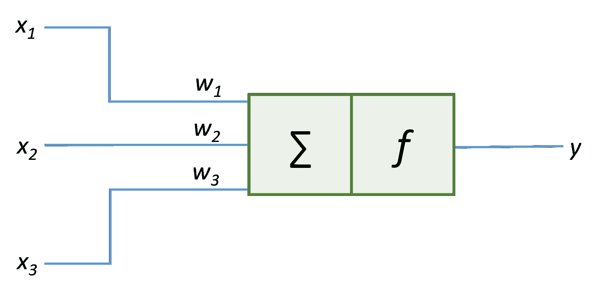
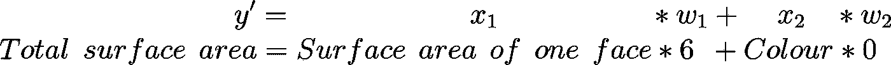
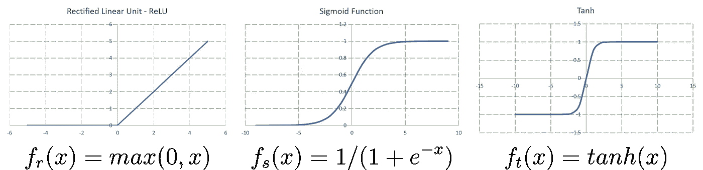
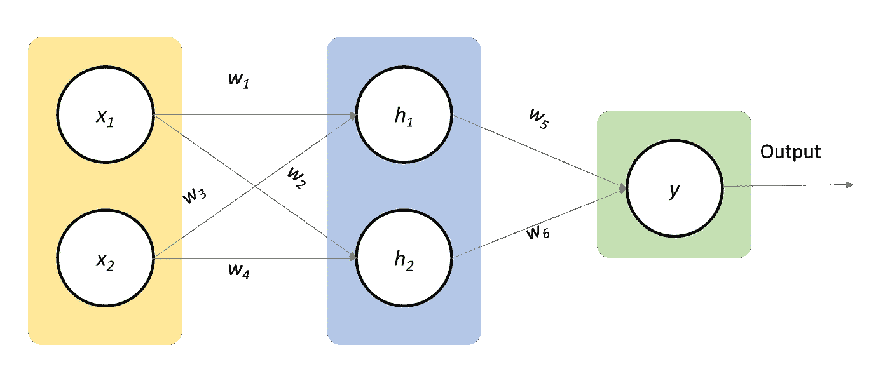
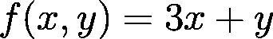
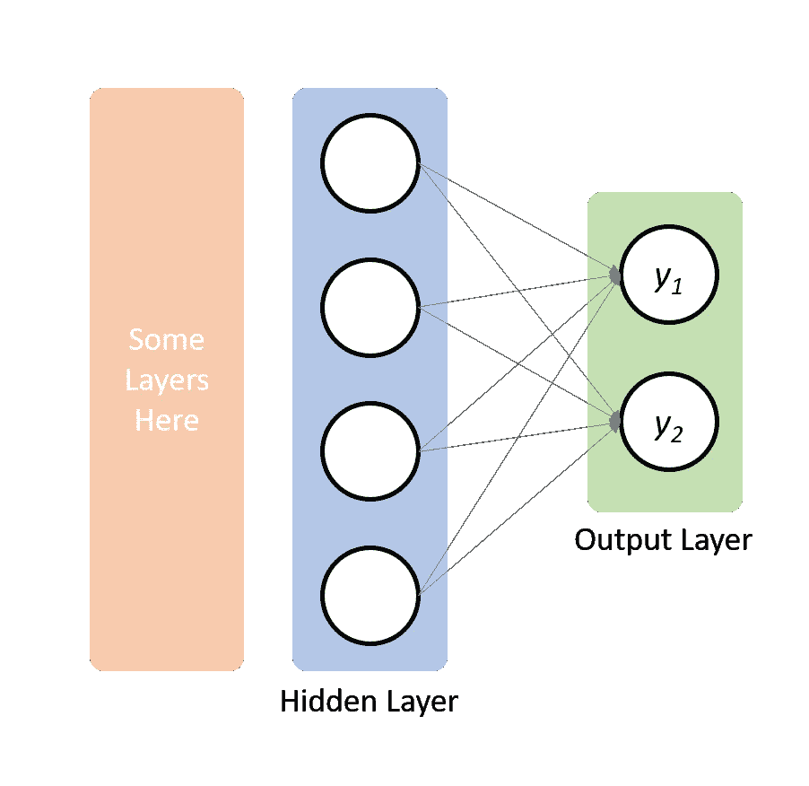

# 神经网络

> 原文：<https://towardsdatascience.com/neural-network-74f53424ba82?source=collection_archive---------9----------------------->

## 更简单直观的解释。

神经网络是用于学习复杂的复杂学习算法，通常是非线性机器学习模型。

```
A note on the notation. x_{i} means x subscript i and x_{^th} means x superscript th.
```

# 线性回归快速回顾

*   线性回归用于预测+∞和-∞之间任何地方的实值输出。
*   用于训练线性回归模型的每个示例由其属性或特征定义，这些属性或特征统称为特征向量。你的名字、年龄、联系电话、性别等等对应于描述你的特征向量。
*   一个线性回归模型 *f(x)* 、*、*是输入实例 *x* 的特征的线性组合，用 *f(x) = wx+b* 表示。
*   通过平方或立方来变换原始特征(考虑一维特征向量 *x* )会产生多项式模型(例如 *f(x) = wx +b* 或 *f(x) = wx +b* )。
*   通常对于具有 R 维特征向量 *x* 和一维输出 *y* 的数据集，线性回归建模一个超平面作为决策边界。超平面在 2D 区域的情况下是一条线，在 3D 空间的情况下是一个平面，在 4D 空间的情况下是一个三维形状，例如一个球体，等等。超平面比它们周围的空间少了一个维度。
*   均方误差成本函数用于找到线性回归模型的最佳值组 *w** 和 *b** 。

# 逻辑回归快速回顾

*   逻辑回归是一种分类算法。给定一个输入示例，逻辑回归模型将该示例分配给相关的类。
*   使用 sigmoid 函数在 0 和 1 之间处理从线性回归模型获得的实值输出，以获得逻辑回归模型。然后基于阈值对新的示例进行分类。
*   一个逻辑回归模型表示为*f(x)= 1/(1+exp(-(wx+b)))*，其中 *exp* 为指数函数。
*   对数似然函数成本函数用于查找逻辑回归模型的最佳值组 *w** 和 *b** 。
*   就像线性回归一样，我们可以将特征转换为包含二次或三次项的更高阶，以使非线性决策边界适合我们的数据集。

# 构建模块——神经元

让我们来看看神经网络的构建模块。



Elementary unit of a neural network: A neuron

基本单元中发生的操作可以用下面的等式来表示—


Output from a single neuron.

让我们看看这个等式的各个组成部分，以及随之而来的*神经元* —

*   *x_{i}，i ∈ {1，2，…，n}* 对应于馈入神经网络的输入特征向量，
*   *b* 是偏置项，
*   对于每个输入特征 *x_{i}* ，都有一个对应的**权重** *w_{i}，*，这表示对应的输入 *x_{i}* 对输出的影响有多强。例如，考虑一个例子，在给定一个面的面积和立方体的颜色的情况下，计算立方体的总表面积。因为一个立方体有六个面，所以我们用一个面的面积乘以 6 来得到立方体的总表面积。然而，立方体的颜色对它的总表面积没有影响，所以我们把它乘以 0。这里 6 和 0 表示对应于输入特征的权重，一个面的面积*和立方体的颜色*。权重值越高，表示该要素对输出的影响越大。**

**

*The idea behind weights.*

*   *请注意，神经元的输入是特征向量和附加偏差的线性组合。最后，该线性组合通过被称为激活函数的函数 *f(x)* 。*

# *激活功能*

*在继续之前，让我们简单讨论一下激活函数。给定一个数据集，目标是找到适合我们数据集的最佳模型，或者我们可以说，在数据集的输入和输出之间逼近一个数学函数。事实证明，由于激活函数的存在，神经网络在逼近这些数学函数方面非常出色。就一会儿，想象一个没有任何激活函数的神经网络——它将只是一些线性回归模型。*

*像 sigmoid 这样的激活函数负责非线性转换，从而使神经网络能够学习复杂的假设。*

*在上面的等式中，如果你用 sigmoid 函数替换函数 *f* ，你将得到一个逻辑单元。常用的激活函数有 Sigmoid、ReLU 和 Tanh。*

**

*Activation functions : Left-to-Right: Rectified Linear Unit (ReLU), the Sigmoid function and the Tanh function.*

# *神经网络*

## *体系结构*

**

*神经网络基本上由三层组成——*

*   ***输入层:**它是一个被动层，也就是说它不执行任何计算，而是将其输入传播到后续层进行进一步处理。*
*   *隐藏层:这是实际计算发生的层。每个圆圈代表一个神经元。每个神经元接收来自前一层的输入，进行所需的计算，并将结果传播到下一层。在单个隐藏层的情况下，隐藏层从*输入层*接收输入，并将输出传播到*输出层。*然而，在多个隐藏层的情况下，一个隐藏层可以从前一个隐藏层接收其输入，并且可以将其输出传递给下一个隐藏层。*
*   ***输出层:**这是最后一层，给出我们想要的输出。在回归问题的输出层中有一个神经元，然而在分类问题的情况下存在多个神经元。*
*   ***箭头:**箭头代表神经网络的参数，称为权重。学习算法的工作是找到一组好的参数，以便神经网络能够很好地泛化。*

## *培养*

*让我们为某个任意问题假设以下神经网络架构—*

**

*Neural Network Architecture*

*很明显，神经网络主要是由它的权重定义的。一旦找到最佳的权重集，网络就可以进行预测了。*

*训练过程从随机初始化权重开始，通常在 0 和 1 之间。随机初始化设施**对称破坏**。考虑一个例子，其中 *w_{1* }、 *w_{2* }、 *w_{3* }和 *w_{4* }被初始化为相同的权重值。这将导致 *h_{1}* 和 *h_{2}* 产生相同的输出，从而通过引入冗余来降低隐藏层中存在的神经元的可用性。*

*初始化权重后，接下来的步骤是将输入馈送到神经网络，并获得一些输出*y’*。这个步骤被称为**正向传播**。*

*显然，使用第一次向前传递获得的输出不是最准确的。诸如均方误差的误差函数可用于获取网络的成本。我们的目标是轻推神经网络的权重，以最小化这种误差。如果我们知道误差相对于权重如何变化，我们可以相应地更新权重以最小化误差。这就是**反向传播**方法派上用场的地方。它使用梯度下降，并决定网络的每个权重应该改变多少。*

*为简化起见，考虑以下函数—*

**

*上述函数对 *x* 的偏导数为 *3* ，对 *y* 的偏导数为 *1* 。解释该结果的一种方式是，如果我们将 *y* 的值增加一个因子 *k* ，那么函数 *f(x，y)* 的值也会增加与∂ *f(x，y)/* ∂ *y = 1* 相同的因子 *k* ，同样，如果我们将 *x* 的值减少一个因子 *k`【也是如此因此，我们可以说一个函数对其变量的导数决定了该函数对该变量的敏感度。本质上，在神经网络的情况下，变量是网络的权重，并且 *f(x，y)* 对应于神经网络模型。**

*导数的这一特性有助于我们确定为了使误差最小化并从网络中获得所需的输出，可能需要轻推一个权重的量。*

*反向传播因以下事实而得名:首先计算输出层的误差，然后通过隐藏层反向传播，在此过程中计算导数。*

```
*A detailed explanation of back-propagation is beyond the scope of this discussion as it can be overwhelming. However the following resource can be useful.*
```

 *[## 反向传播演示

### 反向传播算法对于快速训练大型神经网络至关重要。这篇文章解释了如何…

google-developers.appspot.com](https://google-developers.appspot.com/machine-learning/crash-course/backprop-scroll/)* 

## *对于分类问题*

*神经网络也可以用于分类问题。考虑将电子邮件标记为垃圾邮件或非垃圾邮件的二元分类的经典示例。为了使用神经网络来解决这个问题，输出类别被转换成二维向量，其中，如果电子邮件是垃圾邮件，则设置第一维度，如果电子邮件不是垃圾邮件，则设置第二维度。最后，输出的这种变换形式与输入特征向量一起用于训练神经网络。在 *n-class* 分类的情况下，每个输出被转换成一个 *n* 维向量，其中如果实例属于相应的类，则设置一个维。*

**

*Transformed output variable in case of a spam email.*

**

*Architecture of neural network as a classifier.*

*输出单元 *y_{1}* 预测电子邮件是垃圾邮件的可能性，而 *y_{2}* 预测电子邮件不是垃圾邮件的可能性。根据取较高值的输出单位对电子邮件进行分类。*

# *为什么是新算法？*

*你一定已经学会了线性回归和逻辑回归，那么我们为什么需要训练一个神经网络呢？事实证明，神经网络非常擅长逼近非线性函数。*

*在我们对线性回归和逻辑回归的回顾中，我们讨论了包含更高次项来近似非线性假设，但是这样做并不能保证更好的假设。此外，假设将取决于我们对高次项的选择。考虑这样一种情况，我们有 10 个参数(比如 a，b，c，…，j)，我们决定包括所有平方项，这样做将创建 55 个参数(10+9+8+…+1)。此外，过度拟合的可能性也更高。*

*神经网络解决了这个问题。观察神经网络的隐含层，隐含层的输入不是简单的原始输入 *x_{1}* 和 *x_{2}* ，而是权重，将隐含层的输入转换为原始输入的某个函数。好像神经网络试图找到输入的最佳可能转换，从而解决我们选择更高次项的问题。包括更多的隐藏层允许网络学习甚至更复杂的特征。然而，对于大多数实际用途，两个隐藏层工作得相当好。*