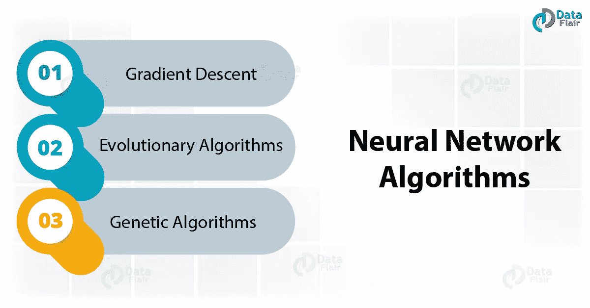

# 神经网络算法—了解如何训练人工神经网络

> 原文：<https://towardsdatascience.com/neural-network-algorithms-learn-how-to-train-ann-736dab9e6299?source=collection_archive---------10----------------------->

*Neural Network Algorithms — Learn How To Train ANN*

# 顶级神经网络算法

神经网络的学习是基于被研究群体的样本进行的。在学习过程中，将输出装置输出的值与实际值进行比较。之后，调整所有单元的权重，以改善预测。

有许多神经网络算法可用于训练[人工神经网络](http://data-flair.training/blogs/artificial-neural-network/)。现在让我们来看看训练神经网络的一些重要算法:

*   梯度下降-用于查找函数的局部最小值。
*   进化算法——基于生物学中自然选择或适者生存的概念。
*   遗传算法——为问题的解决启用最合适的规则，并选择它。所以，他们把他们的‘遗传物质’送给‘孩子’规则。我们将在下面详细了解它们。

获取[神经网络学习规则介绍](http://data-flair.training/blogs/learning-rules-in-neural-network/)了解更多神经网络算法。

# 梯度下降

我们使用梯度下降算法来寻找函数的局部最小值。神经网络算法收敛到局部最小值。与函数梯度的负值成正比。为了找到局部最大值，采取与函数的正梯度成比例的步骤。这是一个梯度上升的过程。

在线性模型中，误差曲面是定义明确且众所周知的抛物线形状的数学对象。然后通过计算找到最小点。与线性模型不同，神经网络是复杂的非线性模型。在这里，误差表面具有不规则的布局，丘陵、山谷、高原和深谷纵横交错。为了找到这个表面上的最后一个点，没有可用的地图，用户必须探索它。

在这种神经网络算法中，沿着斜率最大的线在误差面上移动。它还提供了达到最低点的可能性。然后你必须计算出你应该以什么样的最佳速度下坡。

正确的速度与表面的斜率和学习率成正比。学习速率控制学习过程中权重的修改程度。

因此，神经网络的矩会影响[多层感知器](http://data-flair.training/blogs/artificial-neural-network-model/)的性能。

# 进化算法

这种算法基于生物学中自然选择或适者生存的概念。自然选择的概念表明，对于一个给定的种群来说，环境条件使用了一种压力，这种压力导致该种群中最适者的上升。

要测量给定群体中的适者，您可以应用一个函数作为抽象的度量。

在进化算法的上下文中，将重组称为操作符。然后将它应用于两个或更多的候选项(称为父项),并产生一个或多个新的候选项(称为子项)。对单个候选项应用变异，并产生新的候选项。通过应用重组和变异，我们可以得到一组新的候选者，并根据它们的最适度量值将其放入下一代。

神经网络中进化算法的两个基本要素是:

*   变异算子(重组和变异)
*   选择过程(优胜劣汰)

进化算法的共同特征是:

*   进化算法是基于种群的。
*   进化算法使用群体的重组混合候选者，并创建新的候选者。
*   基于随机选择进化算法的研究。

因此，在细节和应用问题的基础上，我们使用各种形式的进化算法。
一些常见的进化算法有:

*   遗传算法遗传算法——它为优化问题提供解决方案。它在自然进化过程的帮助下提供了解决方案。比如突变、重组、交叉和遗传。
*   遗传编程——遗传编程以计算机程序的形式提供了一种解决方案。由解决计算问题的能力来衡量程序的准确性。
*   进化编程——在模拟环境中开发我们使用的人工智能。
*   进化策略它是一种优化算法。基于生物科学中适应和进化的概念。
*   神经进化——为了训练神经网络，我们使用神经进化。通过指定基因组用来开发神经网络的结构和连接权重。

在所有这些神经网络算法中，遗传算法是最常见的进化算法。

# 遗传算法

遗传算法，由霍兰德的团队在 20 世纪 70 年代早期开发。它能够选择最合适的规则来解决问题。以便它们将它们的“遗传物质”(它们的变量和类别)发送给“子”规则。

这里指的是一组变量的类别。例如，年龄在 36 至 50 岁之间，金融资产不到 2 万美元，月收入超过 2000 美元的客户。

规则相当于决策树的一个分支；它也类似于基因。你可以将基因理解为细胞内控制生物体如何继承其父母特征的单位。因此，遗传算法旨在复制自然选择的机制。通过选择最适合预测的规则，并通过交叉和变异它们，直到获得预测模型。

它们与神经网络一起构成了第二类算法。它模仿自然机制来解释不一定是自然的现象。执行遗传算法的步骤是:

*   步骤 1:随机生成初始规则——首先生成规则，约束条件是它们必须完全不同。每个规则包含用户选择的随机数量的变量。
*   步骤 2:最佳规则的选择——通过适应度函数针对目标检查规则，以引导向最佳规则的进化。最佳规则使适应度函数最大化，并且随着规则的改进概率增加而保留。有些规则会消失，而其他规则会选择几次。
*   第三步:通过变异或交叉生成新规则——首先，转到第二步，直到算法的执行停止。选择的规则被随机变异或交叉。突变是用一个变量或一个类别替换一个原始规则。

两个规则的交叉是它们的一些变量或类别的交换，以产生两个新的规则。杂交比突变更常见。
当满足以下两个条件之一时，神经网络算法结束:

*   达到的指定迭代次数。
*   从第 n 代开始，第 n 代、第 n-1 代和第 n-2 代的规则(几乎)相同。

所以，这都是关于神经网络算法的。希望你喜欢我们的解释。

# 结论

因此，人工神经网络通常难以配置并且训练缓慢，但是一旦准备好，在应用中速度非常快。它们通常被设计成模型来克服数学、计算和工程问题。因为，在数学、神经生物学和计算机科学方面有很多研究。

如果你想分享你的观点，或者对人工神经网络算法有任何疑问，请在评论区提出。

我也推荐你看我以前的文章-

[成为数据科学家应该知道的顶级机器学习算法](https://medium.com/p/17b16bc85077?source=post_stats_page---------------------------)

[机器学习中的降维](https://medium.com/p/dad03dd46a9e?source=post_stats_page---------------------------)

[用于机器学习的人工神经网络—结构&层](https://medium.com/p/a031fcb279d7?source=post_stats_page---------------------------)