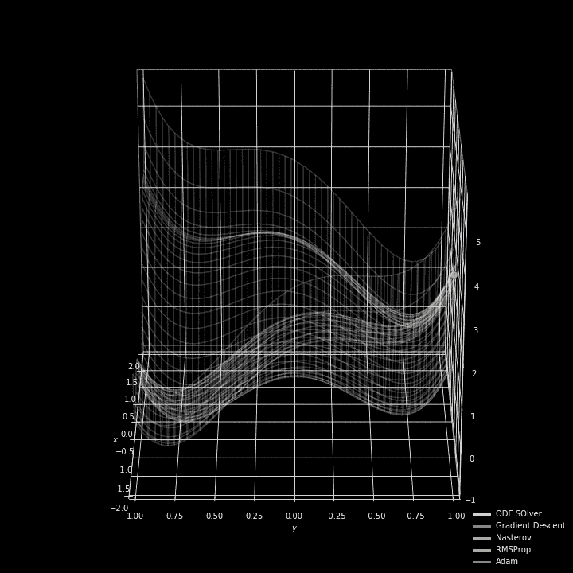
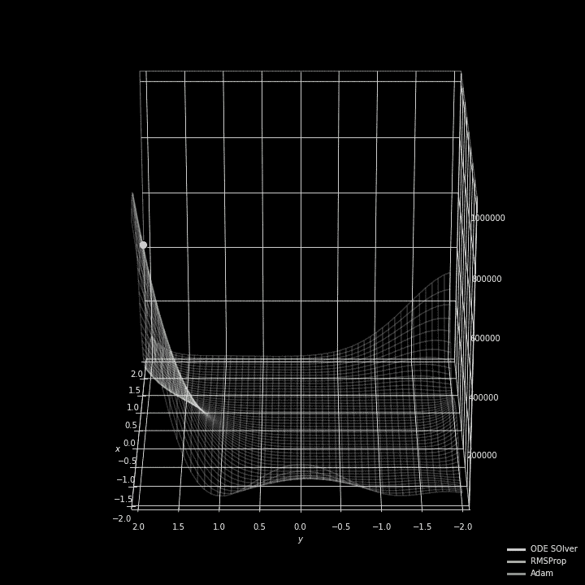
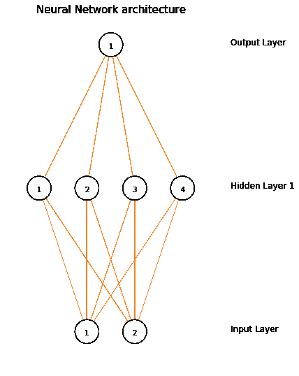
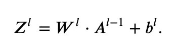
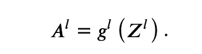
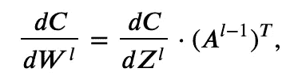
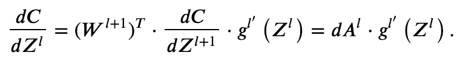
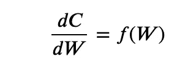
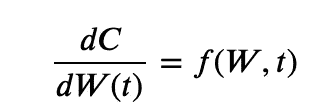
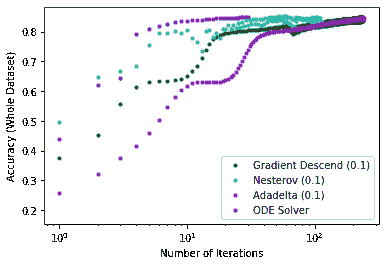

# 用常微分方程重温神经网络反向传播

> 原文：<https://towardsdatascience.com/neural-network-back-propagation-revisited-892f42320d31?source=collection_archive---------30----------------------->

## 通过使用微分方程的数值解来优化神经网络参数被评论为在反向传播期间收敛到成本函数的全局最小值的替代方法。

Different optimizers at work to find the global minimum of two different functions. The “ODE Solver” optimizer will be the subject of this post. If you focus on the white dot, you can see that the ODE solver reaches the minimum with fewer iterations in the two cases shown here. The animation on the left is the [six-hump camel function](http://www.sfu.ca/~ssurjano/camel6.html) with a global minimum at (0,0). The animation on the right is the [Goldstein-Price function](http://www.sfu.ca/~ssurjano/goldpr.html) where the global minimum at (0,-1) is only slightly deeper than the many other local minima. The animations have been created by adapting the code by Piotr Skalski. The code to reproduce the animation above can be found [here](https://gist.github.com/alessiot/aca064b64ff416f75a4d30e08b405c37).

这篇文章的重点是介绍一种不同的方法来优化神经网络的参数(*又名*权重)，同时在训练过程中反向传播损失梯度。核心思想是使用常微分方程(ODE)数值解算器来寻找最小化梯度的权重。这个想法是由[亚伦·敖文思等人](https://www.semanticscholar.org/paper/Efficient-training-of-the-backpropagation-network-a-Owens-Filkin/3ed4de93b828a2350489aaa40de382e3fec45e68?citingPapersSort=is-influential#citing-papers)在 1989 年首次提出的。虽然使用数值解算器增加了大量的计算时间，但是这种方法对于相对较小的数据集和/或收敛到稳定解需要额外努力来微调更“标准”优化器的超参数的情况是有意义的。事实上，数值求解器不需要任何超参数来调整。

最近，在神经网络建模中使用 ODE 求解器已经被用来重新设计深度学习可以对健康变化等连续过程进行建模的方式(见[此处](https://arxiv.org/abs/1806.07366))。

在介绍了神经网络之后，我将描述如何对反向传播步骤进行更改，以便使用 ODE 解算器和标准优化器在 TensorFlow 中训练神经网络。

# 神经网络基础。

神经网络是生物启发的数学模型，可以在计算机上编程，以发现和学习观察数据中的复杂关系。关于神经网络背后的数学的详细回顾，读者可以参考迈克尔·尼尔森的在线书籍。节点的输入层和输出层分别表示特征和结果。一个或多个中间层(称为隐藏层)的序列通常用于捕获初始输入特征的越来越复杂的表示。

An example representation of neural network architecture with two input nodes and a single output node created with the [VisualizeNN](https://github.com/imranq/visualizeNN) module. Other online tools exist to create publication-ready images (see for example [NN-SVG](http://alexlenail.me/NN-SVG/index.html)).

利用这种架构进行学习的基本概念是可调权重，其被表示为网络节点之间的连接线。神经网络也被称为多层感知器网络(MLP)，因为中间层充当*感知器*，即传递来自前一层的传入值或阻止它的本地分类器。

神经网络的训练包括两个阶段，前向和反向传播，这两个阶段重复几次，称为时期。在前向传播过程中，输入数据呈现给网络，并通过其各层进行转换。在任何给定的层 *l，*从前一层𝑙−1 扇出的输入值𝐴使用将层𝑙−1 连接到𝑙的权重( *W* )和层𝑙的偏置( *b* )进行线性变换，如下

𝑍是𝑙.图层节点处的值的向量使用如下激活函数将非线性变换应用于𝑍

在反向传播期间，为每一层𝑙.计算成本𝐶相对于网络权重的梯度对于𝑙层来说，

在哪里

知道这些等式就足以使用 *numpy 从头开始编写神经网络程序。*要查看，可以参考 Piotr Skalski 写的[代码](https://github.com/SkalskiP/ILearnDeepLearning.py)，并在他关于介质的[文章](/lets-code-a-neural-network-in-plain-numpy-ae7e74410795)中查看。

# 用 sklearn 训练 MLP 网络。

在 *sklearn* 中，可以使用任何[监督机器学习技术](https://scikit-learn.org/stable/supervised_learning.html)中使用的典型步骤来训练神经网络模型。为了简单起见，我在下面的代码片段中使用了异或(XOR)真值表。

# 带 ODE 解算器的张量流。

常微分方程(ODE)可以用数值方法求解。事实上，前一节介绍的反向传播方程可以写成

并且是可以用数字求解[的颂歌。在大多数情况下，这种 ODE 在数值上是严格的，也就是说，在积分过程中，通过不稳定性收敛到最优解。](https://www.semanticscholar.org/paper/Efficient-training-of-the-backpropagation-network-a-Owens-Filkin/3ed4de93b828a2350489aaa40de382e3fec45e68?citingPapersSort=is-influential#citing-papers)

刚性常微分方程的解要求积分器的步长非常小，并且可以随时间变化。在 Python 中， [ODE 解算器](https://docs.scipy.org/doc/scipy/reference/generated/scipy.integrate.ode.html#scipy.integrate.ode)在 *scipy* 库中实现。为了使用 ODE 积分器找到最佳权重，我们将变量 *t* 引入反向传播方程，这对应于改变积分器的步长以达到稳定的数值解。因此，我们将使用下面的等式

本节末尾的笔记本更详细地解释了为了用 ODE 求解器优化张量流神经网络而进行的修改。为此，我们需要在“渴望”模式下运行 TensorFlow，如这里的[所示](https://www.tensorflow.org/tutorials/eager/custom_training_walkthrough)。对于这个练习，我从 MNIST 数据集中提取了两个随机样本，其中一个用于训练，另一个用于验证，即调整网络参数。两个样本都包含 0 到 4 之间的数字的数据，每个数字用 100 个样本来表示。当在 50 次迭代之后没有观察到大于 5%的改进时，停止训练，因为在验证集上有最佳性能。该模型的最终性能是根据数字 0-4 的全部 MNIST 数据(35，000 个样本)计算的，如下所示。

Accuracy of the TensorFlow neural network model on the whole datasets of digits between 0 and 4\. (Left) Fewer iterations or presentations of the data to the network are needed to reach optimal performance. (Right) The use of a ODE solver requires significantly greater computation time.

用 ODE 求解器优化神经网络比用标准优化器优化要多花 8 倍的时间。然而，ODE 求解器的精度并不比其他优化器的精度差。

# 结论。

使用常微分方程(ODE)数值解算器已被视为优化神经网络参数的替代方法。虽然这显著增加了训练神经网络模型的计算时间，但是它不需要任何超参数调整，并且可以成为收敛到成本函数全局最小值而不花费时间微调超参数的替代方式。