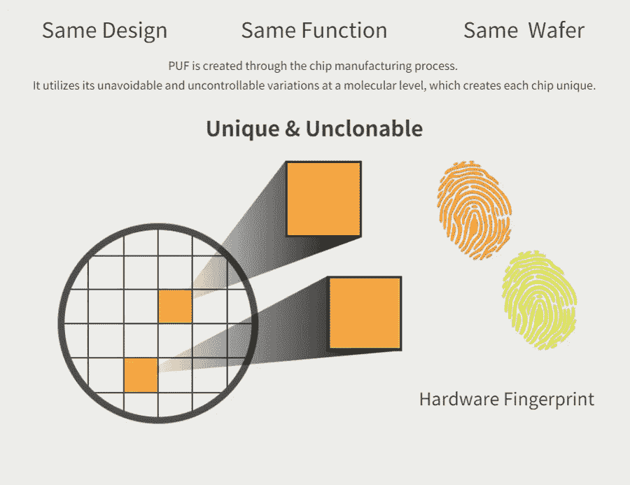
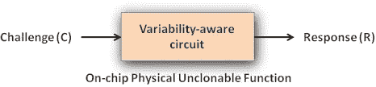
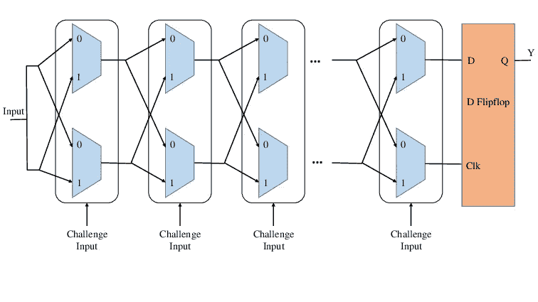
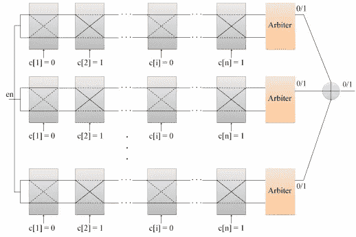
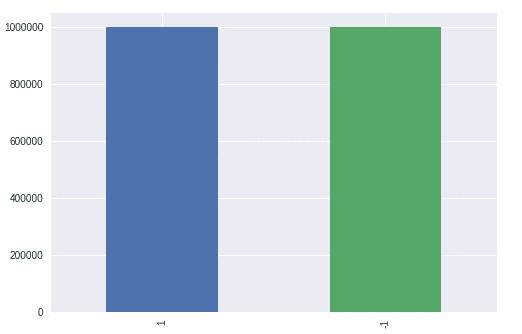
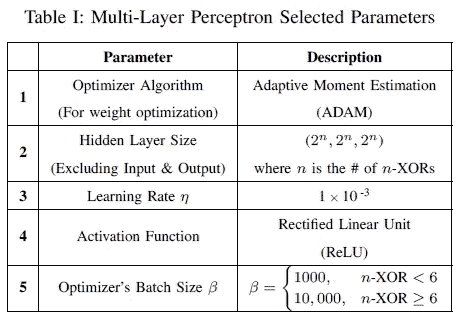
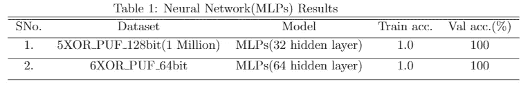

# 基于神经网络的破解大型异或运算的攻击方法

> 原文：<https://towardsdatascience.com/neural-network-based-attack-methods-to-break-the-large-xor-pufs-faebabba1c5a?source=collection_archive---------28----------------------->

> XOR-puf 的漏洞向安全应用程序开发人员揭示了有价值的信息，用于决定为了安全风险而避免哪些 puf。



# 目标

在本文中，我们将讨论对具有五个或更多仲裁器 puf 组件的大型 XOR PUFs 的基于神经网络的攻击的实现。这篇文章展示了基于神经网络的攻击方法如何能够以高精度，在比其他快速机器学习算法少得多的时间内，甚至破解大型 XOR puf(*，即处理可能大于存储容量*的训练数据集。

我们将使用 [keras](https://machinelearningmastery.com/keras-functional-api-deep-learning/) 预测来自 *k* -XOR 仲裁器 PUFs 与 *n* 位挑战输入的最终输出响应。

> 在直接进入实现之前，让我们先来看一些关键概念，以便更好地理解正在发生的事情。

# 你说的 PUFs 是什么意思？

PUF(物理不可克隆功能)是一种物理实体，它利用半导体制造过程中自然发生的变化来为半导体器件提供唯一的身份，这使得不同的半导体器件不可克隆并且是唯一的。PUF 有望为资源受限的物联网设备提供高安全性。如今，puf 通常在集成电路中实现，并且通常用于具有高安全性要求的应用中。



Fig : 1

如上图 1 所示，PUF 是一个输入-输出映射，其中输入是 n 位二进制向量(称为挑战)，输出是 m 位二进制向量(称为响应)。

# 为什么我们需要 puf？

在物联网设备中，确保通信安全至关重要。身份认证是保护物联网设备之间通信的方法之一。 [*经典认证方法*](http://www.iaeng.org/publication/WCECS2014/WCECS2014_pp199-204.pdf) 大多依靠密码算法来处理存储在非易失性存储器中的密钥。这些经典的认证技术有其局限性，这促使 puf 出现。让我们讨论一些限制:-

1.  先前存储在数字非易失性存储器(例如 EEPROM、SRAM)中的密码密钥容易受到不同类型的攻击(例如入侵攻击和旁道攻击)。
2.  由于这种计算昂贵的加密算法使用非易失性存储器，并且需要更多的制造成本以及更多的功耗等。

因此，puf 被广泛用于认证和密码密钥生成的目的，并且 puf 不是将秘密存储在数字存储器中，而是从集成电路(ic)的物理特性中导出秘密。

# 让我们现在来理解异或仲裁者 PUF

XOR 仲裁器 puf(也称为 XOR PUFs)由多个仲裁器 puf 构成。首先，我们需要了解仲裁器 PUFs，它测量两条对称路径之间的时间延迟差。如图 2 所示，aribter PUFs 接受输入信号和 *n* 位挑战，产生单一输出(称为响应)。输入信号根据挑战输入决定其路径，因为它允许输入信号为挑战位的每一位决定每个单独多路复用器中的路径。



Fig-2 : Arbiter PUF circuit.

在图 2 中，仲裁器 PUF 电路为每个输入 X 创建两条具有相同布局长度的延迟路径，并基于哪条路径更快产生输出 Y。

现在在图 3 中，来自 *k* 仲裁器 puf 的不同响应被一起异或以产生单个和最终响应 *r* ，其中所有的单个仲裁器 puf 使用相同的 *n* 位挑战作为挑战输入，这种 *k* 仲裁器 puf 与 XOR 的组合构成了 *k* -XOR 仲裁器 puf。



Fig-3 : k-XOR Arbiter PUFs.

理解了与 XOR 仲裁器 puf 相关的所有关键概念后，让我们继续实现。

# 数据集概述

从 k-XOR 仲裁器 PUFs 模拟中生成了两个数据集:

1.  **5-XOR _ 128 位数据集**:该数据集使用 128 位级或 128 位挑战输入的 5-XOR 仲裁器 PUF 生成。它由 6 百万行和 129 个属性组成，其中最后一个属性是类标签或最终响应(1 或-1)。分为两组:训练组(500 万)和测试组(100 万)。
2.  **6-XOR _ 64 位数据集**:该数据集使用 6-XOR 仲裁器 puf 生成，具有 64 位级或 64 位挑战输入。它由 240 万行和 65 个属性组成，其中最后一个属性是类标签或最终响应(1 或-1)。分为两组:训练集(200 万)和测试集(400K)。

我们可以用神经网络和不同的机器学习算法来实现这两个数据集。两个数据集都是平衡的或者包含相等比例的类。

我们可以从 [**这里**](https://archive.ics.uci.edu/ml/datasets/Physical+Unclonable+Functions) 访问数据集。



Fig-4 : Balanced Dataset (6-XOR_64bit).

# 对 k-XOR 仲裁器 PUFs 的神经网络攻击

实施不同的机器学习算法，如逻辑回归(或 LR 与 Rprop)可以揭示 XOR 仲裁器 puf 中的漏洞，如建议的 [***此处***](https://dl.acm.org/citation.cfm?id=1866335) 。但是，在高性能计算服务器上，这可能需要几天的并行计算时间来破解如此大的 XOR PUFs。由于神经网络是监督学习的最强大的方法之一，这就是为什么特别是，我试图实现多层感知器之一，非常有效地打破它，正如在这篇 [***论文***](https://www.semanticscholar.org/paper/A-Machine-Learning-Based-Security-Vulnerability-on-Aseeri-Zhuang/c77f42238e6098000c7add21d517c7ff0676f54f) 中所建议的。我们将在 keras 中实现与 [*论文*](https://www.semanticscholar.org/paper/A-Machine-Learning-Based-Security-Vulnerability-on-Aseeri-Zhuang/c77f42238e6098000c7add21d517c7ff0676f54f) 中建议的相同的 MLPs 架构和参数，并将观察准确性，即我们在破解 XOR 仲裁 puf 时的准确性。



Fig-5 : List of all parameters of MLPs and their implementation.

## 代码片段:

一些代码片段有助于您理解使用 keras 来破解具有 n 位挑战输入的 XOR 仲裁器 puf 的 MLPs 的实现。

1.  对于 5-XOR _ 128 位数据集(仅考虑 100 万):

```
input_layer = Input(shape = (128,))out1 = Dense(32,activation = 'relu')(input_layer)
out1 = Dropout(0.5)(out1)
out1 = BatchNormalization()(out1)out2 = Dense(32,activation = 'relu')(input_layer)
out2 = Dropout(0.5)(out2)
out2 = BatchNormalization()(out2)out3 = Dense(32,activation = 'relu')(input_layer)
out3 = Dropout(0.5)(out3)
out3 = BatchNormalization()(out3)merge = concatenate([out1,out2,out3])output = Dense(2,activation = 'sigmoid')(merge)model = Model(inputs=input_layer, outputs=output)
# summarize layers
print(model.summary())# plot graph
plot_model(model, to_file='MODEL.png')adam = optimizers.Adam(lr = 0.001)
model.compile(loss='binary_crossentropy', optimizer = adam, metrics=['accuracy'])
```

2.6-XOR _ 64 位数据集:

```
input_layer = Input(shape = (64,))out1 = Dense(64,activation = 'relu')(input_layer)
out1 = Dropout(0.5)(out1)
out1 = BatchNormalization()(out1)out2 = Dense(64,activation = 'relu')(input_layer)
out2 = Dropout(0.5)(out2)
out2 = BatchNormalization()(out2)out3 = Dense(64,activation = 'relu')(input_layer)
out3 = Dropout(0.5)(out3)
out3 = BatchNormalization()(out3)merge = concatenate([out1,out2,out3])output = Dense(2,activation = 'sigmoid')(merge)model = Model(inputs=input_layer, outputs=output)
# summarize layers
print(model.summary())# plot graph
plot_model(model, to_file='MODEL.png')adam = optimizers.Adam(lr = 0.001)
model.compile(loss='binary_crossentropy', optimizer = adam, metrics=['accuracy'])
```

正如我们所见，图 5 考虑了两个数据集的隐藏层数和其他参数，如激活函数和优化器。

# 结果

在 keras 中实现神经网络后，结果(如图 6 所示)非常好。



Fig-6

在这里，我们许多人可能认为结果是过度拟合的，但事实并非如此，因为当我们考虑实现的一些数据点时，我们可以预期这种结果。

# 结论

如果你已经到达这里，非常感谢:)。

安全方面最重要的工作是发现或发现所有可能的不安全风险。如果在任何 puf 中发现任何不安全的风险或漏洞，可能会提醒 puf 设计者提出新的 puf，以便他们可以克服这些现有的漏洞。puf 中的漏洞还可以帮助基于 puf 的设备的物联网设备开发人员避免这些 puf。最后，我们能够使用基于神经网络的攻击来发现 XOR 仲裁器 puf 中的漏洞。MLPs 帮助我们用 XOR 仲裁器 puf(即 [***论文***](https://www.semanticscholar.org/paper/A-Machine-Learning-Based-Security-Vulnerability-on-Aseeri-Zhuang/c77f42238e6098000c7add21d517c7ff0676f54f) )的大容量数据集，比其他任何匹配学习算法更快地实现了漏洞。

请参考我的 GitHub 链接 [***这里***](https://github.com/Manish-12/Vulnerability-of-XOR-Arbiter-PUFs) 访问 Jupyter 笔记本上写的完整代码。

**特别感谢** Srikanth Varma Chekuri 和 AppliedAICourse 团队帮助我在机器学习和深度学习领域学到了这么多东西。

# 参考

1.  [https://www . semantic scholar . org/paper/A-Machine-Learning-Based-Security-Vulnerability-on-Aseeri-Zhuang/c77f 42238 e 6098000 C7 add 21d 517 c7ff 0676 f 54 f](https://www.semanticscholar.org/paper/A-Machine-Learning-Based-Security-Vulnerability-on-Aseeri-Zhuang/c77f42238e6098000c7add21d517c7ff0676f54f)
2.  [https://dl.acm.org/citation.cfm?id=1866335](https://dl.acm.org/citation.cfm?id=1866335)
3.  [https://machine learning mastery . com/keras-functional-API-deep-learning/](https://machinelearningmastery.com/keras-functional-api-deep-learning/)
4.  [https://ieeexplore.ieee.org/stamp/stamp.jsp?arnumber=6823677](https://ieeexplore.ieee.org/stamp/stamp.jsp?arnumber=6823677)
5.  [https://www.appliedaicourse.com/](https://www.appliedaicourse.com/)

PS: 如果你认为可以改进这个博客，我一定会考虑的。