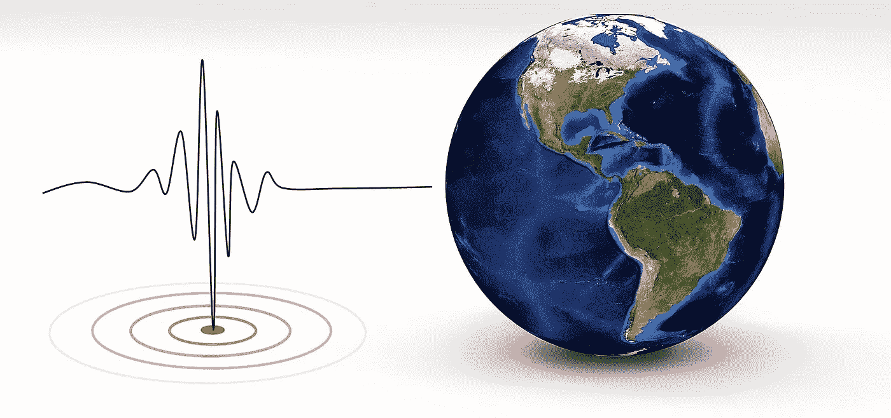
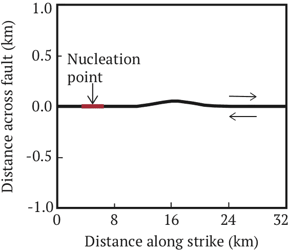
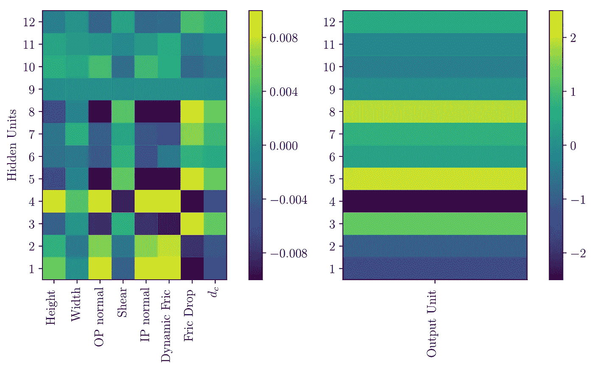
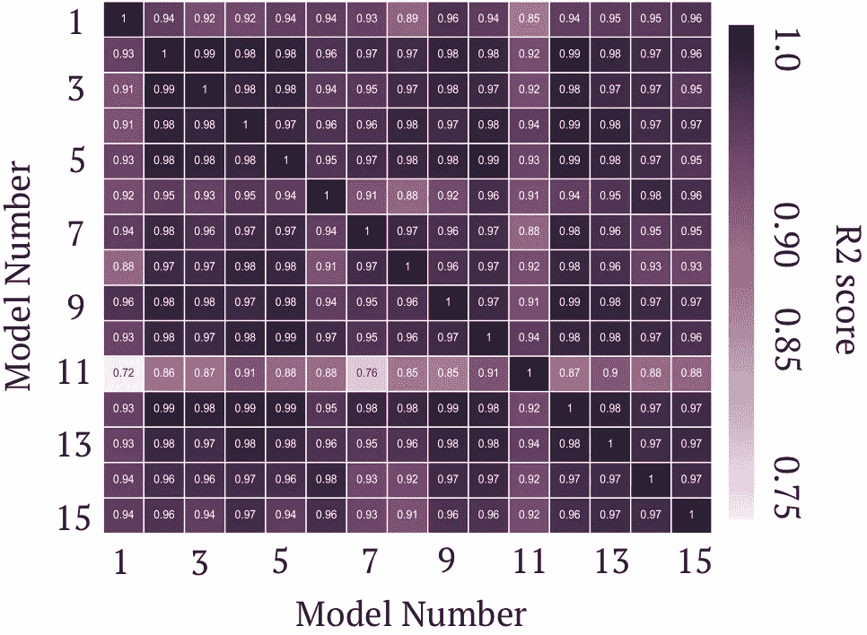

# 神经网络解释了地震破裂的物理现象

> 原文：<https://towardsdatascience.com/neural-network-can-explain-the-physics-of-an-earthquake-rupture-8417ee2c058d?source=collection_archive---------27----------------------->

## 地震破裂动力学的机器学习方法



地震造成的破坏对全世界的人类构成了威胁。为了估计这种危险，科学家们使用不同地点的地震仪记录的历史地震数据和地面运动。然而，目前的方法大多是经验性的，由于缺乏历史地质数据，可能无法捕捉未来大地震中地面震动的全部范围。这导致了危险估计的重大不确定性。不仅如此，由于缺乏足够的历史数据，科学家们大多依赖模拟数据，计算量很大。

在本文中，我将解释使用机器学习预测地震是否会破坏断层的工作流。这个项目是我在孟菲斯大学地震研究和信息中心(CERI)的博士论文的一部分。 [Eric.G .涂抹](http://www.ceri.memphis.edu/people/egdaub/people.html)也是这篇论文的合著者，他监督了我和这个项目。最近我们提交了关于 Arxiv 的论文:【https://arxiv.org/abs/1906.06250[。](https://arxiv.org/abs/1906.06250)

在本文的剩余部分，我将讨论机器学习算法在预测真实地表断层破裂和估计地震危险方面的潜力。我也将解释有助于揭示地震破裂过程的复杂模式

# 地震破裂域



Figure-1: Rupture domain

我们制作了一组 2，000 个不同断层几何形状(高度和宽度)和材料特性(平面外应力、平面内应力、剪切应力、摩擦下降、动态摩擦系数)的破裂模拟，如图 1 所示。我们使用了 Eric 开发的开源数值模拟代码 [fdfault](https://github.com/egdaub/fdfault) 。该区域长 32 公里，宽 24 公里，横跨断层。该图显示了断层的放大视图，以便更好地观察障碍物。地震在离弯曲的几何障碍 10 公里的成核区(红色)开始。根据断层的几何形状和性质，有些地震能够穿过断层，有些则不能。为了简单起见，我们把它变成一个二元分类问题。更多的细节可以在报纸上找到。


Earthquake rupture propagation along the fault

上面的例子是地震无法突破断层的地震破裂停止之一。断裂止于断层的向上弯曲处。用 4 个 CPU 运行这个模拟大约花了 3.5 个小时。我们开发的 ML 可以在几分之一秒内预测这种地震破裂状态。让我们深入 ML 模型的细节和它们的能力。

# 浅层神经网络

我们使用随机森林和神经网络开发了两个预测模型。在本文中，我只关注神经网络算法。更具体地说，对所学参数的解释帮助我们揭示了地震破裂过程的机制。


Figure-2: Schematic diagram of the neural network topology used in the work

上面的图-2 说明了我们在这项工作中使用的神经网络拓扑的示意图。网络有一个 12 单元的隐层。八个输入参数被映射到这 12 个单元，为模型产生 12×8 的权重矩阵。当每个输入进入一个单元时，前一个单元的输出乘以其权重。然后，该单元将所有这些新输入相加，从而确定中间单元的输出值。然后，我们将非线性激活函数 ReLu 应用于输出权重，它传递所有大于零的值，并将任何负输出设置为零。最后，隐藏层将 12 个输出与输出层合并，并使用结果权重进行预测。

# 解释模型参数并获得物理特性



Figure-3: The parameters learned by the NN.

神经网络学习到的权重使我们能够对最能预测破裂传播能力的输入参数组合有所了解。为了可视化权重，我们构建了权重对神经单元矩阵图。这如图 2 所示。左侧面板显示了将八个输入(水平)映射到十二个隐藏单元(垂直)的模型权重。右侧面板显示了将隐藏单元合并为右侧一个输出单元的权重。色标表示重量的范围。模型中的权重范围从负值到正值，表示抑制性或兴奋性影响。

如果特定单元的输出图层权重为正，则参数组合是破裂传播的良好预测值，而负权重表示参数组合是破裂停止的良好预测值。类似地，将输入映射到作为正指示器的隐藏单元的权重表示该输入单元的大值有利于破裂。如果输出单元具有负权重，则隐藏单元的大权重表示该参数的大值预示着停滞。权重提供了对哪些参数组合最能预测破裂的洞察。


Table-1: Five parameter combinations and their corresponding possible predictions

图 2 所示的参数提供了对参数组合及其对确定破裂传播的影响的深入了解。比如 **unit-4** 负输出权重大。该单元的剪切应力、摩擦下降和滑移弱化距离具有较大的负权重，而高度、半宽度、op、ip 正应力、动摩擦系数和摩擦下降具有正权重。这表明，如果断层具有低剪切应力和低摩擦降，但具有高压缩 op、IP 正应力、高动态摩擦系数、高度和半宽度，则断裂可能不会传播而是停止。

另一方面，**单元-8** 具有相当大的正输出权重。OP、IP 法向摩擦系数和动态摩擦系数具有大的负权重，而摩擦下降、滑移弱化距离和剪切应力具有高的正权重。请注意，这些基本上是与 **unit-4** 中的值相反的值，表明数据中存在单一的潜在模式。因此，基于输入数据，模型已经精确地确定了如何以更复杂的方式最佳地组合各种输入参数。表-1 列出了参数组合和相应的预测。

# 学习参数的稳健性



Figure-4: The illustration shows the coefficient of determination (R2 score) among the weights learned by fifteen neural network models

我们证实，通过重复拟合过程，由 ANN 方法找到的参数组合是稳健的。我们开发了另外 15 个神经网络模型，具有相同的训练数据集，但不同的初始权重，以观察模型是否找到预测破裂的相同特征。模型的平均检验准确率为 83%。尽管不同模型的最终权重略有不同，但根据输出权重按升序排序时，它们表现出高度的相关性。图 4 显示了模型学习的参数(升序)中系数(R2 分数)的确定。模型 11 与另一个模型的相关性最小，而模型 10 和 12 的相关性较高。尽管模型 11 与模型 1 的相关系数最低，为 0.71，但它足够高，仍然包含与其他模型相似的模式。高度相关的权重表明，不管模型初始化的随机方式如何，模型都选取一致的特征。

# 想要在你的领域找到对机器学习和图论感兴趣的人吗？

我将通过分享关于 xoolooloo 的有趣信息来结束这篇文章。它是一个基于位置的搜索引擎，利用相似和多重兴趣寻找当地人。例如，如果你读了这篇文章，你肯定对数据科学、图论、机器学习感兴趣。因此，你可以在你的地区找到有这些兴趣的人；去 www.xoolooloo.com[看看](http://www.xoolooloo.com)

# 结论

在计算上，这些模型是非常高效的。一旦计算了训练模拟，并且训练了机器学习算法，模型可以在几分之一秒内做出预测。这有可能将动态破裂模拟的结果纳入其他复杂的计算中，如反演或概率地震危险分析，这通常是不可能的。

该方法还可以应用于其他复杂的破裂问题，如分支断层、断层跨越和其他复杂的非均质性，其中地震破裂传播的物理特性尚未完全了解。机器学习提供了一种处理这种复杂的非线性问题的新方法，并帮助科学家理解潜在的地球物理参数如何与产生的滑动和地面运动相关，从而帮助我们限制未来的地震危害和风险。

非常感谢您的阅读。我希望你喜欢整个系列。完整的代码和相关数据可以在 [Github](https://github.com/msahamed/machine_learning_earthquake_rupture) 上找到。论文的细节可以在 Arxiv:[https://arxiv.org/abs/1906.06250](https://arxiv.org/abs/1906.06250)上找到。

我很想收到你的来信。你可以联系我:

```
Email: sabbers@gmail.com
LinkedIn: [https://www.linkedin.com/in/sabber-ahamed/](https://www.linkedin.com/in/sabber-ahamed/)
Github: [https://github.com/msahamed](https://github.com/msahamed)
Medium: [https://medium.com/@sabber/](https://medium.com/@sabber/)
```