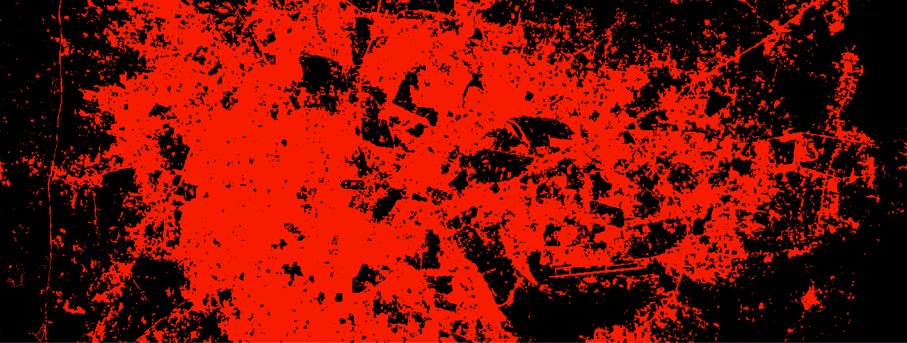
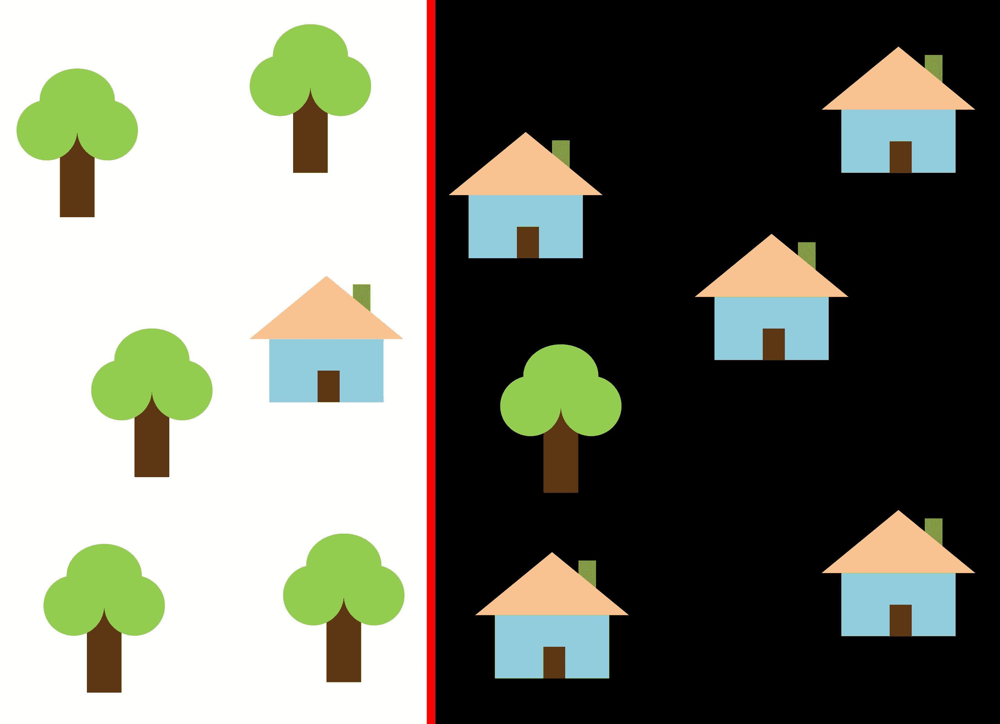
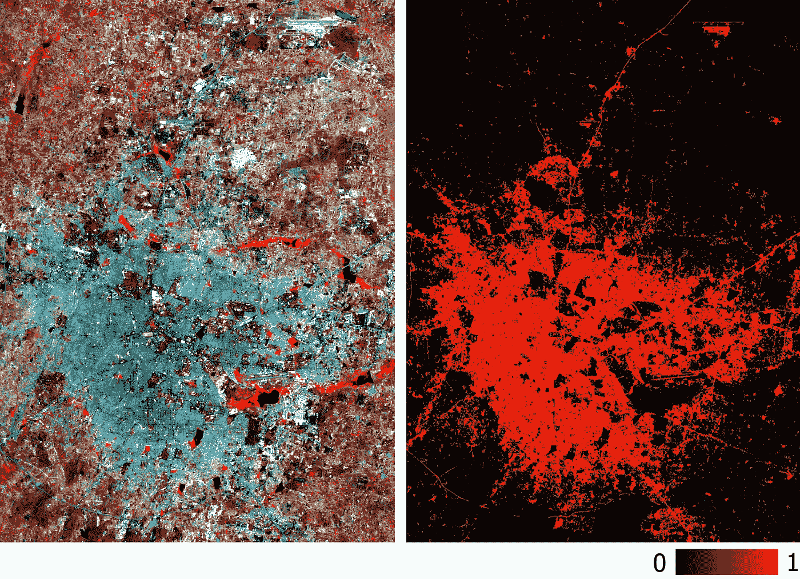
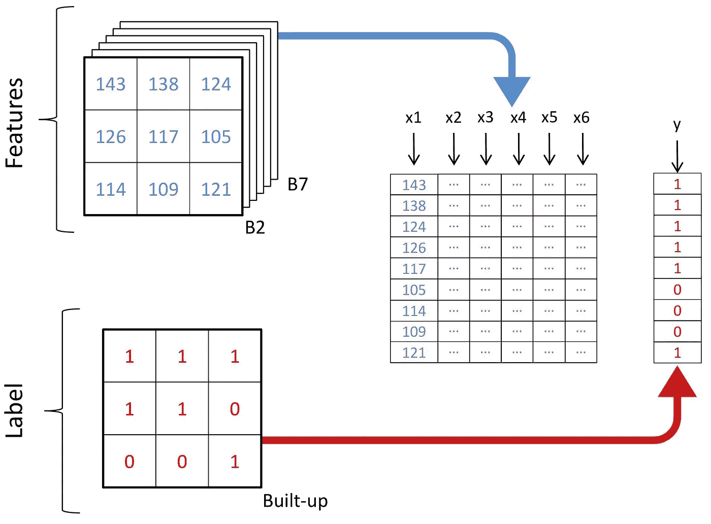
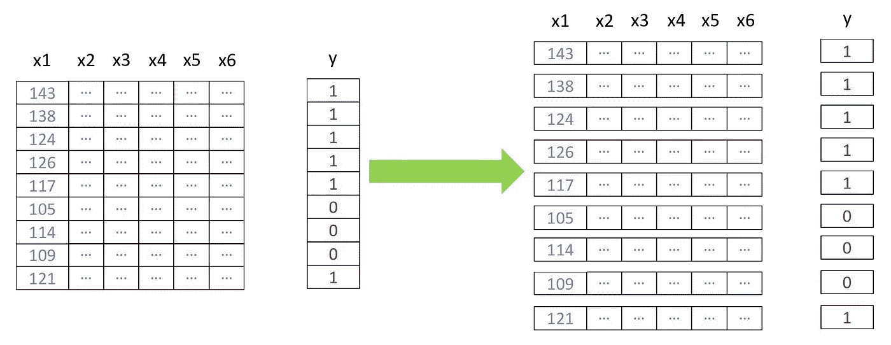
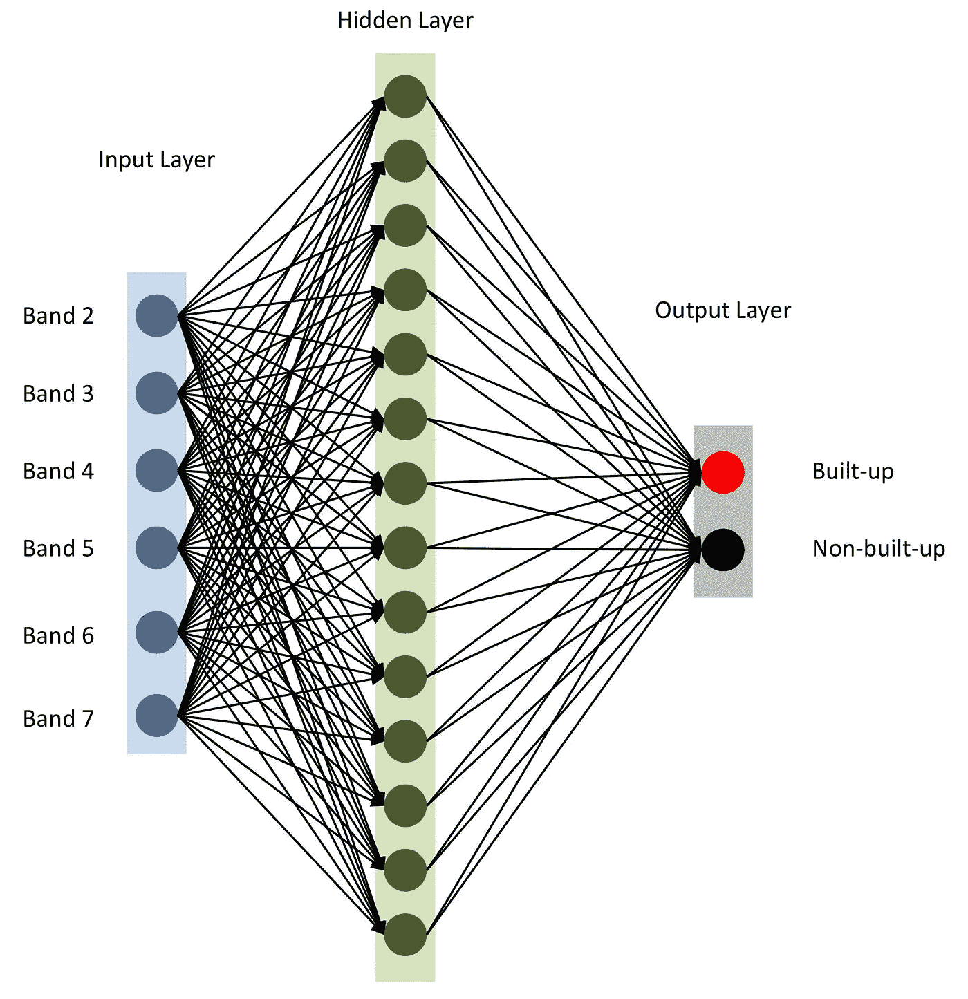
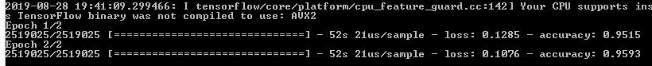
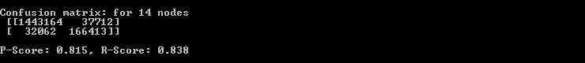
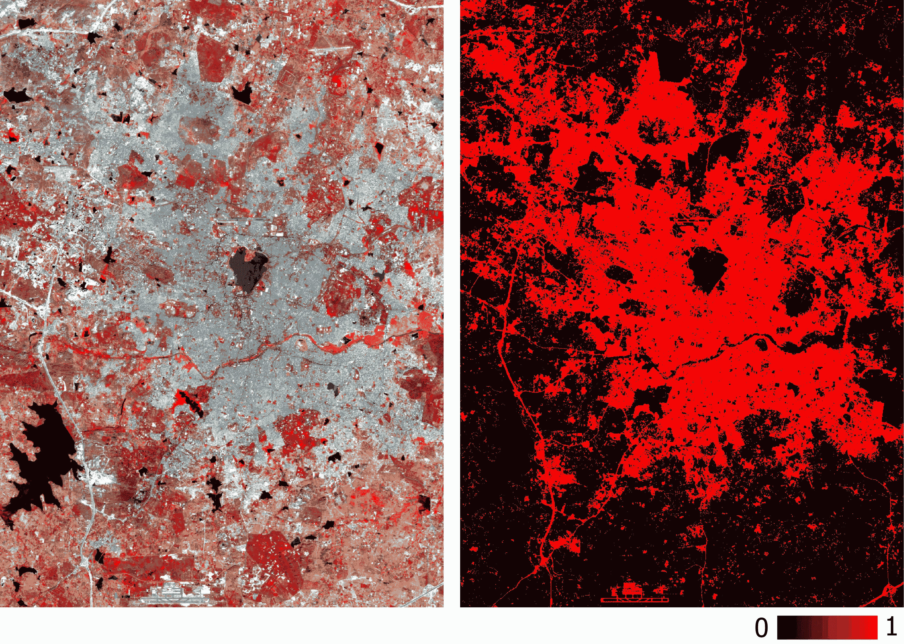

# Python 中张量流用于卫星数据分类的神经网络

> 原文：<https://towardsdatascience.com/neural-network-for-satellite-data-classification-using-tensorflow-in-python-a13bcf38f3e1?source=collection_archive---------2----------------------->

## Landsat 5 多光谱数据分类的逐步指南



深度学习已经接管了解决复杂问题的大多数领域，**地理空间**领域也不例外。这篇文章的标题让你感兴趣，因此，我希望你熟悉**卫星数据集**；目前，Landsat 5 TM。关于机器学习(ML)算法如何工作的小知识，将帮助你快速掌握这个动手教程。对于那些不熟悉 ML 概念的人来说，简而言之，它是在一个实体的一些特征(特征或 x)与其其他属性(值或标签或 Y)之间建立关系——我们为模型提供了大量的示例(带标签的数据)，以便它从中学习，然后预测新数据(未标记的数据)的值/标签。机器学习的理论复习到此为止！

**卫星数据的一般问题:**

卫星数据中的两个或更多要素类(例如，建筑物/荒地/采石场)可能具有相似的光谱值，这使得分类在过去几十年中成为一项具有挑战性的任务。由于上述问题，传统的监督和非监督方法不能成为完美的分类器，尽管它们稳健地执行分类。但是，总是有相关的问题。让我们通过下面的例子来理解这一点:


在上图中，如果您使用一条垂直线作为分类器，并且只沿着 x 轴移动它，使其将右边的所有图像分类为房屋，那么答案可能不是直截了当的。这是因为数据的分布是这样的，不可能用一条垂直线将它们分开。但是，这并不代表房子完全不能分类！



假设您使用红线(如上图所示)来分隔这两个特征。在这种情况下，分类器识别出了大多数房屋，但仍有一所房屋被遗漏，一棵树被错误分类为房屋。为了确保没有一所房子被落下，你可以使用蓝线。在这种情况下，分类器将覆盖所有的房子；这叫做高**召回**。然而，并不是所有的分类图像都是真正的房屋，这被称为低**精度**。同样，如果我们用绿线，所有归类为房屋的图像都是房屋；因此，该分类器具有较高的精度。在这种情况下，召回的次数会少一些，因为还有三所房子没有被召回。在大多数情况下，精确度和召回率之间的这种**权衡**成立。

上面展示的房屋和树木问题类似于建筑、采石场和荒地的情况。卫星数据的分类优先顺序可能因目的而异。例如，如果您希望确保所有堆积像元都被分类为堆积像元，一个也不留，并且您不太关心具有相似特征的其他类的像素被分类为堆积像元，则需要具有高召回率的模型。相反，如果优先级是只对纯堆积像素进行分类，而不包括任何其他类别的像素，并且您可以放弃混合堆积像素，则需要高精度分类器。通用模型将在房子和树的情况下使用红线，以保持精确度和召回率之间的平衡。

**当前范围内使用的数据**

这里，我们将把 Landsat 5 TM 的六个波段(波段 2 —波段 7)作为特征，并尝试预测二元组合类。2011 年为班加罗尔获取的多光谱 Landsat 5 数据及其相应的二元组合层将用于培训和测试。最后，2011 年为海得拉巴获取的另一个多光谱 Landsat 5 数据将用于新的预测。要了解更多关于如何为模型创建训练数据，你可以查看[这个视频](https://youtu.be/X7Hg9kVkbtI)。

> 由于我们使用带标签的数据来训练模型，这是一种受监督的 ML 方法。



Multispectral training data and its corresponding binary built-up layer

我们将使用谷歌在 Python 中的 Tensorflow 库来构建一个神经网络(NN)。将需要以下其他库，请确保您提前安装它们(查看[此视频了解安装](https://youtu.be/1G2tkMaoS8Q)说明):

1.  [*pyrsgis*](https://pypi.org/project/pyrsgis/) —读写 **GeoTIFF**
2.  [*sci kit-learn*](https://pypi.org/project/scikit-learn/)*—用于数据预处理和准确性检查*
3.  *[*numpy*](https://pypi.org/project/numpy/) —用于基本数组操作*
4.  *[*Tensorflow*](https://www.tensorflow.org/install/gpu) —建立神经网络模型*

*不再拖延，让我们开始编码吧。*

*将所有三个文件放在一个目录中—在脚本中指定路径和输入文件名，并读取 GeoTIFF 文件。*

**pyrsgis* 包的*栅格*模块分别读取 GeoTIFF 的地理位置信息和数字编号(DN)值作为 NumPy 数组。有关这方面的详细信息，请参阅 pyrsgis [页面](https://pypi.org/project/pyrsgis/)。*

*让我们打印出已读取数据的大小。*

*输出:*

```
*Bangalore multispectral image shape: 6, 2054, 2044
Bangalore binary built-up image shape: 2054, 2044
Hyderabad multispectral image shape: 6, 1318, 1056*
```

*从输出可以明显看出，班加罗尔图像中的行数和列数是相同的，多光谱图像中的层数也是相同的。该模型将学习根据所有波段的相应 DN 值来决定像素是否是累积的，因此，两个多光谱图像应该具有以相同顺序堆叠的相同数量的特征(波段)。*

*我们现在将把数组的形状改为二维数组，这是大多数 ML 算法所期望的，其中每行代表一个像素。 *pyrsgis* 包的 *convert* 模块将为我们完成这项工作。*

**

*Schemata of restructuring of data*

*输出:*

```
*Bangalore multispectral image shape: 4198376, 6
Bangalore binary built-up image shape: 4198376
Hyderabad multispectral image shape: 1391808, 6*
```

*在上面代码片段的第七行，我们提取了所有值为 1 的像素。这是一个自动防故障装置，可以避免由于 NoData 像素通常具有极高和极低的值而导致的问题。*

*现在，我们将拆分数据进行训练和验证。这样做是为了确保模型没有看到测试数据，并且在新数据上表现得同样好。否则，模型将**过拟合**，并且仅在训练数据上表现良好。*

*输出:*

```
*(2519025, 6)
(2519025,)
(1679351, 6)
(1679351,)*
```

*上面代码片段中的 test_size (0.4)表示训练-测试比例是 60/40。*

*包括神经网络在内的许多 ML 算法期望**标准化的**数据。这意味着直方图在某个范围内(这里是 0 到 1)被拉伸和缩放。我们将正常化我们的功能，以满足这一要求。归一化可以通过减去最小值并除以范围来实现。由于 Landsat 数据是 8 位数据，因此最小值和最大值分别为 0 和 255 (2⁸ = 256 个值)。*

> *请注意，从数据中计算最小值和最大值进行标准化始终是一个好的做法。为了避免复杂性，我们将坚持使用默认的 8 位数据。*

*另一个附加的预处理步骤是将特征从二维重新整形为三维，使得每行代表一个单独的像素。*

**

*输出:*

```
*(2519025, 1, 6) (1679351, 1, 6) (1391808, 1, 6)*
```

*现在一切就绪，让我们使用[](https://keras.io/)*构建模型。首先，我们将使用**顺序**模型，一个接一个地添加图层。有一个节点数等于 *nBands* 的输入层。使用一个具有 14 个节点的隐藏层和作为 [**激活函数**](https://keras.io/activations/) 的 *relu* 。最后一层包含二进制组合类的两个节点，具有' *softmax* '激活功能，适用于分类输出。你可以在这里找到更多的激活功能。**

****

**Neural Network architecture**

**如第 10 行所述，我们用'*亚当*'优化器编译模型。(还有几个[其他的](https://keras.io/optimizers/)可以查一下。)我们现在将使用的损失类型是*分类稀疏交叉熵。*你可以在这里查看详情[。模型性能评估的度量是“*准确性*”。](https://keras.io/losses/)**

**最后，我们用两个**时期**(或迭代)在 *xTrain* 和 *yTrain* 上运行模型。根据您的数据大小和计算能力，拟合模型需要一些时间。模型编译后可以看到以下内容:**

****

**让我们预测我们单独保存的测试数据的值，并执行各种准确性检查。**

***softmax* 函数为每个类类型**概率**值生成单独的列。我们只对类一(构建的)进行提取，如上面代码片段的第六行所述。地理空间相关分析的模型变得难以评估，因为与其他一般的 ML 问题不同，依赖一个概括的总结误差是不公平的；空间位置是制胜模式的关键。因此，**混淆矩阵**、精度和召回率可以更清楚地反映模型的表现如何。**

****

**Confusion matrix, precision and recall as displayed in the terminal**

**正如在上面的混淆矩阵中所看到的，有成千上万的堆积像素被分类为非堆积像素，反之亦然，但占总数据大小的比例较小。在测试数据上获得的准确率和召回率都在 0.8 以上。**

**您总是可以花一些时间并执行一些迭代来找到最佳的隐藏层数量、每个隐藏层中的节点数量以及获得精确度的历元数量。一些常用的遥感指数如 **NDBI** 或 **NDWI** 也可以在需要时用作特征。达到所需精度后，使用模型预测新数据并导出 GeoTIFF。稍加调整的类似模型可以应用于类似的应用。**

> **请注意，我们导出的是具有预测概率值的 GeoTIFF，而不是其阈值二进制版本。我们始终可以稍后在 GIS 环境中设置 float 类型图层的阈值，如下图所示。**

****

**Hyderabad built-up layer as predicted by the model using the multispectral data**

**模型的精度已经通过精度和召回率进行了评估，您也可以对新的预测栅格进行传统检查(例如 **kappa 系数**)。除了上述卫星数据分类的挑战之外，其他直观限制包括由于光谱特征的变化，该模型无法预测不同季节和不同地区获得的数据。**

**我们在本文中使用的模型是神经网络的一个非常基本的架构，一些复杂的模型，包括**卷积神经网络(CNN)** 已经被研究人员证明可以产生更好的结果。想入门 CNN 进行卫星数据分类，可以看看这篇帖子“[***CNN 在中分辨率卫星数据上同样闪亮吗？*T13”。这些方法的主要优点是模型训练后的可伸缩性。**](/is-cnn-equally-shiny-on-mid-resolution-satellite-data-9e24e68f0c08)**

**请在此找到使用的数据和完整的脚本[。](https://github.com/PratyushTripathy/Landsat-Classification-Using-Neural-Network)**