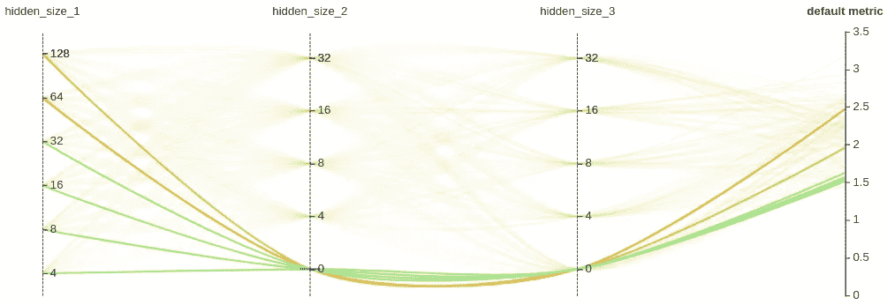

# 用 NNI 搜索神经结构

> 原文：<https://towardsdatascience.com/neural-network-intelligence-to-learn-function-approximation-44046de9cccb?source=collection_archive---------25----------------------->

## 探索微软开源 AutoML 工具的强大功能


Photo by [Filip Bunkens](https://unsplash.com/@thebeardbe?utm_source=medium&utm_medium=referral) on [Unsplash](https://unsplash.com?utm_source=medium&utm_medium=referral)

神经架构搜索(NAS)是深度学习中的一个困难挑战。我们中的许多人都经历过，对于给定的数据集，网络最初可能很难学习。但只要简单地改变一个超参数，学习就会变得非常有效。手动调整包括架构在内的超参数既耗时又具有挑战性，尽管对某些人来说也很有趣。最近，自动超参数调优变得越来越流行，因为它提供了大规模解决 NAS 的有效机制。

在这篇文章中，我们将展示如何使用自动化机器学习(AutoML)工具来执行超参数搜索——NNI(用于[神经网络智能](https://github.com/microsoft/nni))由微软开源。我刚刚开始和 NNI 一起踢球，到目前为止我都很喜欢它。在这里，我想分享我如何使用 NNI 搜索最佳超参数和架构。

作为一个例子，我们将建立一个神经网络来近似数学函数。假设满足激活函数的某些非线性条件，具有一个或多个隐藏层的神经网络被称为*连续*函数的函数逼近器[1]。像只有一个隐藏层的浅层网络不如宽度限制的深层网络有效(例如[2])。对于神经网络如何逼近函数，迈克尔·尼尔森给了[一个很好的、通俗易懂的解释](http://neuralnetworksanddeeplearning.com/chap4.html)。

# 简单非线性函数

我们从一个简单的非线性目标函数 *y = x* 开始。我们用一个有几个隐层的全连通网络，在范围[0，1]内学习这个函数。

下面是将此函数实现为 PyTorch 数据集的代码。输入数据和地面实况标签由 shape (1，1)的张量表示，其中两个分量分别是通道和数据维度。它们都是 1，因为 *x* 和 *y* 只保存标量值。如果您有基于图像的神经网络的经验，您可以将数据视为单通道、单像素图像。

我们建立了一个多达三个隐藏层的全连接网络。该网络可以灵活地配置成具有从 1 到 3 范围内的隐藏层深度。

为了让训练进行下去，我们需要做出许多选择。我们必须决定隐藏层的数量，每层的大小，激活函数，优化器，学习率等。我们从一个由 16 个神经元组成的单一隐藏层的网络开始，选择如下:

```
activation_function: 'Sigmoid'learning_rate: **0.01** optimizer: 'Adam'loss_function: 'MSELoss'
```

运行[脚本](https://github.com/jing-IG/nni-function-approximator/blob/master/func_approx.py)250 个时期，您将获得下图所示的学习功能。红点是网络输出，大致遵循实际的二次函数(蓝色曲线)。但显然，还有改进的空间。


Fig. 1

请注意，我们在 Python 中有固定的随机数生成种子，因此每个网络总是以相同的初始权重/偏差集开始，并且结果是可重复的。

作为一个有趣的实验，我们可以让网络架构更宽或更深，看看它是否能提高近似性。下图显示了一个 256 个神经元的单一隐藏层的“更广泛”模型的结果。性能和 16 神经元版本差不多。


Fig. 2

但是，如果我们使用一个“更深”的模型，每层有 16 个神经元的三个隐藏层，网络输出与目标函数非常匹配(见下图)。更具体地说，网络可以描述为{ *隐藏 _ 层 _ 1 _ 大小:16，隐藏 _ 层 _ 2 _ 大小:16，隐藏 _ 层 _ 3 _ 大小:16* }。为了便于我们讨论各种网络架构，我们将使用三个数字{ *n1、n2、n3* }的简写来表示一个网络。在这种情况下，模型是{16，16，16}。目标函数和网络输出之间的最大近似误差约为 0.02。误差在 *x* (1.0)的上限附近达到最大值。其他地方的误差要小得多。


Fig. 3

# 更具挑战性的功能

现在让我们尝试一个更具挑战性的函数。该函数上下波动几次，变化幅度缓慢衰减。由于没有更好的名字，我将这个函数命名为*振荡器*。振荡器是连续的，因此神经网络可以近似。然而，它并不平滑，有突然的“跳跃”(令人惊讶的是，神经网络仍然能够处理这些，正如我们稍后看到的那样)。


Fig. 4

该函数可以通过构建一系列点( *x，y* )来创建，其中 *x* 均匀分布在[0，1]之间，间距为 0.1，并且 *y* 从 0.5 开始，并且每个后续的 *y* 值从其最后一个值计算。

```
yᵢ₊₁ = -(yᵢ² - 0.5)
```

现在，找出所有的超参数并不容易。例如，如果我们使用相同的{16，16，16}网络，并运行超过 1000 个时期，结果是:


Fig. 5

注意，由于目标函数比简单的二次函数更复杂，所以我们在更多的时期训练它。学习的函数(红色)不像二次函数那样逼近实际函数(蓝色)，即使网络已经“识别”了函数中最显著的特征并逼近它们。

至于之前的二次函数，我们可以把网络架构做得更宽或者更深，看看是否提高了逼近度。但是找到最有效的模型将会很费时间，因为它涉及到大量的试验和错误。

在下一部分，我们将使用 NNI 自动进行搜索。

# 神经网络智能

NNI 是一个灵活和强大的超参数搜索工具。我发现 NNI 的文档和工作流程很容易理解和遵循，不像其他自动机器学习选项。NNI 可以很容易地配置为在本地机器上运行。对于我们的目的来说，在本地进行搜索就足够了，因为每次训练不超过几分钟，甚至不需要 GPU。

NNI 的一个实验由许多试验组成，每个试验评估一个独特的搜索参数组合。在每次试验中，使用选定的参数从头开始构建模型并进行训练。所有的性能指标都被记录下来，并可以在最后使用提供的 WebUI 进行检查。

有两种方式使用 NNI:通过 NNI API 或通过 NNI Python 注释。主要区别是在哪里指定搜索参数选项。NNI API 方法希望在 JSON 文件中列出选项，而 Python Annotation 方法允许您将选项作为特殊格式的代码注释嵌入到脚本中的参数定义旁边。后者为神经架构搜索提供了更好的支持(命名为*神经架构搜索的 NNI 编程接口*)，允许您在注释中方便地指定不同的架构选项。然而，在撰写本文时，这仍然是一个实验性的特性。在本帖中，我们将使用 NNI API 进行包括架构在内的超参数搜索。与 NNI 编程接口相比，这需要我们编写更多的代码来管理架构搜索，但对于我们的目的来说，这仍然是可管理的。

# 第一次 NNI 实验

有许多超参数可能会影响我们的模型性能，但同时搜索所有这些参数非常耗时。假设我们想要探索 7 个参数，每个参数有 4 个值要尝试。唯一参数组合的总数是 4⁷ = 16384。运行如此多的试验将需要很长时间，甚至分析最终结果也可能变得棘手。如本文后面所示，我们将使用 NNI WebUI 来可视化和查看结果。但是，如果我们有太多的数据点，这将不会工作得很好。

相反，我们将把搜索分为两步。还记得我们在这篇文章前面选择的四个参数(激活函数、学习率、优化器和损失函数)的值吗？第一步是尝试为这些与网络架构无关的参数找到合适的值。一旦我们摆脱了这些不确定性，我们就可以专注于架构搜索。注意，激活功能可以被视为一个架构参数。但是它与网络的拓扑无关。在我们的实验中，我们将它与其他非体系结构参数分组，以便稍后我们可以从拓扑角度关注体系结构搜索。

请注意，这种两步走的方法是一种妥协。这里，我们隐含地假设非架构参数(如损失函数)的优化不依赖于网络拓扑，因此我们可以将它们解耦并分别优化。但在现实中，拓扑、非架构超参数和初始网络权重/偏差很可能交织在一起，它们的优化在某种程度上都相互依赖。我们采取这种实用的方法来寻找一个很好的解决问题的方法，但我们不能保证它是最好的。

我们在这个实验中使用一个具有{16，16，16}网络的模型。它可能不是最好的架构(我们还不知道)，但它将允许我们首先深入了解其他超参数。

我们将首先了解 NNI 是如何运作的。使用 NNI API 运行搜索实验的工作流程如下:

**1。定义搜索空间。**搜索空间描述了要搜索的每个参数的所有选择。这些选项将在 JSON 文件中列出，如下所示:

```
"act_func"**:** {"_type"**:** "choice"**,** "_value"**:** ["ReLU"**,** "LeakyReLU"**,** "Sigmoid"**,** "Tanh"**,** "Softplus"]}**,** "learning_rate"**:** {"_type"**:** "quniform"**,** "_value"**:** [**0.005, 0.05, 0.01**]}**,** "optimizer"**:** {"_type"**:** "choice"**,** "_value"**:** ["SGD"**,** "Adam"**,** "RMSprop"]}**,** "loss"**:** {"_type"**:** "choice"**,** "_value"**:** ["SmoothL1Loss"**,** "MSELoss"]}
```

这里，由于学习率是一个连续变量，我们将其设置为在[0.005，005]的范围内变化，间距为 0.01。

**2。修改模型代码以使用 NNI API。**该步骤包括在每次试验之前调用 *nni.get_next_parameter()* 以获得所有搜索参数的唯一组合，在训练期间调用*nni . report _ intermediate _ result()*以将中间性能指标作为时间序列记录到 nni，并在每次训练会话之后调用*nni . report _ final _ result()*以记录最终指标。一个[这样的培训脚本](https://github.com/jing-IG/nni-function-approximator/blob/master/func_approx_nni.py)的例子在这篇文章的报告中提供。

**3。创建一个 YAML 配置文件，并在其中启用 NNI API。**

```
authorName: default
experimentName: single_var_func
trialConcurrency: 2
maxExecDuration: 5h
maxTrialNum: 5000
trainingServicePlatform: local
searchSpacePath: search_space_non_arch.json
*#searchSpacePath: search_space_arch.json* useAnnotation: false
tuner:
  builtinTunerName: GridSearch
trial:
  command: python3 func_approx_nni.py oscillator
  codeDir: .
  gpuNum: 0
```

注意，我们将 *useAnnotation* 设置为 *false* 来启用 NNI API。我们使用 *GridSearch* 搜索调谐器参数*builtin tunername*来搜索所有可能的参数值组合。NNI 调谐器还有其他选项可以使用不同的搜索算法来减少搜索空间和节省搜索时间。在撰写本文时，我还没有很好地理解这些搜索算法所做的权衡。你需要给他们一个尝试，看看哪个更适合你。

**4。进行实验。**

像这样运行实验:

```
nnictl create --config config.yaml
```

如果一切顺利，这将启动一个 NNI 搜索实验，并告诉你查看结果的网址。用浏览器打开网址，你可以看到 NNI 的网页界面。这个漂亮的 UI 工具非常容易使用。它报告作业运行状态，当实验完成时，它以直观的图形显示所有试验的结果。这是有趣的部分——看看哪个参数组合能给你最好的结果。

下面的超参数视图突出显示了该实验中表现最好的部分(红色部分)。


Fig. 6

我们可以看到， *SmoothL1Loss* 损失函数、 *Adam* 优化器和 *LeakyReLU* 激活函数的组合往往工作得非常好，并且性能对学习速率不太敏感。

超参数视图的一个很大的特点是我们可以向左或向右移动参数线。在下面的屏幕截图中，我们将“loss”参数与“act_func”参数互换。现在很容易看出 *ReLU* 不管其他参数如何都是一个糟糕的选择，因为它没有与任何接近或高于 2.0 的好的度量值相关联(用红色或橙色标出)。


Fig. 7

同样，如果我们将“优化器”参数移至“默认指标”线附近，我们可以看到 *RMSprop* 和 *SGD* 通常与较低的指标值(绿色或黄色)相关联，无法与 *Adam* 竞争。


Fig. 8

有趣的是，表现最好的人在人群中脱颖而出。这种差异可能不是非常显著，因为一些模型的指标在训练期间波动很大。最佳表现者具有以下参数:

```
'act_func': 'LeakyReLU'**,** 'learning_rate': **0.005,** 'optimizer': 'Adam'**,** 'loss': 'SmoothL1Loss'
```

如果我们采用这些参数值并训练相同的{16，16，16}网络，则网络输出与目标函数非常匹配(与图 5 相比):


Fig. 9

# 建筑搜索

我们的架构搜索是为了找到隐藏层的最佳数量和每个隐藏层的大小，如下面另一个 JSON 文件中所列:

```
"hidden_size_1"**:** {"_type"**:** "choice"**,** "_value"**:** [**4, 8, 16, 32, 64, 128**]}**,** "hidden_size_2"**:** {"_type"**:** "choice"**,** "_value"**:** [**0, 4, 8, 16, 32**]}**,** "hidden_size_3"**:** {"_type"**:** "choice"**,** "_value"**:** [**0, 4, 8, 16, 32**]}
```

将零作为 hidden_size_2 和 hidden_size_3 的选项有效地覆盖了不使用隐藏层 2 或 3 的情况。例如，将 hidden_size_2 和 hidden_size_3 都设置为零会产生单个隐藏层网络。

搜索结果如下图所示。表现最好的人用红色或橙色突出显示。我们可以看到，第一个隐藏层中的神经元数量与性能指标大致相关。这一层的神经元越多，我们得到的结果就越好。一般来说，其他隐藏层也是这样，有道理。网络掌握的参数越多，它就越容易学习。


Fig. 10

就网络拓扑而言，没有明显的模式。有这样的网络，每一层的神经元数量随着我们的深入而减少，或者大致保持不变，或者实际上增加。

我们对具有最少层数和最少神经元的简单网络更感兴趣。这就是神经架构搜索的目标——在性能很少或没有妥协的情况下找到高效的网络。所有单隐藏层网络的性能在此图中突出显示:



Fig. 11

{64，0，0}模型可以给出非常好的结果，最大近似误差约为 0.006:


Fig. 12

网络中使用的参数(权重和偏差)数量为 64+64+64+1=193，明显少于我们之前尝试的{16，16，16}网络(有 593 个参数)！

如果一个 64 个神经元的单隐层的网络可以在这里工作，为什么一个 128 个神经元的单隐层的网络不能在比较中表现得更好呢？在 WebUI 上，我们可以轻松地检查每个网络随时间推移的性能。结果是{128，0，0}模型的度量比{64，0，0}模型波动更大。因为我们只报告了最后 5 个指标中的最小值作为最终结果，所以{128，0，0}模型的值碰巧更低。但是来自{128，0，0}模型的最后 5 个指标的上限与该实验中的其他顶级表现者一样具有竞争力。为什么训练时波动这么大？在训练的后期阶段，网络性能可能对微小的参数调整很敏感，对于更大的网络，保持所有神经元以同步方式更新更具挑战性。因此，有时性能会有较大的波动。

另一个有趣的观察是，对于所有只有一个隐藏层的网络，那些不超过 32 个神经元的网络显然不会从目标函数中学习。事实上，我们可以通过粗略的分析来理解这一点。近似振荡器函数所需的最小参数是 11*2 = 22，因为我们需要知道范围[0，1]中的所有 11 个关键点，并且每个都需要两个值( *x* 和 *y* )来指定。参数在 22 左右的网络将由 4 或 8 个神经元的单一隐藏层组成。但这并不意味着{8，0，0}网络可能是最有效的架构，因为我们知道神经网络在默认情况下不会自动学习变得高效和苗条。也就是说，网络不知道如何最有效地利用每个参数的*。因此，我们的任务所需的网络可能会比{8，0，0}网络大一点。事实上，如果我们试图训练一个少于 16 个神经元的单一隐藏层的网络，即使经过 5000 多个纪元，我们也无法找到一个像样的解决方案。*

# 概述

NNI 是一个轻量级，灵活的 AutoML 工具，可以帮助神经架构搜索。在这篇文章中，我们用 NNI 优化了一个近似函数的神经网络。这个实验可以在计算能力一般的台式机上完成。因此，与其他 NAS 框架相比，它很容易上手。我们只探索了使用 NNI 的基本方法。我希望他们是有趣的，并且让你对 NNI 能做什么有一个好的感觉。

这篇文章的全部源代码是[在这里](https://github.com/jing-IG/nni-function-approximator)。

**参考文献**

[1] G. Cybenko，[“通过叠加 sigmoidal 函数的近似法”](http://citeseerx.ist.psu.edu/viewdoc/download?doi=10.1.1.441.7873&rep=rep1&type=pdf)，*控制、信号和系统的数学*，2(4)，303–314，1989。
【2】s . Liang 和 R. Srikant，“[为什么深度神经网络要进行函数逼近？](https://arxiv.org/abs/1610.04161)、*ICLR 2017*2017。