# 神经网络优化

> 原文：<https://towardsdatascience.com/neural-network-optimization-7ca72d4db3e0?source=collection_archive---------0----------------------->

## 涵盖优化器，动量，自适应学习率，批量标准化，等等。

> “我们的目标是找到最大价值优化的最佳点，在这一点上，愚蠢的风险与过度的谨慎相平衡。”―史蒂文·j·鲍恩

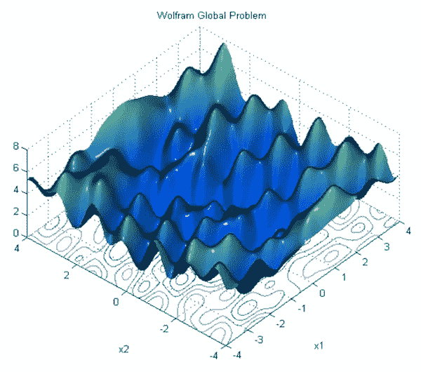

Example of non-convex loss surface with two parameters. Note that in deep neural networks, we’re dealing with millions of parameters, but the basic principle stays the same. Source: [Yoshua Bengio](http://videolectures.net/site/normal_dl/tag=983679/deeplearning2015_bengio_theoretical_motivations_01.pdf).

本文是旨在揭开神经网络神秘面纱并概述如何设计和实现它们的系列文章中的第三篇。在本文中，我将讨论以下与神经网络优化相关的概念:

*   **优化挑战**
*   **气势**
*   **自适应学习率**
*   **参数初始化**
*   **批量归一化**

您可以访问下面的前几篇文章。第一个为那些不熟悉的人提供了神经网络主题的简单介绍。第二篇文章涵盖了更多的中间主题，如激活函数、神经结构和损失函数。

[](/simple-introduction-to-neural-networks-ac1d7c3d7a2c) [## 神经网络简介

### 神经网络的详细概述，有大量的例子和简单的图像。

towardsdatascience.com](/simple-introduction-to-neural-networks-ac1d7c3d7a2c) [](/comprehensive-introduction-to-neural-network-architecture-c08c6d8e5d98) [## 神经网络体系结构综合介绍

### 神经架构、激活函数、损失函数、输出单元的详细概述。

towardsdatascience.com](/comprehensive-introduction-to-neural-network-architecture-c08c6d8e5d98) 

这些教程主要基于哈佛和斯坦福大学计算机科学和数据科学系的课堂笔记和例子。


# **优化挑战**

当在神经网络的上下文中讨论优化时，我们讨论的是**非凸优化**。

[*凸优化*](https://en.wikipedia.org/wiki/Convex_optimization) 涉及一个只有一个最优的函数，对应全局最优(最大或最小)。凸优化问题没有局部最优的概念，使它们相对容易解决——这些是本科和研究生优化课程中常见的介绍性主题。

*非凸优化*涉及一个具有多个最优值的函数，其中只有一个是全局最优值。根据损失面的不同，很难找到全局最优解

对于神经网络来说，我们所说的曲线或曲面就是损失曲面。因为我们试图最小化网络的预测误差，所以我们对在这个损失表面上找到全局最小值感兴趣——这是神经网络训练的目的。

与此相关的问题有很多:

*   什么是合理的学习率？太小的学习率需要太长的时间来收敛，而太大的学习率将意味着网络不会收敛。
*   我们如何避免陷入局部最优？一个局部最优值可能被一个特别陡峭的损失函数包围，并且可能很难“逃离”这个局部最优值。
*   **如果损失面形态发生变化怎么办？**即使我们能找到全局最小值，也不能保证它会无限期地保持全局最小值。一个很好的例子是在不代表实际数据分布的数据集上进行训练时，当应用于新数据时，损失面会有所不同。这就是为什么试图使训练和测试数据集代表整个数据分布如此重要的一个原因。另一个很好的例子是，由于其动态特性，数据的分布习惯性地发生变化——这方面的一个例子是用户对流行音乐或电影的偏好，这种偏好每天和每月都在变化。

幸运的是，有一些方法可以解决所有这些挑战，从而减轻它们潜在的负面影响。

## **局部最优**

以前，局部最小值被认为是神经网络训练中的一个主要问题。如今，研究人员发现，当使用足够大的神经网络时，大多数局部最小值会导致低成本，因此找到真正的全局最小值并不特别重要——具有合理低误差的局部最小值是可接受的。

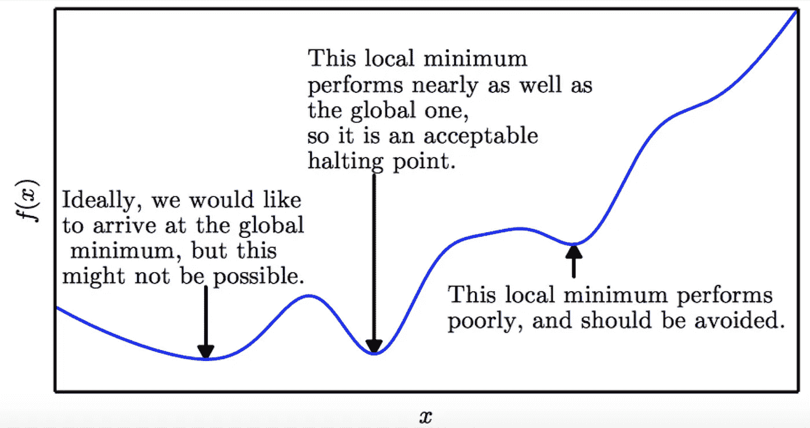

## **鞍点**

最近的研究表明，在高维空间中，鞍点比局部极小值更有可能出现。鞍点也比局部最小值更成问题，因为接近鞍点的梯度可能非常小。因此，梯度下降将导致可忽略的网络更新，因此网络训练将停止。

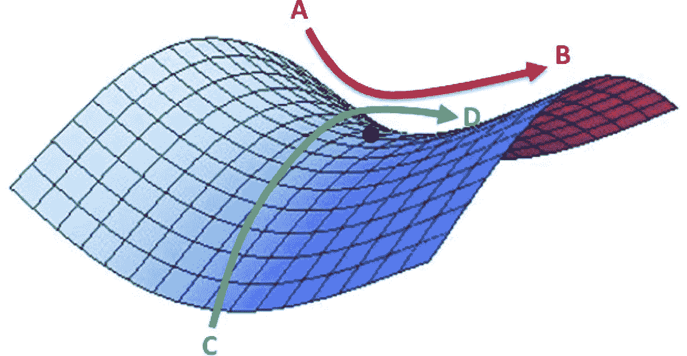

Saddle point — simultaneously a local minimum and a local maximum.

经常用于测试鞍点上优化算法性能的一个示例函数是 [**罗森布鲁克函数**](https://en.wikipedia.org/wiki/Rosenbrock_function) 。该函数由公式描述: *f(x，y) = (a-x) + b(y-x)，*在 *(x，y) = (a，a )* 处具有全局最小值。

这是一个非凸函数，其全局最小值位于一个狭长的谷中。找到山谷相对容易，但是由于平坦的山谷，很难收敛到全局最小值，因此具有小的梯度，因此基于梯度的优化过程很难收敛。


A plot of the Rosenbrock function of two variables. Here a=1,b=100, and the minimum value of zero is at (1,1).

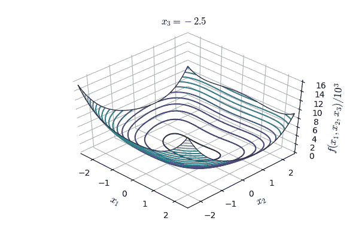

Animation of Rosenbrock’s function of three variables. [Source](http://Simionescu, P.A. (2014). Computer Aided Graphing and Simulation Tools for AutoCAD users (1st ed.). Boca Raton, FL: CRC Press. ISBN 978-1-4822-5290-3.)

## **调理不良**

一个重要的问题是代表学习问题的误差函数的特殊形式。早就注意到，误差函数的导数通常*是病态的*。这种病态反映在包含许多鞍点和平坦区域的误差地形中。

为了理解这一点，我们可以看看 *Hessian 矩阵*——一个标量值函数的二阶偏导数的方阵。 *Hessian* 描述了多变量函数的局部曲率。

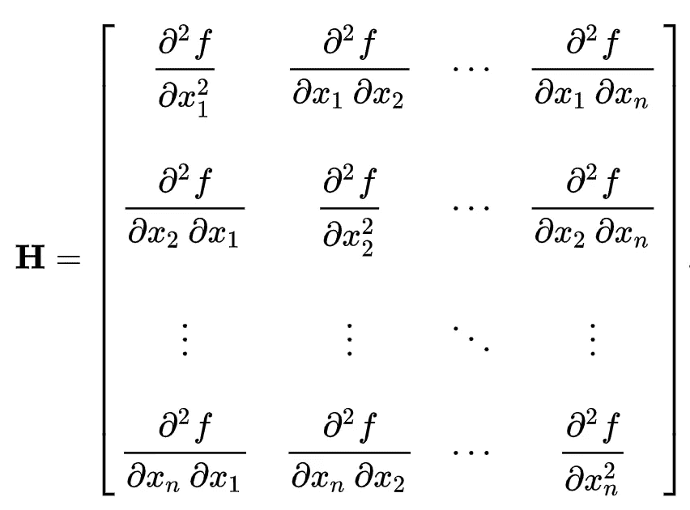

Hessian 可以用来确定一个给定的驻点是否是鞍点。如果 Hessian 在该位置是不定的，则该驻点是鞍点。这也可以通过查看特征值以类似的方式进行推理。


计算和存储完整的 Hessian 矩阵需要 *O(n )* 内存，这对于高维函数如神经网络的损失函数是不可行的。对于这种情况，通常使用[截断牛顿](https://en.wikipedia.org/wiki/Truncated_Newton_method)和[拟牛顿](https://en.wikipedia.org/wiki/Quasi-Newton_method)算法。后一类算法使用对 Hessian 的近似；最流行的准牛顿算法之一是 BFGS 算法。

通常对于神经网络来说，Hessian 矩阵是[不适定的](https://en.wikipedia.org/wiki/Condition_number)——输入的微小变化都会导致输出快速变化。这是一个不希望的特性，因为这意味着优化过程不是特别稳定。在这些环境中，尽管存在强梯度，学习仍然很慢，因为振荡减慢了学习过程。

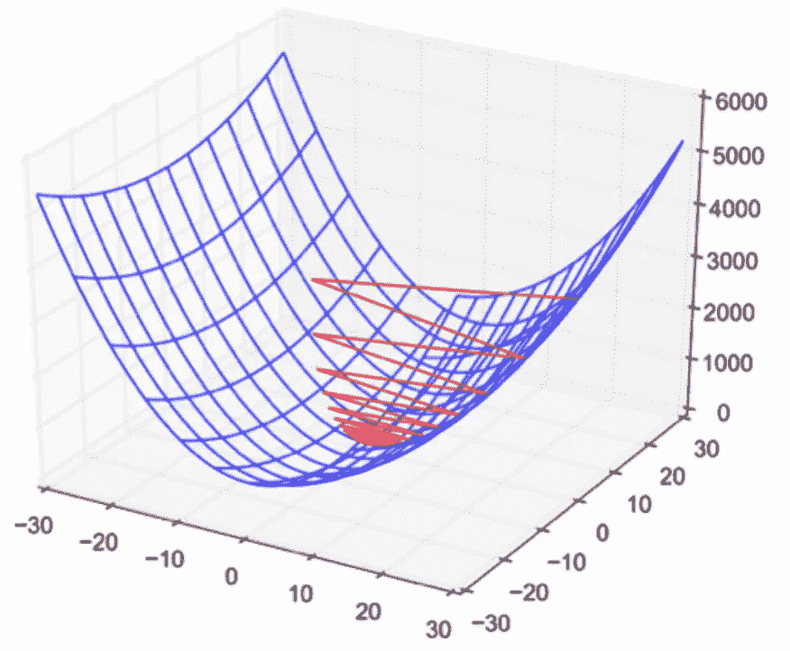

## **消失/爆炸渐变**

到目前为止，我们只讨论了目标函数的结构——在这种情况下是损失函数——及其对优化过程的影响。还有一些与神经网络架构相关的问题，这与深度学习应用程序特别相关。


上述结构是具有 *n* 个隐藏层的深度神经网络的一个例子。当第一层的要素在网络中传播时，它们会经历仿射变换，然后是激活函数，如下所述:


上述等式对于单层是正确的。我们可以写出 n 层网络的输出:


根据 *a* 和 *b* 的大小，上述公式有两种可能的情况。


如果值大于 1，对于较大的值 *n* (深度神经网络)，梯度值将在网络中传播时迅速爆炸。除非实现梯度裁剪，否则爆炸梯度会导致“悬崖”(如果梯度超过某个阈值，就会被裁剪)。


An example of clipped vs. unclipped gradients.


Gradient clipping rule.

如果值小于 1，梯度将很快趋于零。如果计算机能够存储无限小的数字，那么这就不是问题，但是计算机只能存储有限的小数位数。如果梯度值变得小于该值，它将被识别为零。

那我们该怎么办？我们已经发现，神经网络注定具有大量的局部最优值，通常包含尖锐和平坦的谷，这导致学习停滞和不稳定的学习。

我现在将讨论一些我们可以帮助减轻我们刚刚讨论的关于神经网络优化的问题的方法，从动量开始。


# 动力

随机梯度下降(SGD)的一个问题是不利用曲率信息的更新导致的振荡的存在。这导致当曲率较高时 SGD 较慢。


(Left) Vanilla SGD, (right) SGD with momentum. Goodfellow et al. (2016)

通过采用平均梯度，我们可以获得更快的优化路径。这有助于抑制振荡，因为相反方向的梯度被抵消了。

动量这个名称来源于这样一个事实，即它类似于物理学中的线性动量概念。具有运动的对象(在这种情况下，这是优化算法移动的大致方向)具有一些惯性，这导致它们倾向于在运动方向上移动。因此，如果优化算法在大致方向上移动，动量使其“抵抗”方向的变化，这导致高曲率表面的振荡衰减。


动量是目标函数中的一个附加项，它是一个介于 0 和 1 之间的值，通过试图从局部最小值开始跳跃来增加向最小值前进的步长。如果动量项很大，那么学习率应该保持较小。动量值大也意味着收敛速度快。但是如果动量和学习率都保持在大值，那么你可能会跳过最小值一大步。小的动量值不能可靠地避免局部最小值，并且还会减慢系统的训练。如果梯度不断改变方向，动量也有助于平滑变化。动量的正确值可以通过反复试验或交叉验证来学习。

动量使用过去的梯度来更新值，如下式所示。与动量相关的值 *v* 通常被称为“速度”。将更多的权重应用于较新的渐变，从而创建渐变的指数衰减平均值。

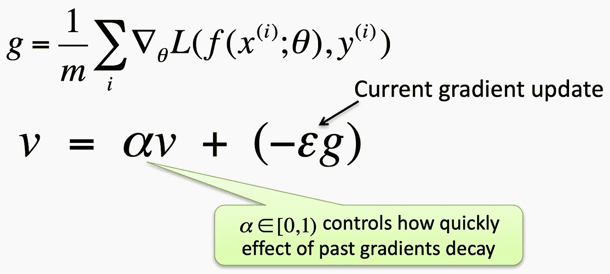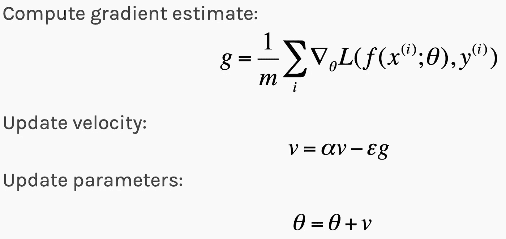

我们可以看到增加动量对优化算法的影响。最初的几次更新并没有显示出相对于普通 SGD 的真正优势——因为我们没有以前的梯度用于我们的更新。随着更新数量的增加，我们的动力开始启动，并允许更快的收敛。

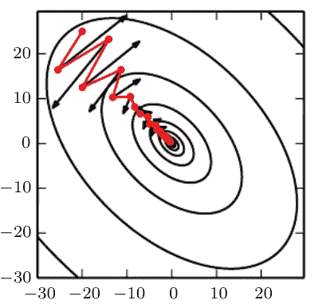

SGD without momentum (black) compared with SGD with momentum (red).

另一种存在的动量是内斯特罗夫动量，我们将简要讨论它。

## **内斯特罗夫势头**

在 [Sutskever，Martens 等人的《论深度学习中初始化和动量的重要性》2013](http://proceedings.mlr.press/v28/sutskever13.pdf) 中对内斯特罗夫动量进行了很好的讨论。

主要的区别是，在经典动量理论中，你首先修正你的速度，然后根据这个速度前进一大步(然后重复)，但是在内斯特罗夫动量理论中，你首先向速度方向前进一步，然后根据一个新的位置修正速度矢量(然后重复)。

即经典动量:

```
vW(t+1) = momentum.*Vw(t) - scaling .* gradient_F( W(t) )
W(t+1) = W(t) + vW(t+1)
```

而内斯特罗夫的势头是这样的:

```
vW(t+1) = momentum.*Vw(t) - scaling .* gradient_F( W(t) + momentum.*vW(t) )
W(t+1) = W(t) + vW(t+1)
```

这种差别很微妙，但在实践中，它会产生巨大的影响。

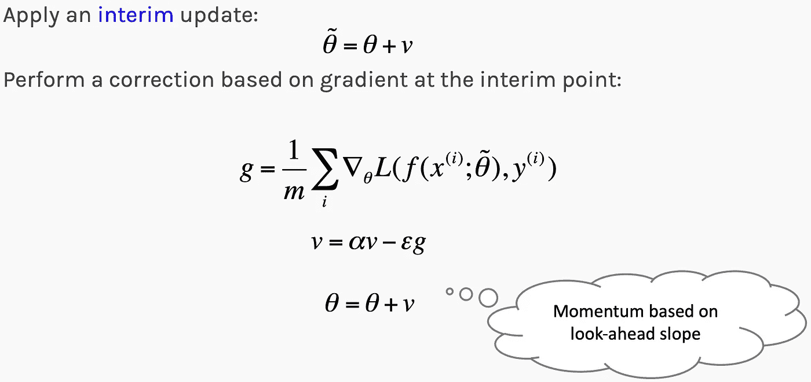

这个概念可能很难理解，所以下面是传统动量更新和内斯特罗夫动量之间的区别的直观表示。


Source ([Stanford CS231n class](http://cs231n.github.io/neural-networks-3/))


# **自适应学习率**

沿垂直方向的振荡-沿参数 2 的学习速度一定较慢。对每个参数使用不同的学习速度？

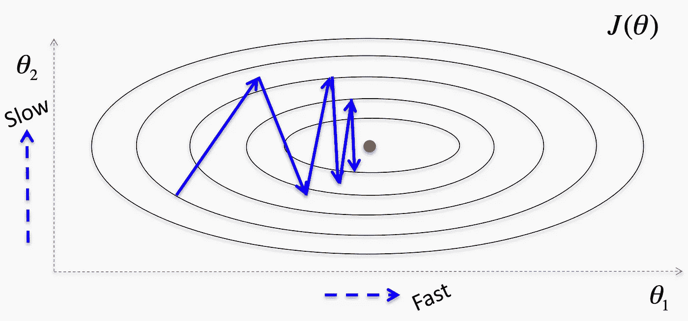

## 阿达格拉德

动量增加了误差函数斜率的更新，从而加快了 SGD 的速度。AdaGrad 根据每个参数的重要性调整更新，以执行更大或更小的更新。


Adagrad 的主要优势之一是，它消除了手动调整学习速度的需要，并在平缓的倾斜方向上取得更大的进步。

AdaGrad 的主要缺点是它在分母中累积平方梯度:因为每个增加的项都是正的，所以累积和在训练期间保持增长。这反过来导致学习速率缩小，最终变得无穷小，此时算法不再能够获得额外的知识。

## RMSProp

对于非凸问题，AdaGrad 会过早地降低学习速率。我们可以使用指数加权平均值进行梯度累积。

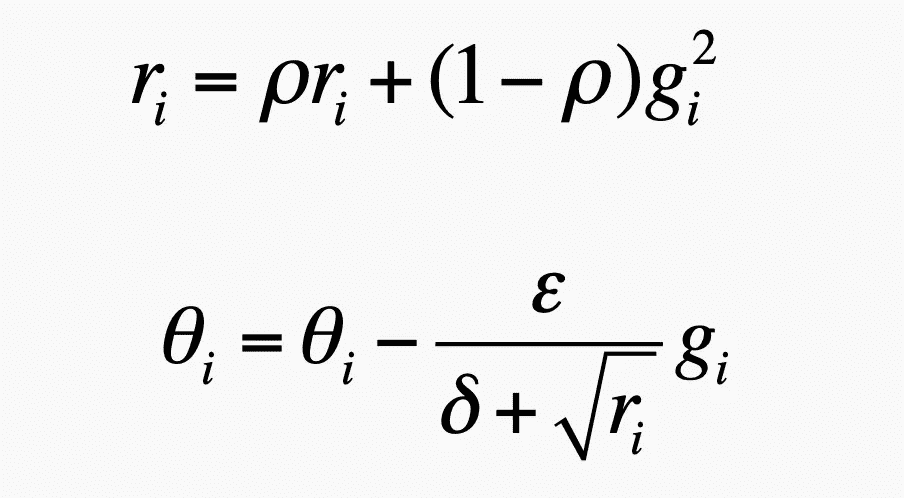

## 圣经》和《古兰经》传统中）亚当（人类第一人的名字

Adam 是 RMSprop 和 momentum 的组合(类似地，Nadam 指 RMSprop 和内斯特罗夫 momentum 的组合)。Adam 指的是*自适应矩估计，*，它是当今用于神经网络的最流行的优化器。

Adam 计算每个参数的自适应学习率。除了存储像 Adadelta 和 RMSprop 这样的过去平方梯度 vt 的指数衰减平均值之外，Adam 还保持过去梯度的指数衰减平均值，类似于动量。

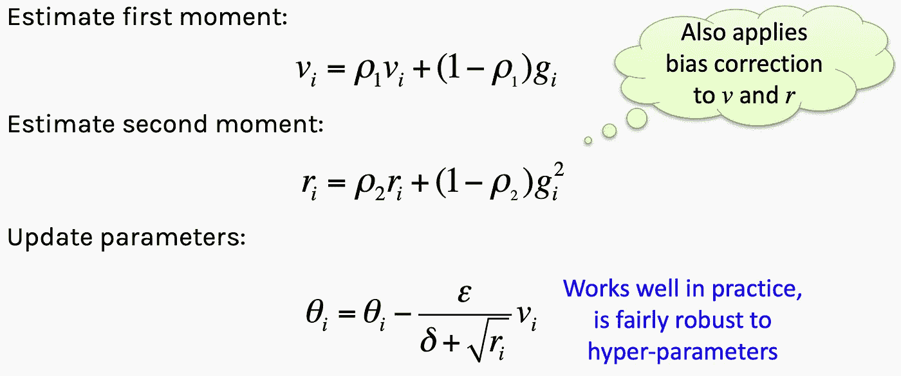

# **参数初始化**

在前面的章节中，我们研究了如何最好地导航神经网络目标函数的损失面，以便收敛到全局最优(或可接受的良好局部最优)。现在，我们将看看如何操纵网络本身，以帮助优化程序。

网络权重的初始化是开发神经网络的一个重要且经常被忽视的特征。初始化不良的网络会带来多种问题，对网络性能不利。

以一个网络为例，我们将其初始化为全零值。在这种情况下会发生什么？网络实际上根本学不到任何东西。即使在梯度更新之后，所有的权重仍然是零，因为我们计算梯度更新的固有方式。

假设我们实现了这一点，并发现这是一个问题，然后决定将我们的网络初始化都设置为相同的值 0.5。现在会发生什么？网络实际上会学习一些东西，但我们过早地规定了神经单元之间的某种对称形式。

一般来说，通过根据正态分布随机化权重来避免预设任何形式的神经结构是一个好主意。在 Keras 中，这通常是通过指定一个随机状态来实现的(这提供了随机性，但确保了测量的可重复性)。

这种初始化的规模应该是多少？如果我们为权重选择大的值，这可能导致爆炸梯度。另一方面，较小的权重值会导致渐变消失。在这两者之间有一个最佳平衡点，但是它不能被先验地知道，必须通过反复试验来推断。

## Xavier 初始化

Xavier 初始化是分配网络权重的简单启发式方法。每经过一层，我们希望方差保持不变。这有助于我们防止信号爆炸到高值或消失为零。换句话说，我们需要初始化权重，使得输入和输出的方差保持不变。

权重来自具有零均值和特定方差的分布。对于具有 *m* 输入的全连接层:


值 *m* 有时被称为*扇入:*传入神经元的数量(权重张量中的输入单元)。

重要的是要记住，这是一个启发，因此没有特别的理论支持-它只是凭经验观察到表现良好。可以在这里阅读原论文[。](http://jmlr.org/proceedings/papers/v9/glorot10a/glorot10a.pdf)

## **他正常初始化**

正常初始化基本上与 Xavier 初始化相同，只是方差要乘以 2 倍。

在这种方法中，记住前一层的大小来初始化权重，这有助于更快更有效地获得成本函数的全局最小值。权重仍然是随机的，但是范围根据前一层神经元的大小而不同。这提供了受控的初始化，因此更快和更有效的梯度下降。

对于 ReLU 装置，建议:


## 偏置初始化

偏置初始化指的是应该如何初始化神经元的偏置。我们已经描述了权重应该用某种形式的正态分布随机初始化(以打破对称性)，但是我们应该如何处理偏差呢？

套用斯坦福 CS231n 课程的话:初始化偏差的最简单、最常见的方式是将其设置为零——因为权重中的小随机数提供了不对称打破。对于 ReLU 非线性，一些人喜欢对所有偏差使用小的常数值，例如 0.01，因为这确保所有 ReLU 单元在开始时启动，并因此获得和传播一些梯度。然而，尚不清楚这是否提供了一致的改善，更常见的是将偏差设置为零。

偏置初始化的一个主要问题是避免隐藏单元在初始化时饱和，例如在 ReLU 中，可以通过将偏置初始化为 0.1 而不是 0 来实现。

## **预初始化**

另一种初始化权重的方法是使用预初始化。这对于用于检查图像的卷积网络来说是常见的。该技术包括输入已经训练好的网络(例如 VGG16)的权重，并使用这些权重作为待训练网络的初始权重。

这种技术只对用于类似数据的网络才是真正可行的，所述数据是网络被训练的数据。例如，VGG16 是为图像分析开发的，如果您计划分析图像，但数据集中的数据样本很少，那么预初始化可能是一种可行的方法。这是迁移学习背后的基本概念，但是术语预初始化和迁移学习不一定是同义词。


# 批量标准化

到目前为止，我们已经研究了使用动量和自适应学习率来导航神经网络损失面的方法。我们还研究了参数初始化的几种方法，以便最小化网络内的先验偏差*。在这一节中，我们将看看如何操作数据本身，以帮助我们的模型优化。*

为了做到这一点，我们将研究批处理规范化以及实现批处理规范化以帮助优化神经网络的一些方法。

## **特征归一化**

特征规范化正是它所说的，它包括在应用学习算法之前规范化特征。这涉及到重新缩放特征，通常在预处理过程中完成。

根据论文“[批量归一化:通过减少内部协变量移位来加速深度网络训练](https://arxiv.org/abs/1502.03167)”，梯度下降在有特征缩放的情况下比没有特征缩放的情况下收敛得快得多。

有几种方法可以缩放数据。一种常见的方法是*最小-最大归一化*，由此

缩放数据的最简单方法称为*最小-最大归一化*，它涉及重新缩放要素的范围，以在[0，1]或[1，1]中缩放范围。这是通过用最小值减去每个值，然后用数据集中存在的值的范围对其进行缩放来实现的。如果数据的分布高度倾斜，这可能会导致许多值聚集在一个位置。如果发生这种情况，有时可以通过对特征变量取对数来缓解(因为这有可能会导致异常值崩溃，因此它们对分布的影响不太大)。


另一种常用方法是*均值归一化*，这基本上与最小-最大归一化相同，只是从每个值中减去平均值。这是本文讨论的三种方法中最不常见的一种。

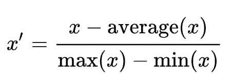

*特征标准化*使数据中每个特征的值具有零均值(当减去分子中的均值时)和单位方差。这种方法广泛用于许多机器学习算法(通常是那些涉及基于距离的方法)中的归一化。计算的一般方法是确定每个特征的分布平均值和标准偏差。接下来，我们从每个特征中减去平均值。然后，我们将每个特征的值(平均值已经减去)除以其标准偏差。


通过执行归一化，我们可以改善数据集的失真(例如一个要素相对于另一个要素的拉长)并使其更加均匀。


## 内部协方差移位

这个思路也来源于之前提到的论文[批量归一化:通过减少内部协变量移位加速深度网络训练](https://arxiv.org/abs/1502.03167)。

作者定义*内部协方差移位*:

> 我们将内部协变量移位定义为由于训练期间网络参数的变化而导致的网络激活分布的变化。

这可能有点模糊，所以我会尝试解开这个。在神经网络中，第一层的输出馈入第二层，第二层的输出馈入第三层，依此类推。当一层的参数改变时，对后续层的输入分布也改变。


输入分布的这些变化对于神经网络来说可能是有问题的，因为它有减慢学习的趋势，尤其是可能具有大量层的深度神经网络。

众所周知，如果输入已被白化(即零均值、单位方差)且不相关，则网络收敛更快，而内部协变量移位会导致相反的结果。

[批量标准化](https://machinelearning.wtf/terms/batch-normalization/)是一种旨在减轻神经网络内部协变量变化的方法。

## 批量标准化

批量标准化是将特征标准化的思想扩展到神经网络的其他层。如果输入层可以从标准化中受益，为什么网络层的其余部分不能呢？

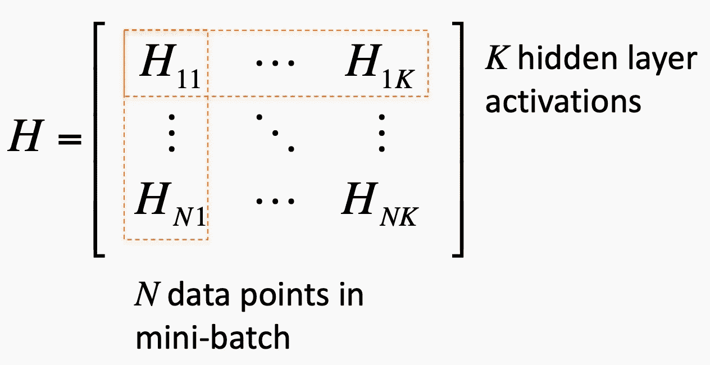

为了提高神经网络的稳定性，批标准化通过减去批平均值并除以批标准偏差来标准化先前激活层的输出。

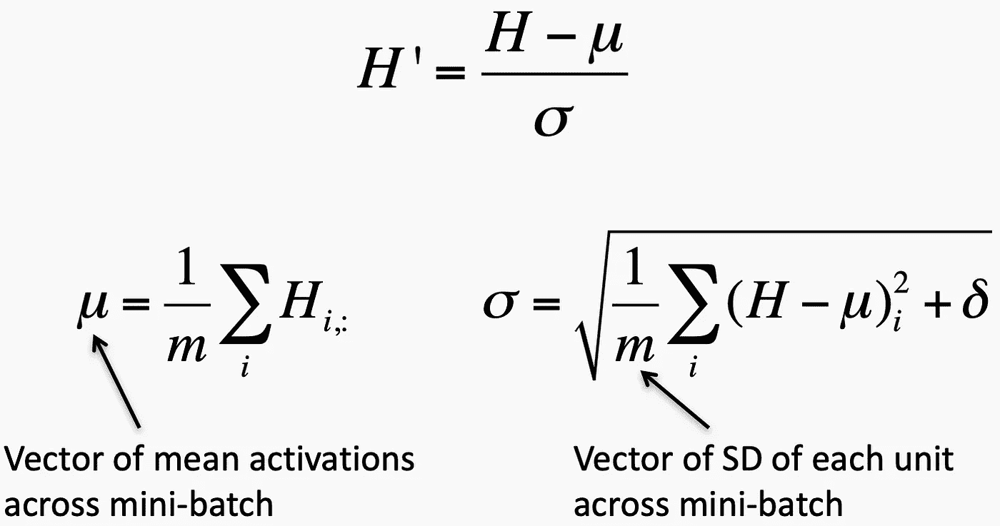

批量标准化允许网络的每一层独立于其他层进行学习。

然而，在通过一些随机初始化的参数对激活输出进行移位/缩放之后，下一层中的权重不再是最优的。如果这是最小化损失函数的一种方式，SGD(随机梯度下降)撤销这种归一化。

因此，批量归一化会向每一层添加两个可训练参数，因此归一化输出会乘以一个“标准差”参数(γ)并添加一个“均值”参数(β)。换句话说，批量规范化让 SGD 通过只改变每次激活的这两个权重来进行反规范化，而不是通过改变所有权重来失去网络的稳定性。

这个过程被称为*批量归一化转换*。

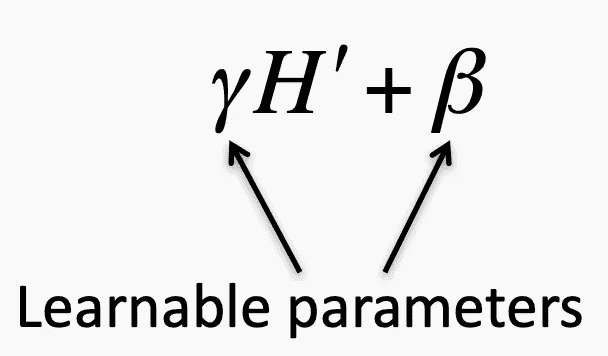

The batch normalization transform.

为了直观地说明这一点，我们可以分析下图。我们正在看第一个隐藏层，紧接着输入层。对于每个 *N* 小批量，我们可以计算输出的平均值和标准偏差。

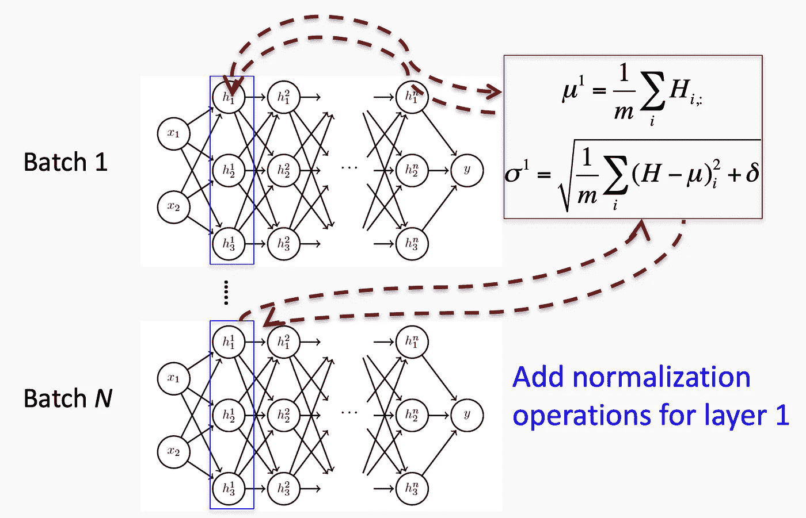

随后对所有随后的隐藏层重复这一过程。接下来，我们可以区分 *N* 个小批量的联合损失，然后通过归一化操作反向传播。

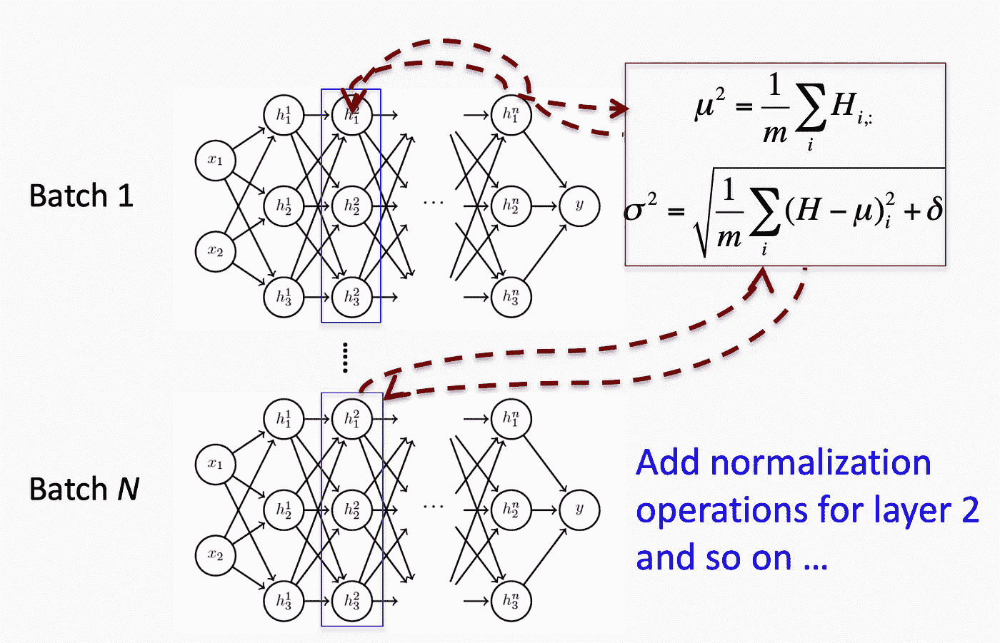

批处理规范化减少了过度拟合，因为它有轻微的正则化效果。类似于*脱落*，它给每个隐藏层的激活添加一些噪声。

在测试期间，平均值和标准偏差由训练期间收集的运行平均值代替。这与使用总体统计而不是小批量统计是一样的，因为这确保了输出的确定性地依赖于输入。

使用批处理规范化有几个优点:

1.  减少内部协变移位。
2.  降低梯度对参数比例或其初始值的依赖性。
3.  规则化模型，并减少对丢失、光度失真、局部响应归一化和其他规则化技术的需要。
4.  允许使用饱和非线性和更高的学习率。


# 最终意见

这就结束了我关于全连接神经网络系列文章的第三部分。在接下来的文章中，我将提供一些深入的编码示例，演示如何执行神经网络优化，以及神经网络的更高级主题，如热重启、快照集成等。

## 时事通讯

关于新博客文章和额外内容的更新，请注册我的时事通讯。

[](https://mailchi.mp/6304809e49e7/matthew-stewart) [## 时事通讯订阅

### 丰富您的学术之旅，加入一个由科学家，研究人员和行业专业人士组成的社区，以获得…

mailchi.mp](https://mailchi.mp/6304809e49e7/matthew-stewart) 

# 进一步阅读

深度学习课程:

*   吴恩达的机器学习课程有一个很好的神经网络介绍部分。
*   Geoffrey Hinton 的课程:[用于机器学习的 Coursera 神经网络(2012 年秋季)](https://www.coursera.org/course/neuralnets)
*   [迈克尔·尼尔森的免费书籍*神经网络和深度学习*](http://neuralnetworksanddeeplearning.com/)
*   约舒阿·本吉奥、伊恩·古德菲勒和亚伦·库维尔写了一本关于深度学习的书
*   [雨果·拉罗歇尔在舍布鲁克大学的课程(视频+幻灯片)](http://info.usherbrooke.ca/hlarochelle/neural_networks/content.html)
*   [斯坦福关于无监督特征学习和深度学习的教程(吴恩达等人)](http://ufldl.stanford.edu/wiki/index.php/Main_Page)
*   [牛津大学 2014-2015 年 ML 课程](https://www.cs.ox.ac.uk/people/nando.defreitas/machinelearning/)
*   [英伟达深度学习课程(2015 年夏季)](https://developer.nvidia.com/deep-learning-courses)
*   [谷歌在 Udacity 上的深度学习课程(2016 年 1 月)](https://www.udacity.com/course/deep-learning--ud730)

面向 NLP:

*   [Stanford CS224d:自然语言处理的深度学习(2015 年春季)，作者 Richard Socher](http://cs224d.stanford.edu/syllabus.html)
*   [NAACL HLT 2013 上的教程:自然语言处理的深度学习(无魔法)(视频+幻灯片)](http://nlp.stanford.edu/courses/NAACL2013/)

以视觉为导向:

*   [用于视觉识别的 CS231n 卷积神经网络](http://cs231n.github.io/)作者 Andrej Karpathy(之前的版本，更短更不完善:[黑客的神经网络指南](http://karpathy.github.io/neuralnets/))。

重要的神经网络文章:

*   [神经网络中的深度学习:概述](https://www.sciencedirect.com/science/article/pii/S0893608014002135)
*   [神经网络的持续终身学习:综述——开放存取](https://www.sciencedirect.com/science/article/pii/S0893608019300231)
*   [物理储层计算的最新进展:综述—开放存取](https://www.sciencedirect.com/science/article/pii/S0893608019300784)
*   [脉冲神经网络中的深度学习](https://www.sciencedirect.com/science/article/pii/S0893608018303332)
*   [集成神经网络(ENN):一种无梯度随机方法——开放存取](https://www.sciencedirect.com/science/article/pii/S0893608018303319)
*   [多层前馈网络是通用逼近器](https://www.sciencedirect.com/science/article/pii/0893608089900208)
*   [深度网络与 ReLU 激活函数和线性样条型方法的比较——开放访问](https://www.sciencedirect.com/science/article/pii/S0893608018303277)
*   [脉冲神经元网络:第三代神经网络模型](https://www.sciencedirect.com/science/article/pii/S0893608097000117)
*   [多层前馈网络的逼近能力](https://www.sciencedirect.com/science/article/pii/089360809190009T)
*   [关于梯度下降学习算法中的动量项](https://www.sciencedirect.com/science/article/pii/S0893608098001166)