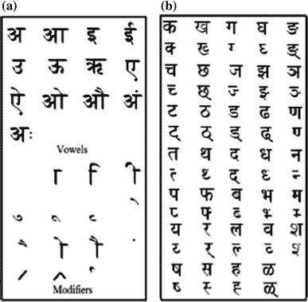
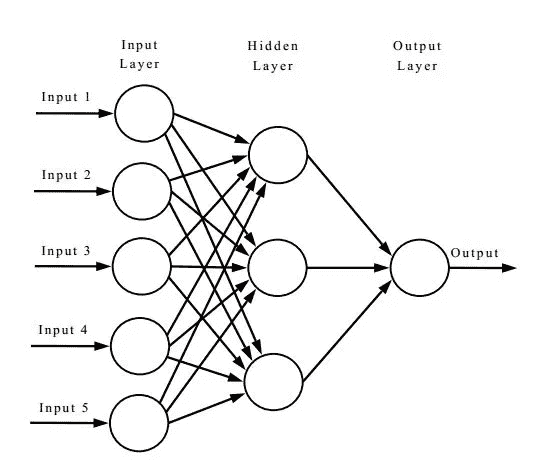
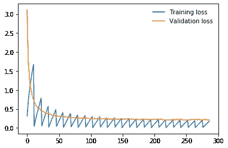
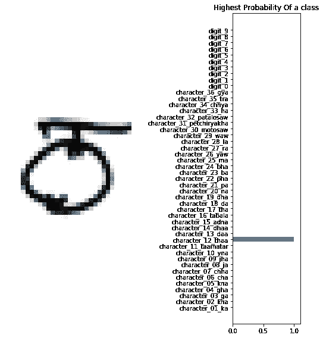

# 使用 PyTorch 的梵文字符神经网络教程

> 原文：<https://towardsdatascience.com/neural-network-tutorial-with-devanagari-characters-using-pytorch-6abceb78a020?source=collection_archive---------25----------------------->

## *用 PyTorch 训练一个人工神经网络用于识别手写的梵文字符。*



Source: images.google.com

顾名思义，神经网络是由人脑神经元松散地激发出来的。但是我们不会在这里讨论大脑类比的任何细节。相反，我们将通过一些数学和编码来理解它。

# 感知器

弗兰克·罗森布拉特(Frank Rosenblatt)在 20 世纪 50 年代提出了感知机(perceptron)，表明一种算法可以模仿人类大脑的决策能力(我们仍在尝试)。他在论文中写道，我们可以将输入视为由二进制数组成的神经元。如果这些二进制数可以生成一个二进制数作为输出**，如果**输出满足某个阈值，则只生成**。**


Perceptron model

你可能会问:

但是 Gopal，我们也可以写一个程序来做这个任务；为什么要写神经网络呢？我很高兴你问了。

选择神经网络而不是任何程序的第一个原因是，它们是**通用函数逼近器**，可以推断出我们试图建立的模型，或者如果它太复杂，神经网络总是代表那个函数。

我们可以假设将任何函数转化为数学术语，然后我们可以使用神经网络来表示该函数。

第二个原因是可伸缩性和灵活性。我们可以很容易地在神经网络中堆叠层，这将增加神经网络的复杂性。

# 神经网络的基本架构

**神经网络由以下组件组成:**

*   输入层 x
*   任意数量的隐藏层
*   输出图层，𝑦
*   一套 parameters(𝑊)和 biases(𝑏)各 layer,𝑊和𝑏之间
*   每个隐藏层的激活函数的选择，𝜎



Resource from [https://tex.stackexchange.com/questions/132444/diagram-of-an-artificial-neural-network](https://tex.stackexchange.com/questions/132444/diagram-of-an-artificial-neural-network)

我们训练神经网络进行 *n* 次迭代；每次迭代包括两个步骤:

1.  前馈
2.  反向传播

# 前馈:

简单来说，当第一层的输出成为下一层的输入。这种网络称为**前馈网络。**

我们的网络中没有反馈信息的回路；它将总是被前馈。

# 反向传播:

这是我们的神经网络*实际上*从训练**数据**中学习的过程。

但问题仍然没有答案，我们的网络如何学习分类或预测？如果我们的模型已经预测到了什么，那么我们的模型如何确定它是正确的预测还是错误的呢？

答案是**损失函数；它**有助于我们的网络预测与原始值相差多少。

我们的模型已经预测了一所房子的价格为 100K 美元，而原始价格为 101K 美元，那么原始价格和预测价格之间的差异将为 1K 美元；这就是损失函数帮助我们的网络决定的。

回到反向传播，在我们借助损失函数计算模型预测和原始值的误差之后，**我们发回这个误差以更新我们的输入神经元或** **权重和偏差。这被称为反向传播。**

但是我们需要多少来更新我们的**权重和偏差**？

**为了知道调整权重和偏差的适当量，我们必须推导出*我们的* *权重和偏差的损失函数*。**

我认为现在我们有足够的直觉来开始我们的编码部分。

# 实现人工神经网络对手绘天体文字的分类

我们将使用 PyTorch 库来构建我们的神经网络。

我写了一个小程序 *plot_images* 用于显示字符及其标签。

让我们看看我们的 CSV 文件中有什么。

*df.head()* 将给出数据帧的前 5 列。在我们的数据集中，我们有从 0 到 1023 的像素值。用于显示特定字符的*字符*列由特定像素值组成。

让我们运行我们的 *plot_images* 函数，看看这些图像。

```
>>plot_images(df, 4, "character")
```


我们的数据集中有 46 个独特的手绘字符；因此，数字 46 将是我们神经网络的输出维度。

但是在创建神经网络之前，我们需要准备数据加载器，以便将它提供给我们的模型进行训练和测试，因为 NumPy 数据不能与 PyTorch 的库一起工作。

因此，在上面的代码示例中，我们读取数据并从中分离出要素和标签。**如果你注意到了，我也在用 255.0 除*features _ numpy*；我这样做是为了规范我们的像素值。**

然后，我将我们的分类标签转换成代码，因为我们只能用数字数据来创建张量值。

在我们的 *data_loader* 函数中，我们获取特性和目标；如果它们在 NumPy 数据中，我们就把它们转换成张量；之后，我们用***torch . utils . Data . tensordataset、*** 和**创建张量数据，最后将数据转换成数据加载器。**

就是这样；我们的数据现在可以输入到模型中了。让我们现在建立神经网络。

在我们的 **ANNModel 中，取 32*32，最后一层输入的输出维度为 46。但是我们这里有两个我还没有谈到的新术语。**

**Dropout:删除带有概率值的随机激活权重。假设我们已经将概率值设置为 0.2。那么对于每一个前馈或者反向传播过程，它都会忽略掉那 20%的神经元。它有助于防止过度合身。**

**Softmax:在数学中，Softmax 函数，也称为 softargmax 或归一化指数函数，是一个将 K 个实数的向量作为输入，并将其归一化为由 K 个与输入数的指数成比例的概率组成的概率分布的函数。**

通过理解这两个术语，我们现在可以继续培训过程。

训练过程简单；我们正在迭代我们的训练数据加载器的图像和标签。然后清除初始梯度值并随后进行预测。运行这个程序后，您应该可以获得超过 94%的测试数据的准确率。

不可能解释每一步；请在评论区问我。

培训结束后，让我们看看我们的培训和验证曲线。



Training vs. Validation loss

看起来不错。:)

## 推论:

让我们检查一下我们的模型在测试数据上的表现。

```
>> make_predictions(test_loader, 44)
```



Inference

它做得非常好。:)

参考

[](https://en.wikipedia.org/wiki/Softmax_function) [## Softmax 函数

### 在数学中，softmax 函数，也称为 softargmax 或归一化指数函数，[2] :198 是一个…

en.wikipedia.org](https://en.wikipedia.org/wiki/Softmax_function) 

数据集:

 [## 梵文字符集

### 下载数千个项目的开放数据集+在一个平台上共享项目。探索热门话题，如政府…

www.kaggle.com](https://www.kaggle.com/rishianand/devanagari-character-set)