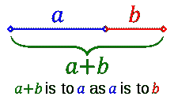
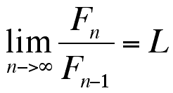
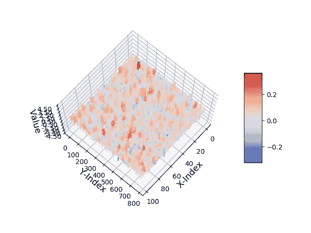
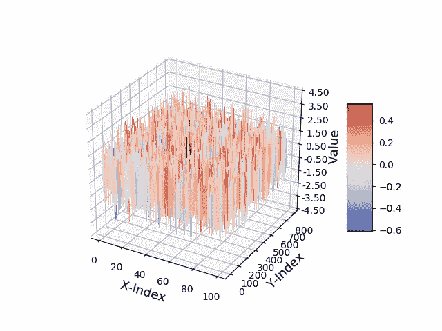
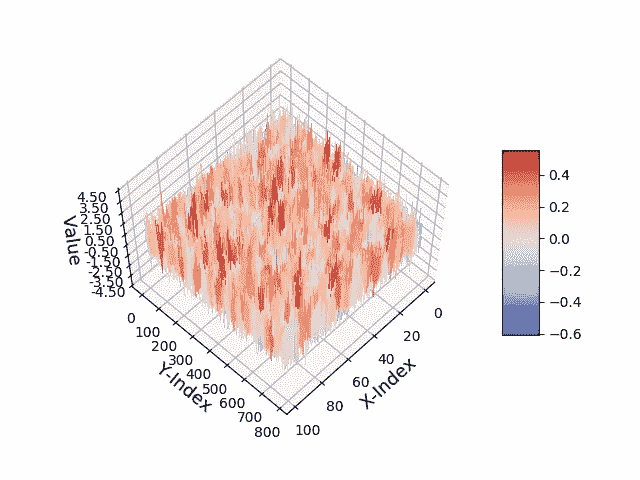
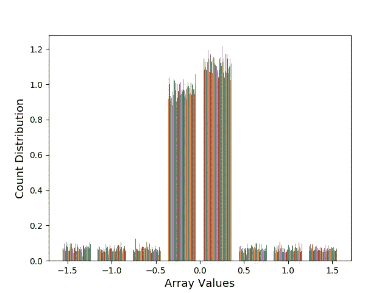
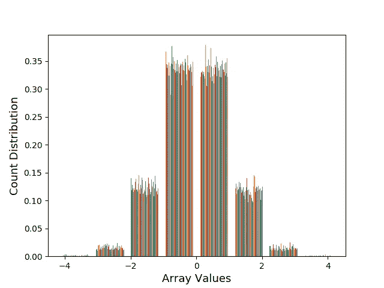
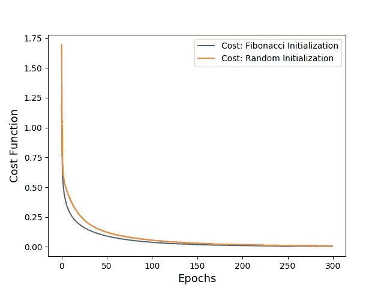
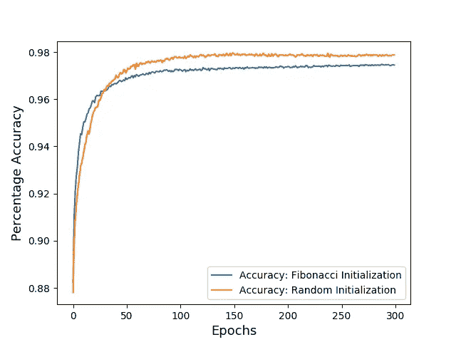

# 神经网络和斐波那契数

> 原文：<https://towardsdatascience.com/neural-networks-and-fibonacci-numbers-a7b0848a6c08?source=collection_archive---------22----------------------->

好吧，数学是美丽的，也许是我们可以用来表达自然界模式的最好工具。一个比率形式的特殊数字在自然界中经常出现，它的性质吸引了一代又一代从事构思和探索的精英。


**Does this spiral of Parthenon, ring a bell !!**

嗯，不是别人，正是**黄金比例**！！在数学上，它被简单地定义为一个数，该数是由线段的较长部分除以较短部分得到的，等于这两个给定部分之和与较长部分之比。



**(a+b)/a = a/b = φ**

用 phi(φ)来表示。这个数字可以在整个自然界和时间的历史中看到。从历史上看，从埃及到希腊建筑，从达芬奇的“神圣比例”到萨尔瓦多·达利的艺术作品，这种比例一直在重复出现。一位名叫斐波那契的数学家在 1200 年左右发现了这个数列，它有一个独特的性质，可以表示为数列中前两项之和。这个数列也有与黄金分割率相关的特殊性质。这个序列中两个连续项的比率接近黄金分割率，当项变得更高时，值接近黄金分割率！！



**L = φ, for the above mentioned limit at infinity.**

# 简介:神经网络中的斐波那契数

神经网络使用人工神经元来理解和制定嵌套层次概念形式的人类智能。同时，人类和自然界中的许多事物都服从斐波那契数列。因此，在本文中，我们旨在复制 2000 年代的一项[研究](http://ir.cut.ac.za/bitstream/handle/11462/343/Luwes%2c%20N.J..pdf?sequence=1&isAllowed=y)，该研究声称，以黄金比例作为学习速率的斐波纳契初始化权重矩阵在学习曲线性能方面将优于随机初始化。因为，这是一个合理的假设，相信随着性能的提高，神经网络方程确实用 Fibonacci 值表示其自然对应物，因为它是可调的权重。

因此，在本文中，我们将用斐波那契数初始化权重矩阵，并将它与随机初始化得到的结果进行比较。与 LabVIEW 中的早期研究不同，我们将针对相对复杂和庞大的 MNIST 图像数据集以及 tensorflow 的现代框架来测试我们的网络。在这之后，让我们从实验中观察成本函数学习曲线和准确性，并相应地得出结论。

# 让我们初始化:编码斐波那契权重

在用不同的斐波纳契数和来自该系列的权重矩阵的排列进行重复实验后。我们提供了一个按比例缩小到 0.001 倍的以下数字列表[0、1、2、3、5、8、13、21、34、55、89、144、233、377、610]，这些数字随机排列在权重矩阵中，以获得更好的精度。这里，下面参考 784x100 权重矩阵上的可视化图，该图将输入图像像素映射到大小为 100 的隐藏单元。


Fibonacci Initialization



Fibonacci Initialization

这种可视化给出了关于为给定维度的权重矩阵生成的斐波纳契数列的分布的粗略想法，其以随机方式分布在数组元素上。下面是提到的代码，它将 X 和 Y 维度作为输入，并返回具有斐波纳契权重的给定大小的权重矩阵。

```
def fib_init(X_val,Y_val):
    # Starting filling array values from F5 of Fibonacci
    mul_fact = 0.001

    fib_series = [0, 1, 2, 3, 5, 8, 13, 21, 34, 55, 89, 144, 233, 377, 610]

    W = np.zeros((X_val, Y_val))for i in range(X_val):
        for j in range(Y_val):
            W[i][j] = random.choice(fib_series) * mul_fact
            if(random.uniform(0, 1)<0.5):
                W[i][j] = -W[i][j]

    return np.float32(W)
# float type-casting is for maintaining compatibility with our tensor-flow code.
```

以类似的方式，我们设计了基于 Fibonacci 初始化的偏置矩阵*‘b’*的代码。经过反复实验，我们得出了以下值[5，8，13，21，34，55],按比例缩小到 0.01，以获得更好的偏置矢量精度。下面是一个类似的代码片段，它将向量的大小作为输入，并将 Fibonacci 初始化的向量作为输出返回。

```
def fib_bias(X_val):
    mul_fact = 0.01
    fib_series = [5, 8, 13, 21, 34, 55]
    b = np.zeros(X_val)
    for i in range(X_val):
        b[i] = random.choice(fib_series) * mul_fact
        if(random.uniform(0, 1)<0.5):
            b[i] = -b[i]
    return np.float32(b)
# float type-casting is for maintaining compatibility with our tensor-flow code.
```

将上述初始化与随机初始化进行比较，随机初始化即从均匀分布中产生随机数，并缩放到因子 0.01。参考下图，了解分布情况。



Random Initialization



Random Initialization

显然，上述初始化矩阵在初始化数据方面具有更高的幅度。此外，对于随机初始化技术，这导致数据中更多的变化。这可以通过对这两种初始化技术的直方图进行比较研究来观察。



Fibonacci Initialization



Random Initialization

显然，在我们当前设计的实验中，随机初始化具有更大的方差，与斐波那契权重相比，权重的范围要高得多。你可以参考 [github](https://github.com/ashishrana160796/fibonacci-initialized-neural-networks) 库，获取更新的实验(*完成*)的斐波那契初始化结果，该实验的数据方差几乎相等，数据分布相似。

# 让我们来比较一下:在 MNIST 运行我们的网络

在我们的实验中，我们训练了一个前馈神经网络，该网络仅具有单个隐藏层的 300 个隐藏单元输入，并使用交叉熵作为该模型的成本函数。对于与训练模型相关的代码，plot 实用程序脚本会引用 github [库](https://github.com/ashishrana160796/fibonacci-initialized-neural-networks)。通过这个实验，我们想要比较和观察给定训练模型的损失函数的行为。损失函数是否真的像早期研究声称的那样收敛得更快，以及所使用的两种初始化的准确性。损失函数值越低，精度真的提高了吗？关于两种初始化的成本函数比较曲线，请参考下文。



Cross Entropy Loss Function Comparison

显然，我们可以观察到，利用上述成本函数值与历元数的关系图，模型在斐波纳契初始化上的训练确实优于具有低得多的值的随机初始化。即使在达到饱和之后，对于第 300 个时期，Fibonacci 初始化的损失也低得多。因此，我们的模型确实学习了训练样本到正确输出的非常精确的映射。

我们可以在测试集上比较准确性，看看哪个模型具有更好的准确性。现在，需要回答的一个重要问题是，随着成本函数值的降低，模型能够捕捉到 MNIST 数据集中的高方差，精确度确实得到了提高。意思是在这么多胡言乱语之后什么都没发生。让我们看看下面…



Model Accuracy Comparison 😠

随机初始化确实以 0.33%的小百分比优于我们的斐波纳契初始化的神经网络。但是，考虑到斐波纳契初始化权重的方差较小，斐波纳契初始化仍然产生了良好的精度，我们还需要进行更多的实验。因此，根据我们的结果，我们在训练集上获得了更好的成本函数收敛结果😉和在上述相同条件下重复实验时相对几乎相同或稍低的精确度😠。需要进行更多不同条件的实验。因此，旅程仍在继续！！

# 结论和未来范围

[的研究](http://ir.cut.ac.za/bitstream/handle/11462/343/Luwes%2c%20N.J..pdf?sequence=1&isAllowed=y)走得很远，声称神经网络方程是自然重现的对应模式的真实表示，神经网络模拟其自然对应模式，权重为斐波那契数。事实上，我们的实验并不确定这一点，因为精度并没有提高很多，事实上结果是更低，但对于 Fibonacci 初始化的权重，损失函数确实更早得到最小化。这种行为需要一个合理的解释💭。

此外，探索不同的数学上合理的初始化似乎是一个非常酷的构思过程，并在其上对我们的神经网络管道进行建模。未来的工作将在 CNN、RNNs 和初始化数据的更高方差上进行类似的实验。同样，需要添加与 Xaviar 和 He 初始化的比较。关于更新，敬请关注 [github 知识库](https://github.com/ashishrana160796/fibonacci-initialized-neural-networks) ( *进行中*)以及本文的更新。

将非常感谢您的意见和建议，以改进我们的实验和提到的方法。感谢阅读！！

# 实验结果更新

1.  基于高方差 Fibonacci 初始化权重的实验表明，对于这种实验来说，这是一条直线下坡路，并且精度随着基于完全随机分布的选择的较高 Fibonacci 权重而急剧下降。