# 神经网络:基础

> 原文：<https://towardsdatascience.com/neural-networks-basics-29cc093b82be?source=collection_archive---------8----------------------->

Auditory learner? Listen to this article in podcast form instead!

人工神经网络(ann)是机器学习领域的热门话题。因此，大量的研究正在进行。计算机视觉对噪音数据的容忍度、自动驾驶汽车对道路路线的预测，以及自然语言处理(NLP)的进步，使你可以与你的语音助手交流，这些都归功于人工神经网络。了解神经网络的基础知识将有助于你参与到围绕这个话题的对话中。

让我们从定义开始:人工神经网络是一种数学结构，当给定输入时，它可以映射到期望的输出。这样，十几个问题就会浮现在你的脑海里。让我们继续回答一些常见问题，以了解神经网络的基础知识。

# 谁发明了神经网络？

这个答案会因你问的人而异。有些人相信沃伦麦卡洛克和沃尔特皮茨的第一个理论。他们被认为描述了一个神经元如何有一个数学表示。然而，在这篇文章中，我们说的是一位名叫弗兰克·罗森布拉特的心理学家。

# 罗森布拉特

罗森布拉特在 1957 年发表了一篇名为[“感知机:感知和识别自动化”](https://blogs.umass.edu/brain-wars/files/2016/03/rosenblatt-1957.pdf)的论文。该出版物描述了神经网络的构建模块，感知器。他描述了这些人工神经元如何从数据中学习。他被认为创造了监督学习，允许神经元根据其准确性改变自己的权重。

# 麦卡洛克和皮茨

麦卡洛克和皮茨在 1943 年发表了一篇名为“[神经活动中固有观念的逻辑演算”的论文。他们极大地影响了罗森布拉特的研究。在那篇论文中，他们描述了人类神经元如何在生物神经网络的“全有或全无”特征中进行数学表示。](https://www.cs.cmu.edu/~./epxing/Class/10715/reading/McCulloch.and.Pitts.pdf)

当神经元接收到一个信号时，它不会自动开始向下游传递信号。它会保持信号，直到达到阈值，然后它沿着轴突发送信息，被邻近的细胞接收。

# Hebb

神经心理学的心理学家先驱唐纳德·赫布(Donald Hebb)在 1949 年发表了一篇名为[“行为的组织:一种神经心理学理论”](http://s-f-walker.org.uk/pubsebooks/pdfs/The_Organization_of_Behavior-Donald_O._Hebb.pdf)的论文。这篇开创性的论文产生了心理学中一个全新的规则，叫做赫布规则。该规则描述了一个神经元如何刺激另一个神经元，在重复激活后，细胞 A 变得有效地激活细胞 b。用 Hebb 的话说，“一起放电的神经元连接在一起”。

> *“当 A 细胞的轴突足够接近以激活 B 细胞，并重复和持续地参与其激活时，在一个或两个细胞中发生某种类型的生长过程或代谢变化，从而增加 A 细胞激活 B 细胞的效率”*
> 
> *赫布规则定义*

# 什么是感知器，它是如何组成神经网络的？

感知器是神经网络的构建模块，类似于核酸、脂类、碳水化合物和蛋白质的[生物构建模块](https://www.ncbi.nlm.nih.gov/pmc/articles/PMC2892900/)。四个部分也构成了这些:

1.  输入值
2.  权重和偏差
3.  求和函数
4.  激活功能

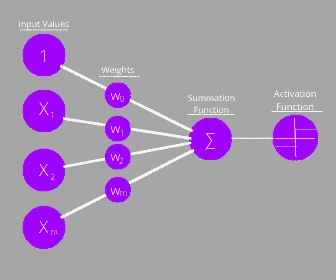

输入值受到预定权重值的影响，然后在求和函数中相加在一起。在求和函数之后，该值在激活函数中被压缩在-1 和 1 之间或 0 和 1 之间。这将决定感知器是否会被激活。值越负，越接近最小值(-1 或 0)，值越正，越接近最大值(1)。如果它被激活，那么输出将沿着它的路径发送。

# 单一感知器

如果感知器是单一形式的，那么第一个也是唯一的输出将是 yes 或 no 格式。单感知器非常适合线性可分性数据集，即可以使用具有恒定斜率的单条线来分离的组。

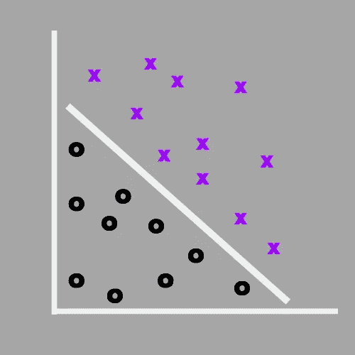

感知器对于“与”、“或”、“异或”逻辑门来说非常优秀。让我们来分解一下:

如果两个输入都为真，那么结果逻辑将为真。

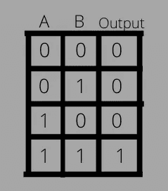

或者，如果一个或两个输入为真，则推理结果为真。

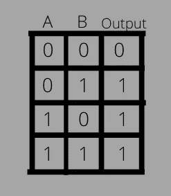

XOR '，exclusive 'OR '，如果信息中的一个(但不是两个)为真，则命题将得出 true。

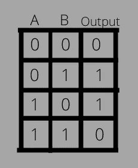

# 神经网络

然而，如果有一个以上的感知器存在并以分层的方式连接，我们就产生了一个神经网络。第一层的输出成为第二层的输入，依此类推，直到输出层对总激活进行求和。总激活度是网络最终决策的置信度。

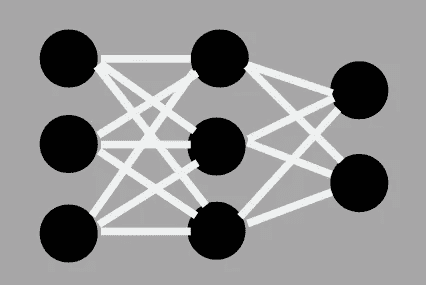

# 神经网络有哪些层？

神经网络有 3 层:

1.  输入层
2.  隐蔽层
3.  输出层

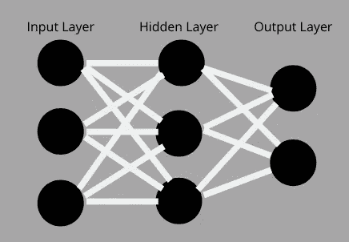

输入层是网络的起点。这是将用于预测的值引入的图层。隐藏层是网络发挥其“魔力”的地方。在整个区域计算输入值的激活量。隐藏层可以小到 1 层，也可以大到项目所需的数量。最后，输出层是每个最终节点的激活用于选择解决方案的地方。

如您所见，每个单元都连接到后续层的每个单元。这使得附近的感知器可以相互通信，并创建最适合其使用的权重。

只要记住，第一层是输入，最后一层是输出。中间的任何东西都是隐藏层。

# 计算机如何“看见”神经网络？

经常用于表示神经网络的图表(如上图所示)是人类友好的版本。计算机如何处理和观察它们是以矩阵的形式出现的。

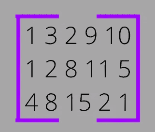

我们将首先讨论前馈或训练部分。这是使用矩阵乘法完成的。

# 矩阵乘法

让我们分解一个具有 2 个输入值的神经网络，1 个隐藏层包含 3 个节点，我们以 2 个输出层节点结束。

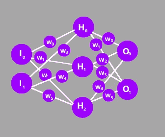

我们将通过对每个元素使用唯一的字母来保持这一点，以便您可以在我们进行的过程中引用它。

## 权重 x 输入层

矩阵乘法是通过取第一矩阵的行并将每个元素与第二矩阵中的相应元素相乘来完成的。该操作的主要规则是第一个矩阵中的列数必须与第二个矩阵中的行数相匹配。让我们看一下将用于该网络的第一组矩阵。

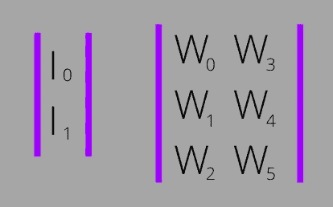

正如我们所看到的，如果输入值的矩阵是第一个，我们将得到一个未定义的结果，因为上面的规则不被遵守。然而，如果我们翻转矩阵，我们将能够执行乘法。结果/输入矩阵作为第二个或右矩阵，权重矩阵作为第一个或左矩阵。

让我们在这个网络中执行第一次乘法。

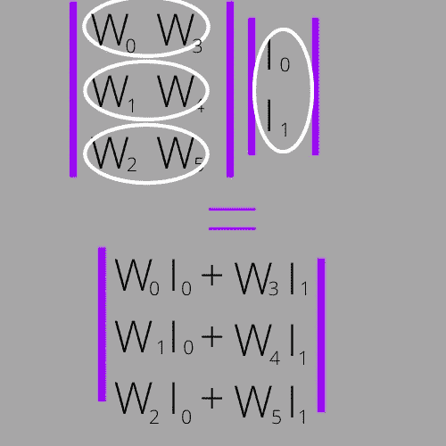

我们得到的矩阵包含 3 行，分别对应于隐藏层中的 3 个节点:

## 权重 x 隐藏层

让我们做最后的乘法。

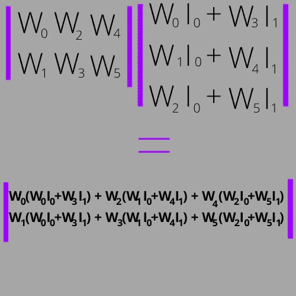

输出矩阵具有最终结果，它包含与输出层的 2 个节点相关的 2 行:

上述等式的结果将是每个神经元的激活水平。如果 O 0 高于 O 1，那么与 O 0 相关的预测将作为解给出。

# 神经网络是如何“学习”的？

神经网络分两步学习，前馈(我们刚刚讲过)和反向传播。反向传播本身可以分为两步，计算成本，然后最小化成本。

成本是网络的预测值和数据集的期望值之间的差值。成本越大，误差越大。目标是尽可能降低成本。为了实现这一目标，通过改变权重和偏好来最小化成本是游戏的名称。简单来说，它的前馈是反向的。你正在做矩阵乘法来改变权重，以便根据某些神经元将接收到的内容来给予它们更多的强调。

最小化成本函数的一种常见方法是通过梯度下降。

# 梯度下降

目标是通过合计实际和预期输出之间的所有差异，然后将其乘以学习率，找到函数的全局成本最小值。最常见的成本函数是均方误差。

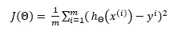

J(θ)由梯度下降函数调用。

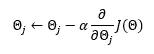

学习率α基本上是收敛的一大步(换句话说就是找到全局最小值)。为了给你一个视觉效果，想象你站在山顶上，下面是一个美丽的山谷。你开始沿着山坡往下走。对抗听从你内心孩子的冲动，快速滚下山(可能错过你的目标)，你从容不迫，轻松地走下来，避开路上的任何石头和树木。

学习率类似于你要走多大步或方法才能到达山谷。如果学习率太大，你可能会继续滚向另一边，并且由于你滚的冲力而完全错过山谷。如果学习率太小，那么在你到达山谷(最佳目标)之前，天就已经黑了。为您的模型找到合适的学习速率对于创建有效且高效的神经网络至关重要。

如果你想知道从哪里开始机器学习的自学，请查看[学习机器学习的 5 个简单步骤](https://medium.com/analytics-vidhya/5-easy-steps-to-master-machine-learning-18621ac795d7)。这篇文章将帮助你有效地学习这个广泛的主题。

在我们重新学习之前，

