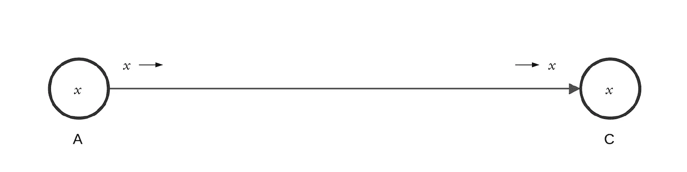
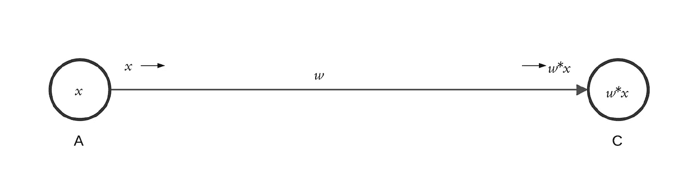
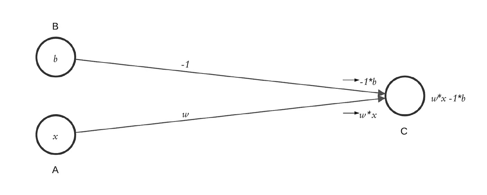
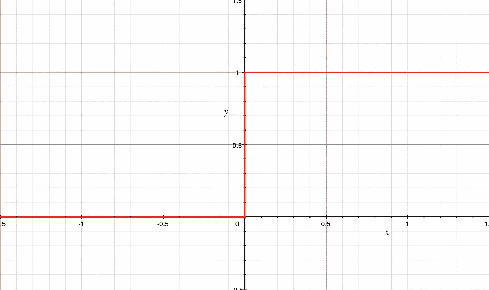
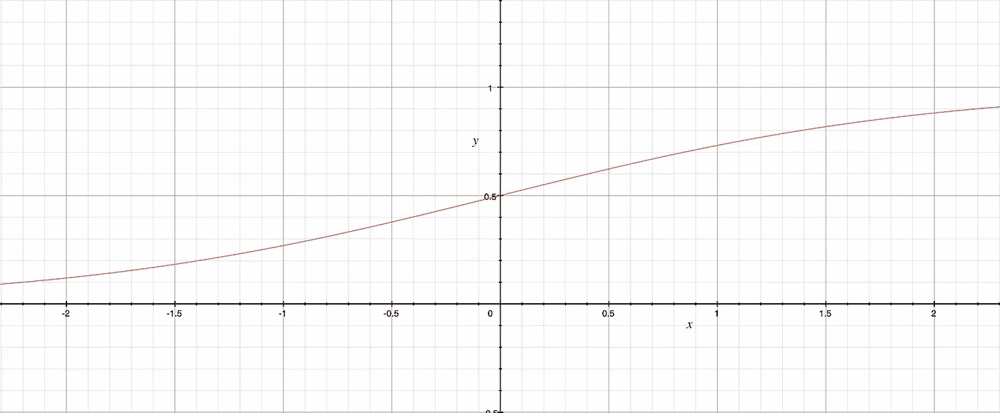
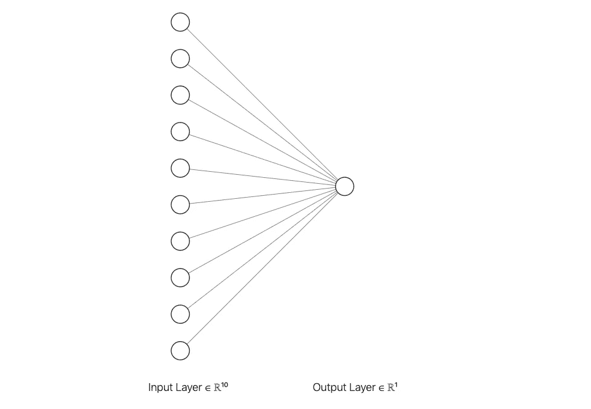
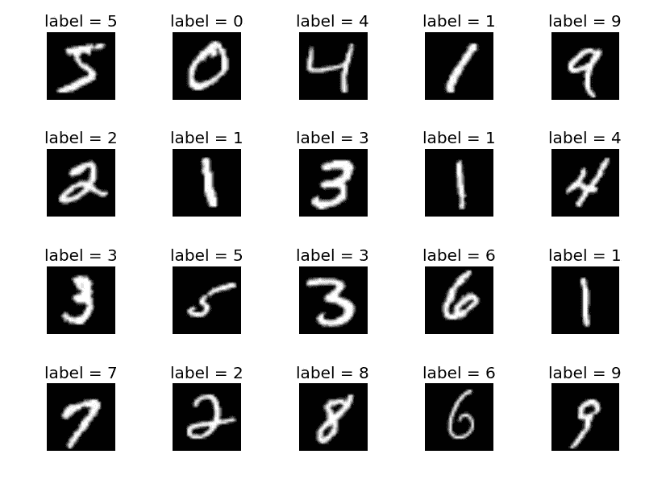
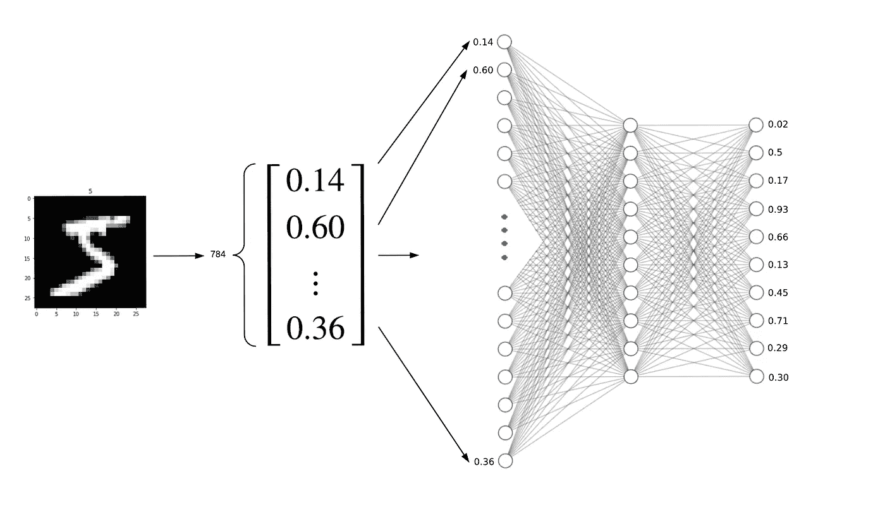
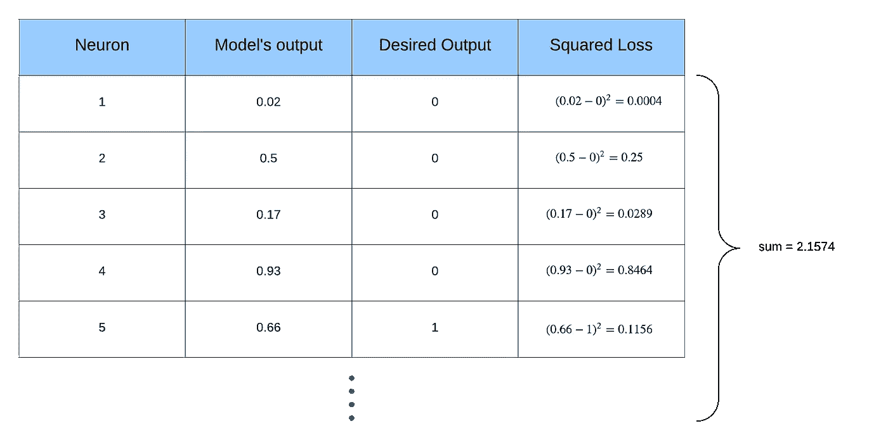

# 神经网络，去神秘化

> 原文：<https://towardsdatascience.com/neural-networks-demystified-49f3426d4478?source=collection_archive---------30----------------------->

Image by [Gerd Altmann](https://pixabay.com/users/geralt-9301/?utm_source=link-attribution&amp;utm_medium=referral&amp;utm_campaign=image&amp;utm_content=3706562) from [Pixabay](https://pixabay.com/?utm_source=link-attribution&amp;utm_medium=referral&amp;utm_campaign=image&amp;utm_content=3706562)

你肯定听说过神经网络——这种神秘的、科幻般的技术成为了一个伟大的时髦词汇。但是作为一个非技术人员，你已经把它们当作一个只留给计算机科学书呆子(像我一样)的谜而一笔勾销了。今天，这一关于它们如何工作的初级读本改变了这一点，它是为对计算机科学、编码或数学一无所知的人设计的。

# 什么*是神经网络？*

*神经网络可以被认为是一个人工信息处理器。它接受输入，以某种方式进行处理，然后产生一些输出。网络的结构决定了它如何进行处理，不同的结构产生不同的输出。其结果是网络可以对图像进行分类，翻译语言等等。*

*我们很快就会看到，网络的某些部分是固定的，而其他部分，即参数，是可以改变的。我们的目标是调整这些参数，使我们的网络学会解决问题。最初，我们的网络在完成任务时会非常糟糕，就像一个孩子在做微积分一样，因为这些参数是随机设置的。但是，随着我们反复测试网络，并根据其响应更新参数，随着时间的推移，它会变得更好。不出所料，这种测试和更新的重复过程意味着训练数据是神经网络的一大部分。*

*让我们来看看神经网络是什么样子的。*

# *网络体系结构*

*神经网络的原始动机是人脑中的神经元，其具有几个重要特征:*

1.  *我们大脑中的神经元通过一个巨大的网络相互连接，其中一些神经元的输出可以作为其他神经元的输入。*
2.  *神经元之间的连接强度可以根据使用频率而变化，这导致了唐纳德·赫布的流行短语“一起放电的神经元，连接在一起”。*
3.  *神经元中的电化学电势可以增加，但神经元不会“激发”，直到电势超过某个阈值。*

*让我们看看是否可以通过观察神经网络的构建模块——感知器——来人工复制其中的一些功能。*

**

*在上图中，我们已经表示了两个相连的神经元 A 和 C，其中神经元 A、 *x、*的输出等于神经元 C 的输入。我们将用节点(圆圈)表示神经元，用边(线条)表示神经元之间的连接。你可以这样想象一个神经元:它接受一些输入，保存一个值(它的输入的某种组合)，然后将该值作为输出传递。到目前为止，这个模型满足上面列出的第一个特征。让我们介绍一下连接强度。*

**

*我们可以通过引入一个*连接* *权重 w*来改变连接的强度，神经元 C 的输入现在将是神经元 A 的输出 *x* ，乘以权重 *w* 。直觉上， *w* 的值越大(越小)，两个神经元之间的联系越强(越弱)。这满足了第二个特征。最后，我们来介绍一下潜在门槛。*

**

*我们现在引入了另一个神经元 B，它的值为 *b* ，连接权重为-1。b 是众所周知的偏差，我们很快就会知道为什么。对 C 的输入成为 A 和 B 的加权和，即 *w** x + (-1)*b .接下来，我们对 C 处的输入应用[阶跃函数](https://en.wikipedia.org/wiki/Step_function)定义为 *f(x) = 1 如果 x > 0，0 否则。**

**

*The [step function](https://en.wikipedia.org/wiki/Step_function)*

*总而言之，如果 w* x -b > 0，则 C 处的值变为 *1，否则为 0。我们到底为什么要这么做？嗯，如果 *w** x < b，C 处的值将等于 0。换句话说，偏差 *b* 充当一个阈值，我们需要通过该阈值才能使 C 处的值不为 0。这和前面讨论的神经元的第三个特征一模一样！正因为如此，我们称阶跃函数为“激活函数”。**

*只有一个问题。x = 0 处阶梯图的垂直部分意味着它不可微。如果你不知道那是什么意思，不要着急(不满意看结论)。你只需要知道，我们可以用 [sigmoid 函数](https://en.wikipedia.org/wiki/Sigmoid_function)来近似阶跃函数。*

**

*The [Sigmoid function](https://en.wikipedia.org/wiki/Sigmoid_function)*

*您可以将 sigmoid 函数视为所有可能输入的“压缩”,以适应 0 和 1 之间的值。x 越大(越小) *sigmoid(x)* 越接近 1 (0)。*

*我们可以扩展当前的模型，让许多神经元提供输入，每个神经元都有自己的权重。请注意，其中只有一个是偏差。同样，输入成为它之前的神经元的加权和(每个节点的输出与其连接权重的乘积)。*

**

*既然如此，为什么不在每一层增加几个节点，增加几层连接呢？我们称第一层和最后一层之间的层为“隐藏层”。这里，每一层将只有一个偏差。*

*我们通常从填充最左边的神经元层开始，通过计算下一层中每个神经元的值在网络中“向前”移动，等等。最后，我们可以计算输出层中神经元的值。*

*我们之前说过，我们的网络中有一些固定的特征和一些参数。一般结构，即层数、每层节点数和激活函数是固定的。根据我们在网络中前进的方式，给定神经元及其前面的权重，每个神经元的值是确定的。因此我们唯一能改变的，我们的参数，变成了神经元之间连接的权重。*

*既然我们已经了解了什么是网络，那么让我们来看看如何使用它来解决问题。*

# *它如何“学习”*

*我们将看看最著名的机器学习任务之一，识别手写图像。*

**

*[Source](https://corochann.com/mnist-dataset-introduction-1138.html)*

*学习的一般过程是这样的:*

1.  *定义一个网络*
2.  *将图像传入网络(输入)*
3.  *网络将预测图像的标签(输出)*
4.  *使用预测以网络“学习”的方式更新网络*
5.  *返回第二步并重复*

*让我们假设每个图像都是 28x28 (784)像素，并且因为它们是灰度的，所以每个像素的值的范围从 0(黑色)到 1(白色)。为了训练网络，我们需要图像及其相关标签形式的训练数据。*

*我们网络的第一层将代表数据；这就是我们如何将一个数据点(一幅图像)输入我们的网络。在第一层中将有 784 个神经元(加上一个偏差)，并且每个神经元的值将是来自训练图像的一个像素的值。网络中的最后一层将代表输出；图像标签的模型预测。这一层将有 10 个神经元，神经元 *i* 中的值越接近 1，模型越认为图像具有标签 *i* 。*

*最初，我们将图的权重设置为随机值，这就是为什么最初的预测不会很好。选择隐藏层的数量和每层中神经元的数量是一个很难解决的问题，我们将跳过这个问题。出于教育目的，让我们假设有一个 10 个节点的隐藏层，看一个例子。*

**

*在这个例子中，图像的值被输入到模型中，我们通过网络向前移动来计算输出神经元的值。该模型认为图像是 4，因为第 4 个神经元的输出最接近最后一层的 1。*

*如前所述，目标是更新图的权重，以便更好地对数据进行分类。我们怎么才能让它做到这一点？为了做到这一点，我们首先需要定义一个损失函数，在做出预测后，它给我们一个量化的衡量模型表现好坏的方法。一个例子是平方误差损失。我们从图像的标签中知道它是 5，所以我们理想的是输出层的每个神经元都是 0，除了第 5 个应该是 1。下面是我们计算预测损失的方法:*

**

*如果模型在正确预测标签方面做得非常好，损失的总和将接近于 0。*

*使用损失函数和一些被称为“反向传播”的应用微积分(我们将跳过)，我们可以找到我们应该如何调整权重以最小化损失函数。换句话说，我们可以找出方向(更大或更小)和每个权重应该改变的量，以便使图表更好地预测这个特定图像的。但是我们不希望它只学习预测这张图像，我们希望它能够预测数据集中的所有图像，并且能够推广到新的图像。所以我们只在反向传播建议的方向上稍微更新一下权重。如果我们对许多不同的图像重复这个过程很多次，网络将学习能够很好地分类手写图像的权重。*

*这已经很多了，让我们来回顾一下:*

*   *网络有代表神经元的节点和代表连接权重的边。我们的目标是以这样一种方式调整权重，使流程能够学习完成一项任务。*
*   *我们使用输入层将数据传递到网络中，其中每个节点的值对应于图像中的一个像素。*
*   *然后，我们通过图表向前移动，计算训练示例的预测输出。网络的预测最初会很糟糕，因为权重是随机设置的。*
*   *我们使用损失函数来计算错误程度的量化指标。*
*   *使用损失函数，我们执行反向传播来确定方向，以及每个权重应该调整多少来最小化该训练示例的损失函数*。**
*   *我们对权重进行少量更新，并对许多不同的训练示例进行重复*

# *结论*

*一旦你看到神经网络是如何运作的，它们看起来更像是人工的而不是智能的。我希望从这本初级读本中，你能受到启发，进一步研究它们。为了简单起见，我们跳过了许多重要的想法，其中最主要的是反向传播，尽管它是大多数神经网络的核心，但对于这样的文章来说太“数学化”了。对于感兴趣的人来说，我们需要用 sigmoid 函数代替阶跃函数，因为反向传播依赖于微分，而阶跃函数没有导数。我们建立的特定网络被称为前馈全连接网络。在实践中，[卷积神经网络](/a-comprehensive-guide-to-convolutional-neural-networks-the-eli5-way-3bd2b1164a53)可以更好地识别手写图像。最后，如果你想进一步探索机器学习的世界，我推荐 3blue1brown 的精彩[视频系列](http://3b1b.co/neural-networks) (~1 小时)。*