# 神经网络:初学者用。由初学者。

> 原文：<https://towardsdatascience.com/neural-networks-for-beginners-by-beginners-6bfc002e13a2?source=collection_archive---------9----------------------->

## 一个足智多谋的初学者指南神经网络的本质和实施

Photo by [Bit Cloud](https://unsplash.com/@bitcloudphotography?utm_source=medium&utm_medium=referral) on [Unsplash](https://unsplash.com?utm_source=medium&utm_medium=referral)

*挺住！为什么要看一个初学者写的文章？答案很简单——我决定写一篇关于神经网络的文章，它是用一种简单的语言写的，即使像我这样的初学者也能理解，同时也足够足智多谋，可以帮助某人很好地掌握这一庞大的材料。*

## 先决条件

您需要具备以下方面的基本知识:

*   线性代数
*   计算机编程语言
*   NumPy

你不需要擅长这些，但是如果你以前用过的话会容易得多。

## 密码

我在整篇文章中放了你需要的每一段代码，但是如果你想拥有整段代码，这里有 **Jupyter 笔记本**:

 [## KrumovAI/从头开始的神经网络

### 此时您不能执行该操作。您已使用另一个标签页或窗口登录。您已在另一个选项卡中注销，或者…

github.com](https://github.com/KrumovAI/Neural-Networks-From-Scratch/blob/master/neural_network.ipynb) 

## 介绍

神经网络。这是大多数普通编码人员在听到人工智能和/或机器学习这些流行语时首先想到的。虽然不是书中最基本的材料，但如果用初学者友好的语言来解释，它实际上是一个不错的起点。

在整篇文章中，我将带您开始一段旅程，从神经网络思想的最开始开始，带您通过使其学习的核心现代原则，最后向您展示一个从头开始的神经网络模型的一步一步的实现，其特点是完全连接、激活、扁平化、卷积和池层。这个实现很大程度上基于并受到了 [Omar Aflak](https://medium.com/u/c215fdc67eb?source=post_page-----6bfc002e13a2--------------------------------) 的这篇令人惊叹的文章的启发，这篇文章是每个想要了解更多关于神经网络的数学背景的人的必读之作。

 [## Python 中从头开始的数学和神经网络

### 制作自己的机器学习库。

medium.com](https://medium.com/datadriveninvestor/math-neural-network-from-scratch-in-python-d6da9f29ce65) 

# 理解神经网络

神经网络的历史可以追溯到 1943 年，当时神经生理学家沃伦·麦卡洛克和数学家沃尔特·皮茨描绘了一个带有简单电子电路的人脑神经元模型，该电路采用一组输入，将它们乘以加权值，并使它们通过一个阈值门，该阈值门根据阈值给出 0 或 1 的输出值。这个模型被称为麦卡洛克-皮茨感知器。

McCulloch-Pitts perceptron | Source: **Wikimedia Commons**

一位名叫罗森布拉特的心理学家进一步发展了这一想法，他创建了感知器的数学模型，并将其命名为 Mark I 感知器。它基于麦卡洛克-皮茨模型，是让机器学习的最初尝试之一。感知器模型也接受一组二进制输入，然后乘以加权值(代表突触强度)。然后添加一个值通常为 1 的偏置(该偏置确保使用相同的输入可以计算更多的函数),并再次基于阈值将输出设置为 0 或 1。上面提到的输入要么是输入数据，要么是其他感知器的输出。

虽然麦卡洛克-皮茨模型在当时是一项开创性的研究，但它缺乏良好的学习机制，这使得它不适合人工智能领域。

罗森布拉特从唐纳德·赫布(Donald Hebb)的论文中获得灵感，即学习通过神经元之间突触的形成和变化发生在人脑中，然后提出了以自己的方式复制它的想法。他想到了一种感知器，这种感知器接受一组输入-输出示例的训练集，并通过改变感知器的权重来形成(学习)一个函数。

实施分四步进行:

1.  用随机权重初始化感知器
2.  对于训练集中的每个示例，计算输出
3.  如果输出应该是 1，但却是 0，则用输入 1 增加权重，反之亦然-如果输出是 1，但应该是 0，则用输入 1 减少权重。
4.  对每个示例重复步骤 2-4，直到感知器输出正确的值

这套指令是现代感知机的基础。然而，由于计算能力的显著提高，我们现在可以与更多的感知器一起工作，形成一个神经网络。

Source: **mlxtend**

然而，它们并不只是随机放在网络中，而是实际上是另一个构建块(层)的一部分。

## 层

一个层由感知器组成，这些感知器连接到前一层和下一层的感知器，如果这样的感知器确实存在的话。每一层都定义了自己的功能，因此服务于自己的目的。神经网络由输入层(获取初始数据)、输出层(返回网络的整体结果)和隐藏层(一个或多个具有不同大小(感知器数量)和功能的层)组成。

Source: **cs231n.github.io**

为了使网络能够学习并产生结果，每一层必须实现两个功能— **正向传播**和**反向传播**(简称为**反向传播**)。

Base Layer Class

想象一列火车行驶在 A 点(输入)和 B 点(输出)之间，每次到达其中一个点时都会改变方向。从 A 到 B 的过程从输入层提取一个或多个样本，并将其连续通过所有隐藏层的前向传播函数，直到到达 B 点(并产生结果)。反向传播基本上是相同的事情，只是方向相反-本课程以相反的顺序通过所有图层的反向传播方法获取数据，直到数据到达点 a。但这两个课程的不同之处在于这些方法内部发生的情况。

正向传播只负责通过函数运行输入并返回结果。没有学习，只有计算。反向传播有点棘手，因为它负责做两件事:

*   更新层的参数，以提高正向传播方法的准确性。
*   实现正向传播函数的导数并返回结果。

那么这到底是怎么发生的，为什么会发生。谜团在 B 点解开——在火车改变方向并通过所有层的反向传播之前。为了调整我们的模型，我们需要回答两个问题:

*   模型的结果与实际产出相比有多好？
*   我们如何最小化这种差异？

回答第一个问题的过程被称为计算误差。为此，我们使用**成本函数**(与**损失函数**同义)。

## 成本函数

有不同类型的成本函数进行完全不同的计算，但都服务于相同的目的-显示我们的模型离实际结果有多远。选择成本函数与模型的目的密切相关，但在本文中，我们将只使用最流行的一种方法——均方误差(MSE)。

Formula for **Mean Squared Error**(**MSE**) | Source: **DataQuest.io**

这是一个非常简单的函数——我们对实际输出和模型输出之间的差的平方求和，然后计算平均值。但是帮助我们的模型只实现 MSE 不会有任何显著的帮助。我们也必须实现它的衍生物。

但是我们为什么需要这个呢？因为臭名昭著的…

## 梯度下降

这里我们需要做的最后一件事是向我们的模型展示如何最小化误差。为此，我们需要一个**优化算法(optimizer)** 。同样，有许多种类的优化器都服务于相同的目的，但为了保持简单但仍然有意义的事情，我们将使用最广泛使用的一个，许多其他优化算法的基础。看这强大的**梯度下降**:

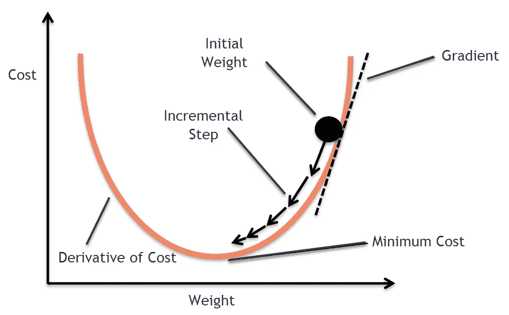

Graphical representation of **Gradient Descent** | Source: **Medium**

看起来不像听起来那么可怕，对吧？好消息，这是一个相对简单的概念。根据定义，**梯度**是一个有趣的词，表示导数，或者函数的变化率。

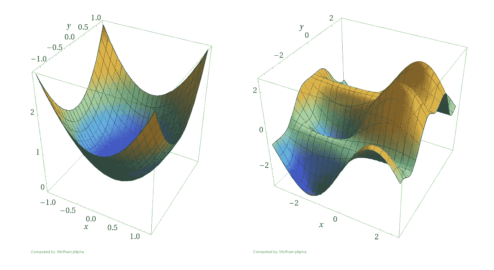

3D representation of **Gradient** | Source: **OReilly**

假设我们的模型是一个球。该表面表示误差的梯度(导数)。我们希望球滚下表面(**下降**)尽可能低，以降低高度(误差)。从数学层面来说——我们需要达到一个全局(或者至少是一个足够好的局部)最小值。

为了让球移动，我们需要以一定的速率更新我们的参数——称为**学习速率**。这是一个预定义的参数，我们在运行模型之前将它传递给我们的模型。这种参数被称为超参数，在我们的模型性能中有着巨大的作用。我的意思是:

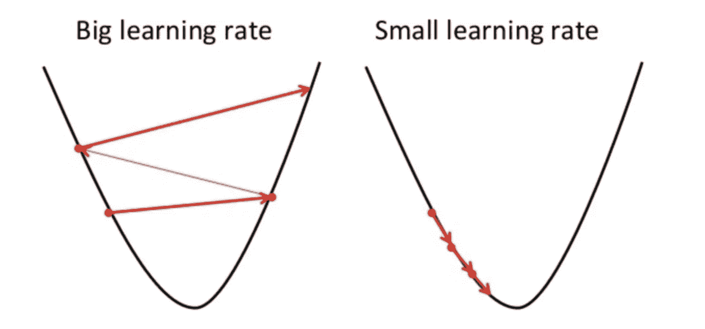

Significance of **Learning Rate** | Source: **analyticsvidhya.com**

如果我们选择一个太大的学习率，参数将会剧烈变化，我们可能会跳过最小值。另一方面，如果我们的学习率太小，那么要达到令人满意的结果将花费太多的时间和计算能力。这就是为什么通过用不同的学习率值测试模型来调整这个参数是相当重要的。强烈建议从 0.1 或 0.01 的学习率开始，并从那里开始调优。

## 背靠背(传播)

现在，我们需要通过将适当的数据传递给反向传播方法来逐层更新模型的参数。反向传播有两个参数——输出误差和学习速率。输出误差的计算方式可以是成本函数的导数，也可以是前一层反向传播的结果(从 B 点到 A 点)，如上所述，反向传播应该给出正向传播函数的导数。通过这样做，每一层向它的前一层显示它的错误。

换句话说，如果出于某种原因，我们有一个正弦层，它看起来会像这样:

现在我们已经得到了所需的两个参数，反向传播应该更新层权重(如果存在的话)。由于每种类型的层都是不同的，因此它定义了自己的参数调整逻辑，这一点我们稍后会谈到。

## 结束梯度下降

当每一层的反向传播完成，我们的列车到达 A 点时，它获取下一个样本(或样本集)，并再次通过隐藏层的前向传播函数开始它的过程——只是这一次，它们应该表现得更好一点。这个过程不断继续，直到训练完成和/或达到最小误差。

现在我们已经解释了梯度下降背后的所有理论，下面是它在代码中的样子:

我希望这段代码片段能对算法本身给出更多的解释。唯一我们还没有完全覆盖的是我们可以在网络中使用什么类型的层以及如何实现它们。

# 基本层

对于初学者来说，似乎有很多种层可供选择，臭名昭著的全连接层无疑是最佳选择。

## 全连接的

全连接层是使用最广泛的类类型。其工作原理基于罗森布拉特模型，具体如下:

1.  **来自**前**层的每一个感知器**都链接到**这**层的**每一个感知器**。
2.  每个环节都有一个**加权值(weight)。**
3.  一个**偏差**被添加到结果中。
4.  该层的**权重**保存在一个 2D 数组中，大小为***【m】****x****n***(其中 ***m*** 是前一层的感知器数量， ***n*** 是该层的感知器数量)。它们被初始化为随机值。
5.  该层的**偏差**保存在大小为 ***n*** 的 1D 数组中。它被初始化为随机值。

Visual representation of **Fully-Connected(FC) Layer** | Source: **cs231n.github.io**

现在让我们来看看我们的实现:

正如你所看到的，只要你知道基本的线性代数，我们的 to 方法的实现并不复杂。虽然相对简单，但这是一个完全有用且优化的层实现，我们将很容易在以后使用它。

然而全连接层的唯一问题是它们是线性的。事实上，大多数层都有完全线性的逻辑。线性函数是一次多项式。仅使用这样的函数妨碍了模型学习复杂函数映射的能力，因此，学习是有限的。这就是为什么(按照惯例)在每个使用**激活层**的线性层之后添加非线性功能是好的。

## 活化层

激活层与任何其他类型的层一样，只是它们没有权重，而是对输入使用非线性函数。

这种**激活函数**的一个很好的例子是代表**双曲正切的 **tanh** 。**

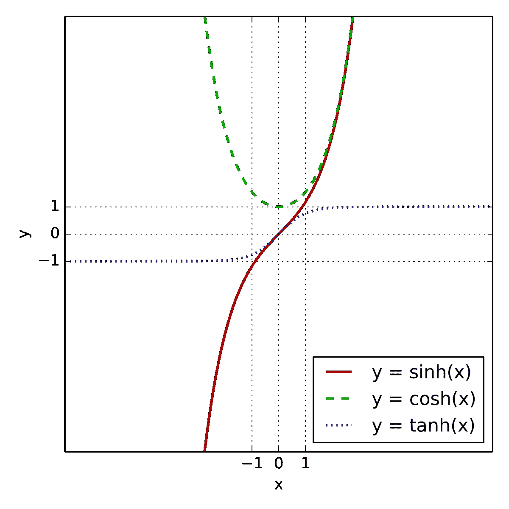

**Tanh** compared to **sinh** and **cosh** | Source: **Wikipedia**

因为我们在开始构建模型时会用到它，所以我们需要实现它:

现在我们已经实现了最重要的两层，让我们继续实现整个**神经网络**类。

# 神经网络实现

有几种方法需要实现

*   一个构造函数——这里我们需要传递超参数(学习率和历元数——我们的网络在输入数据集上运行的次数)；必要字段的初始化
*   添加层方法—传递层的实例；用于模型构建；可以(应该)用几次才能加几层；
*   使用成本函数方法-指定训练模型时要使用的成本函数
*   拟合方法——执行训练过程的方法的标准名称；这里是我们放置之前的渐变下降片段的地方
*   预测方法—仅用于计算结果的方法的标准名称；一旦训练过程完成，它是有用的

代码是这样的:

您可能已经注意到在每个方法的末尾都出现了`return self`语句。我这样做的原因是它允许我们做**方法链接**。如果你不确定我在说什么，你马上就会看到一个很好的例子。

现在让我们将它付诸实践。我们将使用 **MNIST** 数据库对手写数字进行分类。可以从[这里](http://yann.lecun.com/exdb/mnist/)下载，也可以从 **Keras** 轻松导入。

因为像素值表示在范围[0；255]，我们将把它缩小到范围[0.0，1.0]。

我们做的另一件事是让 **y** (结果)变得更方便一点(注意**keras . utils . to _ categorial)**。它的作用是在一个**独热向量**中表示数值结果:

**5 =>【0，0，0，0，0，1，0，0，0，0，0】**

这很有帮助，因为我们网络的输出层将由 10 个节点组成，每个节点保存一个输出值。由于理想情况下的输出是正确的独热向量，因此成本函数现在更容易完成其工作。

现在，让我们通过放置一些 FC 和激活层来构建我们的第一个网络:

我们只使用前 1000 个样本的原因是，如果我们使用所有的样本，运行时间会太长。在这种情况下，使用更多的样本会得到更好的结果，所以如果有时间，可以尝试更大的范围。

在我们运行这个之前，我们需要再添加一个最后的触摸——另一个预输出激活函数— **Softmax** 。它所做的是对一个概率分布数组中有 *n* 个元素的数组进行归一化，该数组由与输入数字的指数成比例的 *n* 个概率组成，或者简单地说，计算样本匹配某个类别的概率。

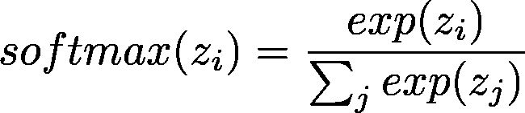

**Softmax** formula | Source: **hackernoon.com**

以及实现:

让我们再试一次，只是这一次我们将有 **Softmax** 激活作为我们的最后一层。

现在我们已经训练了我们的数据，让我们评估我们的最终模型。

# 估价

请记住，我们已经实现了一个用于教育目的的小型模型。它不会产生很高的结果。我强烈建议用它来玩，以获得更好的准确性。

为了评估我们的结果，我们将使用一个来自 **sklearn** 的简单实用程序，它显示了我们模型的准确性。

现在你知道了神经网络构建的基础，我们可以继续学习更高级的东西…

# 卷积神经网络(CNN)

使用 FC 层执行图像识别任务的主要问题是，它将每个像素作为一个单独的特征，这似乎不太正确，因为神经网络的目标是复制人脑。帮助我们的大脑识别视觉输入的不仅仅是随机的点，而是点的模式。这就是所谓的**卷积**和**相关**过程派上用场的地方。

## 卷积和相关

图像处理中的卷积和相关几乎是相同的过程，只是在实现上有一点小小的不同。两者都取一幅图像 ***I*** ，基于另一个矩阵产生一个矩阵 ***O*** (称为**滤镜**或**特征图** ) ***F*** 。我的意思是

先说**关联:**

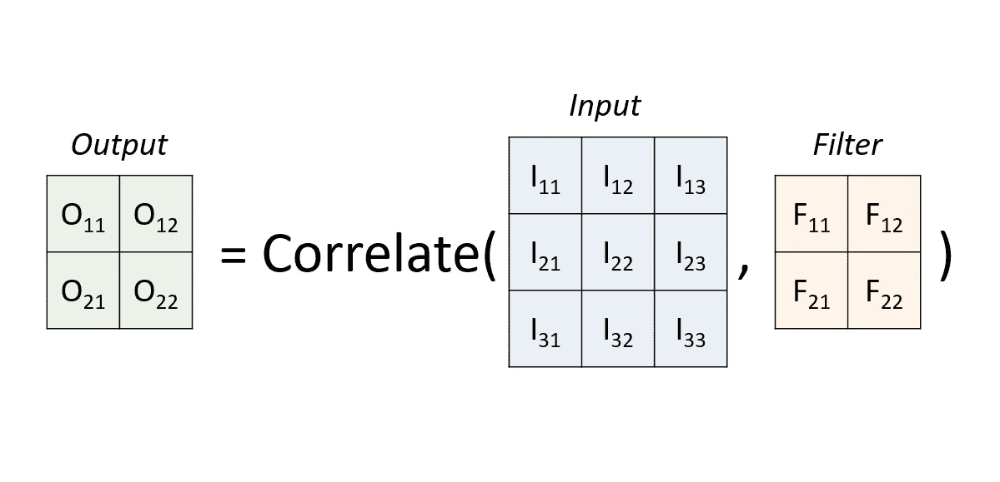

Visual representation of **Correlation** | Source: **My Late Night PowerPoint Creations**

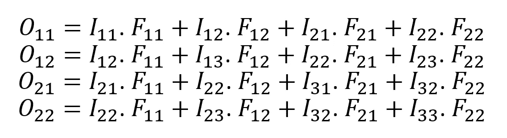

让我们解释一下发生了什么。过滤器就像一个**滑动窗口**，一步一步地穿过数组，向右滑动直到到达行的末尾。然后向下滑动，从行的开始处开始。在每个位置，我们对滤波器 ***F*** 和输入图像 ***I*** 的相应窗口的点积求和。每个位置代表输出**中的一个单元格。**

*那么**卷积**呢？*

*Source: **Giffy***

***相关**和**卷积**的唯一区别是**卷积**与同一个滤波器 ***F*** 一起工作，只是旋转了 180 度。*

*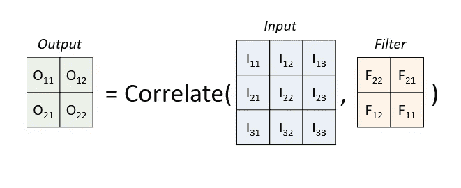*

*Visual representation of **Convolution** | Source: **My Late Night PowerPoint Creations***

## *但是这对我们有什么帮助呢？*

*通过使用这种过滤器，通过我们的图像，我们提取的不仅仅是一个像素，而是整个像素区域，使我们的模型能够映射更复杂的图像特征，如线条和形状。*

*例如，如果你给一个卷积层一个猫的图像，它将能够识别像鼻子和耳朵这样的小特征。然后通过添加更多的卷积层，它可以识别更大尺度的特征，如头部或尾部。*

*其工作方式是每个卷积层有几个滤波器，都用随机数初始化。这背后的目标是让每个过滤器激活不同的特征(一个特征训练检测鼻子，另一个特征检测眼睛，等等。).*

**通常在处理* ***多通道图像(如 RGB)*** *时，您的滤镜将是三维的，深度等于图像通道数。这样你就只关注 2D 进程了。**

***填充和步幅***

*卷积和相关的问题是角点像素没有得到太多的关注，它们只被处理一次。如果你想改变这一点，你可以添加一个**填充。***

*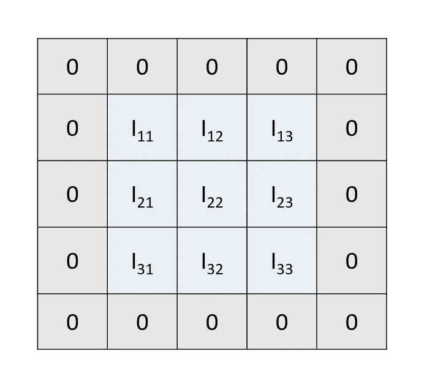*

*Visual representation of **Padding** | Source: **My Late Night PowerPoint Creations***

*现在，即使是角落也会像图像的其他部分一样被处理。*

*然而，有时我们不想对每个像素都给予太多的关注(在处理较大的图像时非常适用)。让每个过滤器通过每个可能的位置有时是多余的。这就是为什么我们可以配置一个**步幅。***

*步幅告诉我们的过滤器在到达下一个位置时应该滑动多少。步幅为 2 将在每次移位时跳过一个位置，这减小了输出的大小并使得计算量更小。*

*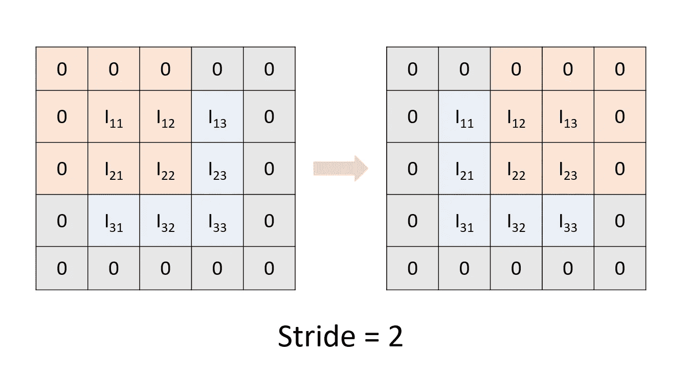*

*Visual representation of **Stride** | Source: **My Late Night PowerPoint Creations***

**没有步幅基本上意味着步幅为 1——过滤器覆盖了所有可能的位置而没有跳跃。**

***实施***

*首先让我们列出我们的参数:*

*   ***滤镜数量**——图层中有多少个滤镜*
*   *过滤器尺寸——我们的过滤器会有多大*
*   ***填充** —我们将有多少零填充(我们将对这个使用元组格式 ***(x，y)*** ，其中 ***x*** 代表列零填充， ***y*** 代表行零填充)。*
*   ***步幅** —只是一个简单的数字，显示一个滤镜每张幻灯片应该移动多少个位置*

****NB！*** *因为我们要用随机值初始化我们的过滤器，所以使用* ***相关性*** *或* ***卷积*** *实际上没有区别，所以为了简单起见，我们将使用相关性。**

*这里有一个非常迭代(for-loopy)的方法来实现卷积层:*

*虽然有点容易理解，但它太慢了，因为它缺乏**矢量化**(使用 for 循环而不是基于数组的操作)。这就是为什么我四处挖掘，找到了一些非常有用的库方法，帮助我优化我的层:*

*   *[**skim age . util . view _ as _ windows**](https://scikit-image.org/docs/dev/api/skimage.util.html#skimage.util.view_as_windows)—我用它来自动获取我的滤镜应该去的位置，而不是自己循环遍历它们。*
*   *[**NP . tensordot**](https://docs.scipy.org/doc/numpy-1.14.0/reference/generated/numpy.tensordot.html)**——**我用它把窗口(我用上面提到的方法得到的)和滤镜相乘。*

*不幸的是，我找不到一种简单的方法来对 **in_error** 的计算进行矢量化(我得到的最接近的方法是使用[**scipy . signal . convolve _ 2d**](https://docs.scipy.org/doc/scipy/reference/generated/scipy.signal.convolve2d.html)**，**，但它不适用于 stride)，直到我意识到矢量化操作通常用于用低级语言编写的循环，所以我使用 **Cython** (一个库，它允许*

*更多关于 **Cython** 的信息，请访问[他们的文档](https://cython.readthedocs.io/en/latest/)。*

*现在我们已经有了所有的拼图，让我们组装我们的**优化**卷积层:*

*说到优化，我们将看到的下一组层将帮助我们避免 GPU 融化。*

# *池层*

*合并图层的目的是减少先前卷积图层输出的空间大小。这有助于我们的模型，原因有二:*

1.  *它降低了所需的计算能力。*
2.  *它创建输入的较低分辨率版本。这个过程也被称为**下采样**。这有所帮助的原因是卷积层的过滤器通常被绑定到图像中的准确位置。具有小的移动或失真可能导致不期望的不同输出。下采样图像仍然包含较大的结构特征，只是排除了可能妨碍模型性能的精细细节。*

**一种可以用来解决这个问题的* ***下采样*** *的替代方法是首先在* ***卷积层*** *上使用一个* ***更大的步幅*** *。**

*在大多数 CNN 模型中遇到的通常模式如下:*

*   *卷积层*
*   *活化层*
*   *汇集层*

*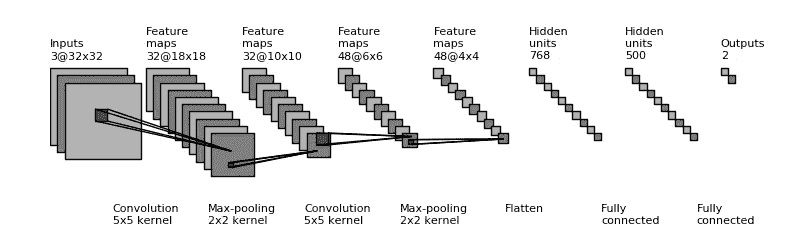*

*A typical **CNN pattern** | Source: **jefkine.com***

## *工作原理*

***汇集**的工作方式有点类似于**卷积**和**相关**。我们又一次有了一个窗口(称为**池**)滑过我们的输入。然而**池**不包含任何像**过滤器/特征映射**那样的数据。当一个池移动到一个位置时，它仅根据该位置的值计算结果(如**平均值**或**最大值**)。*

*为了帮助您理解它是如何工作的，我们将实现最广泛使用的类型— **Max Pooling Layer** 。*

## *最大池层*

*想法很简单—当池滑动到某个位置时，该位置的最大值存储在输出中。*

*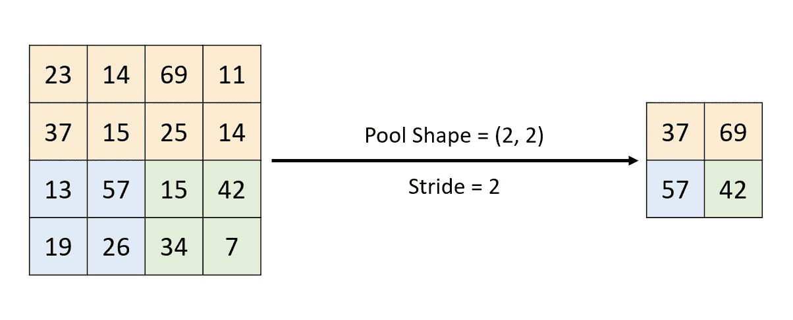*

*Visual representation of **Max Pooling** | Source: **My Late Night PowerPoint Creations***

## *因素*

*这里的列表比卷积层的列表简单得多*

*   ***池形状** —池的形状，用一个元组来描述，一个好的默认值是(2，2)*
*   ***步距** —与卷积相同，一个好的默认值是 2(大多数情况下，匹配池的尺寸是好的)*

## *履行*

*再次实现一个**基类**是一个好主意，因为一些操作对于所有的池层都是相同的(例如像**初始化**):*

*接下来是**最大池**:*

*我强烈建议您自己尝试实现**平均池层**。*

*在我们建立第一个 CNN 模型之前，我们需要重新格式化我们的数据，以便它可以被其他层使用，如全连接。这是需要的，因为当我们解决分类任务时，最后的非激活层应该总是完全连接的。因为如果全连接的输入不是 1D 数组，那么它将会是一团乱麻，我们必须首先**展平**(将 N-D 数组转换为 1D 数组)数据。*

# *展平图层*

*这可能是实现起来最简单的一层。我们的正向传播需要展平输入，反向传播需要将其重新格式化回初始形式:*

*现在让我们建立我们的第一个 CNN…*

# *CNN 模型*

*我们将使用本文中实现的所有层来构建一个简单的 CNN:*

*现在让我们看看它的表现如何:*

*它应该比我们的普通网表现更好，尽管如果你玩它并有耐心等待训练过程结束，它实际上可以取得更高的结果。这里有一些关于如何建立一个更好的神经网络模型的有用资源…*

# *附加链接*

* [## 新手问“人工神经网络要用多少个隐层/神经元？”

### 人工神经网络(ann)的初学者很可能会问一些问题。这些问题包括什么…

towardsdatascience.com](/beginners-ask-how-many-hidden-layers-neurons-to-use-in-artificial-neural-networks-51466afa0d3e)  [## EfficientNet:重新思考卷积神经网络的模型缩放

### 自从 AlexNet 赢得了 2012 年的 ImageNet 竞赛，CNN(卷积神经网络的简称)已经成为设计者

medium.com](https://medium.com/@nainaakash012/efficientnet-rethinking-model-scaling-for-convolutional-neural-networks-92941c5bfb95) 

# 最后的话

感谢大家花时间阅读我的第一篇关于媒体的文章。我真的希望它能帮助你学到一些新的有用的东西，甚至可以帮助你开始学习数据科学和机器学习。

如果您有任何意见、想法或建议，我会非常乐意收到您的反馈，并会尽快回复。

# 图像参考

[https://www . research gate . net/figure/Threshold-Logic-Unit-Source-Wikimedia-Commons _ fig 10 _ 264080882](https://www.researchgate.net/figure/Threshold-Logic-Unit-Source-Wikimedia-Commons_fig10_264080882)

 [## 感知器

### 一种用于分类的感知器学习算法的实现。分类器导入感知器…

rasbt.github.io](http://rasbt.github.io/mlxtend/user_guide/classifier/Perceptron/)  [## 用于视觉识别的 CS231n 卷积神经网络

### 目录:引入神经网络而不诉诸大脑类比是可能的。在…一节中

cs231n.github.io](http://cs231n.github.io/neural-networks-1/)  [## 教程:了解线性回归和回归误差度量

### 人类大脑的构造是为了识别我们周围世界的模式。例如，我们观察到如果我们练习…

www.dataquest.io](https://www.dataquest.io/blog/understanding-regression-error-metrics/)  [## 为什么是随机梯度下降？

### 随机梯度下降(SGD)是数据科学中最流行和最常用的优化器之一。如果你曾经…

medium.com](https://medium.com/bayshore-intelligence-solutions/why-is-stochastic-gradient-descent-2c17baf016de)  [## 深度学习的难点在于

### 深度学习的核心是一个困难的优化问题。如此之难以至于在引进后的几十年里…

www.oreilly.com](https://www.oreilly.com/radar/the-hard-thing-about-deep-learning/)  [## 机器学习中的梯度下降算法(及其变体)简介

### 介绍优化始终是最终目标，无论你是处理一个现实生活中的问题或建立一个…

www.analyticsvidhya.com](https://www.analyticsvidhya.com/blog/2017/03/introduction-to-gradient-descent-algorithm-along-its-variants/)  [## уакл:Sinh cosh tanh . SVG

### 504 × 504 пиксела. 240 × 240 пиксела | 480 × 480 пиксела | 600 × 600 пиксела | 768 × 768 пиксела | 1024 × 1024 пиксела.

bg.m.wikipedia.org](https://bg.m.wikipedia.org/wiki/%D0%A4%D0%B0%D0%B9%D0%BB:Sinh_cosh_tanh.svg)  [## 训练建筑分类器- II

### 这是 5 篇文章系列的第 2 部分:训练架构分类器:动机训练架构分类器…

hackernoon.com](https://hackernoon.com/training-an-architectural-classifier-ii-bf29eca3cfa6)  [## 卷积神经网络中的反向传播

### 卷积神经网络(CNN)是多层感知器(MLPs)的生物启发变体…

www.jefkine.com](https://www.jefkine.com/general/2016/09/05/backpropagation-in-convolutional-neural-networks/)*