# 用于音乐生成的神经网络

> 原文：<https://towardsdatascience.com/neural-networks-for-music-generation-97c983b50204?source=collection_archive---------5----------------------->

## 能否通过 AI 重现艺术家的创造力？

人工智能最新进展的一个令人兴奋的应用是人工音乐生成。能否通过 AI 重现艺术家的创造力？深度学习模型能否成为音乐人的灵感或生产力工具？这些问题把我们带到了创造力的定义，以及这些工具超出其自身研究兴趣的有用性。

# 人工音乐生成的目标

## 模拟人类的创造力

T 这方面研究的第一个目标是人工生成人类发出的音乐或者更具体的艺术家发出的音乐，比如莫札特。这里的一个挑战是创作原创作品，仍然尊重你期望听到的规则和经典模式。

## 开发一种工具来帮助艺术家进行创作

人工智能可以被用来增强艺术家的创造力吗？除了灵感，还可以通过提供一种工具来有效地开发他们的想法？我们已经看到了像 Ableton 这样强大的作曲软件是如何塑造了现在的音乐空间，比以往更加多样化。现在，AI 会把这种趋势扩大到什么程度？

Image by Clem Onojeghuo — Unsplash

# 音乐一代面临的挑战

> “音乐是情感的速记”列夫·托尔斯泰

人工生成的音乐带来了许多挑战。我们首先需要决定如何对不同的音乐特征进行编码。然后，我们应该确保我们的作品尊重关于结构和力度的主要音乐规则。

> “音乐有多个维度，相对差异可能比它们的绝对值更重要；最突出的两个是时机和音高。”[1]

## 力学

乐器发出的声音的音量。它通常使用作曲家所做的注释进行编码，从最弱音 ***ppp*** 到最强音 ***fff。***

## 音色

这可能是最重要也是最难编码的音乐特征。

> *“听觉的属性，使听者能够判断两个不同的声音，相似地呈现并具有相同的响度和音高，是不同的”维基百科*

如果一架钢琴演奏一个音符，然后一把吉他演奏同样的音符，同样的时间长度，同样的响度，你仍然可以很容易地区分这两种声音，因为这两种乐器的声音是不同的。这种区别在于声音的音色。这是因为乐器的每个音符都是一个包含多个频率的复合波。

## 粒度和时间范围

什么是时间离散化？通常使用的两种策略是基于最小单位将时间设置为相对持续时间:十六个音符；或者为弹奏的音符固定一个绝对持续时间:例如 30 毫秒。这最后一个策略也能在乐谱的诠释中捕捉到表现力，让作品听起来更人性化。

其他必须表现的音乐特征包括持续时间、休止符、节拍和音高。

Image by Steve Buissinne — Pixabay

# 最先进的音乐创作方法

H 在我介绍这一领域的几项研究之前，它并不详尽，但提出了一些有趣的解决问题的方法。

## 洋红色— 2016

这个由 Google Brain 开发的项目旨在为艺术家创造一个新的工具，供他们在工作和开发新歌时使用。他们开发了几种模型来产生音乐。

2016 年底，他们发表了一个用强化学习调整的 LSTM 模型。有趣的想法是使用强化学习来教会模型遵循某些规则，同时仍然允许它保留从数据中学习的信息。[2]

为此，定义了几个**指标**:首先，那些我们希望降低的，与惩罚相关的指标:

*   音符不在调上
*   平均自相关(log1 — log2 — log3): *目标是鼓励多样性，因此如果成分与自身高度相关，模型会受到惩罚*
*   笔记过度重复: *LSTM 容易重复相同的模式，这里使用强化学习带来更有创意的方法*

然后，我们希望与**奖励**相关的指标变高:

*   以主音开始的作品
*   Leaps resolved: *我们希望避免尴尬的间隔，所以当间隔太大时，我们向相反的方向返回。在 RL 术语中:在同一个方向跳跃两次是负奖励*
*   具有唯一最大音符或唯一最小音符的作曲
*   主题中的音符:*模特演奏主题会得到奖励:代表一个简短音乐“想法”的一系列音符*

这些标准定义了一种音乐理论规则。这些指标的改进程度取决于对特定行为的奖励程度。这样，我们可以更加强调一些被认为更重要的指标。例如，在这里，每当一个音符被过度重复时，就会给予一个很大的惩罚(-100)，而对于一个独特的极值音符(+3)，在作品的结尾会给予一个小得多的奖励。度量标准的选择以及权重定义了我们想要创作的音乐的形状。

最近，Magenta 团队使用 GAN 和 Transformers 生成了具有改进的长期结构的音乐。

在变形金刚的模型中，使用了相对自我关注。它根据标记之间的距离调节注意力。这种架构有助于捕捉音乐中自我指涉现象存在的各个层面。

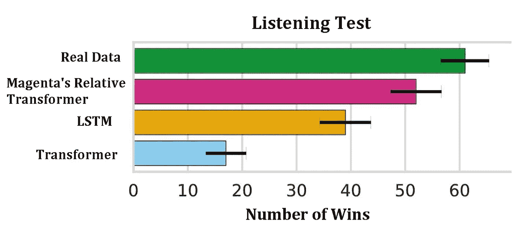

Number of wins for each model. Error bars show standard deviations of mean. (Humans’ comparisons)

然后，这些模型被用来创建艺术家在创作时可以使用的创意工具。这是作为插件添加到 *Ableton Live* 的 *Magenta 工作室*的概念。

> “Magenta Studio 是一个基于 Magenta 开源模型的音乐创意工具集合，既可以作为独立应用程序，也可以作为 Ableton Live 的插件。他们使用尖端的机器学习技术来生成音乐。”[3]

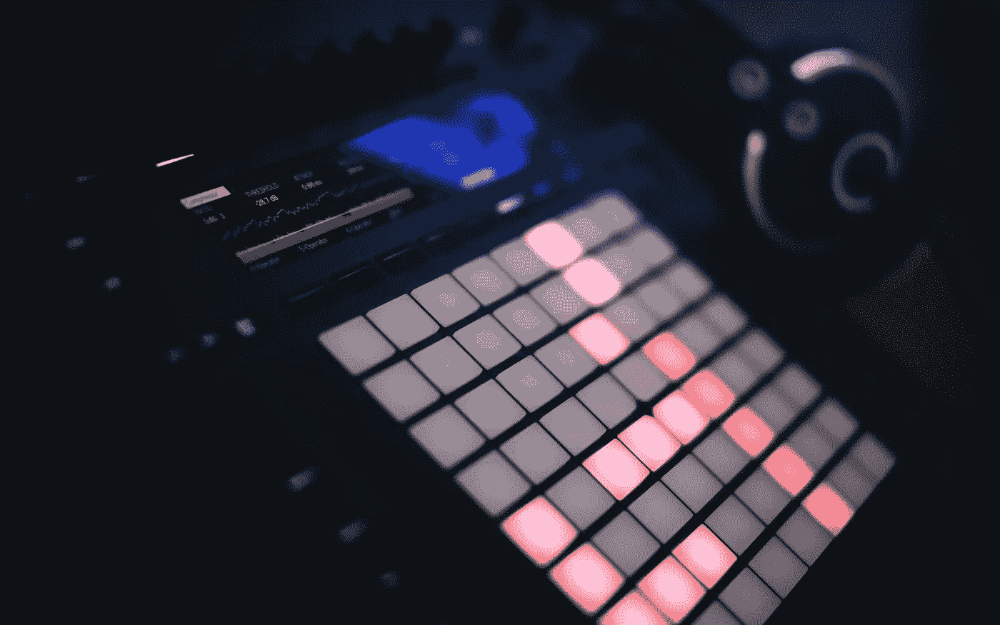

Image by Anton Shuvalov — Unsplash

## MuseGAN — 2017 年

在这个项目中，为了应对音符的分组，用**小节**代替音符作为基本的作曲单位。因此，使用 CNN 生成一个又一个小节的音乐，这有利于找到局部的、平移不变的模式。[4]

本文中一个有趣的方法是使用的评估指标。我们希望我们的音乐具有的五个主要特征被定义并用于训练网络。然后，我们对它们进行评估，并评估预测的效果:

*   空棒比率
*   每批使用的沥青等级数量(从 0 到 12)
*   “合格票据”的比率。这里，超过三个时间步长的音符被认为是合格的。合格音符显示音乐是否过度碎片化。
*   鼓模式:8 拍或 16 拍模式中音符的比率
*   音调距离:测量一对轨道之间的和谐度。较大的音调距离意味着较弱的轨道间和声关系。

## Wavenet — 2016 年

这是一个使用连续编码而不是离散编码的项目示例。该模型生成**原始音频波形**。因此，它能够发出任何声音，比如人声。[5]

该模型是 CNN，其中卷积层具有多个膨胀因子，并且预测仅依赖于先前的时间步长。应用包括钢琴作品的生成和语音生成。

## MuseNet — 2019 年

这是 OpenAI 音乐生成模型。它利用最先进的 NLP 架构(大规模变压器模型)来预测序列中的下一个令牌。它可以结合不同著名作曲家以及不同音乐流派的风格。[6]

2D map of the cosine similarity of various musical composer and style embeddings — MuseNet

# 音乐生成的 Maia 方法

aia 是我在加州大学伯克利分校与 Edward T .和 Louis R .共同开发的一个研究项目，旨在为这一广泛的挑战提供一种可能的解决方案。

## 背景

我们一开始的意图是创造一个人工智能，它可以完成莫扎特未完成的作品*以泪洗面*—*安魂曲*的第八个序列——莫扎特去世时，这首曲子只写到第八小节。

我们通过将音乐生成框架化为语言建模问题来解决这个问题。这个想法是将 midi 文件编码成一个记号词汇表，并让神经网络从成千上万个 midi 文件中预测下一个记号。

## 编码

我们采用了由 OpenAI 的技术人员 Christine Payne 提出的“Notewise”方法[7],将每首乐曲的持续时间、音高和动态编码成一个文本序列，从而产生 150 个单词的词汇量。

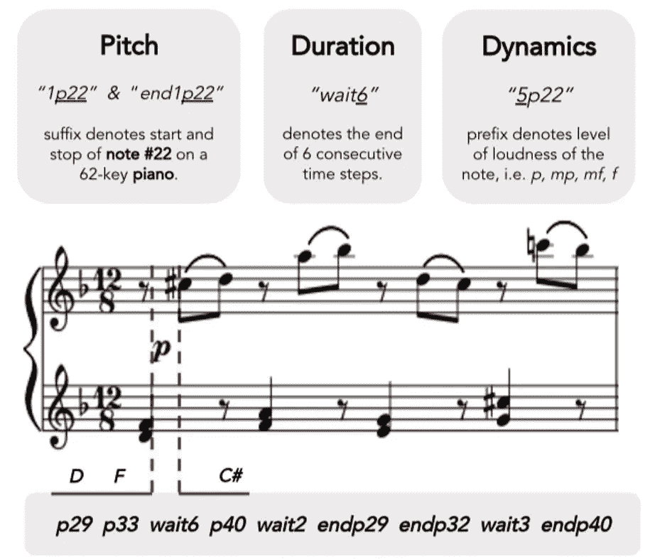

Description of the encoding

此外，为了增加我们的数据集，我们使用调制将每首曲子复制 12 次，每次都比下一个音符低一个音符。

## 标记化和排序

我们探索了为每首乐曲添加特殊标记，以便序列包含关于作曲家、音乐开始时间和结束时间的信息。

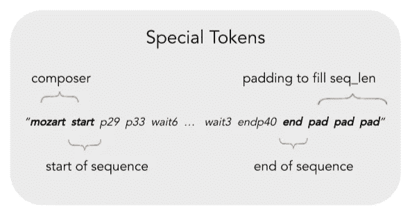

Special Tokens

我们还探讨了 ngram 标记化，它将一串 n 个连续的“单词”视为单个标记。动机是看看我们是否能更好地捕捉复合“单词”的语义，这些单词代表共同的和弦或旋律模式。最终，我们仍然坚持在最终模型中使用单字标记，因为与我们的数据集相比，任何更高阶的 ngram 都会大大增加词汇表的大小。

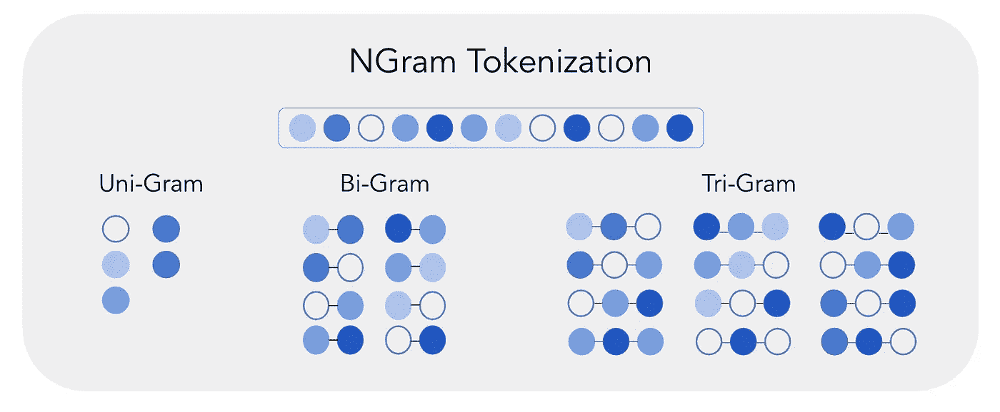

NGram Tokenization

接下来，编码的文本数据被分批成 512 个标记的序列用于训练。我们不是将它们切割成互斥的序列，而是将序列重叠，即每个后续序列与前一序列有 50%的重叠。这样，我们就不会在分割序列的点上丢失任何连续性的信息。

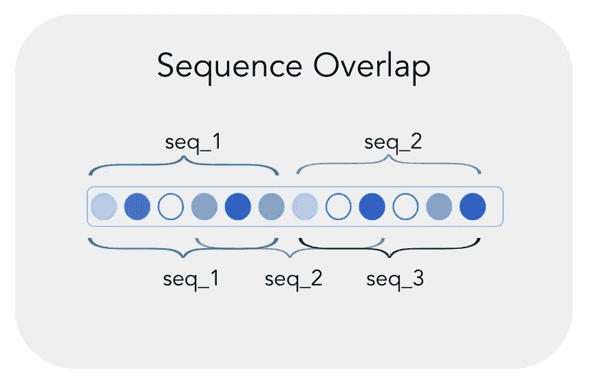

Sequence Overlap

## 两层堆叠 LSTM

第一个版本是使用递归神经网络架构构建的。特别是，我们使用了 LSTM，因为与 RNN 和格鲁相比，它额外的遗忘门和细胞状态能够携带关于音乐中长期结构的信息——这使我们能够预测长达 1 分钟的更长序列，听起来仍然连贯。我们的基线模型是一个两层堆叠的 LSTM，每个 LSTM 单元中有 512 个隐藏单元。我们使用嵌入层将每个令牌转换成一个向量。

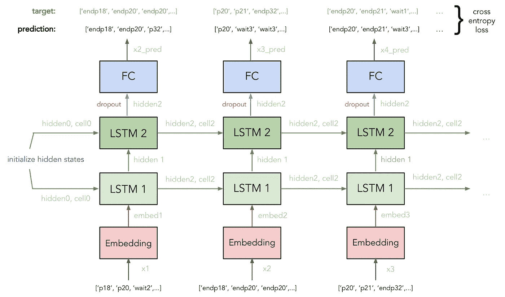

LSTM architecture

为了确保我们生成的序列是多样的，而不是总是在预测中选择最有可能的下一个标记，该模型将根据其相应的概率从前 k 个最有可能的下一个标记中随机采样，其中 k 在 1 和 5 之间。

我们必须调整一些超参数，比如决定每个样本的序列长度。太短，你将学不到足够的东西来产生一串对人类来说连贯的音乐。太长的序列和训练将花费太长的时间而没有学到更多的信息。

优化我们的批处理大小也将允许我们权衡学习迭代与利用 GPU 的并发计算。我们使用网格搜索来寻找序列长度和批量大小的最佳组合。

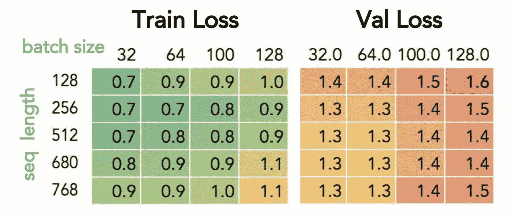

Loss of our models

## GPT —变压器

GPT 是基于堆叠在一起的变压器解码器的架构[8]。Transformer 是一个序列模型，它利用了自我关注，对于涉及长期依赖关系的生成任务，它已经产生了令人印象深刻的结果。它本质上是普通的 Transformer 模型，去掉了它的编码器块和交叉注意机制——因此它可以更有效地执行无人监督的任务。这使得它非常适合音乐表现。

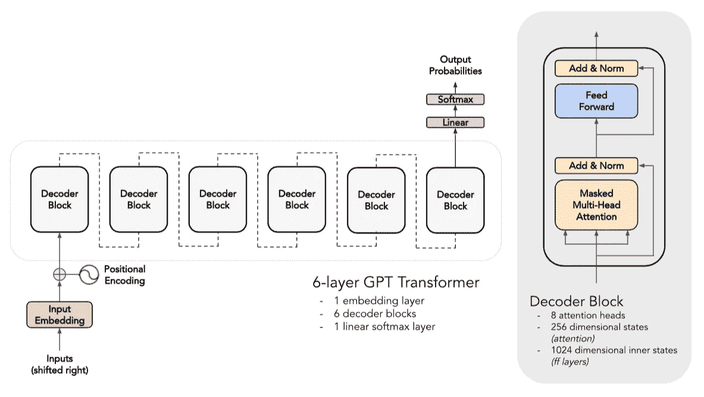

GPT’s architecture

我们使用 6 层 GPT 模型，包括一个嵌入层、6 个解码器块和 1 个线性 softmax 层，它将为我们返回下一个预测令牌的逻辑。每个解码器模块具有 8 个自关注头，前馈层具有 256 维状态和 1024 维内部状态。

使用来自所有作曲家的数据，训练损失在大约 5000 次迭代后收敛。然而，我们决定将训练推进到 20 万次迭代(30 个历元)——这需要大约 60 个小时——来看看我们是否可以获得更高质量的生成样本。

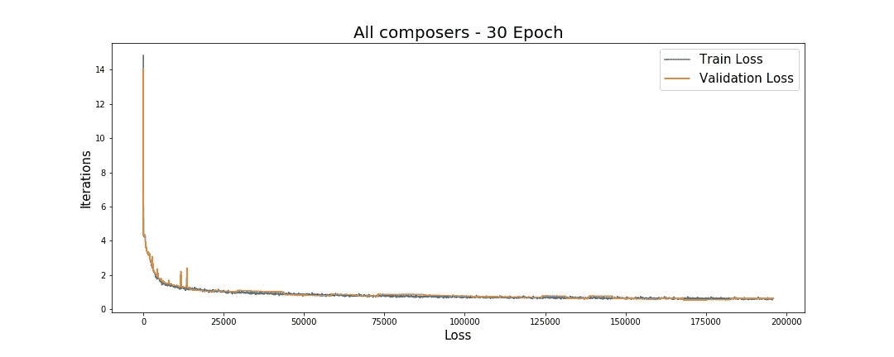

Loss over 30 epochs

我们最初的结果不是特别一致，所以我们把训练集中在一个作曲家身上。

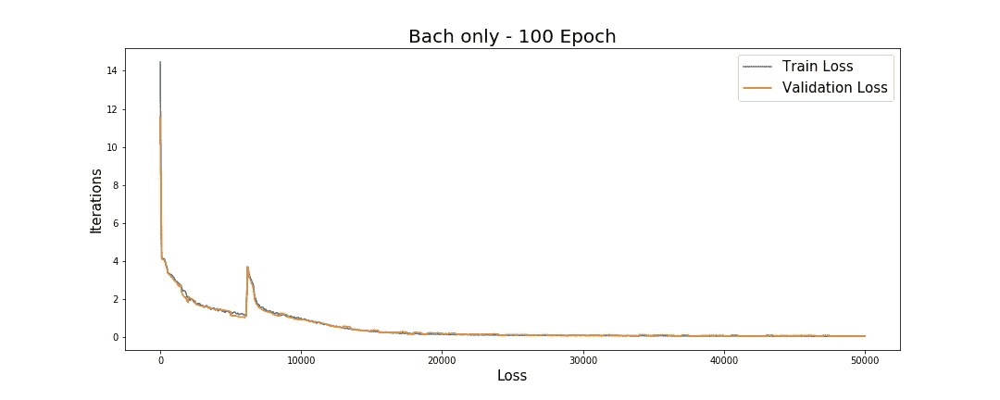

Loss over 100 epochs

总的来说，我们对更长序列建模的尝试受到了我们使用的 GPU 内存的阻碍。在每个序列中，它最多只能支持 512 个令牌。

## 进一步研究

为了提高我们的模型的长期保持能力，我们探索了最近的 NLP 模型，如 GPT-2 和稀疏变压器。

关于 GPT-2 模型，我们必须在使用**预先训练的模型**或**从头开始建造**之间做出选择。第一种解决方案将允许我们利用模型被训练的大数据集，但是因为它被训练在文本上而不是音乐上，它可能不能很好地概括我们的数据集。第二种解决方案更有意义，因为该模型只从音乐数据中学习，但数据集的大小将减少总训练量，从而降低整体性能。我们决定采取第二种选择；然而，GPT-2 的二进制编码部分不适合我们的标记化和排序，这阻止了模型的良好表现。

## 估价

一个可以递归地、快速地、准确地应用于我们模型的量化指标是 **BLEU 评分**。BLEU 评估生成序列中使用的 ngrams 的数量，这些 ngrams 也存在于一些参考序列中。它被广泛用于评估翻译模型，并假设好的序列在微观层面上看起来与真实的序列相似。这是一个合理的假设，因为我们期望我们生成的作品包含相似的和声、节奏和风格。

然而，我们这里的问题与翻译问题完全不同。我们不是将一个特定的翻译与有限的几种表达方式进行比较。我们正在基于几个音符生成全新的音乐序列，包括其他成分，如**创造力**和**一致性**。

这有几个后果。首先，小的 ngrams 信息量较少。事实上，由于我们在参考文件中使用了大量的组合，我们预计 1 克的值为 1(我们不会在组合中使用新的音符)，2 克和 3 克的值也非常接近 1。因此，关于这些 ngrams 的信息很少。此外，我们希望我们生成的作品具有某种**的原创性**。我们不想从训练数据中重新创建或重复现有的序列，而是真正创造一些新的和独特的东西，这些东西是由现有的音乐激发的**——就像艺术家会做的那样。因此，高 n-gram 也应该不被重视，非常高的 n-gram 不被考虑。**

基于所有这些考虑，我们构建了一个**定制的 BLEU 分数**。选择的权重为:

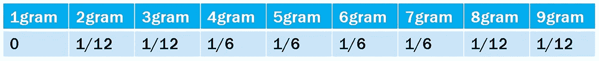

Weight table for the customized BLEU score

我们使用 BLEU 评分来比较我们的 LSTM 基线模型和一些真实的莫扎特作品。结果——在十几个序列上平均——对于 LSTM 是 0.25，对于真实数据是 0.14。这意味着我们生成的样本符合我们定制的标准。LSTM 作品产生的比真实作品更高的分数强调了**过度拟合**的存在，其中生成的音乐包含来自原始数据的**大量重复。**

对 GPT 来说，我们面临着不同的挑战。我们的 GPT 版本努力学习长期模式，结果在高 ngrams 或更多)上得分很低。这凸显出我们的新作品可能更具原创性，但也不太忠实于音乐规则，因此显示出更少的结构和更少的和声。

因此，为了将我们的 GPT 与基线模型和真实数据进行比较，我们可视化了**累积的 ngrams** (从 2 到 5)。总的来说，GPT 在每个累积的 ngrams 中得分较低，强化了之前观察到的模式。

Cumulated ngrams visualization

## 生成的音乐样本

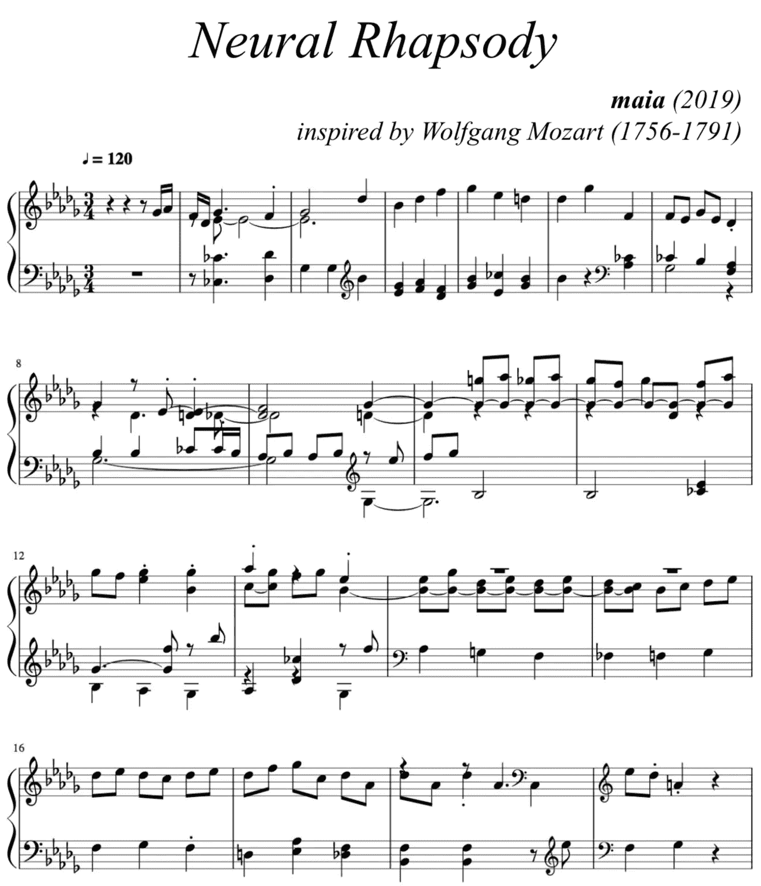

Generated Music Sheet

# 结论和未来的改进

选择的编码决定了你正在创建的模型的范围和限制。选取 MIDI 文件的离散表示会导致原始连续音频文件中的信息不可避免地丢失。

另一种方法是直接处理声音文件。这也将有助于更好地分析木材。最近的研究开发了深度学习模型，可以将训练集的音色转移到输入文件，同时保留其音高。[9]

此外，为了应对随着时间的推移不断重复的模式的挑战，但在扩展或压缩版本中，有必要横向和纵向地看待乐谱，以更好地解释乐谱的重复模式和结构。

通过 Magenta 团队和 Flaming Lips 开发的水果精灵项目，了解如何使用这些机器学习模型为艺术家创造新的体验:

Fruit Genie: real-time intelligent musical instrument which combines Magenta’s Piano Genie model with a physical interface consisting of fruits

# 参考

[1] *陈志诚，安娜·黄，阿什什·瓦斯瓦尼，雅各布·乌兹科雷特，诺姆·沙泽尔，伊恩·西蒙，柯蒂斯·霍桑，安德鲁·M·戴，马修·D·霍夫曼，莫妮卡·丁库莱斯库，道格拉斯·埃克。*音乐转换器:生成具有长期结构的音乐

[2] *娜塔莎·杰克斯，·顾，理查德·E·特纳，道格拉斯·埃克*。具有强化学习的调谐递归神经网络

[3]品红工作室。【https://magenta.tensorflow.org/studio-announce 

[4] *董浩文、萧文怡、杨丽嘉、易*。MuseGAN:符号音乐生成和伴奏的多轨道有序生成对抗网络

[5] *亚伦·范德奥尔德、桑德·迪耶曼、黑加·曾、卡伦·西蒙扬、奥里奥尔·维尼亚尔斯、亚历克斯·格雷夫斯、纳尔·卡尔奇布伦纳、老安德鲁、科雷·卡武克库奥卢。WaveNet:原始音频的生成模型*

[6] *佩恩，克里斯汀*。穆塞内。 *OpenAI* ，2019 年 4 月 25 日，openai.com/blog/musenet

[7] *佩恩*，*克里斯汀*。克拉拉:一个神经网络音乐生成器。[http://christinecleavey . com/Clara-a-neural-net-music-generator/](http://christinemcleavey.com/clara-a-neural-net-music-generator/)。2018.

亚历克·拉德福德，卡蒂克·纳拉辛汉，蒂姆·萨利曼斯，伊利亚·苏茨基弗。通过生成性预训练提高语言理解能力

莱昂纳多·加布里耶利、卡明·塞拉、法比奥·维斯佩里尼、迭戈·德罗基尼、伊曼纽·普林西皮、斯特凡诺·斯夸蒂尼。音色修改和传递的深度学习:一项评估研究