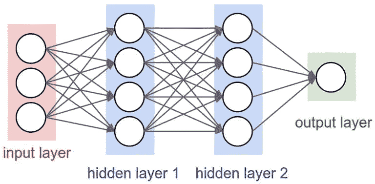
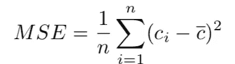
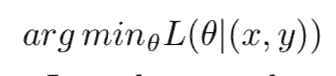
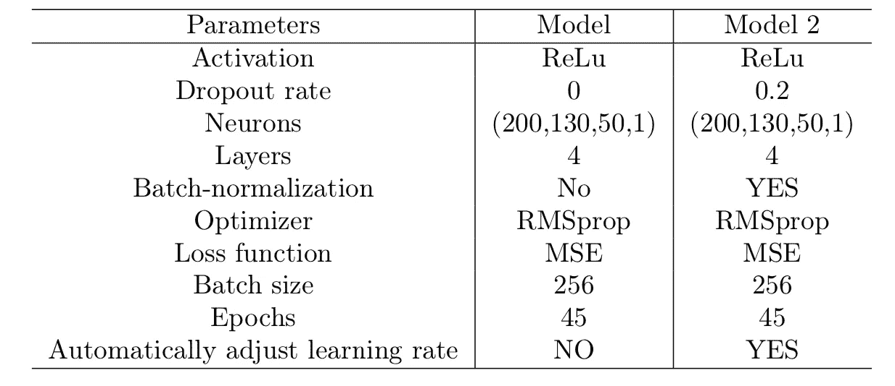
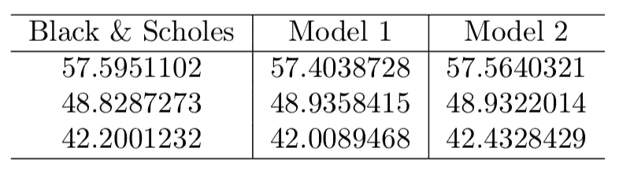
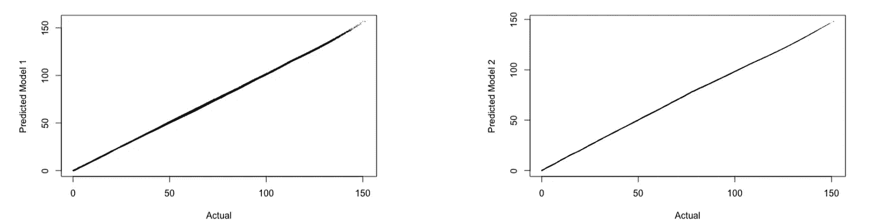
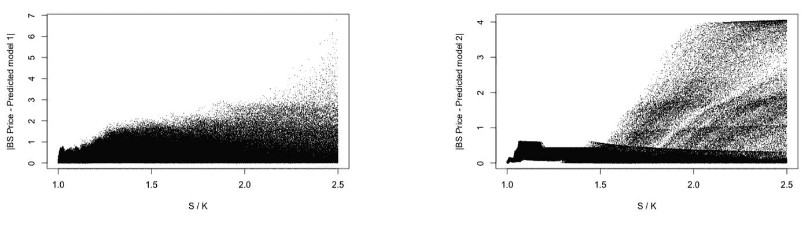

# 期权定价的神经网络

> 原文：<https://towardsdatascience.com/neural-networks-for-option-pricing-danielcotto-c24569ad0bb?source=collection_archive---------10----------------------->

## 金融中的人工神经网络

## 使用 R 在布莱克&斯科尔斯世界中学习


Photo by [Alina Grubnyak](https://unsplash.com/@alinnnaaaa?utm_source=medium&utm_medium=referral) on [Unsplash](https://unsplash.com?utm_source=medium&utm_medium=referral)

本文只是将深度学习应用于期权定价的一种尝试。特别是，主要目标是展示人工神经网络从数据集“学习”模型的能力。

具有多个隐藏层的人工神经网络(ann)已经成为从大数据集检测模式的成功方法。人工神经网络实现通常可以分解为两个独立的阶段:训练部分和测试部分。在训练阶段，人工神经网络从数据集“学习”模型，而在测试阶段，经过训练的人工神经网络可用于预测结果



该架构是由定义数量的神经元组成的不同层的组合。将前一层的神经元与后一层的神经元连接起来，可以使用来自前一步的输出信号作为下一层的输入信号。

激活函数ψ()增加了系统的非线性。虽然有许多函数，但为了本节的目的，我将只使用 ReLu 函数，定义如下:


为了评估性能，均方误差(MSE)



训练过程试图学习最小化损失函数的最优权重和偏差



由于期权价格的历史数据相当昂贵，我决定模拟它们。

已经假设股票价格遵循 gBM 以获得足够数量的股票价格。因此，模拟价值必须有足够的执行价格、到期日、利率和波动性。

根据这些参数，通过布莱克-斯科尔斯公式计算出了欧式看涨期权的价格。因此，假设它处于布莱克-斯科尔斯世界，即模型的所有假设都得到满足。

```
#BS_closed formula: EU_call_bs = function(S, K, r, sigma,t=0, T){
  d1 = (log(S/K)+(r+((sigma)^2)/2)*(T-t))/(sigma*sqrt(T-t))
  d2 = d1-(sigma*sqrt(T-t))
  return((S*pnorm(d1))-(K*exp(-r*(T-t))*pnorm(d2)))
}#Generate Dataset
sample<-sde::GBM(x=100,N=1000000,r = r,sigma = 0.8,T = 1)mydata <- NULL
mydata$Stock <- sample
mydata$Strike <- sample*runif(length(sample),min = 0.4,max=1)
mydata$Time <- runif(n=length(sample))
mydata$sigma <- runif(n=length(sample), min = 0.1, max = 0.8)
mydata$r <-runif(n=length(sample),min = 0.01, max=0.05)
mydata$BS <-  EU_call_bs(S = mydata$Stock, t = 0, T = mydata$Time, 
r = mydata$r, K = mydata$Strike, sigma = as.numeric(mydata$sigma));
```

一旦数据集建立起来，它就被分成两个子集:训练集和测试集。人工神经网络已经在训练集上进行了训练，然后在测试数据集上进行了评估。

```
#Split datasetsplit <- rsample::initial_split(mydata, prop = .7, strata='BS' )train <- rsample::training(split)
test  <- rsample::testing(split)# Create & standardize feature sets
# training features
train_x <- train %>% dplyr::select(-BS)
mean    <- colMeans(train_x)
std     <- apply(train_x, 2, sd)
train_x <- scale(train_x, center = mean, scale = std)# testing features
test_x <- test %>% dplyr::select(-BS)
test_x <- scale(test_x, center = mean, scale = std)# Create & transform response sets
train_y <- log(train$BS)
test_y  <- log(test$BS)
```

下图显示了用于人工神经网络的超参数。



```
#MODEL 1
model_1 <- keras_model_sequential() %>%
  layer_dense(units =  200,activation = "relu", input_shape = ncol(train_x)) %>%
  layer_dense(units = 130,activation = "relu") %>%
  layer_dense(units = 50,activation = "relu") %>%
  layer_dense(units = 1)  %>%

  # backpropagation
  compile(
    optimizer = "rmsprop",
    loss = "mse",
    metrics = c("mae")
  )learn_1 <- model_1 %>% fit(
  x = train_x,
  y = train_y,
  epochs = 45,
  batch_size = 256,
  validation_split = .2,
  verbose = TRUE,
)#MODEL 2model_2 <- keras_model_sequential() %>%
  layer_dense(units =  200,activation = "relu", input_shape = ncol(train_x),kernel_regularizer = regularizer_l2(0.001)) %>%
  layer_batch_normalization() %>%
  layer_dropout(rate = 0.2) %>%
  layer_dense(units = 130,activation = "relu",kernel_regularizer = regularizer_l2(0.001)) %>%
  layer_batch_normalization() %>%
  layer_dropout(rate = 0.2) %>%
  layer_dense(units = 50,activation = "relu",kernel_regularizer = regularizer_l2(0.001)) %>%
  layer_batch_normalization() %>%
  layer_dropout(rate = 0.2) %>%
  layer_dense(units = 1)  %>%

  compile(
    optimizer = "rmsprop", #optimizer_adam(lr = 0.01) 
    loss = "mse",
    metrics = c("mae")
  )
learn_2 <- model_2 %>% fit(
  x = train_x,
  y = train_y,
  epochs = 45,
  batch_size = 256,
  validation_split = .2,
  verbose = TRUE,
  callbacks = list(
    #callback_early_stopping(patience = 10),
    callback_reduce_lr_on_plateau(patience = 5))
)
```

在预测阶段，结果与在训练阶段得到的结果差别不大。

```
#Storing Predictionrisultati <- NULLrisultati$predcted_values_model_1<- model_1 %>% predict(test_x)
risultati$true_value <- test_yrisultati$predcted_values_model_2<- model_2 %>% predict(test_x)risultati$pred_value_model_1_converted <- exp(risultati$predcted_values_model_1)risultati$true_converted <- exp(risultati$true_value)risultati$pred_value_model_2_converted <- exp(risultati$predcted_values_model_2)risultati$S_K <- test[,1] / test[,2]risultati$Err_model_1 <- abs(risultati$true_converted - risultati$pred_value_model_1_converted )risultati$Err_model_2 <- abs(risultati$true_converted - risultati$pred_value_model_2_converted )
```

测试集前三行的预测结果是:



下面的图是两个模型的每个选项的实际价格与预测价格，产生了一条偏差很小的窄线。

```
plot(x=risultati$true_converted, y=risultati$pred_value_model_1_converted , cex= 0.001, xlab='Actual', ylab='Predicted Model 1')plot(x=risultati$true_converted, y=risultati$pred_value_model_2_converted , cex= 0.001, xlab='Actual', ylab='Predicted Model 2')
```



为了更好地查看结果，模型产生的绝对误差如下图所示。有趣的是，随着 S/K 的增加，两个模型有不同的行为。

```
plot(x=risultati$S_K, risultati$Err_model_1, xlab='S / K', ylab='|BS Price - Predicted model 1|',cex=0.01)plot(x=risultati$S_K, risultati$Err_model_2, xlab='S / K', ylab='|BS Price - Predicted model 2|',cex=0.01)
```



对模型进行更深入的分析并对参数进行微调肯定会改善结果。总的来说，在 Black & Scholes 世界中，人工神经网络提供了一种计算欧式衍生产品的好方法。

> 所有的模型都是错误的，但有些是有用的。
> 
> 乔治·博克斯，1978 年

[1] R.Kristiansson，[奇异衍生品与深度学习](https://www.math.kth.se/matstat/seminarier/reports/M-exjobb18/180525c.pdf) (2019)，KTH 皇家理工学院工程科学学院

[2]刘帅强，Cornelis W. Oosterlee，Sander M.Bohte，(2018)

[3] Robert Culkin，Sanjiv R. Das，[金融中的机器学习:期权定价的深度学习案例](https://www.joim.com/article/machine-learning-in-finance-the-case-of-deep-learning-for-option-pricing/) (2017)

[4]雅各布·迈克尔逊·孔林德、约翰·哈里斯和凯罗尔·普日拜特科夫斯基，[使用机器学习对期权进行套期保值和定价](http://cs229.stanford.edu/proj2009/KolindHarrisPrzybytkowski.pdf) (2009)

[5] D.Stafford，[期权定价中的机器学习](http://jultika.oulu.fi/files/nbnfioulu-201901091016.pdf) (2018)，奥卢大学