# 神经网络|基础

> 原文：<https://towardsdatascience.com/neural-networks-fundamentals-1b4c46e7dbfe?source=collection_archive---------7----------------------->

## 在这篇文章中，我将试图强调一些与人工神经网络相关的基础知识和基本概念。

Source: [Liu Zishan](https://www.shutterstock.com/g/Liu+zishan)

# 定义

**人工神经网络(ANN)** 是一系列算法，旨在通过模拟人脑运作方式的过程来识别一组数据中的潜在关系。这种系统通过分析例子来“学习”执行任务，通常不需要用特定于任务的规则来编程。

# 全球建筑

神经网络分为不同的层次:

*   **输入层**:输入层神经元接收应该解释待分析问题的信息；
*   **隐藏层**:隐藏层是一个中间层，允许神经网络模拟非线性现象。这被说成是“隐藏的”，因为没有与外界的直接联系。每个隐含层的输出是下一层单元的输入；
*   **输出层**:输出层是网络的最后一层；它产生了结果，预测。

# 感知器

感知器是第一个也是最简单的神经网络模型，是人工智能领域著名的心理学家 Frank Rosenblatt 在 1957 年发明的监督学习算法。

这个网络之所以简单，是因为它只有两层:一个输入层和一个输出层。这种结构只涉及一个权重矩阵，输入层的所有单元都连接到输出层的。

感知器是用于二元预测的线性分类器，换句话说，它可以将数据分类或分成两类。

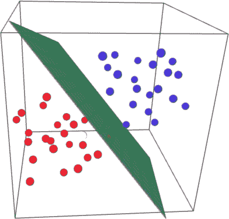

3D representation of linearly separable data

**感知器操作**

首先，简单感知器取 *n 个*输入值( *x1* ， *x2* ，…， *xn* )，同样由 *n+1* 常量定义:

*   *n* 突触系数(或权重: *w1* ， *w2* ，…，*wn*)；
*   偏置:激活函数等于 1 的神经元。像其他神经元一样，偏差通过一个权重(通常称为阈值)将其自身连接到上一层神经元。

然后，每个输入值必须乘以其各自的权重(*至*)，并且这些乘积的结果必须相加，以获得**加权和。**然后，神经元将生成两个可能值中的一个，这由总和的结果低于或高于阈值 *θ* 这一事实来确定。

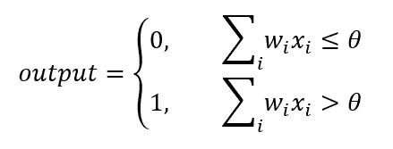

加权和可以转化为两个向量 *w* (权重)和 *x* (输入)的点积，其中 *w⋅ x* = ∑ *wixi* ，那么不等式可以通过将 *θ* (阈值)移到另一边来解决。

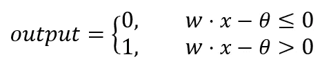

此外，请记住，偏差就像一个神经元，其中的激活函数等于 1，因此这最后一个与其权重(阈值)的乘积意味着阈值乘以 1。因此，常用的符号包括用变量 *b* (用于偏置)代替阈值，其中*b*=*θ*。

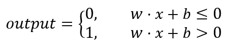

完成所有这些步骤会产生以下架构:

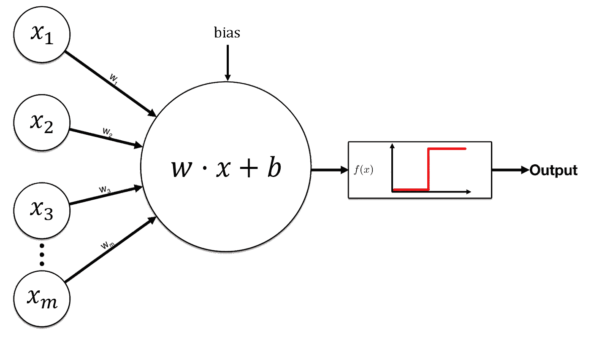

Schematic representation of the simple perceptron

一旦获得加权和，有必要应用一个**激活函数。**简单的感知器使用 Heaviside 阶跃函数将结果值转换为二进制输出，将输入值分类为 0 或 1。

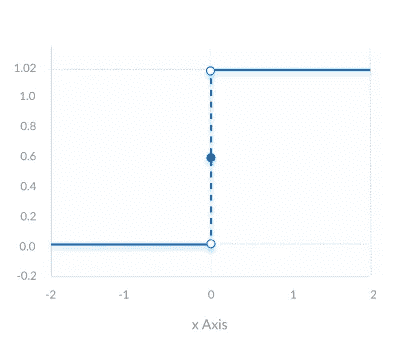

Graphical representation of the Heaviside step function

Heaviside 阶跃函数在输入数据可线性分离的分类任务中特别有用。

# 多层感知器

多层感知器(MLP)由一个输入层、一个输出层和一个或多个隐藏层组成。所以，它不再是简单感知器那样的神经网络，而是复数形式的**神经网络**。如果 MLP 有 *n* 层，那么它有 *n-1* 个权重矩阵。

理论上，向隐藏层添加足够数量的神经元可能足以逼近任何非线性函数。

**多层感知器架构:**

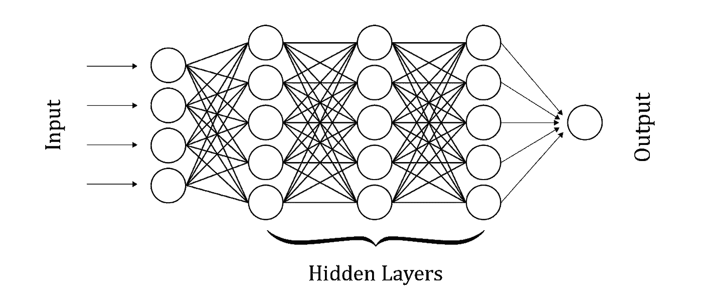

Graphical representation of the Multi-Layer Perceptron

神经网络在将所有输入传递到所有层(直到输出层)后生成预测。这个过程称为**正向传播。**

神经网络的工作方式与感知器相同。所以，为了理解神经网络，必须理解感知机！

# 激活功能

激活函数，也称为传递函数，是神经网络的重要组成部分。除了将非线性概念引入网络之外，**旨在将进入一个单元(神经元)的信号转换成输出信号(响应)。**

该函数的名称来自其生物学等价物“动作电位”:**一旦达到，就会导致神经元反应的兴奋阈值。**

值得注意的是，由于偏置，有可能将激活函数曲线上移或下移**、**，这意味着网络有更大的学习机会。

激活函数有两种:**线性和非线性。**

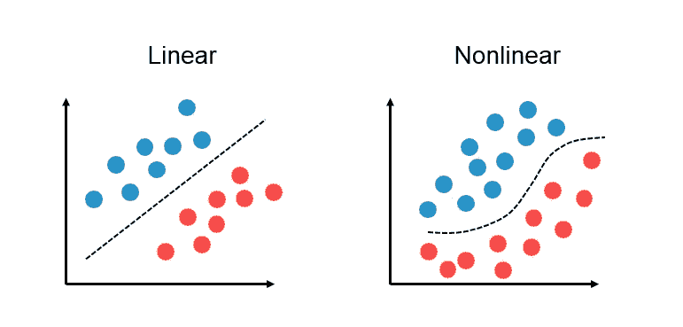

## 线性激活函数

这是一个简单的函数，其形式为: *f(x) = x* 。输入经过很少或没有修改就传递到输出。这完全是一个相称的问题。

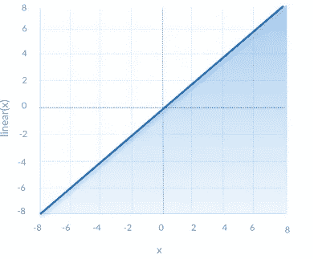

Graphical representation of a linear function

## 非线性激活函数

非线性函数是最常用的，它可以分离不可线性分离的数据。非线性方程决定了输入和输出之间的对应关系。

**主要非线性函数:**

*   **乙状结肠:**

sigmoid 函数(或逻辑函数)是一条“S”曲线，它产生 0 到 1 之间的输出，用概率表示。

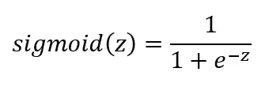

Sigmoid function definition

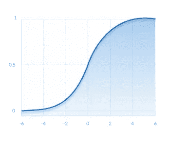

Graphical representation of the sigmoid function

作为一个“更平滑”的版本，它优于 Heaviside 阶跃函数，但并非没有缺陷。事实上，sigmoid 函数不是以零为中心的，因此负输入可能会产生正输出。此外，它对神经元的影响相对较低，结果通常非常接近 0 或 1，因此它会导致其中一些神经元饱和。最后，指数函数使得该过程作为计算是昂贵的。

*   **双曲正切值:**

双曲正切像前一个一样是一个 s 形函数；然而，由于其对称性，它通常比逻辑函数产生更好的结果。实际上，区别在于 TanH 函数的结果映射在-1 和 1 之间。它通常优于 Sigmoid 函数，因为它以零为中心。这个函数非常适合多层感知器，尤其是隐藏层。

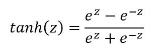

Hyperbolic tangent definition

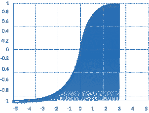

Graphical representation of the TanH function

除此之外，双曲正切函数也有与 Sigmoid 函数相同的缺点。

*   **整流线性单元(ReLU) :**

ReLU 函数有助于解决上述函数的饱和问题。它是最常用的。

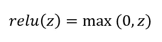

ReLU function definition

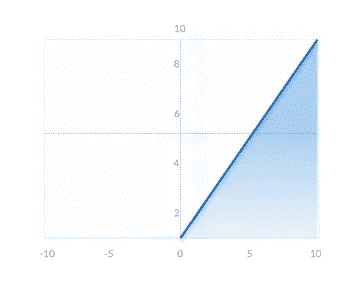

Graphical representation of the ReLU function

如果输入为负，则输出为 0，而如果输入为正，则输出为 *z* 。该激活函数显著增加了网络收敛，并且不会饱和。

但是，ReLU 函数也并不完美。如果输入值为负，神经元可能保持不活动，因此权重不会更新，网络不再学习。

## 为什么需要这个激活功能？

没有非线性激活函数，人工神经网络无论有多少层，都将表现为简单的感知器，因为对其层求和只会产生另一个线性函数。

## 应该使用哪个函数？

是回归还是分类问题？第一种情况，是二元分类情况吗？最终，没有更好的激活函数，**这取决于要处理的任务。**

# 价值函数

为了学习，感知机必须知道它犯了一个错误，以及它应该给出的答案。这是监督学习。为此，需要使用一个成本函数，其目的是计算误差，换句话说，量化预测 *y_hat* 和期望值 *y* 之间的差距。因此，有必要最小化成本函数，直到最优:**这是神经网络训练。**

为了定义成本函数 *J* ，可以使用均方误差:

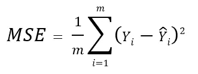

Mean squared error (MSE)

其中:

*   *m* 是训练样本数；
*   *y* 是期望值；
*   *y_hat* 是预测值。

一旦对预测值和期望值进行了比较，信息必须返回到神经网络，因此它返回到突触并更新权重。这不多也不少于前面提到的正向传播的反向路径。它被称为**反向传播。**

如前所述，**机器学习算法的目的是找到一个权重组合，以便最小化成本函数**

> **延伸阅读:**

 [## 理解神经网络中的激活函数

### 最近，我的一个同事问了我几个类似“为什么我们有这么多激活功能？”，“为什么是…

medium.com](https://medium.com/the-theory-of-everything/understanding-activation-functions-in-neural-networks-9491262884e0) 

# 梯度下降

在拥有更多权重从而拥有高维空间的情况下，就出现了一个问题:**维度的诅咒。像蛮力这样幼稚的方法不能再用了。因此，有必要使用可行的方法来计算成本函数:**梯度下降**，**，**最流行的算法之一来执行优化。**

让我们假设成本函数 *J* 是凸的:

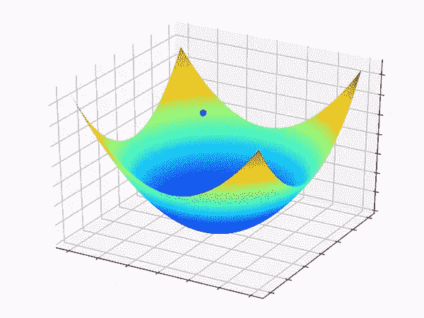

Tridimensional representation of a convex function

横轴代表参数、权重和偏差的空间，而代价函数 *J* 是横轴上方的**误差面**。蓝色圆圈是初始成本值。剩下的就是往下走，但是从这里走哪条路最好呢？

要回答这个问题，必须改变一些参数，即权重和偏差。然后，它将涉及成本函数的梯度，因为梯度向量将自然地指示最陡的斜率。**输入值是固定的，这一点很重要，因此权重(和偏差)是唯一可以控制的调整变量。**

现在，想象一个球被扔进一个圆形的桶里(凸函数)，它必须到达桶的底部。**这就是优化。**在梯度下降的情况下，它必须从左向右移动，以优化其位置。

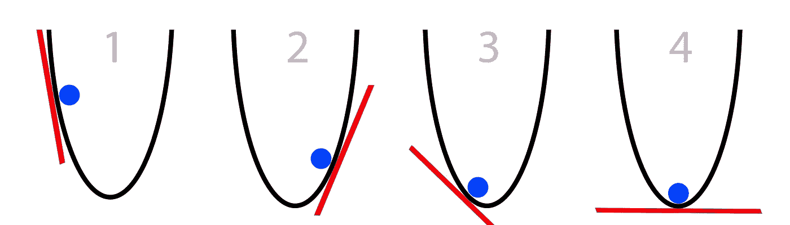

从一个初始位置开始，观察倾斜角，以便画出该点的切线:这意味着计算导数。如果斜率是负的，球向右，如果斜率是正的，球向左。

但是缺少了一些东西，至少因为它是一个超参数:**学习率( *α* )。**坡度表示要走的方向，但并没有告诉球在那个方向应该走多远。**这就是学习率的作用，它决定了每一步达到最小值的大小。**

综上所述，梯度下降可定义如下:

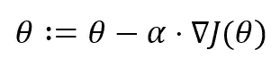

Canonical formula for gradient descent

其中:

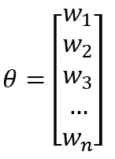

*   *θ* 是模型的参数(权重向量)；

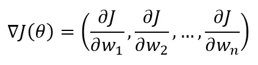

*   ∇ *J(θ)* 是代价函数 *J* 的梯度，换句话说，这是包含每一个偏导数的向量。我们将通过对函数求导一次得到它；
*   *α* 是的学习速率(步长)，设定在学习过程之前。

学习率的选择仍然是一个开放性的问题，对于给定数据集上的给定模型，最优值无法通过分析计算得到。相反，足够好的学习率必须通过反复试验来发现，但是要注意，它必须随着时间的推移而降低。

为学习速率选择正确的值很重要，因为它一方面会影响学习速度，另一方面会影响找到局部最优(收敛)的机会。如果选择不当，该值可能会导致预测模型性能不佳的两个主要原因:

*   **过拟合**:算法很好地适应了训练数据集，在现实中太好了，这是一个问题，因为它将不再能够概括数据。随着学习率的提高，每一步可以走更远的距离，但是会有超过最低点的风险，因为斜率是不断变化的。简单来说，损失函数在最小值附近波动，甚至可能发散；
*   设定一个非常低的学习率可以让你自信地走向负梯度。较低的 *α* 更精确，但是计算斜率需要很多时间，并且导致收敛速度非常慢。

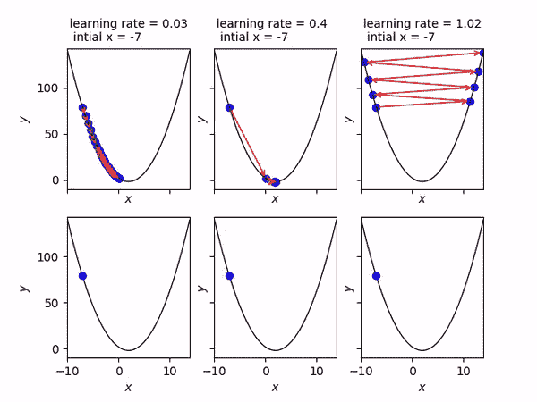

Left: α too small; Middle: decent α; Right: α too big.

有了好的学习率，经过几次迭代，应该会找到一个合适的最小值，然后球就再也下不去了。

最后，确定优化网络的最佳权重。

这就是梯度下降的全部内容:**了解每个权重在网络总误差中的贡献，从而收敛到优化的权重配置。**

## 随机梯度下降

然而，还有一个问题:**梯度下降需要成本函数是凸的。**换句话说，曲线完全在它的每条切线之上，并且这样一个函数的导数在其区间上增加。如前所述，它采用以下形式:∨。但是一个非凸的函数呢？

这一次，让我们假设成本函数 *J* 是非凸的:

Tridimensional representation of a non-convex function

在这种情况下，采取最陡的坡度是不够的。误差表面在视觉上变得更加复杂，难以理解，并且具有特定的特征，例如**局部最小值**和可能的**鞍点。**

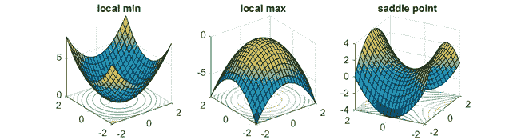

因此，风险是导致一些迭代算法的阻塞，大大减慢反向传播，并且**落在不是最小整体值(全局最小值)的位置上。**

为了克服这个问题，可以使用**随机梯度下降(SGD)。**

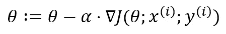

Mathematical formula for SGD

除了外观，这一个更快。它提供了更多的权重波动，这增加了检测到全局最小值而不停留在局部最小值的机会。

事实上，没有必要测试并在内存中加载整个数据集以仅在最后调整权重。**随机梯度下降将在每次迭代后完成，使得该过程作为计算变得更轻。**此外，**标准(或批次)梯度下降是确定性的:**如果起始条件(权重)始终相同，那么结果也将始终相同。

> **进一步阅读:**

 [## AI 笔记:神经网络中的参数优化- deeplearning.ai

### 在机器学习中，你从定义一个任务和一个模型开始。该模型由架构和参数组成…

www.deeplearning.ai](http://www.deeplearning.ai/ai-notes/optimization/)  [## 理解梯度下降背后的数学。

### 机器学习中一种常用优化算法背后的简单数学直觉。

towardsdatascience.com](/understanding-the-mathematics-behind-gradient-descent-dde5dc9be06e) 

# 神经网络训练

1.  用接近(但不同于)0 的值初始化权重；
2.  发送输入层中的第一个观察值，每个神经元一个变量；
3.  正向传播:神经元被激活的方式取决于它们被赋予的权重。传播激活直到获得 *y_hat* 预测；
4.  将预测值与期望值进行比较，用代价函数度量误差；
5.  反向传播:错误在网络中再次传播。根据它们在误差中的责任更新权重，调整学习率；
6.  重复步骤 1 至 5，并在每次观察后调整权重，或者在一批观察后调整权重(批量学习)；
7.  当所有的数据集都通过了神经网络，它被称为一个时期。重复更多的时代。

> **延伸阅读:**

 [## AI 笔记:初始化神经网络- deeplearning.ai

### 为了建立一个机器学习算法，通常你要定义一个架构(例如，逻辑回归，支持向量…

www.deeplearning.ai](http://www.deeplearning.ai/ai-notes/initialization/) 

# 关键要点

*   感知器是第一个也是最简单的人工神经网络模型。人工神经网络以同样的方式工作；
*   神经网络由一个输入层、一个或多个隐藏层以及最后一个输出层组成；
*   输入值是固定的，突触系数(权重)和偏差是唯一可以控制的参数；
*   神经网络的层数越多，就越深，但将它们相乘可能会适得其反；
*   还有其他类型的人工神经网络，仅举几个例子，例如卷积神经网络(CNN 或 ConvNet)或递归神经网络(RNN)；
*   成本函数用于量化预测值和期望值之间的差距。由于权重的优化组合(神经网络训练)，这必须被最小化；
*   梯度下降是一种优化算法，也是迄今为止训练神经网络最常用的方法；
*   知道方向和该方向上每一步的大小(学习率)是执行梯度下降的关键。最后一个必须仔细设置；
*   过拟合和欠拟合是预测模型性能差的两个主要原因。

# 更多资源:

## 课程

*   [deeplearning.ai](https://www.deeplearning.ai/) ，吴恩达入门深度学习课程；
*   [CS231n:用于视觉识别的卷积神经网络](http://cs231n.stanford.edu/syllabus.html)，斯坦福的深度学习课程；
*   [fast.ai](https://www.fast.ai/) ，动手项目课程。

## 阅读

*   [深度学习](http://www.deeplearningbook.org/)，这本书的在线版本被广泛认为是深度学习的“圣经”，作者是伊恩·古德菲勒、约舒阿·本吉奥和亚伦·库维尔；
*   [神经网络和深度学习](http://neuralnetworksanddeeplearning.com/chap1.html)，迈克尔·尼尔森的免费、清晰、易懂的教材；
*   [深度学习论文阅读路线图](https://github.com/songrotek/Deep-Learning-Papers-Reading-Roadmap)，按时间顺序和研究领域组织的关键论文汇编。