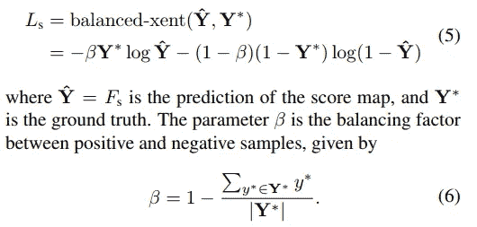

# 神经网络直觉:1。平衡交叉熵

> 原文：<https://towardsdatascience.com/neural-networks-intuitions-1-balanced-cross-entropy-331995cd5033?source=collection_archive---------15----------------------->

大家好！

这是我的第一篇媒体博客。创建这个系列的目的是为了更好地理解从神经网络的基础到损失函数、神经网络架构等等(不需要深入研究数学)。自从我开始深度学习生涯以来，我一直觉得在模型工程期间或解决问题/调试神经网络时，形成直觉对取得进展有很大帮助。这一系列博客文章(我希望以后继续)的主要目的是让**洞察**正在发生的事情**，即使其中的数学部分很难理解。**

PS:我也希望向你们学习:-)

**问题:**在解释什么是平衡交叉熵之前，让我们考虑一个物体(在我们的例子中是**正文**)检测问题。众所周知的文本检测架构是 **DenseBox** 和它著名的实现 **EAST:一个高效准确的场景文本检测器。** DenseBox 接收输入场景图像并输出激活图(二进制或灰色),其中激活图中的白色区域表示文本区域，黑色或灰色区域表示背景。所以基本上有两类(文本和背景)并且使用的损失函数是**二进制交叉熵**。因为很明显，在任何给定的文本检测数据集中背景类实例的数量通常多于文本类实例的数量，所以训练神经网络可能使其偏向于输出更多的背景类而不是文本类。所以使用二元交叉熵，或者其他损失函数是行不通的。

> 我说的“照原样使用二元交叉熵或任何其他损失函数都行不通”是什么意思？

任何深度学习实践者都很清楚这样一个事实，即类不平衡会影响神经网络的性能。类别不平衡的问题可以通过在训练数据中添加不太占优势的类别的更多实例来解决。我不打算深究这个问题，因为有几种方法可以解决阶级不平衡的问题。

> 有没有什么优雅的方法可以在不修改数据集的情况下解决类不平衡的问题？

解决这个问题的一个方法是调整损失函数，就像 DenseBox 论文中所做的那样。

**解决方案:**

平衡交叉熵:

* as mentioned in EAST paper

看着上面的方程，我们可以很好地发现二元交叉熵和平衡交叉熵之间的区别。它是变量 **β** 。

> 那么 **β** 意味着什么呢？

β =阴性样本数/样本总数。换句话说，β是样本的**部分，它在数据集中占优势**。1 — β表示另一类的**分数(明显！).**

> **β** 如何帮助解决阶级失衡问题？

由于乘以 Y = 0 的项(1 — β)，损失评估为一个非常小的值，从而导致**小于**(当β接近 0 时，例如 0.1，0.2)或**没有**(当β为 0 时)**学习。**正类的分数越小，Y=0 时的损失值越小。

请注意，在这种情况下，负类(Y=0)比正类(Y=1)更大。

*简单来说，你* ***将损失函数中对应于主导类的部分乘以一个较小的值*** *，即乘以次主导类的分数。这使得损失值非常小(当数据集中只有一个类时甚至为零)，因此神经网络权重不会经常调整为输出主导类。*

上述等式也适用于数据集中正类(Y=1)占优势的情况。在这种情况下，将 Y * log Yˆ乘以 1 — β，可以比实际情况进一步降低损耗。请注意，乘以 **β或 1- β** 取决于您选择的 **β** 是什么。

这是我对平衡交叉熵的理解，以及它如何帮助解决类不平衡的问题。请随意指出我博客中的任何错误，或者我对此的直觉是错误的。

干杯:-)