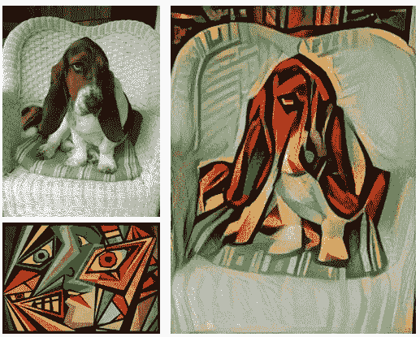
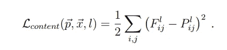
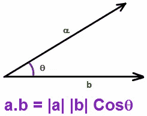
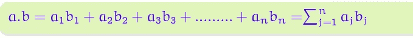
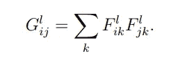
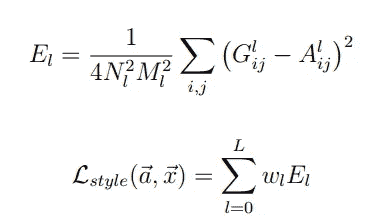
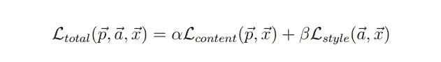
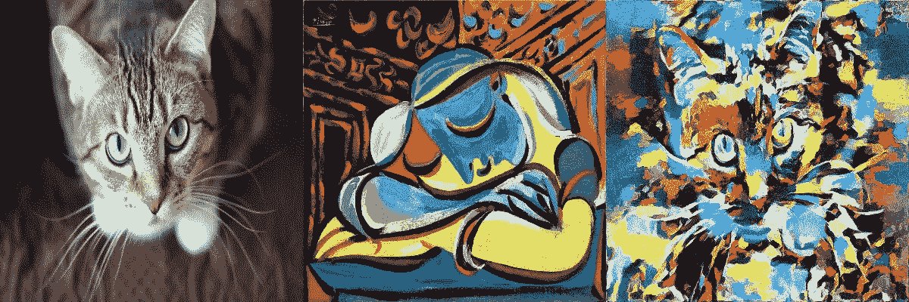
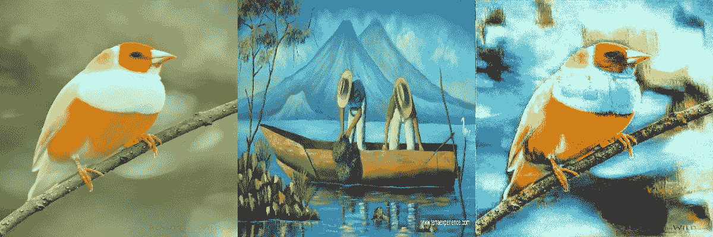
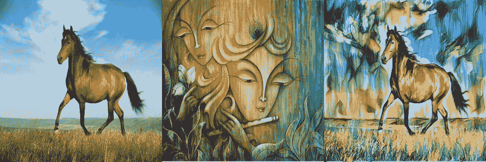

# 神经网络直觉:2。点积、Gram 矩阵和神经风格转移

> 原文：<https://towardsdatascience.com/neural-networks-intuitions-2-dot-product-gram-matrix-and-neural-style-transfer-5d39653e7916?source=collection_archive---------6----------------------->

大家好！

今天我们要来看看已经用神经网络解决的一个有趣的问题— **“图像风格转换”**。问题是获取两幅图像，从一幅图像中提取内容，从另一幅图像中提取风格(纹理),并将它们无缝地合并成一幅看起来真实的最终图像。这篇博文是对Gatys 等人的文章*一种艺术风格的神经算法*的解释。艾尔([https://arxiv.org/abs/1508.06576](https://arxiv.org/abs/1508.06576))

让我们看一个例子来说明问题。

**Top left** is the **content** image, **bottom left** is the **style** image, **result** is the one on the **right**

有趣吧？下面我们来看看如何解决。

**概述:**让我简单介绍一下该解决方案

1.  创建随机输入图像
2.  通过一个预先训练好的主干架构传递输入，比如 VGG、雷斯内特(注意，在反向传播过程中不会训练这个主干)。
3.  计算损失并计算相对于输入图像像素的**梯度。**因此，仅调整输入像素，而权重保持不变。

目的是改变输入图像，使其代表各个图像的内容和风格。

这个问题由两个子问题组成:1 .生成内容和 2。来生成样式。

**问题— 1。生成内容:**问题是生成一个包含内容图像中的内容的图像。

> 这里需要注意的一点是，图像应该只包含内容(就像内容图像的草图一样，而不是来自内容图像的纹理，因为输出应该包含与样式图像相同的样式)

**解决方案:**答案应该很简单。使用输入和目标之间的 MSE 损失(或任何相似性度量，如 SSIM，PSNR)。但是这里的目标是什么呢？如果对输出的风格没有限制，那么输入和内容图像之间的 MSE 就足够了。那么如何在不复制图片风格的情况下获取图片的内容呢？

使用**特征地图。**

卷积特征图通常是输入图像特征的非常好的表示。它们捕捉图像的空间信息，而不包含样式信息(如果按原样使用特征地图)，这正是我们需要的。这就是我们在反向传播过程中保持主干权重固定的原因。

> 因此，**输入图像特征和内容图像特征之间的 MSE 损失**将起作用！

Content Loss

Backbone used is vgg16_bn

使用早期 conv 图层的要素地图可以更好地表现内容，因为它们更接近输入，因此使用 conv2、conv4 和 conv7 的要素。

SaveFeatures is used to save the activations of conv layers(for content/style/input) during a forward pass

MSE between input and content features

**问题— 2。生成样式:**问题是生成一个包含样式图像中样式的图像。

**解决方案:**为了提取一幅图像的风格(或者更具体地说，为了计算风格损失)，我们需要一种叫做格拉姆矩阵的东西。等等，什么是克矩阵？

在谈论如何计算风格损失之前，让我先谈谈一些数学基础。

**点积:**

两个向量的点积可以写成:

(a)

或者

(b)

两个向量的点积是各自坐标乘积的和。

用 *3blue1brown* 的话说，**“*点积可以看做是向量 a 在向量 b 上的投影长度乘以向量 b 的长度”。***

或者用*可汗学园的话来说，* ***“可以看做与向量 b 同向的向量 a 的长度乘以向量 b 的长度”。***

图(a)中的术语 *|a|cos θ* (重新排列为 *|b||a|cos θ* )本质上是邻边的长度(或**投影向量‘a’如 3blue1brown 中的，**)，因此它归结为邻边乘以向量 b 的长度的乘积

> 那么这意味着什么呢？

用更直观的方式来说， ***点积可以看做两个向量实际上是多么相似*** 。它们越相似，它们之间的角度就越小，如图(a)所示，或者各自的坐标就越接近，如图(b)所示。在这两种情况下，结果都很大。所以它们越相似，点积就越大。

但是这和神经网络有什么关系呢？

> 考虑表示输入空间特征的两个向量(**更具体地，来自深度为 C** 的卷积特征图的 2 个展平特征向量)，它们的点积给我们提供了关于它们之间关系的信息。乘积越小，学习的特征越不同，乘积越大，特征越相关。换句话说，乘积越小，**两个特征同时出现的次数越少，**乘积越大，**它们同时出现的次数越多。**这在某种意义上给出了关于图像风格(纹理)的信息，而没有给出关于其空间结构的信息，因为我们已经展平了特征并在其上执行了点积。

现在从深度为 C 的卷积特征图中取出所有的 **C** 特征向量(展平的),并计算它们中每一个的点积(包括特征向量本身)。结果是**克矩阵**(大小为 CxC)。

Gram matrix

这就对了。

> 计算输入的 gram 矩阵和样式图像之间的 MSE 损失，就可以生成所需样式的输入图像了。

Summing MSE of Gram matrices for all layers, normalizing and computing a weighted sum in the end

Saving feature maps for style image

考虑从几个卷积层(在实验中)提取风格信息的特征图总是更好的。在上述代码中，使用了卷积层 2、4、7、10 和 13。

Computing gram matrix and style loss

最后，**在反向传播**之前将内容和样式损失相加，以获得输出图像，该输出图像具有来自内容图像的内容和来自样式图像的样式。

当损失处于不同的范围时，两种损失的正常总和可能不起作用。因此，内容和风格损失的加权总和应该是可行的。

Total loss

compute weighted sum of both losses and then backprop

注意，输入图像可以是任意随机张量**，其值与内容和样式图像的范围**相同。

我实施的一些结果:

查看我的 github repo[*https://github . com/mailcorahul/deep _ learning/tree/master/papers/Neural _ Style _ Transfer*](https://github.com/mailcorahul/deep_learning/tree/master/papers/neural_style_transfer)，了解 pytorch 实现的论文*Gatys 等人使用卷积神经网络进行图像样式转换。艾尔。*

干杯-:)