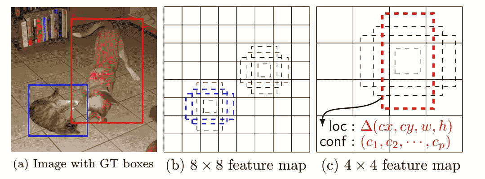
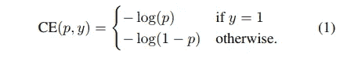
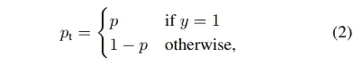
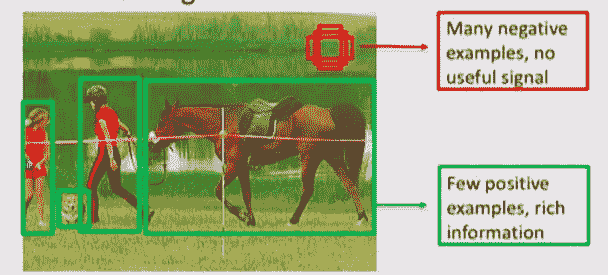
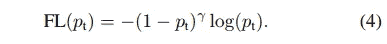
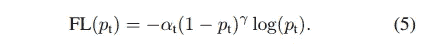
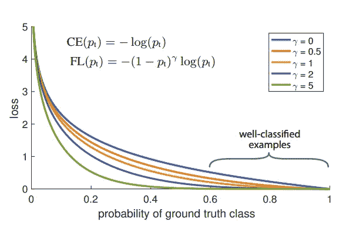
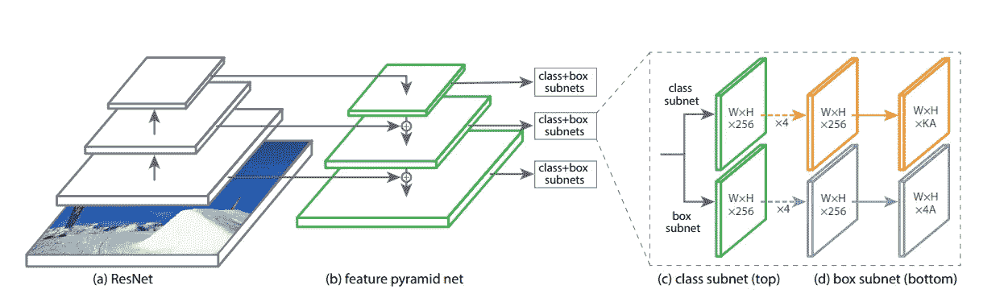

# 神经网络直觉:3。密集物体探测的焦点损失—论文解释

> 原文：<https://towardsdatascience.com/neural-networks-intuitions-3-focal-loss-for-dense-object-detection-paper-explanation-61bc0205114e?source=collection_archive---------2----------------------->

嘿大家好！

今天，在神经网络直觉系列中，我将讨论 **RetinaNet:密集物体检测的焦点损失**论文。本文讨论了 RetinaNet，它是一种单次目标检测器，与其他两级检测器相比速度更快，并且还解决了所有单次目标检测器的一个共同问题——单次目标检测器不如两级目标检测器精确。

论文链接:[密集物体探测的焦损失](https://arxiv.org/abs/1708.02002)

那么 RetinaNet 如何解决所有单次检测器普遍存在的不准确问题呢？像往常一样，让我们深入探讨一下单次检测器的核心问题，看看 RetinaNet 与其他的有何不同:-)。

> 问题:单次目标检测器不如两级目标检测器精确。

我们来看看为什么上面的说法是真的。

在传统的两级对象检测器中，**第一级**接收输入图像并输出**区域建议**，即对象可能存在的位置，并且**第二级**涉及**将每个建议分类到哪个类别**。这意味着两级检测器中的分类头通常接收包含更多肯定类别(即相关对象)的建议，并且所提供的否定(背景)样本的数量相对较少(或者在理想情况下甚至可能为零)。因此，分类头不会偏向负面(或背景)类别。这是至关重要的，因为神经网络有这种倾向，偏向于更经常显示给它们的类。

> **第一阶段**接收输入图像并输出**区域建议**即物体可能存在的位置，并且**第二阶段**涉及**将每个建议分类到哪个类别。**

现在让我们看看在单级检测器中发生了什么——单次检测器通常接收输入图像，并输出图像中存在的对象(类)及其相应的边界框坐标。

> 他们是如何在单镜头中输出班级分数和盒子坐标的？

单发探测器使用来自更快的 R-CNN 的**锚盒(或默认盒)**的概念。锚点是分配给特征图中每个单元的逻辑框，**相对于其进行边界框回归和分类**。它们可以有不同的纵横比(取决于我们手头的问题)。我不打算进入锚的细节。这里的关键是**不是用另一个神经网络(或任何算法)来生成区域建议，而是将特征图的整个网格视为区域建议**，该区域建议又由同一个神经网络分类以产生类分数和边界框偏移。

> 单发探测器与 fast-RCNN 中的区域建议网络(RPN)相同，除了 RPN 执行前景与背景分类，而单发探测器执行多类分类，即包括所有对象类和背景。

> 没错。我们现在知道了单触发探测器的工作原理，但是这个过程是如何影响它们的精度的呢？或者更准确地说，这如何使它们不如两级检测器精确？

单发检测器中分类头将特征图网格中存在的每个锚点视为其输入的区域提议集。

Default boxes(or anchors) as mentioned in [SSD: Single Shot MultiBox Detector](https://arxiv.org/abs/1512.02325)

> 与包含负面或背景类别的锚的数量相比，包含正面类别(相关对象)的锚的数量非常少(例如 1:1000)。因此，与正样本相比，分类器获得更多的负样本(或者更具体地说，更容易的训练样本)，从而导致更有偏向的学习。

> 如前所述，两级检测器通过级联分类器减少了背景样本的数量。

这就是为什么单级检测器的性能不如两级检测器的原因。请注意，这些准确性基准测试是使用 COCO 等标准对象检测数据集进行的。对于用户可能正在处理的其他自定义数据集，情况不一定如此。

> 在 [**SSD:单次多盒检测器**](https://arxiv.org/abs/1512.02325) 中，通过使用每个默认盒的**最高置信损失对负样本进行排序，并挑选顶部的样本**，从而使负样本和正样本之间的比率最多为 3:1，从而解决了这种类别不平衡问题。

现在让我们看看 RetinaNet 如何通过仅仅调整一个对象分类器的损失函数来以一种优雅的方式解决这个类不平衡的问题。

**解决方案:**本文的作者引入了一个称为**焦点损失**的损失函数，它对容易分类的例子(即我们案例中的背景)进行惩罚。

考虑用于分类的典型交叉熵损失

Cross entropy Loss

y ∈ {±1} specifies the ground-truth class and p ∈ [0, 1] is the model’s estimated probability for the class with label y = 1

这里要解决的问题是分类损失被来自“**简单背景**”示例的贡献淹没——如果一个示例不能很好地解释特定类的模式(或者几乎不能帮助区分该类和其他类),则该示例可以被称为简单

这种简单的例子被很好地分类，即概率> > 0.5，因此它们对损失的贡献非常小。但是如果这样的例子远远多于正面例子的数量呢？—阴性与阳性的比例为 10000:1。那么它对损失的贡献是巨大的，从而造成网络偏向背景类。

Focal loss

为了避免这些简单的例子对损失的贡献，1-它们的概率乘以它们的原始损失值，最终减少它们的损失。

> 因此，如果一个例子很容易分类，那么它的概率 p 将是> > 0.5(接近 0.9–1.0)，而 1-p(接近 0)导致 C.E .产生一个非常小的值，最终导致该例子的学习非常低或没有学习。γ项是聚焦参数，它调整简单示例的向下加权速率。

A Balanced C.E variant of Focal Loss is usually used

使用平衡交叉熵(看看我在本系列中的第一篇文章[和**调制因子(1pt)^γ**)的组合，因为它产生了更好的精度，如本文所述。](/neural-networks-intuitions-1-balanced-cross-entropy-331995cd5033)

看一下上图，它更直观地给出了如何通过使用调制因子来减少**良好/简单分类示例的损失。**

这里要注意的另一件重要事情是，它们显示了与 SSD 中使用的硬负挖掘相比，单独使用**焦损失如何产生更好的结果。**

**RetinaNet 架构:** RetinaNet 使用带有 Resnet 主干的功能金字塔网络(FPN)。FPN 包括在进行预测之前添加顶层要素地图及其下的要素地图。将顶层特征图与下面的特征图相加通常涉及放大顶层图，使用 1x1 conv 对下面的图进行维度匹配，并对两者进行元素相加。查看[用于对象检测的特征金字塔网络](https://arxiv.org/abs/1612.03144)论文，了解关于 FPN 的更多详细信息。

**训练视网膜网:**另一个更重要的方面是在开始训练之前初始化前景类的模型概率。**所有正面锚被分配 0.01** 的先验概率，以便它们对损失有更大的贡献，并确保大量负面例子不会妨碍初始阶段的训练。

这是我对密集物体探测的纸焦损失的解释。如果我的理解有漏洞，欢迎提问或指正。

干杯:-)