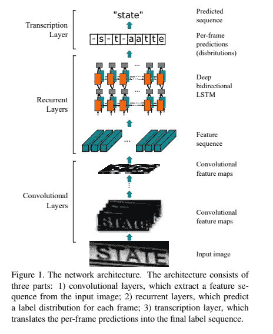
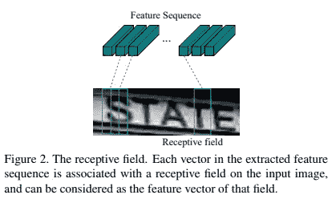
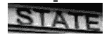
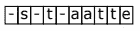
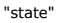
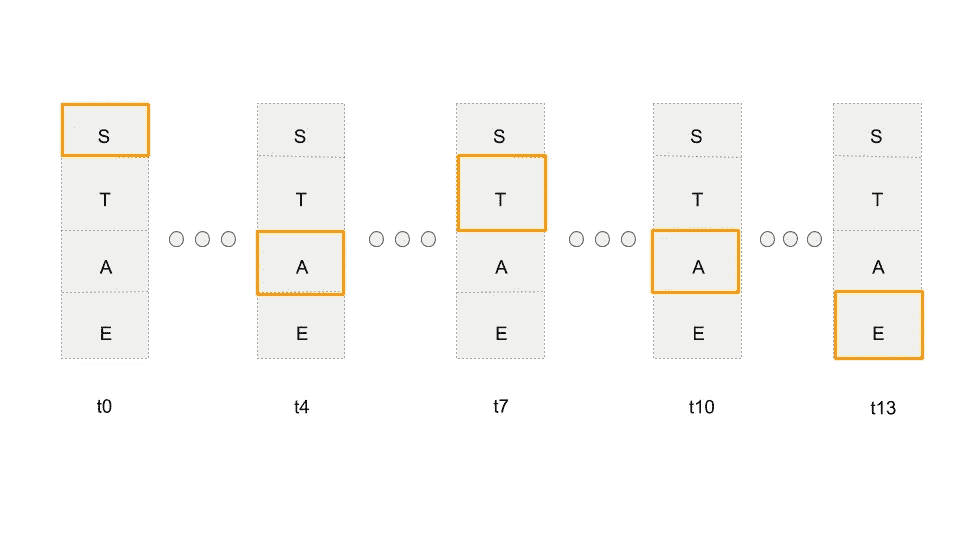
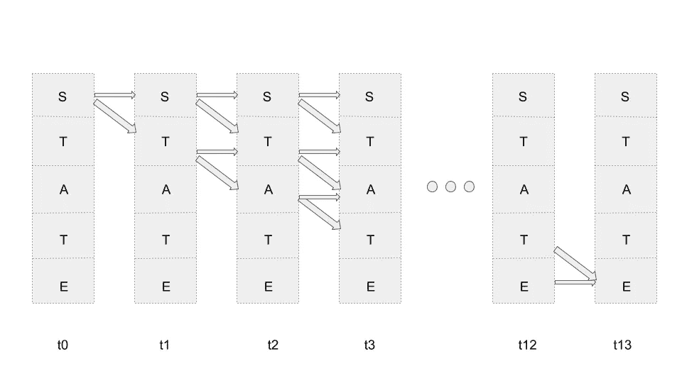
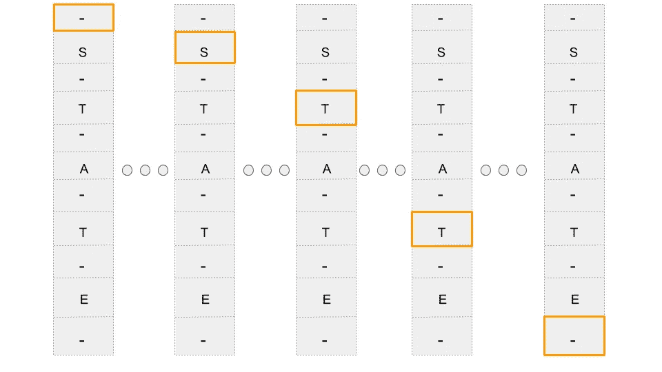

# 神经网络直觉:4。联结主义时间分类

> 原文：<https://towardsdatascience.com/neural-networks-intuitions-4-connectionist-temporal-classification-9bd042bdcb3a?source=collection_archive---------17----------------------->

乡亲们！

今天我要讲一个我花了很长时间(真的很长时间)才理解的话题，包括使用的动机和作用- *联结主义时间分类(CTC)* 。

在讲 *CTC* 之前，我们先来了解一下什么是序对序模型:-)

***序列对序列模型:*** 这些是神经网络，它们接受任何序列——字符、单词、图像像素，并给出输出序列，该输出序列可以与输入序列在同一域或不同域。

序列到序列模型的几个例子:

1.  ***语言翻译问题*** —其中输入是一种语言的单词序列(一个句子)，输出是另一种语言的单词序列。

3.  *****语音转文本问题—*** 其中输入是音频序列，输出是音素序列。**

***递归神经网络*通常用于此类*序列到序列*问题，因为网络不仅要考虑当前输入，还要考虑之前和之后的输入，以便进行预测。**

> **那么，序列到序列模型与连接主义时间分类(CTC)有什么关系呢？嗯，CTC 是一种算法，用于解决训练 seq-2-seq 模型时面临的一个关键问题，即当输入和输出序列的长度不匹配时的**。****

**让我深入一个我以前处理过的问题来揭开 CTC 的细节:-)**

*****单词识别* :** 问题是预测一幅图像中存在的单词。解决这一问题的一种方法是将其视为序列间问题，并使用卷积和递归神经网络的混合架构。CRNN 的架构如下:**

****

**An End-to-End Trainable Neural Network for Image-based Sequence Recognition and Its Application to Scene Text Recognition - Baoguang Shi et al.**

> **这里，输入序列是卷积特征图，输出将是字符序列。**

**为了更好地理解到底发生了什么，让我来解释一下流程:**

1.  **Conv 网接受输入单词图像，比如大小为 WxHx3，并产生卷积特征量，比如大小为 W/2×H/2×D，其中 D 是特征量的深度。**
2.  **现在，大小为 1 x H/2 x D 的每一列都作为输入(注意，有 W/2 个这样的列)提供给 RNN，后者又从词汇表集中产生一个字符作为输出。**
3.  **因此，CRNN 试图预测出现在特征图的每一列中的字符。请注意，一个列可能包含也可能不包含字符，这就是为什么多使用了一个输出标签—空白'-'(检查上图的输出)。**

****

**Baoguang Shi et al.**

> **有人可能会问，在图像的情况下，时间依赖性是什么。因为特征图是分开的，并且对每一列都进行预测，所以一个完整的字符不太可能落在一列中。因此，字符的模式学习不仅依赖于当前列，还依赖于它之前和之后的列。**

**让我们看一下 RNN 的输出，以便搞清楚。**

****

**1\. input image**

****

**2\. predicted sequence from RNN**

****

**3\. decoded output**

**注意，**解码输出(3)是通过折叠重复字符并从来自 RNN 的预测序列(2)中移除空白字符(如果有的话)而形成的。****

**为了清楚起见，让我先定义一些东西:**

**a. ***输入 _ 序列*** :长度为 **W/2** 的 ***输入*** 序列，反馈给 RNN。**

**b. ***预测 _ 序列***:RNN 输出的 ***预测输出*** 长度为 **W/2** 的序列。**

**c. ***目标 _ 序列:******地面实况输出*** 序列长度 **W/2。****

**d.***解码 _ 序列:******解码输出*** 序列的长度 **≤ W/2。****

**而训练这样一个网络，我们有的只是 **< 1。输入图像，请按 3。解码输出>** 对作为训练实例。但是神经网络给出*预测序列*作为输出，其长度不等于解码输出的长度。**

> **在计算损失时，长度为 W/2 的预测序列不能与长度≤ W/2 的解码序列进行比较。**

*   **注意:我们假设输入和预测序列是同步的。即顺序将是相同的。**

*****问题:*** 所以为了训练这个网，我们需要知道***target _ sequence***是什么。但是我们如何得到那个*目标序列*？我们当然不能注释长度为 W/2 的序列中的每个时间步长(那是不可能的！).**

*****解法:*** 使用合理的启发式猜测*目标 _ 序列*。是的，你没看错。对*目标 _ 序列*进行初步猜测。考虑上面的输入图像，该输入的解码输出是什么？**

> **解码输出→ **“状态”****

**假设*目标序列/预测序列*(即 RNN 的输出)的长度为 14。现在我们来猜猜 *target_sequence* 是**【SSSTTAAAATTEEE】**(后面再看*空白*字符)。**

> **假设我们有一个 target_sequence，我们可以在第一步使用该序列训练网络，然后使用网络的预测作为新的 target_sequence(用于下一步),并在训练期间反复迭代它——迭代和估计。**

**但是这里有一个关键问题。我们如何确保网络预测的*目标序列*在解码时给出我们想要的输出，在我们的例子中是**状态**？**

**如果 RNN 输出“ **RRRRAAAEEELLLL** ”会怎样？我们不能将该输出序列用作训练过程下一步的新*目标序列*。因此，我们需要对 RNN 预测的序列施加一些限制。**

*****约束 1:*** 不考虑整个词汇(字母 A 到 Z)的预测，只考虑作为解码输出一部分的字母。**

**在我们的例子中，字母 T，A，E 是解码输出“状态”的一部分。**

****

**Considering only target alphabets. Most probable character for a given timestep is highlighted in orange. For example sake, I have highlighted only 5 steps(decoded output for this eg. is SATAE)**

**好了，这确保了我们的网络产生一个*预测序列*，它只包含解码输出中的字母。但是对字母输出的顺序没有限制。**

**例如:RNN 输出“ **SSAAAATTTAAEEE** ”，它仍然只包含目标字母，但是当解码时产生 *SATAE* 而不是*状态。***

*****约束 2:*** 为了确保网络输出一个序列，该序列在解码时给出我们想要的折叠输出，让我们施加以下约束:**

**不仅要考虑字母 S、T、A、E，还要按照各个字母在解码输出中出现的顺序对它们进行排序(即使这些字母必须重复)。**

****

**Use Viterbi algorithm(dynamic programming) to compute the best path from a set of all possible paths starting from S ending with E.**

**现在，修复第一个输出应该始终是左上角的符号，最后一个输出应该始终是右下角的符号，并且顺序应该始终严格地从上到下，即没有向上移动。*从左上符号到右下符号的每条路径都被认为是有效的序列/对齐，因为它总是解码为有效的“解码序列”。***

**将每个时间步长的每个输出符号可视化为图中的一个节点，边用箭头表示。每个节点的分数是它在该时间步来自网络的概率，边分数是 1。序列(或路径)的分数是包含在其中的所有节点的概率的乘积。**

*****子问题:*** *给定一组这样的有效序列，找出最可能的序列？***

*****解* :** *这个问题是用维特比算法(动态规划)解决的。***

> **一旦我们确保预测的序列是有效的序列(或比对)，我们可以使用 ***迭代和估计*** 方法来训练网络。也可以使用在类似任务上受过训练的预训练的 RNN，以使训练过程更加稳健。**

**但所有这些都严重依赖于如何猜测初始目标序列以及如何在训练期间计算 *target_sequence* (使用维特比算法的最大可能序列)。因此这种方法不是最佳的。**

**我们不是选择最可能的序列，而是对所有可能的有效序列使用一个期望值。这同样可以使用动态编程来计算，并且所使用的算法被称为***CTC-前向-后向算法*** 。我不打算进入向前-向后/维特比算法的细节，因为它对我来说仍然是一个灰色地带。**

**最后，考虑输出有重复字符的情况。设输出字为 ***【字母】****预测 _ 序列*为***llleetttteerr*。**现在，当这个*预测序列*折叠时会发生什么？**

**我们得到的解码输出为***【LETER】***，这是不可取的。**

> **因此，为了考虑输出域中的重复字符，将空白字符(-)作为词汇表的一部分。基本上，当词汇表中没有符号出现在该时间步长时，神经网络输出一个空白字符。**

**因此，代替产生"***llleetttteerr*"，**一个带有空白作为词汇一部分的 RNN 现在可能输出"--***L-EE-TT-T-E-R "***，当解码时产生 ***"字母"*** *。***

**由于包含了一个空白字符，它可能出现在***target _ sequence***的任何地方，我们将目标字母+空白排列如下:**

****

**Blanks are inserted before and after every target alphabet. Note that only few timesteps are shown in the above diagram.**

**现在让我来分解一下术语 ***【连接主义者时态分类】*** 看看它到底是什么意思？**

> **我们的解决方案现在可以标记(或预测)序列中的每个时间步长。标记未分段数据序列的任务称为时间分类，因为我们使用 RNNs 来标记未分段数据，所以它被称为连接主义时间分类[1]。**

**[1]如*连接主义时间分类中所述:用递归神经网络标记未分段的序列数据— Graves 等人***

> **为了更清楚，这里未分段的数据序列是我们的解码输出，分段的数据序列将是目标序列，我们使用 RNN 来标记它。**

**我希望你们都有直觉，对于输入和输出序列长度不匹配的序列间问题，神经网络是如何训练的。**

**我的博客文章是从这个关于 CTC 的精彩的 CMU 演讲中得到启发的:[https://www.youtube.com/watch?v=c86gfVGcvh4](https://www.youtube.com/watch?v=c86gfVGcvh4)。看一看吧！**

**干杯:-)**