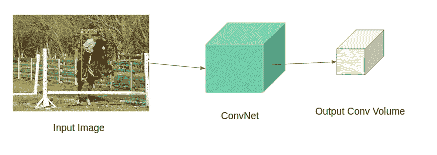
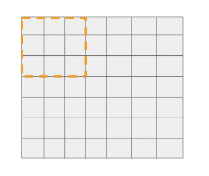
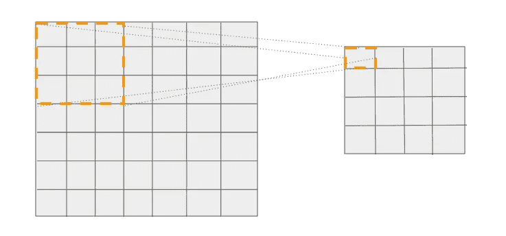
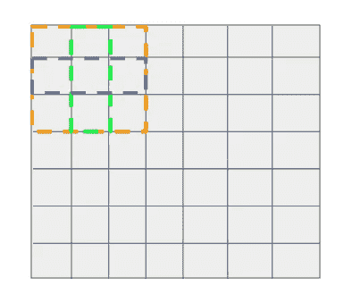

# 神经网络直觉:5。锚点和对象检测

> 原文：<https://towardsdatascience.com/neural-networks-intuitions-5-anchors-and-object-detection-fc9b12120830?source=collection_archive---------7----------------------->

大家好！欢迎回到我的神经网络直觉系列。

今天我将谈论一个在物体检测器中引入的*优雅的*概念——*锚*，它们如何帮助*检测图像中的物体*，以及它们与传统的*两阶段检测器*有何不同。

像往常一样，让我们看看这些锚被引入作为解决方案的问题:-)

在从锚开始之前，让我们看看两级对象检测器是如何工作的，以及它们实际上如何促进单级检测器的发展。

***两级对象检测器:*** 传统的两级对象检测器分两次检测图像中的对象:

1.  ***第一遍*** :第一遍取入输入图像，输出可能存在物体的区域(称为区域建议或感兴趣区域)。这个过程既可以通过外部算法(例如:选择性搜索)来执行，也可以通过神经网络来执行。
2.  ***第二遍:*** 第二遍是一个神经网络，它接收这些感兴趣的区域，并将其分类为一个目标对象类别。

为了简单起见，我要讲一个著名的两级检测器——***fast——RCNN。*** 两者都通于更快——RCNN 包含一个神经网络。

(一)。第一个神经网络预测物体可能出现的位置(也称为*客观分数)。它基本上执行前景(对象)对背景分类。这个网络被称为区域建议网络，又名 RPN。*

㈡。在提取区域提议之后，来自输入图像的相应位置被裁剪并被馈送到下一个神经网络，以在比方说 N 个目标类中执行分类。这个网络预测在那个位置存在什么物体。

## 步骤(ii)似乎非常琐碎，因为它归结为图像分类，其中对象裁剪被分类为 N 个类别之一。

让我们深入研究第一步。

(a)这个神经网络如何预测这些物体的位置？

(b)如果可以训练神经网络来执行前景与背景分类，那么为什么不训练它来一次预测所有 N 个类别？

> (a)的解决方案是锚,( b)的答案是肯定的，我们可以有一个单一的网络来执行 N 路对象检测，这样的网络就是广为人知的单次对象检测器。你没看错。单触发检测器几乎与 fast-RCNN 第一遍中的网络相同。

*我说 SSD 是 ***几乎与 RPN 的*** 相同，因为 ***在概念上*** 两者相同，但在 ***架构上有*。****

****问题:*** 神经网络如何检测图像中的物体？*

****解(1) —单个物体检测:*** 让我们举一个在图像中寻找单个物体的最简单的例子。给定一幅图像，神经网络必须输出图像中对象的类别及其边界框坐标。所以网络必须输出 4+C 个数字，其中 C 是类的数量。*

## *这可以通过将输入图像通过一些卷积层集合并在末端使用全连接层来直接完成，该全连接层将最终的 conv 体积转换成 4+C 维的向量，其中前四个数字表示物体位置(比如 minx、miny、maxx、maxy ),接下来的 C 个数字表示类别概率分数。*

****解决方案(2)——多物体检测:*** 这可以通过将上述方法扩展到 *N* 物体来实现。所以网络现在输出的不是 4+C 个数字作为输出，而是 *N*(4+C)* 个数字。*

*取一幅尺寸为 H x W x 3 的输入图像，让它通过一组卷积层，得到一个尺寸为 h x w x d 的卷积体，其中“d”是深度或通道数。*

**

*Pass image through ConvNet to get an output feature map*

*考虑上面的输出卷积量。假设该卷的大小为 7 x 7 x 512。应用大小为 3 x 3 x 512 的 N 个滤波器，跨距=2，填充=1，产生大小为 4 x 4 x N 的输出音量。*

*让我们看看这个大小为 4 x 4 x N 的输出，并尝试推断它的含义。*

## *在输出特征图中有 16 个细胞，我们可以说每个细胞在图像中的某个点有一个感受野(或视野)。并且每个这样的单元都有 N 个与之相关联的数字。正如我之前指出的，N 是类的数量，我们可以说每个单元都有关于什么对象出现在特征图中相应位置的信息。以同样的方式，有另一个平行的 conv 头，其中大小为 3×3×512 的 4 个过滤器被应用于相同的 conv 体积，以获得大小为 4×4×4 的另一个输出，这对应于边界框偏移。*

*这就对了。现在我们知道了如何从单个神经网络中做出多个物体预测。但是等等，我们如何用这个 4 x 4 x N 输出的网格来计算损耗呢？*

*现在，让我们深入了解我们在输出层使用的 N 个滤波器。从这 N 个滤波器中只取一个，看看它是如何在特征图上卷积得到输出的。*

**

*3 x 3 filter convolved on a 7 x 7 feature map(shown in 2d) at stride = 2.*

*这个 3x3 过滤器可以在 16 个唯一的位置上围绕 7x7 网格移动，并进行预测(如前所述)，这是非常明显的。*

*我们知道，网格中的 16 个单元中的每一个都对应于它之前的层中的特定位置。看下图。我们看到输出网格中第一个单元格的参考框大小为 3x3。*

**

*The 1st cell can be associated with a particular location in the input image from which the prediction was made.*

> *类似地，输出中的每个像元都可以与输入图像中进行预测的特定位置相关联。*

*因此有 16 个这样的参考位置(大小为 3×3)，每个位置都有自己相对于输入图像的坐标。现在，在这些参考的帮助下，我们可以实现两个目标:*

1.  ****分类损失*** :如果 N 个对象中的一个落在这 16 个参考位置中，即具有与地面真实对象框的交集(IOU) ≥某个阈值，那么我们知道要匹配什么地面真实向量。*
2.  ****回归损失*** :我们到底为什么需要这个？假设物体落入这些参考框之一，我们可以简单地输出这些参考位置相对于输入图像的实际坐标。原因是因为物体不必是方形的。因此，我们不是天真地输出一组固定的框坐标，而是通过输出 4 个偏移值来调整这些参考位置的默认坐标。现在我们知道了地面实况框坐标和相应的参考位置坐标，我们可以简单地使用 L1/L2 距离来计算回归损失。*

## *与图像分类任务不同，在图像分类任务中，我们只有输出向量进行匹配，而在这里，我们有 16 个参考进行匹配。这意味着网络可以一次预测 16 个目标。可以通过在多个特征图上进行预测或者通过在特征图上增加所谓的参考位置来增加要估计的对象的数量。*

> *这些引用位置只不过是定位框或默认框。*

*在上面的例子中，只有一个锚盒，即每个滤波器位置进行一次预测。*

> *通常情况下，可以对特征图中的每个过滤器位置进行多次预测，这意味着需要有多少个预测就有多少个引用。*

*假设每个滤波器位置有 3 个基准电压源。*

**

*Three boxes per filter location — one of size 3x3(orange), one of size 1x3(blue) and another of size 3x1(green)*

*正如我们前面看到的，输出是锚盒的函数，所以如果引用/锚的数量改变，输出大小也会改变。因此，由于锚的数量=3，网络输出将是 4x4x(N*3)(和 4x4x(4*3))，而不是像 1 个锚的情况那样输出 4x4xN(和 4x4x4))。*

*一般来说，单触发检波器的输出形状可以写成*

> *分类头型:HxWxNA*
> 
> *回归头型:HxWx4A*

*其中 A 是使用的锚的数量。*

*还有一个问题！*

*每个滤波器位置有多个锚/参考盒有什么意义？*

> *这使得网络能够预测每个图像位置的不同大小的多个对象。*

> *这种单触发检测器的变体称为单触发多盒检测器(SSD ),其中在末端使用卷积层来获得输出，而在末端使用全连接层来获得输出的变体称为只看一次(YOLO)。*

*我希望我已经让主播的概念对你们大家来说很容易理解。主播是一个很难理解的概念，在这篇博客中仍然有一些关于他们的未解问题。我想在我接下来的文章中回答这些问题。到那时再见吧:-)*

*参考资料:*

*[1]我的帖子是从这个优秀的视频中得到灵感的:[https://www.youtube.com/watch?v=0frKXR-2PBY](https://www.youtube.com/watch?v=0frKXR-2PBY)—FastAI 关于多目标检测的视频**强烈推荐* **

*[2]https://arxiv.org/abs/1506.01497*