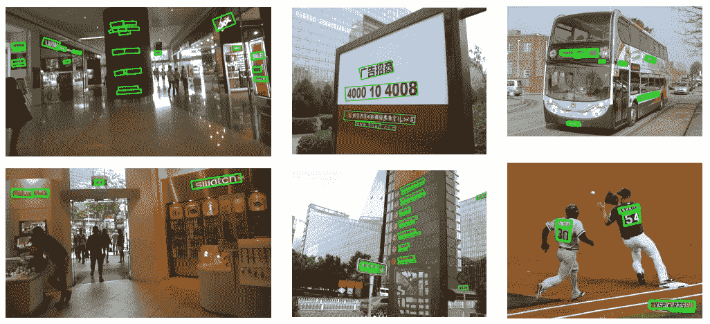
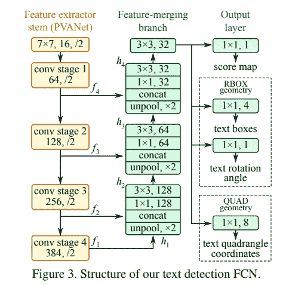
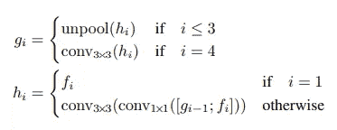
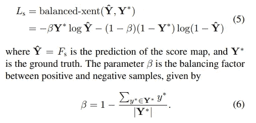
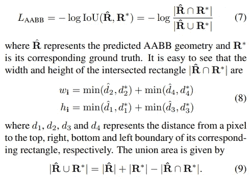
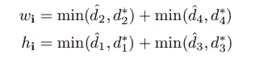
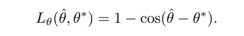
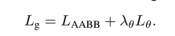

# 神经网络直觉:6。EAST:一种高效准确的场景文本检测器——论文解读

> 原文：<https://towardsdatascience.com/neural-networks-intuitions-6-east-5892f85a097?source=collection_archive---------8----------------------->

## 嘿伙计们！再次回来真好:-)

距离我发表上一篇文章已经有一段时间了。在我的系列文章*“神经网络直觉”的第六部分中，*我将谈论一种使用最广泛的场景文本检测器——[***EAST(高效准确的场景文本检测)***](https://arxiv.org/abs/1704.03155) ，顾名思义，与文本检测器相比，它不仅准确，而且更加高效*。*

*首先，让我们从总体上看一下*场景文本检测*的问题，然后深入研究*东* :-)*

# *场景文本检测:*

***问题:**上面已经提到的问题是检测自然场景图像中的文本。场景文本检测是对象检测的一个特例，这里的对象归结为一个单独的实体— **“文本”。***

**

*Scene Text Detection*

*但是我们在什么水平上检测文本呢？*

> **我们可以在*字符级*或*单词级*检测文本。这完全取决于如何对文本检测数据集进行注释，以及我们希望网络如何学习。通常，自然场景图像在单词级别被标记，从而使网络学会检测单词(以及单词之间的空格，以便区分任何两个 **单词实例**)。**

***解决方案:**既然这里的问题是物体检测，既然我们已经知道了物体检测的基础 *(* [神经网络直觉:5 .锚和对象检测](/neural-networks-intuitions-5-anchors-and-object-detection-fc9b12120830) *)* ，我们可以简单地使用现有的对象检测器之一——比如 SSD、Faster-RCNN 或 RetinaNet。他们应该能帮我们完成这项工作。*

> *但是我们真的需要每个特征地图单元有多个定位框吗？或者我们是否需要使用锚的概念来完成更具体更简单的任务，比如文本检测？*

*我之所以说文本检测(或者更具体地说单词检测)是一项更简单的任务，是因为:*

*a. ***单词*** 的模式/特征并没有那么复杂——尤其是在语言固定的情况下(比如英语)，我们基本上有 26*2(小写和大写字母)+ 10(数字)。*

> *但是我们不是在字符级别检测，对吗？那么，如果有大量的单词组合，这个任务是如何简单的呢？*

*让我们看下一点来看原因！*

*b.如果您以前有过文本检测的工作经验，您可以看到文本检测器可以学习预测没有经过训练的语言中的单词(即使并不完美)。例如 ***英文*** 单词检测器检测 ***日文/泰米尔文*** 单词。*

> *这很明显地表明，所学的模式并不完全是“语言单词”。那么网络到底在学什么呢？—它可以是学习一起出现在组中的形状，由一定数量的空白分隔，例如，一个连接的组件。*

*至少这是我对单词检测器可以学习什么的直觉:-)*

# *我们为上述问题制定一个解决方案怎么样？*

## *伪代码:*

1.  *将输入场景文本图像传递给 ConvNet(特征提取器)。*
2.  *在特征融合阶段合并多尺度特征。*
3.  *在特征卷上运行 *1x1 conv 滤波器(class head)* 以获得范围为 0–1 的*激活图/热图，其中*1 表示图像中存在文本*，而 *0 表示背景*。**
4.  *对激活图进行阈值处理，并使用 cv2.findContours()之类的逻辑来查找文本区域，并最终从中找到文本单词。*

> *如果我们注意第 3 步，我们可以注意到锚的*用法，*与大小为 1x1 的*过滤器相关联，并且每个特征地图单元* 只有 ***一个锚框。这一点很关键，因为它有助于我们与传统的单次目标探测器进行比较。****

*这几乎就是 EAST 所做的——除了没有使用一些过度的逻辑来查找文本区域，它还有另一个头— *box head* ,它将输出到最近的[minx，miny，maxx，maxy]边界的 4 个距离值(特征地图中的每个像素)。*

# *EAST——一种高效准确的场景文本检测器；*

***a .架构:**每个单次拍摄物体探测器都包含 3 个主要阶段:*

1.  *特征提取阶段。*
2.  *特征融合阶段。*
3.  *预测网络。*

*单触发探测器的所有变体在上述三个阶段中的一个阶段有所不同。东方也遵循上述相同的范式。*

**

***b .投入产出:***

1.  *该网络接收输入图像，并通过某组 conv 层(特征提取器干)来获得四级特征图——f1、f2、f3、f4。*
2.  *然后，特性图被解池(x2)、连接(沿通道维度)，然后通过 1x1，再通过 3x3 转换器。合并来自不同空间分辨率的特征的原因是为了预测更小的单词区域。*

**

*Feature merging*

*3.然后，最终的特征体积将用于进行分数和盒子预测-深度=1 的 1x1 过滤器用于生成分数图，深度=5 的另一个 1x1 过滤器用于生成 RBOX(旋转的盒子)-四个盒子偏移和旋转角度，深度=8 的另一个 1x1 过滤器用于生成四边形(具有 8 个偏移的四边形)。*

***c .损失函数:***

*在进入损失函数之前，让我们先来解释一下网络输出。*

> *1.类头输出可以解释为类似于传统检测器的类输出，只是这里每个特征地图像元只有锚框，因此输出将为 HxWx1 形状，其中 1 表示每个像元的锚框数量。*
> 
> *2.但是在盒子头的情况下，输出(形状 HxWx4)应该在“像素”级别解释，并且没有锚盒的概念。每个像素都有 4 个与之相关的数字—到最近的[minx，miny，maxx，maxy]框的距离。这里需要注意的重要一点是，最终的字级输出是从这个每像素级输出中导出的。*

***c1。分类损失***

*我们都很清楚对象检测数据集中存在的类不平衡问题。背景类的样本数量通常非常多，现在我们*将每个 1x1 框(基本上是每个像素)作为输出*，背景样本的数量变得巨大。*

*为了解决这个类不平衡的问题，EAST 使用了交叉熵的一个修改版本，叫做 ***平衡/加权交叉熵。****

**

*Balanced Cross Entropy (BCE)*

> *在 BCE 中，高代表类的分数通常与低代表类的损失项相乘(类似地，高代表类的损失项也是如此),以便控制高代表类和低代表类的贡献。*注:背景类:=高表示，前景类:=低表示。**

*查看这个博客对 BCE *(* [神经网络直觉的详细解释:1。平衡交叉熵](/neural-networks-intuitions-1-balanced-cross-entropy-331995cd5033) *)。**

***c2。IOU 损耗:**这里使用的 IOU 损耗不同于传统的包围盒损耗。*

**

*IOU Loss*

*每个像素将有 4 个与之相关的数字——到最近的顶部、左侧、底部、右侧框边界的距离，根据该距离计算 IOU，然后使用*负对数似然作为损失，当 IOU 小于 1 时进行惩罚。**

> *很明显，gt/pred 框的宽度和高度可以通过简单地将它们的 *x 和 y 偏移量*相加来计算，由此获得 gt 和 pred 框的面积。*
> 
> *为了找到相交矩形的宽度和高度，*

**

*现在我们有了 gt 盒的面积，预测盒的面积和相交盒的面积，我们可以计算 IOU 了！*

*然后我们计算角度损失，*

**

*1 — cos(predicted angle — gt angle)*

*总损失写为，*

**

*A weighted sum of both losses.*

*在我接下来的文章中(编辑到同一篇文章)，为了完整起见，我将解释关于如何从网络输出中计算边界框的 *EAST post processing* 。*

*论文链接:【https://arxiv.org/abs/1704.03155 *

*干杯！*