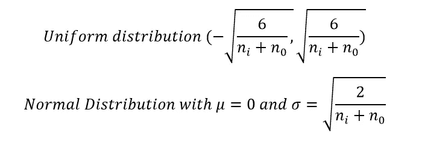
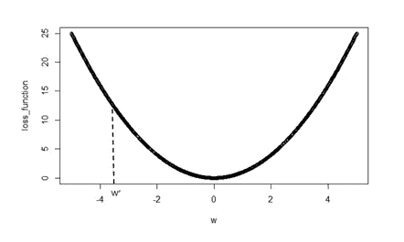
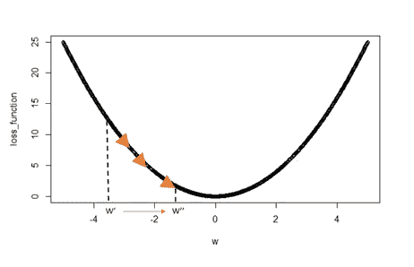
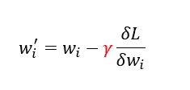
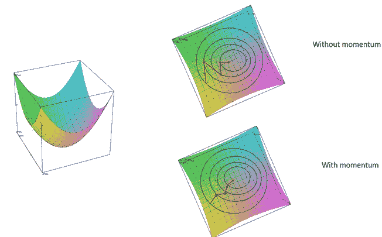

# 神经网络:参数、超参数和优化策略

> 原文：<https://towardsdatascience.com/neural-networks-parameters-hyperparameters-and-optimization-strategies-3f0842fac0a5?source=collection_archive---------2----------------------->

神经网络(NNs)是深度学习分析中使用的典型算法。神经网络可以采取不同的形状和结构，但其核心框架如下:

所以我们有我们的输入(x)，我们取它们的加权和(权重等于 w)，通过一个激活函数 *f(.)*，*瞧，*，我们得到我们的输出。然后，根据我们的预测有多准确，算法会根据给定的优化策略，通过所谓的“反向传播”阶段进行自我更新。

不用说，这是一个非常糟糕的定义，但是如果你在阅读本文时记住它，你会更好地理解它的核心主题。

事实上，我想重点讨论的是如何处理神经网络的一些特征元素，这些元素的初始化、优化和调整可以使您的算法更加强大。开始之前，让我们看看我在谈论哪些元素:

**参数**:这些是模型的系数，由模型自己选择。这意味着算法在学习时优化这些系数(根据给定的优化策略)并返回一组使误差最小的参数。举个例子，在线性回归任务中，你有一个看起来像 y=b + ax 的模型，其中 b 和 a 是你的参数。对于这些参数，您唯一要做的事情就是初始化它们(我们将在后面看到它的含义)。

**超参数**:这些是与之前不同的，你需要设置的元素。此外，模型不会根据优化策略更新它们:总是需要您的手动干预。

**策略**:这是一些你应该拥有的关于你的模型的技巧和方法。也就是说，在管理您的数据之前，您可能希望对它们进行规范化，特别是当您有不同范围的值时，这可能会影响您的算法的性能。

所以，让我们来检查所有这些。

**参数**

正如预期的那样，对于参数，您唯一要做的事情就是初始化它们(注意，参数初始化是一种策略)。那么，初始化它们的最好方法是什么呢？当然，你不应该做的是将它们设置为零:事实上，这样做你冒着惩罚整个算法的风险。举一个你可能面临的各种问题的例子，即使在几次重新称重后，仍然坚持重量等于零。

因此，这里有一些根据你决定使用的激活函数正确初始化你的参数的想法(我将在后面详述激活函数)。

如果您使用 Sigmoid 或 Tanh 激活函数，您可以使用具有均匀或正态分布的 Xavier 初始化:

如果您使用的是 ReLU，您可以使用 he 初始化，使用正态分布:

其中 *ni* 和 *n0* 分别是输入数和输出数。

**超参数**

这要有趣得多。超参数比参数更需要您的注意力和知识。因此，要想知道如何处理它们，让我们来看看其中的一些:

**隐藏层数**:这可能是最值得质疑的一点。这个想法是，你想让你的神经网络尽可能简单(你想让它快速和良好的推广)，但同时，你想让它很好地分类你的输入数据。在这种情况下(以及许多其他与超参数相关的情况)，您应该继续进行手动尝试。在自我学习机器的时代，这听起来可能很“古老”，但请记住，后者需要在学习之前构建。因此，为了提供这种直觉，我建议你在这个 [Tensorflow 平台](https://playground.tensorflow.org/#activation=sigmoid&batchSize=10&dataset=circle&regDataset=reg-plane&learningRate=0.03&regularizationRate=0&noise=0&networkShape=&seed=0.23580&showTestData=false&discretize=false&percTrainData=50&x=true&y=false&xTimesY=false&xSquared=false&ySquared=false&cosX=false&sinX=false&cosY=false&sinY=false&collectStats=false&problem=classification&initZero=false&hideText=false)上运行一些实验:你会看到在若干层/神经元之后，精确度不再提高，因此保持算法如此繁重是低效的。

**学习率**:该超参数指的是反向传播步骤，根据优化函数更新参数。基本上，它代表了重新校准后重量的变化有多重要。但是“重新校准”是什么意思呢？好吧，如果你考虑一个只有一个权重的一般损失函数，图形表示将是这样的:

你想使损失最小化，所以理想情况下，你希望你当前的 w 滑向最小值。该过程应该如下:

对应的功能是:

其中第一项是你当前的体重，第二项是你的函数的梯度(在这个一维的例子中，它将是你的损失函数的一阶导数，很明显，是关于你唯一的体重)。记住，如果切线段的陡度为负，一阶导数就有负值，这就是为什么我们在两项中间放一个负号(直觉:如果陡度为负，权重应该向右移动，如示例所示)。这个优化过程被称为梯度下降。

现在让我们给公式添加一个新术语:

这个 gamma 是我们的学习率，它告诉算法梯度对权重的影响应该有多重要。小伽马的问题是 NN 将非常缓慢地收敛(如果它将收敛的话),并且我们可能招致所谓的“消失梯度”的问题。另一方面，如果伽马值很大，风险就会错过最小值，并导致“爆炸梯度”的情况。

一个好的策略可能是从 0.1 左右的值开始，然后以指数方式减少它:在某个点上，损失函数值在最初的几次迭代中开始减少，这是权重采取正确方向的信号。

**动量**:这是一种在反向传播阶段使用的技术。如关于学习率所述，参数被更新，使得它们可以向损失函数的最小值收敛。这个过程可能太长，影响算法的效率。因此，一个可能的解决方案是跟踪先前的方向(即损失函数相对于权重的梯度),并将它们作为嵌入信息保存:这就是动量被考虑的原因。它基本上不是在学习速率方面(每次更新多少权重)而是在过去重新校准的嵌入式存储器方面(该算法知道该权重的先前方向，比方说，是正确的，并且它将在下一次传播期间直接朝着该方向前进)提高了收敛速度。如果我们考虑一个双权损失函数的投影(具体地说，一个抛物面)，我们可以形象化它:

你可以在这里找到制作这些 3D 图形[的来源。](http://www.livephysics.com/tools/mathematical-tools/online-3-d-function-grapher/?xmin=-1&xmax=1&ymin=-1&ymax=1&zmin=Auto&zmax=Auto&f=x%5E2%2By%5E2)

如你所见，如果我们添加动量超参数，下降阶段会更快，因为模型保留了过去梯度方向的痕迹。

如果你决定采用较高的动量值，这意味着它将大量考虑过去的方向:这可能会导致难以置信的快速学习算法，但错过一些正确“偏差”的风险很高。建议总是从低值开始，然后逐渐增加。

**激活函数**:它是一个函数，我们通过它来传递我们的加权和，以便得到一个有意义的输出，即作为一个概率向量或 0-1 输出。主要的激活函数是 Sigmoid(对于多类分类，使用该函数的变体，称为 SoftMax 函数:它返回和等于 1 的概率向量作为输出)、Tanh 和 RELU。

注意，激活函数可以位于 NN 中的任意点，次数不限。然而，你总是要考虑效率和速度。也就是说，ReLU 函数在训练方面非常快，而 Sigmoid 函数更复杂，需要更多时间。因此，一个好的实践可能是使用 ReLU 的隐藏层，然后，在最后一层，插入你的乙状结肠。

**小批量**:当你面对数十亿的数据时，向你的神经网络提供所有这些数据可能会导致低效(以及适得其反)。一个好的做法是给它输入较小的数据样本，称为批次:通过这样做，每次算法训练自己时，它都将在相同批次大小的样本上进行训练。典型的大小是 32 或更大，但是你需要记住，如果大小太大，风险是一个过于一般化的模型，不适合新的数据。

**历元**:它代表你希望你的算法在你的整个数据集上训练多少次(注意，历元不同于迭代:后者是完成一个历元所需的批次数量)。同样，纪元的数量取决于您所面临的数据和任务的类型。一个想法可以是强加一个条件，当误差接近零时，纪元停止。或者，更容易的是，您可以从相对较少的时期开始，然后逐渐增加，跟踪一些评估指标(比如准确性)。

**退出**:这项技术包括移除一些节点，这样神经网络就不会太重。这可以在培训阶段实施。这个想法是，我们不希望我们的神经网络被信息淹没，特别是当我们考虑到一些节点可能是多余的和无用的。因此，在构建我们的算法时，对于每个训练阶段，我们可以决定以概率 p(称为“保持概率”)保留每个节点，或者以概率 1-p(称为“丢弃概率”)丢弃它。

**策略**

策略是我们可能希望对我们的算法采用的方法和最佳实践，以使它更好地执行。其中包括以下内容:

**参数初始化**:我们在第一段已经讲过了。

**数据标准化**:检查数据时，您可能会注意到一些要素以不同的比例表示。这可能会影响你的神经网络的性能，因为收敛速度较慢。规范化数据意味着将所有数据转换为相同的标度，范围为[0–1]。您也可以决定标准化您的数据，这意味着使它们正态分布，平均值等于 0，标准差等于 1。虽然数据规范化发生在训练神经网络之前，但另一种可以规范化数据的方法是通过所谓的批量规范化:它直接发生在神经网络训练期间，特别是在加权和之后和激活函数之前。

**优化算法**:上一段我提到了梯度下降作为优化算法。然而，我们有后者的许多变体:随机梯度下降(它根据梯度下降优化来最小化损失，并且对于每次迭代，它随机选择一个训练样本——这就是为什么它被称为随机的)，RMSProp(与之前的不同，因为每个参数都有适应的学习速率)和 Adam 优化器(它是 RMSProp + momentum)。当然，这不是完整的列表，但足以理解 Adam optimizer 通常是最佳选择，因为它允许您设置不同的超参数并定制您的 NN。

**正则化**:如果你想保持你的模型简单，避免过度拟合，这个策略是至关重要的。其思想是，如果权重太大/太多，正则化会给模型增加一个惩罚。事实上，如果重新校准程序增加了权重，它会给我们的损失函数增加一个新项，该新项会增加(因此，损失也会增加)。有两种正则化:套索正则化(L1)和桥正则化(L2):

L1 正则化倾向于将权重缩小到零，存在丢弃一些输入的风险(因为它们将与空值相乘)，而 L2 可能将权重缩小到非常低的值，但不会缩小到零(因此输入被保留)。

有趣的是，这一概念与时间序列分析中的信息标准密切相关。事实上，在优化我们的自回归模型的最大似然函数时，我们可能会遇到同样的过度拟合问题，因为这一过程往往会增加参数的数量:这就是为什么如果后者增加，增加惩罚是一个好的做法。

**结论**

本文并不打算详尽列出神经网络的所有特征元素，但是理解它们之间的主要区别以及初始化和调整的关键思想是很重要的。