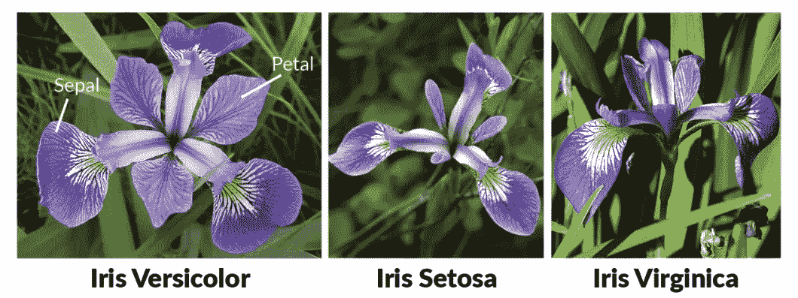
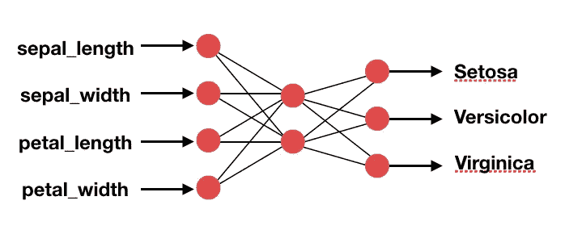
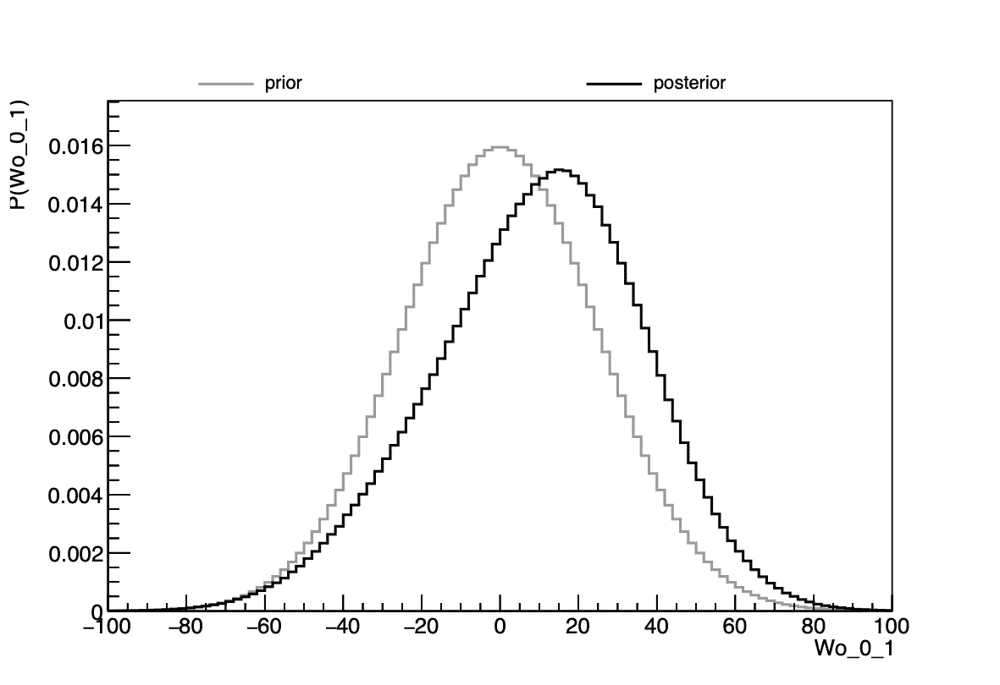
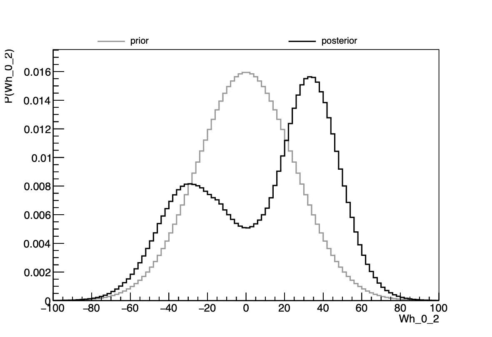
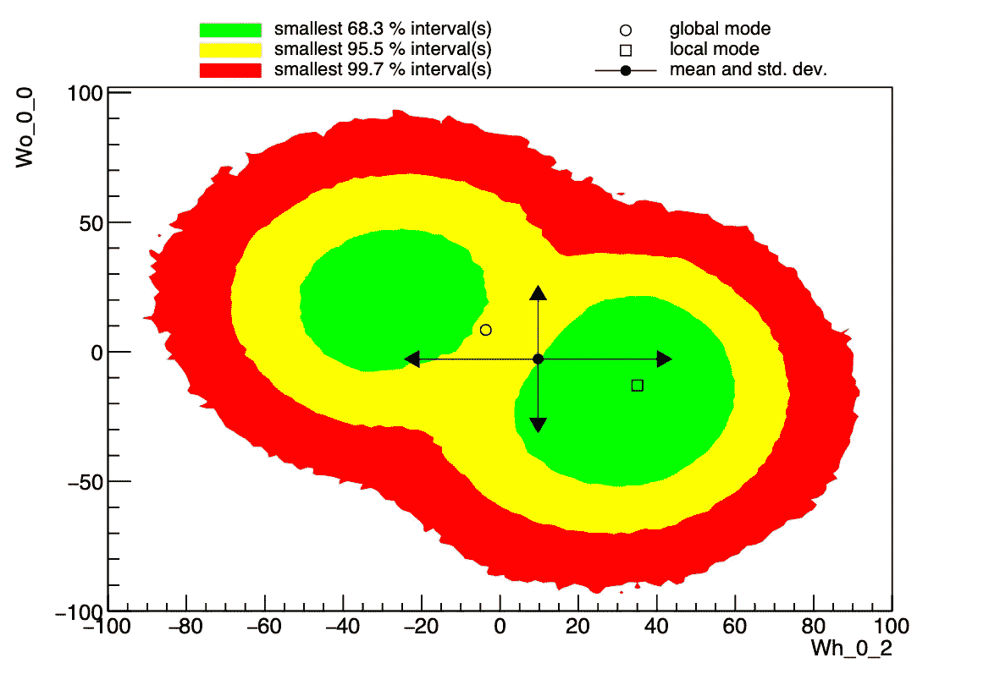
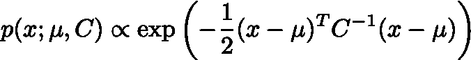
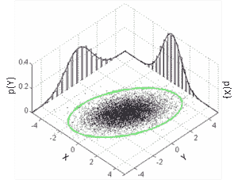
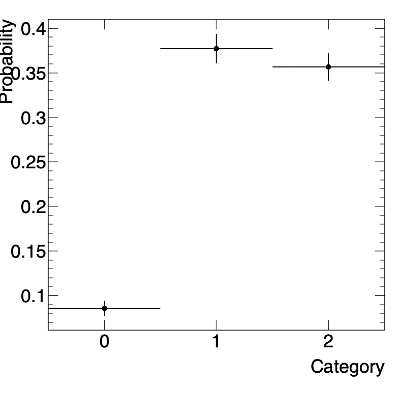

# 神经网络应该学会如何说“我不确定”

> 原文：<https://towardsdatascience.com/neural-networks-should-learn-how-to-say-im-not-sure-a430d665fa7d?source=collection_archive---------14----------------------->

## 贝叶斯定理使人工智能能够回答不确定性问题

如果有一个机器学习的应用被认为特别有用并且经常成功，那就是分类。分类是将一个给定的条目分配到一个类中的任务(*，例如*“猫”还是“虎”？).通常，要处理的每个条目都用数字表示为一个数字向量，它可以对高级特征进行编码(*例如*尾巴的长度、条纹或斑点的存在等)。)或者低级的(*例如*一个图像中每个像素的值)。多年来，社区已经探索了许多不同的分类器，最流行的是[人工神经网络](https://en.wikipedia.org/wiki/Artificial_neural_network)、[决策树](https://en.wikipedia.org/wiki/Decision_tree)、[支持向量机](https://en.wikipedia.org/wiki/Support-vector_machine)，或其他算法，如 [k-means 聚类](https://en.wikipedia.org/wiki/K-means_clustering)。在这篇文章中，我将集中讨论神经网络，但是这个论点也可以适用于其他类型的分类器。

通常，神经网络由一个输入层(接受输入特征)、多个隐藏层(该数字越大，网络越深)和一个输出层组成。对于二进制分类问题，输出层通常有一个单一节点(例如*猫*对*老虎)，或者在不止两个类的情况下有 *N* 节点(例如*猫*对*老虎*对*狮子)。通常，学生们会遇到一个简单的分类问题，叫做费希尔虹膜数据集。人们必须创建一个分类器，该分类器能够基于四个简单的输入特征(萼片长度和宽度、花瓣长度和宽度)来分离称为( *versicolor* 、 *setosa* 和 *virginica* )的三种花。统计学家[罗纳德·费雪](https://en.wikipedia.org/wiki/Ronald_Fisher)在他 1936 年的论文 [*中首次介绍了这个数据集。在分类学问题中多重测量的使用*](https://onlinelibrary.wiley.com/doi/abs/10.1111/j.1469-1809.1936.tb02137.x) 。**

The Iris flowers dataset is one of the best-known datasets found in the classification literature. The goal is to classify Iris flowers among three species (Setosa, Versicolor or Virginica) from measurements of length and width of sepals and petals.

众所周知，这个问题特别容易解决，同时仍然保留了许多教育方面。我们将尝试用嵌入了[贝叶斯推理](https://en.wikipedia.org/wiki/Bayesian_inference)的特定神经网络来解决它，以便不仅给出一个答案，而且给出一个具有相关不确定性的答案。这篇文章使用的代码可以在 https://github.com/rdisipio/DeepBayesIris 的[公开获得。](https://github.com/rdisipio/DeepBayesIris)

为什么我们首先关心不确定性，这几乎是一个哲学问题。简单地说，任何人(至少是理性的人)都会感觉到“这是一朵*鸢尾*”和“这看起来像一朵*鸢尾*，但有 30%的可能性是一朵*海滨鸢尾*”之间的区别。大多数分类器只能给出类似于前一句的结果，主要是因为后一句很难计算。实现这一点的方式是依靠[贝叶斯定理](https://en.wikipedia.org/wiki/Bayes%27_theorem):在获得关于某件事的新信息时，一个人的信念(“后验概率”)会被观察到的(“证据”)和之前已知的(“先验概率”)的混合所“更新”。特别是，如果最初的信念非常坚定，没有证据可以改变一个人的信念(例如[确认偏差](https://en.wikipedia.org/wiki/Confirmation_bias))。在实践中，该定理用一个数学公式来表示与假设( *H* )和数据( *D* )相关的概率:

在我们的例子中，假设 *H* 将是一组定义我们的分类器行为的参数，先验将是我们对这些参数的实际值的最初猜测。通过求解贝叶斯定理，我们将得出另一组参数 *H** (“最佳拟合”)，这些参数提高了分类器将数据集中的每朵花分配到正确类别的整体能力。如果您已经熟悉神经网络，这组参数对应于网络的权重和偏差，以及损失函数的可能性。

对于这个特定的应用程序，我设置了一个完全连接的前馈多层[感知器](https://en.wikipedia.org/wiki/Perceptron)(有点拗口，但实际上这是最简单的神经网络类型！)具有四个输入节点，一个隐藏层具有五个节点和 *tanh* 激活，一个输出层具有三个节点(每个类别一个)和[soft max 激活](https://en.wikipedia.org/wiki/Softmax_function)。 *softmax* 函数确保结果可以解释为概率，*，即*每个节点的值在 0 和 1 之间，所有节点的和为 1。损失函数为 [*交叉熵*](https://ml-cheatsheet.readthedocs.io/en/latest/loss_functions.html) ，恰当地衡量了输出为概率值的分类模型的性能。

Diagram of the architecture of the neural network used in this example. Including the biases, there is a total of 19 weights to be estimated during the training.

在我们深入研究实现的细节之前，让我们澄清一下我们将如何使用这种网络。首先，我们将找到优化损失函数的一组最佳权重和偏差*H**——在这种情况下，我们将寻找函数的最大值*而不是传统机器学习软件包中出现的最小值。这种“贝叶斯训练”的结果将是一组参数和不确定性。此外，我们希望估计参数之间的相关性，这是我们进行如下解释的推理所需要的。在推理步骤中，我们将通过具有相同架构的神经网络来预测给定条目的类别，但是执行多次，每次使用稍微不同的一组参数。所有这些运行的平均值将给出一个中心值和相关的不确定性。*

实际实现基于高能物理界流行的两个 C++软件库: [ROOT](https://root.cern.ch/) (由 [CERN](https://home.cern/) 开发)和[贝叶斯分析工具包](https://github.com/bat/bat) (BAT)。在幕后，BAT 用一种叫做 [Metropolis-Hastings](https://en.wikipedia.org/wiki/Metropolis%E2%80%93Hastings_algorithm) 的统计方法探索了 *H* 的多维概率分布(见[我早先的帖子](https://medium.com/@riccardo.disipio/how-much-ceos-are-worth-ask-a-nuclear-physicist-to-find-out-7220e3b231c4)关于如何用这种方法预测大公司 CEO 的薪酬)。属于一类叫做[马尔可夫链蒙特卡罗](https://en.wikipedia.org/wiki/Markov_chain_Monte_Carlo) (MCMC)的采样算法。众所周知，当要探索的维数非常大时，这种算法特别有效。实际上，必须创建 BAT::BCModel 的派生类，然后定义参数集及其范围(在这个简单的示例中，它们都在范围[-100，100]内)。最重要的是，必须实现虚拟函数 BC model::log likelihood(STD::vector<double>)来计算出现在贝叶斯定理中的“证据”项，作为 MCMC 每次迭代的参数 *H* 的函数。也可以重新实现对先验分布的估计，但为了简单起见，可以将它们设置为均值为 0 且标准差覆盖 1/4 允许范围的高斯分布(本例中为 100/4 = 25)。这是一个非常粗略的假设，原则上可以用一个更少“信息”的常数先验来代替。然而，使用贝叶斯方法的全部要点是阐明我们先前的信念:在这种情况下，我认为可以公平地说，人们期望参数的值很小，但为更好的估计留有余地。稍后我们将看到这个“更新”实际上是什么样子。

在 LogLikelihood()函数中，参数被传递给一个前馈类，该类重新排列这些参数，然后实际执行神经网络计算。通过相对于已知标签的交叉熵损失来比较输出(对于*setosa*[1，0，0]，对于*versicolor*[0，1，0]，对于*virginica*[0，0，1】)。MCMC 引擎抽取参数的随机值，计算损耗，并根据 Metropolis-Hastings 算法前进到附近的点。为了进一步优化，由多个并行链(通常为 4 或 8 个，每个 CPU 内核最多一个)执行“探索”,这些并行链在理论上应该收敛到同一个最佳点。

过程结束时，后验分布可用于单个参数(边缘化 1D 分布)或成对参数(边缘化 2D 分布)。理想情况下，这些 1D 分布应该是对应网络权重的最可能值周围的高斯分布。事实上，神经网络是非常复杂的系统，很少有能够被有效识别的全局最大值。更有可能的是，将会有一大组*局部*最大值，对于手头的分类问题来说足够好。这通过具有多个峰值的后验分布来反映，每个峰值对应于不同的最大值。然而，没有简单的方法来处理这些情况，需要一些近似。在该方法的实现中，我决定使用分布的平均值作为权重，RMS 作为相同权重的不确定性。此外，从 2D 边缘分布可以估计协方差矩阵，其中元素 *C_ij* 例如由第 *i* 和第 *j* 权重的 2D 边缘分布之间的[皮尔逊相关系数](https://en.wikipedia.org/wiki/Pearson_correlation_coefficient)给出。这些信息被保存到一个文本文件中，用于推理。

Example of a “well-behaving” distribution: the 1D-marginalized posterior probability of the weight prefers a positive value but with large uncertainty

Example of a the 1D-marginalized posterior probability with two peaks, both corresponding a value of the weight that leads to a local maximum of the loss function.

Example of a the 2D-marginalized posterior probability with two peaks. The global optimization (hollow circle) prefers either of the two, but the highest peak in the 2D distribution (hollow square) is the other one.

在推断步骤中，从训练结束时创建的文本文件中加载网络的权重和相关矩阵。神经网络将被执行多次，并且结果将被收集和平均以得到最终结果。

现在是阐明为什么我们需要将协方差矩阵传播到推断步骤的时候了:我们不能简单地抛出随机数，好像权重是彼此独立的*，而它们实际上是相关的*。原则上，我们希望探索 *H* *的完整的 *N* 维概率分布函数，但这太复杂了。相反，我们可以用一个[多元正态分布](https://en.wikipedia.org/wiki/Multivariate_normal_distribution) *X* ~ *N* (μ，σ)来近似它，这是高斯分布的*N*-维等价物(μ是权重的中心值的向量，σ是标准偏差的向量):

Multinormal distribution. It’s the equivalent in *multiple* dimensions of the Gaussian distribution.

An example of a 2D multivariate normal (gaussian) distribution.

然而，从 *X* 采样并不是一件简单的事情。事实证明，在 1D，将标准正态随机变量 *Z* ~ *N* (0，1)转化为正态随机变量 *N* (μ，σ)更容易，首先通过方差的平方根(*即*，标准差)进行缩放，然后移动结果以获得正确的平均值(加上μ)，*即* *X* = μ + √同样的想法适用于多维，但是我们有一个*协方差矩阵*，而不是方差的标量值。但是等等:一个矩阵 *C* 的平方根是多少？根据定义，它必须看起来像*c*=*c*^(1/2)*(*c*^(1/2))^t.)找到矩阵 *C* ^(1/2 的最常见方法是由[乔莱斯基分解](https://en.wikipedia.org/wiki/Cholesky_decomposition)给出的，其中得到一个三角矩阵 *U* 使得*c*=*u*^t*u*(*u*因此，我们可以简单地得到***x*=μ+*u*^t**z***。

最后，我们对一个给定的事件进行分类，看看神经网络的反应是什么。

在第一种情况下，网络对花的分类没有问题:它是一个…

Classification output for entry #0 (iris setosa)

相反，在这另一种情况下，结果是非常明显的…

Classification output for entry #70 (iris versicolor). The output is consistent with both iris versicolor and iris virginica.

特别是，这最后一个例子似乎表明，类别#1 ( *versicolor* )比类别#2 ( *virginica* )更有可能。然而，经过更仔细的检查，人们可以看到两个不确定带重叠，降低了统计意义——事实上，这种情况基本上是未分类的，唯一可以得出的结论是，这种花不太可能是*鸢尾*。

总结一下，这是一个简单而美好的例子，它表明不仅对事物进行分类是多么重要，而且给决策附加一个不确定性也是多么重要。这就是人类在决策过程中吸收新信息并运用理性的方式。在所考虑的情况下，这可能不是什么大事，但正如美国数学家凯茜·奥尼尔在《数学毁灭的武器》一书中所讨论的那样，盲目信任人工智能/人工智能分类器的结果可能会在人而不是花作为输入的社会经济情况下产生可怕的后果。