# 用近似对数计算训练神经网络

> 原文：<https://towardsdatascience.com/neural-networks-training-with-approximate-logarithmic-computations-44516f32b15b?source=collection_archive---------31----------------------->

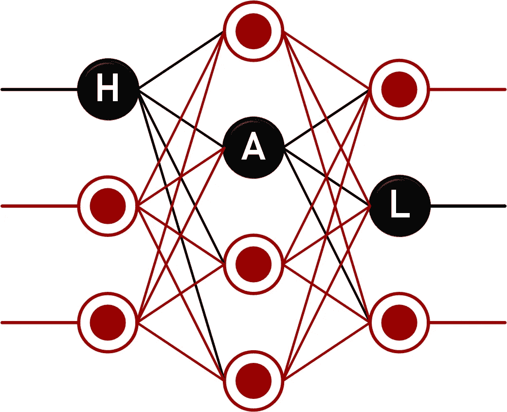

**Fig 1:** [Hardware Accelerated Learning](https://hal.usc.edu/)

就**计算**和**内存访问**而言，神经网络训练是昂贵的——大约是推理的三到五倍。当在边缘设备(连接到互联网边缘的设备——可穿戴设备、智能手机、无人驾驶汽车等)上训练神经网络时，这两个因素一起对净功率需求产生了显著影响。为了在这种边缘设备上进行实时训练和推理，计算量的减少是至关重要的。尽管已经提出了许多解决上述问题的方法，例如基于[稀疏度](https://arxiv.org/abs/1711.01343)、[修剪](https://arxiv.org/abs/1910.00724)和[量化](https://arxiv.org/abs/1702.03044)的方法，我们提出了另一种方法——在对数系统中设计端到端训练。注意，

*   为此，所有重要的神经网络操作都需要在 LNS 中定义。
*   在 LNS 中，乘法简化为加法。但是加法本身在计算上变得昂贵。
*   因此，我们借助**近似对数计算**，直觉地认为反向传播噪声容差能够吸收我们对数域运算的不确定性。

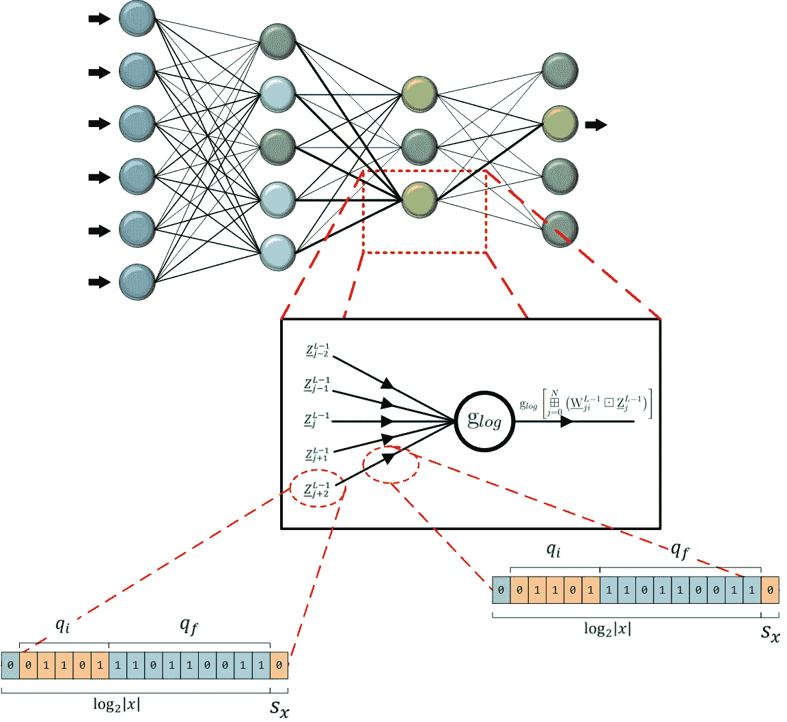

**Fig 2:** An LNS-DNN-MLP where the neurons have logarithmic activation functions and the activations and weights are in fixed point LNS

实数和对数之间的映射如下所示:

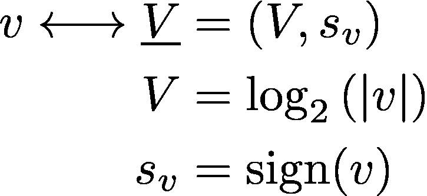

这种对数映射意味着需要修改向量空间ℝ的基本运算，这些运算是加法和乘法。在对数域中，乘法以加法换取计算复杂度。

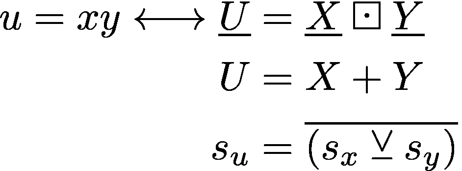

也就是说，乘法运算被消除，代之以加法运算。另一方面，添加是很棘手的。加法的确切形式如下所示，

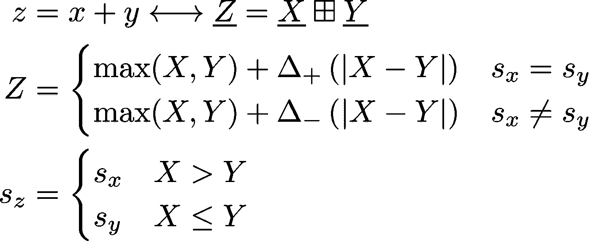

在对数域中执行加法时，δ项会导致非线性和大量额外计算。

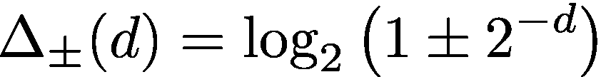

△ w.r.t. *d* 的图示清楚地显示了非线性。

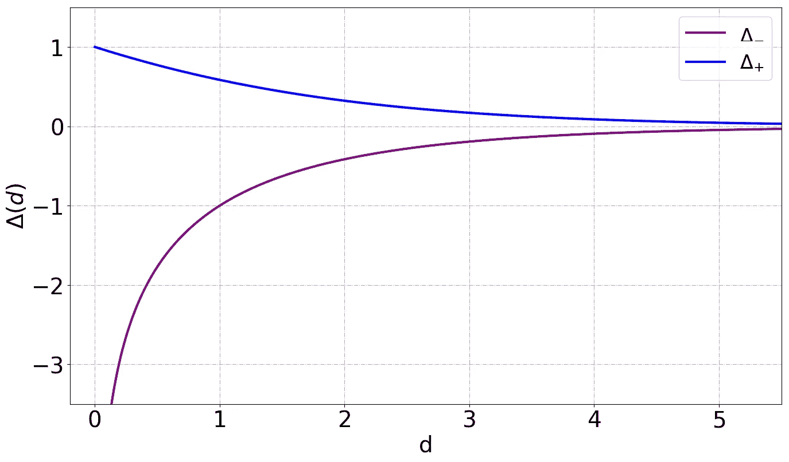

**Fig 3:** Correction term △

以类似的方式也可以定义减法，

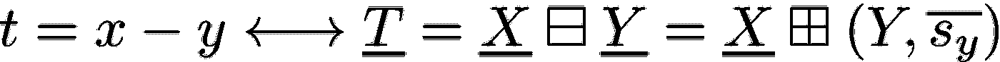

由于一次乘法现在只是一次加法，直观地说，我们可以推断出在对数域中求幂也将更简单，

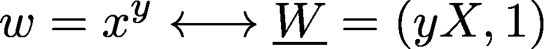

# 近似值

为了减少每次加法的计算量，我们决定把*加到大约*就可以了。这意味着我们需要在△项中引入近似值，因为计算这些校正项是加法运算中计算量最大的步骤。我们想到了两种主要的近似方法，接下来我们会介绍这两种方法，

## 基于 LUT 的近似

**思路:**将△项存储为由定点宽度、动态范围、分辨率三个参数指定的查找表。

*   当△项下降到 0 时，动态范围由定点宽度决定
*   分辨率是一个超参数
*   定点宽度是一个超参数

例如，下面我们展示了如何使用基于查找表的方法对图 3 中的曲线进行阶梯近似，

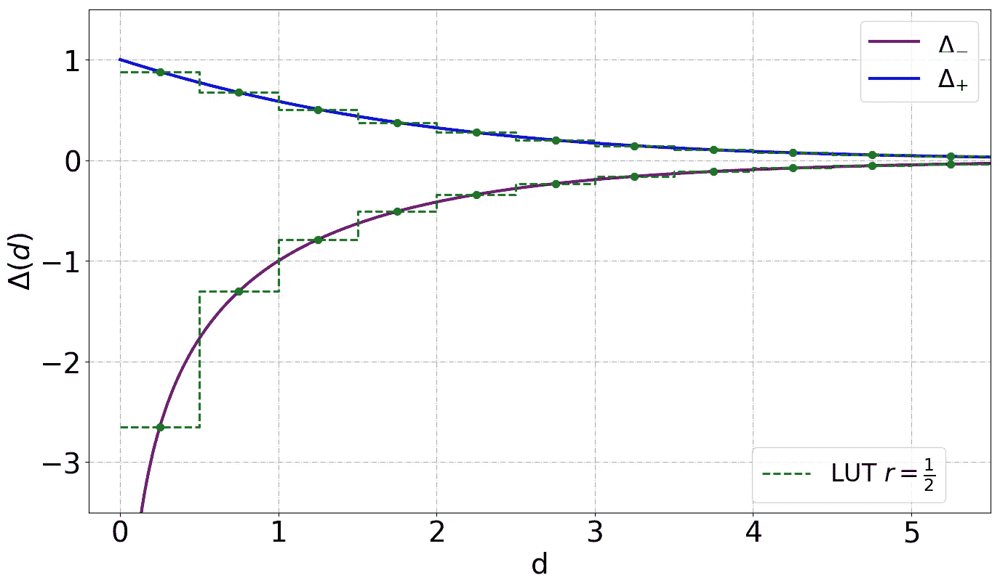

**Fig 4:** *r* (Resolution) = 0.5\. Inverting resolution gives the number of samples per consecutive integers.

另一个例子是由于更小的 *r* ，每个连续整数有更多的样本，因此查找表更大。

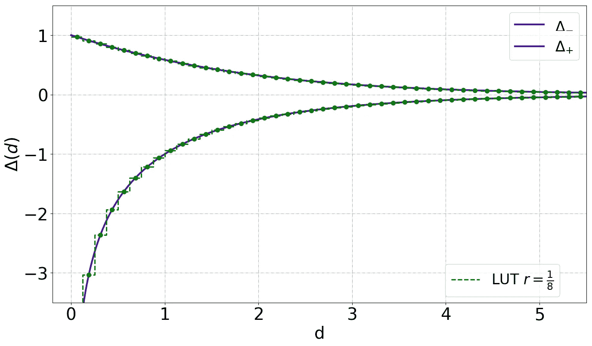

**Fig 5:** r = 0.125

## 基于位移的近似

以下表达式的泰勒级数近似给了我们:

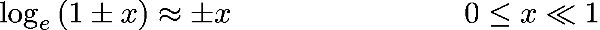

将这种近似应用于我们的表达式，

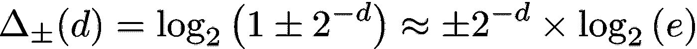

为了便于实现，常数项可以表示为 2 的幂的和，

我们可以将这种近似作为基于查找表的分辨率为 1 的近似的特例，即每个连续整数一个样本。我们在工作中实现的位移近似值显示在下面的图中。

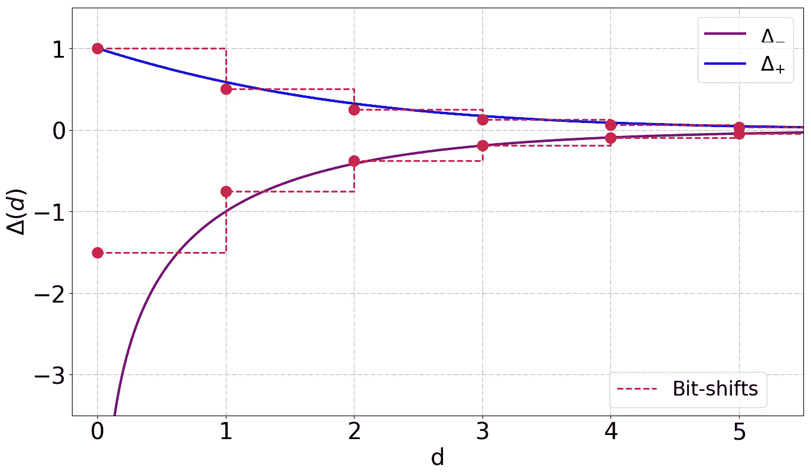

**Fig 6:** Constant term taken as 1 for the bit-shift approximation to the blue curve and as 1.5 for the same approximation to the purple curve.

# 对数域中的神经网络运算

现在使用上面描述的数学，我们可以在对数域中重新定义所有的神经网络操作。图 2 中突出显示了单个 LNS 神经元，在其*扇入*边缘上具有对数编码的定点权重，并从先前的神经元层获取对数编码的定点激活。它*对数累加(* ⊞ *)* 权重和激活的*对数域乘积(* ⊡ *)* ，在它通过激活函数之后，该激活函数本身是标准激活函数的对数图像。

## 激活—日志泄漏 ReLU

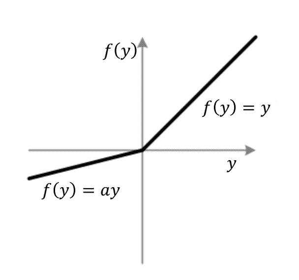

**Fig 7:** parametric Leaky ReLU

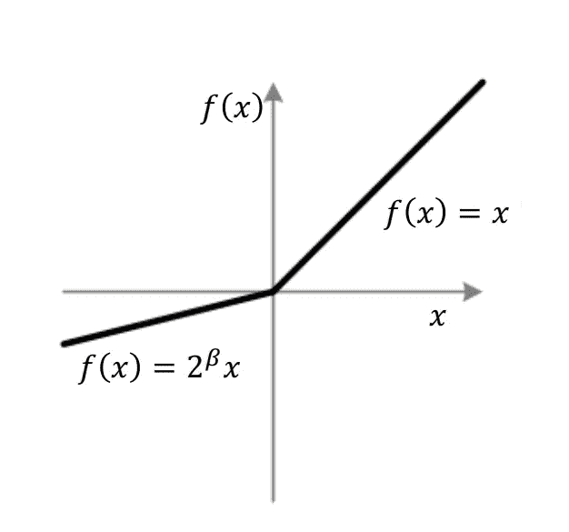

**Fig 8:** The log-Leaky ReLU

图 7 描绘了 Leaky ReLU，这是一种特殊的参数 ReLU，在 2015 年的论文中有所描述。在该图中，我们重写了常数 *a* ,这样我们就可以用公式表示我们的日志激活函数。图 8 中也描绘了相同的激活函数，但是常数表示为' *a'* 等于 2 的𝛽.幂在这种形式中，我们现在可以很方便地在对数域中表达“ReLU 图像”,利用我们使用的符号和我们迄今为止发展的数学。对数泄漏 ReLU 的数学方程如下所示，

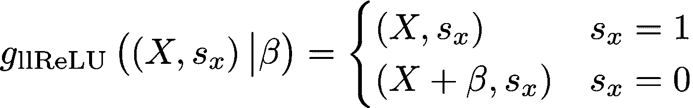

像 Leaky ReLU 一样，log-leaky ReLU 也是由单个超参数超参数化的，这就是上面给出的方程中的𝛽。

## 初始化 LNS 中的网络权重

*   我们不应该初始化从某个分布中采样的数十万个参数，然后取对数，而是应该使用标准的概率测量变化方法，直接在从我们期望的分布中导出的分布上初始化我们的参数。
*   权重从对称分布初始化。因此，符号参数可以随机初始化，并且独立于来自*伯努利(0.5)* 分布的幅度。
*   权重幅度分布减少到，

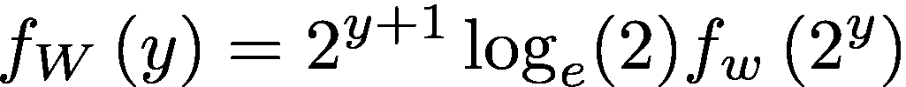

*   作为说明性的例子，假设通常对于神经网络，我们更喜欢从具有σ标准偏差的零均值正态分布中采样我们的初始权重和偏差值，那么在对数域中，符号参数应该从*伯努利(0.5)* 分布中采样，并且对数幅度应该从下面给出的分布中采样，

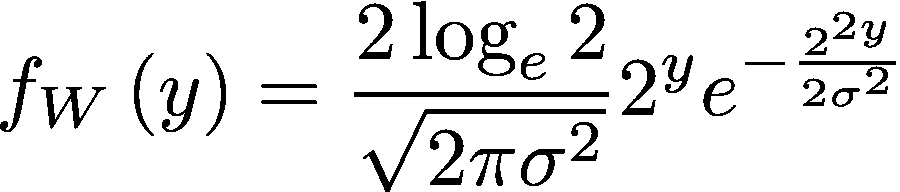

## LNS 神经网络中的 Softmax

在训练时，神经网络应该输出通常由软最大层产生的软决策。softmax 的数学表达式为:

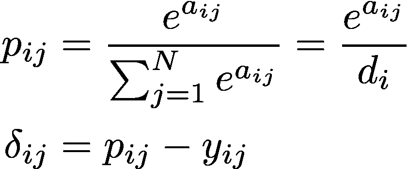

这里𝛿是反向传播初始化项， *𝑦* 是一次性输出标签。在对数域中，当我们意识到我们想要的是对数概率值时，我们可以简化这个过程。

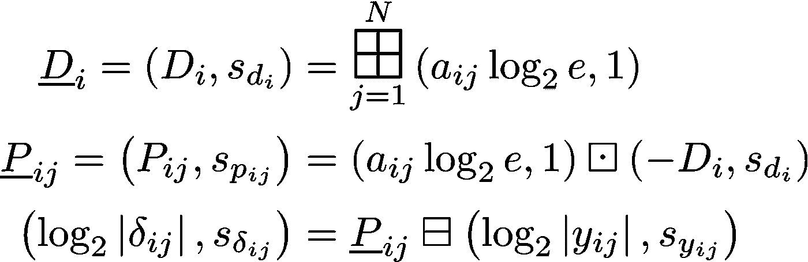

# 实验和结果

本节包含在我们的对数域 MLP 上执行的训练实验的详细描述，我们使用迄今概述的数学和神经网络 MLP 架构知识来设计该对数域。

## 对数域中的定点位宽分析

我们所有的神经网络训练和推理实验都是使用定点运算进行的。但是，当我们谈论对数域中的定点数学时，位宽是如何缩放的呢？确切地说，与线性域中的 16 位标准字相比，对数域字需要多少位才能在精度和动态范围方面具有表示能力？事实证明，我们可以分析并推导出一个悲观的最坏情况表达式，该表达式给出了在线性域*中精确表示特定位宽的信息所需的最大位数。*这里的术语“精确”是指满足线性域字长的精度和动态范围。

在这个等式中，符号有它们通常的含义。

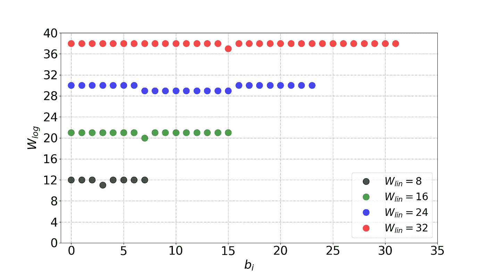

**Fig 9:** Log-domain bit-widths versus the integer bits in a linear-domain fixed-point representation

以图形方式直观显示这些信息通常更容易，因此图 9 显示了对数域中所需的位数，以准确描述以 1 字节倍数表示的信息。

在最坏的情况下，我们似乎需要额外的 *O(对数 Wₗᵢₙ)* 比特来满足精度要求。请注意，上面给出的分析有严格的要求，实际上对于手头的任务来说是多余的，在我们的实验中，我们发现使用 MLPs 使用相同的位宽效果很好。

## 数字结果

我们用于所有不同数据集的 MLP 具有相同的总体架构，超参数针对每个数据集进行了单独优化。

*   经过训练的 MLP 只有一个隐藏层。网络结构是每层 784–100–*n*个𝒸神经元，其中 *n* 𝒸是数据集中输出类的数量。
*   SGD 优化器与权重衰减正则化一起使用。12 位定点系统的训练需要比 16 位定点系统更高的正则化超参数λ。
*   近似⊞的查找表有 20 个元素，分辨率为 0.5。这些 lut 用于所有近似⊞运算，除了当计算 softmax 时，由于增加的精度要求，soft max 使用单独的表。用于近似⊞运算的 Softmax LUT 具有 640 个元素，分辨率为 0.015625。
*   在四个数据集上训练——每个数据集 20 个时期。基线训练也进行了 20 个时期。所有训练都在定点设置中完成。使用的数据集是 [MNIST](http://yann.lecun.com/exdb/publis/pdf/lecun-01a.pdf) 、[时尚-MNIST](https://arxiv.org/pdf/1708.07747.pdf) 、 [EMNIST 字母](https://arxiv.org/pdf/1702.05373.pdf)和 [EMNIST 数字](https://arxiv.org/pdf/1702.05373.pdf)。

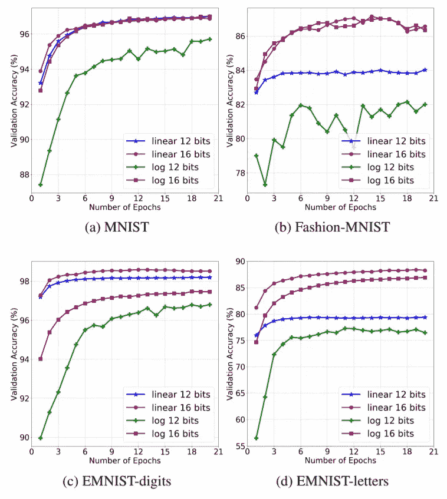

**Fig 10:** Performance Plots (Learning Curves)

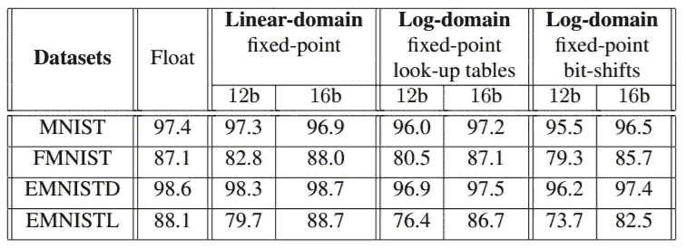

All numerical results are in percentage

有限精度线性和对数域训练的学习曲线如图 10 所示。在线性域中，使用 16 位定点表示，小数部分使用 11 位，与浮点相比，性能下降可以忽略不计。在对数域中，16 位表示使用 10 个分数位(即，由于符号需要额外的位)。当在 12 位系统上执行实验时，对于线性和对数域，分数位数分别保持在 7 和 6。应当注意，在所有情况下，图 10 中红色圆圈和紫色方块之间的精度损失不超过 1%。该表提供了定点线性处理和全对数域训练以及各种近似推理的测试集精度的比较。

## 参考

*   [论文链接](https://arxiv.org/pdf/1910.09876.pdf) —发表于 2020 年 IEEE 声学、语音和信号处理国际会议(ICASSP)。
*   [代码链接](https://github.com/arnabsanyal/lnsdnn)。