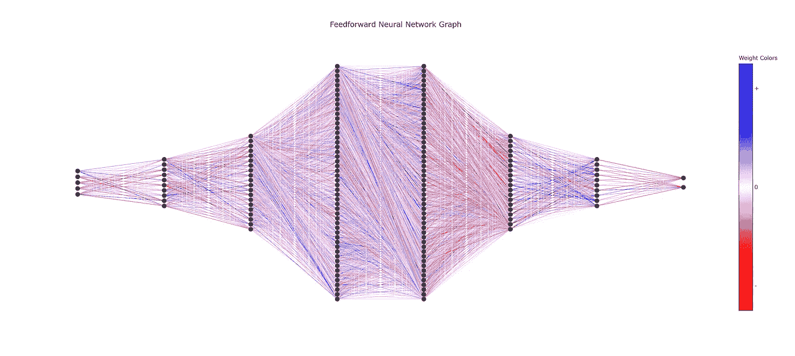
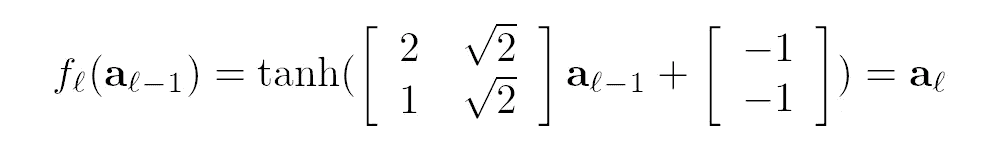
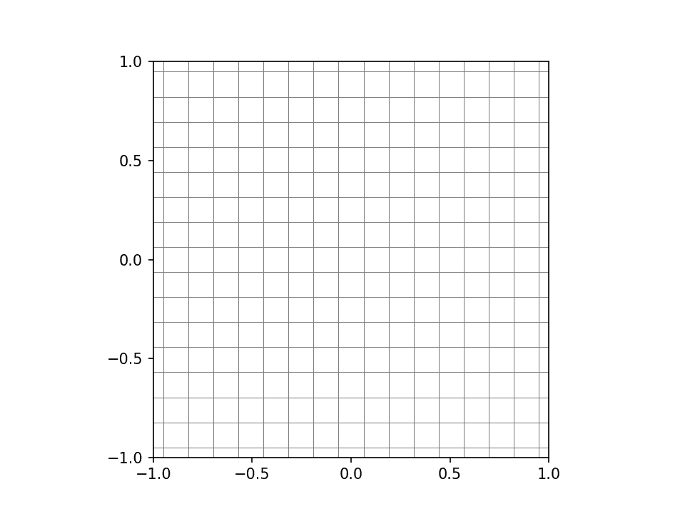
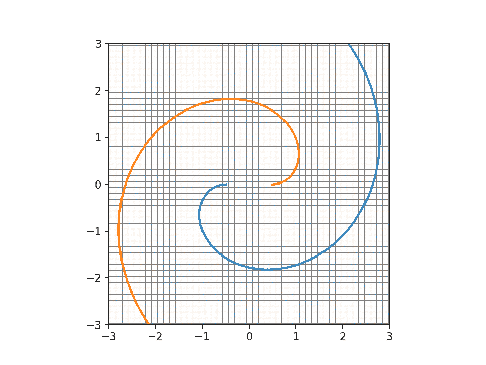
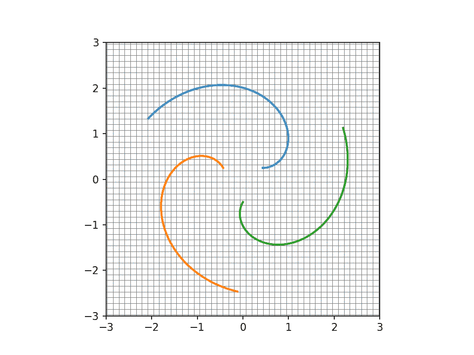

# 神经网络:为什么它们工作得这么好？

> 原文：<https://towardsdatascience.com/neural-networks-why-do-they-work-so-well-part-i-22f0d3690511?source=collection_archive---------18----------------------->

# 先决条件

这篇文章需要一些关键的数学对象和技术的知识。一般来说，了解这些要求是非常有用的，所以如果你不熟悉的话，我建议你研究一下。单击该主题中我最喜欢的资源的任何链接。

## 线性代数

1.  [矢量](https://youtu.be/fNk_zzaMoSs)
2.  [矩阵](https://youtu.be/kYB8IZa5AuE)

## 结石

1.  [偏导数](https://youtu.be/AXqhWeUEtQU)
2.  [链式法则](https://youtu.be/0T0QrHO56qg)

# 基础知识:输入和输出

神经网络是一个函数。它接受一些输入并将其映射到输出。更具体地说，神经网络是一种旨在进行预测的功能。

为了更好地理解这个定义，让我们看一个例子。假设我们希望根据我们掌握的关于您的一些数据来预测您是否患有心脏病:体重、身高、年龄、静息心率和胆固醇水平。

首先，我们可以将您的特征堆叠成一个向量 **x** ，如下所示:

为了获得神经网络对你患心脏病概率的预测，我们将 x 输入到模型中。这将输出 **y-hat** —模型对 p(心脏病)的预测。我们可以这样写(其中 *N* 是神经网络):

这里， **y-hat** 是 0 和 1 之间的连续值，因为它是概率。然而，真实值 **y** 是二进制的(即要么 1 要么 0)，因为你要么有心脏病(1)，要么没有(0)。

好吧！您现在对神经网络的作用以及它为什么有用有了大致的了解。但是，你仍然不知道神经网络是如何预测 y 和 T21 的。让我们再深入一点。

# 图层:🍰

*注意:在这一节中，我使用下划线后跟方括号来表示 Unicode 中没有的文本内下标字符。这里有一个例子:*

如前所述，神经网络是一个函数。但是，更具体地说，它是多种功能的组合。在深度学习中，这些功能被称为层。稍后我们将更多地讨论这些层是如何组成的，但现在，让我们只关注一层。

因为层是一个函数，它只是接收输入并产生输出。我们称这个函数为ℓ.层的 _[ℓ按照惯例， *f* _[ℓ】接收一个输入**a _**【ℓ-1】并产生一个输出**a _**【ℓ].】这里，**a _**【ℓ】被称为层ℓ.的*激活*

我们已经标记了 *f* _[ℓ]'s 输入和输出，但是层 *f* _[ℓ具体做什么呢？嗯， *f* _[ℓ】分三个阶段映射**a _**【ℓ-1】→**a _**【ℓ】。以下是每种情况下发生的情况:

1.  首先，权重矩阵 **W** 应用线性变换→ **W a** _[ℓ-1】
2.  然后，添加一个偏置向量**b**→**w a**_[ℓ-1】**+**b****
3.  **最后，应用非线性激活函数σ→σ(**w a**_[ℓ-1】**+**b**)****

****这个序列可以用下面的等式来概括:****

********

****好了，我们对图层的功能做了一些数学标记。但是我不确定我们是否真正理解了什么是层*在做*。让我们试着通过视觉化来更好地感受一下 _[ℓ是如何改变空间的。****

****为了可视化 *f* _[ℓ】，我们将需要处理低维(1、2 或 3)输入和输出。对于这个可视化，我们将有一个 2D 输入和一个 2D 输出。这意味着输入 **a** _[ℓ-1] ∈ ℝ，输出**a**_[ℓ】∈ℝ。我们也可以说 *f* _[ℓ】映射ℝ → ℝ。视觉上，这意味着 2D 空间中的每个点都通过 *f* _[ℓ].映射到 2D 空间中的一个新点****

****为了绘制出 *f* _[ℓ】如何在 2D 空间中操纵每个点，我们需要为σ选择一个函数，为 **W** 、选择一个矩阵，为 **b** 选择一个向量。对于这个可视化，我们将选择σ、 **W、**和 **b** ，如下所示:****

********

****现在我们有了这个具体的函数，我们可以展示它如何影响 2D 空间中的每一点。为了了解发生了什么，我们将只显示位于网格上的点。考虑到这一点，让我们制作一个可视化:****

********

****A visualization of a layer *f*_[ℓ] mapping ℝ² → ℝ².****

****注意图层 *f* _[ℓ】是如何通过三种不同的变换得到ℝ的每一个点的。首先， **W** 拉伸 2D 空间，同时保持所有线条平行。然后， **b** 将空间从原点移开。最后，σ smooshes 空间不考虑保持网格线平行。当 *f* _[ℓ】完成其转换时，根据 *f* _[ℓ].，每个输入激活 **a** _[ℓ-1】将从其原始位置移动到其相应的输出激活 **a** _[ℓ】****

****很好，但是，为什么这很有用？嗯，就其本身而言，单一的一层并不一定有用。只有当我们组合它们的时候，层才真正变得有用。再来说说这是怎么做到的。****

# ****组成:y = f(f(f(x)))****

****如前所述，我们可以通过组成层来构建神经网络。组合层意味着我们将一个层的输出激活输入到下一个层的输入中。****

****一旦我们连接好每一层，我们就可以将输入 **x** (也称为 **a** _[0】)送入第一层 *f* _[1】。第一层 *f* _[1】将其输出激活 **a** _[1】馈入 *f* _[2】，后者将其激活 **a** _[2】馈入 *f* _[3】等等。直到最终到达网络的最后一层 *f* _[L】，并且产生输出 **y-hat** (也称为 **a** _[L】)作为对 **y** 的预测。****

****作为这个过程在数学上的一个例子，这里有一个三层神经网络****

********

****太好了！这就概括了什么是神经网络*和*。但是，仍然不清楚为什么一系列合成层对预测有用。为了获得更好的直觉，让我们做另一个可视化。****

****像最后一个可视化一样，我们将在ℝ处理输入，在ℝ处理输出。这里的关键区别是，我们将展示整个神经网络如何改变ℝ，而不是展示一个层如何改变ℝ。为了保证整个过程可以可视化，每一层的 *N* ( *f* _[1】， *f* _[2】， *f* _[3]，…， *f* _[L])也会映射ℝ → ℝ。这让我们可以看到神经网络转变的每一步都发生了什么。****

****对于这个可视化，我还将绘制两条属于橙色或蓝色类的螺旋。这些螺旋将有助于证明网络的有用性。考虑到所有这些，我们得出了以下结论:****

********

****A visualization of a neural network separating 2 spirals by mapping ℝ² → ℝ².****

****很酷，对吧？让我们把这个再打开一点。****

****首先，注意每一层是如何一层接一层地应用的。第一层 *f* _[1】映射**a**_[0】→**a**_[1】。第二层 *f* _[2】映射**a**_[1】→**a**_[2】。第三层 *f* _[3】映射**a**_[2】→**a**_[3】以此类推。直到最后*f*_【L】映射**a**_【L-1】→**a**_【L】(即 **y 帽**)。这只是遵循了神经网络的基本定义。****

****接下来，注意网络的每一层是如何一点一点地分离橙色和蓝色螺旋的。在每个阶段，当前的转换都建立在前一个转换的进度之上。通过这个过程，网络正在为橙色和蓝色点中的每一个点形成其*预测*。当映射最终结束时，输入点 **x** 落在模型对 **x** 的类别的预测上——橙色(-1，-1)或蓝色(1，1)。在这里，模型似乎做得相当不错。****

****但是神经网络有用的原因与这个具体的例子无关。模型的威力在于它的*灵活性*。因为每一层ℓ都可以有它自己的σ_[ℓ]， **W** _[ℓ】，**t11】和 **b** _[ℓ】，所以理论上该模型可以采取无限的配置。******

**这意味着神经网络可以做的不仅仅是分离这些橙色和蓝色的螺旋。事实上，它可以在所有不同的配置中分离大量不同的点。它不仅仅可以分离点。事实上，它几乎可以近似任何变换(即函数)。这使得该模型适用于大量的问题。**

**这是神经网络的另一个例子。这个把三个螺旋分开。**

****

**A visualization of a neural network separating 3 spirals by mapping ℝ² → ℝ².**

**但是等一下。一个模型*究竟如何知道*如何逼近一个给定的函数？当然，它使用了一系列的层。但是这些层如何知道如何使自己对给定的问题有用呢？更具体地说，神经网络中的每一层如何弄清楚如何设置其参数σ、 **W、**和 **b** 来完成一些有用的事情？**

**我将把这个问题留到下一篇文章，在那里我们将开始探索神经网络如何学习它的σs、 **W** s **、**和 **b** s。**

> **如果你想知道我是如何在本文中创建可视化效果的，请查看我在 GitHub 上的[机器学习模型](https://github.com/isaiahnields/machine-learning-from-scratch)库。**