# 用 Numpy 从零开始的神经网络第 1 部分:简介

> 原文：<https://towardsdatascience.com/neural-networks-with-numpy-for-absolute-beginners-introduction-c1394639edb2?source=collection_archive---------16----------------------->

## 在本教程中，您将简要了解什么是神经网络以及它们是如何发展起来的。最后，你会对网络如何学习有一个简单的直觉。

人工智能已经成为当今最热门的领域之一，我们大多数人都愿意从神经网络开始进入这个领域。！

但是在面对神经网络的数学密集型概念时，我们最终只是学习了一些框架，如 Tensorflow、Pytorch 等。，用于实现深度学习模型。

而且，仅仅学习这些框架，不理解底层概念，就像是在玩黑盒。

无论你是想在工业界还是学术界工作，你都将工作、调整和摆弄那些你需要清楚了解的模型。工业界和学术界都希望你对这些概念有充分的了解，包括数学。

在这一系列教程中，我将通过提供一步一步的解释使理解神经网络变得极其简单。此外，你需要的数学将是高中水平。

让我们从人工神经网络的诞生开始，并获得一些关于它如何进化的灵感。

# 一点点神经网络进化的历史

必须指出的是，在 1950-2000 年期间开发的大多数神经网络算法和现在存在的算法都受到了我们大脑、神经元、它们的结构以及它们如何学习和传输数据的高度启发。最受欢迎的作品包括《感知机》(1958)和《新认知机》(1980)。这些论文对解开大脑密码非常有帮助。他们试图用数学方法建立我们大脑中神经网络的模型。

而一切都是在 1986 年 AI 的教父 Geoffrey Hinton 制定了反向传播算法(没错！你学的东西都 30 多岁了！).

# 生物神经元

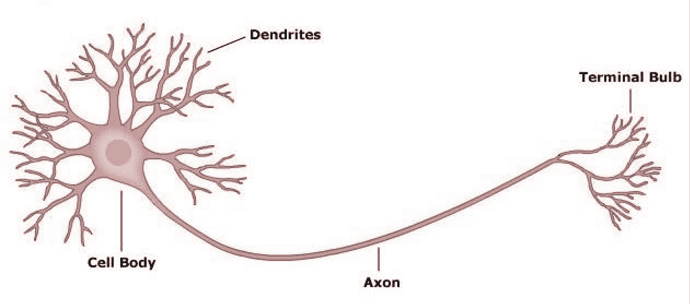

上图显示了一个生物神经元。它有从神经元接收信息的树突。接收到的信息被传递到神经元的*细胞体或细胞核*。*核*是信息被处理并通过*轴突*传递给下一层神经元的地方。

我们的大脑由大约 1000 亿个这样的神经元组成，这些神经元通过电化学信号进行交流。每个神经元都与 100 个或 1000 个其他神经元相连，这些神经元不断地发送和接收信号。

但是仅仅通过发送电化学信号，我们的大脑是如何处理这么多信息的呢？神经元如何理解哪个信号重要，哪个不重要？神经元如何知道向前传递什么信息？

电化学信号由强信号和弱信号组成。强信号是支配重要信息的信号。因此，只有强信号或它们的组合才能通过细胞核(神经元的 CPU)，并通过轴突传递给下一组神经元。

但是怎么有些信号强，有些信号弱呢？

嗯，经过数百万年的进化，神经元对某些信号变得敏感。当神经元遇到特定的模式时，它们被触发(激活)，并因此向其他神经元发送强信号，因此信息被传输。

我们大多数人还知道，我们大脑的不同区域被激活(或接受)不同的行为，如视觉、听觉、创造性思维等。这是因为属于大脑中特定区域的神经元被训练成更好地处理特定类型的信息，因此只有在特定类型的信息被发送时才会被激活。下图让我们更好地了解了大脑的不同接收区域。

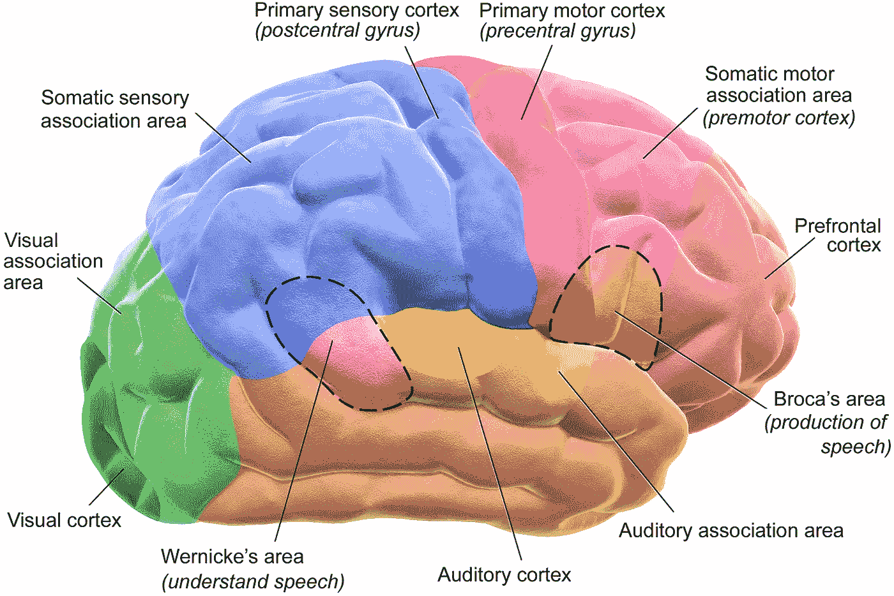

Different regions of the cortex

如果是这样的话……可以让神经元对不同的模式敏感吗(例如，如果它们真的基于某些模式变得敏感了)？

通过神经可塑性已经表明，大脑的不同区域可以被重新连接以执行完全不同的任务。例如负责触觉的神经元可以被重新连接，变得对气味敏感。看看下面这个很棒的 TEDx 视频，了解更多关于神经可塑性的知识。

TEDx video on Neuroplasticity[[Source](https://www.youtube.com/watch?v=xzbHtIrb14s)]

但是神经元变得敏感的机制是什么呢？

不幸的是，神经科学家仍在试图找出答案！！

但幸运的是，AI Geff 的上帝之父通过发明反向传播挽救了这一天，反向传播为我们的人工神经元完成了同样的任务，即，使它们对某些模式敏感。

在下一节中，我们将探索感知器的工作，并获得数学直觉。

# 感知器/人工神经元

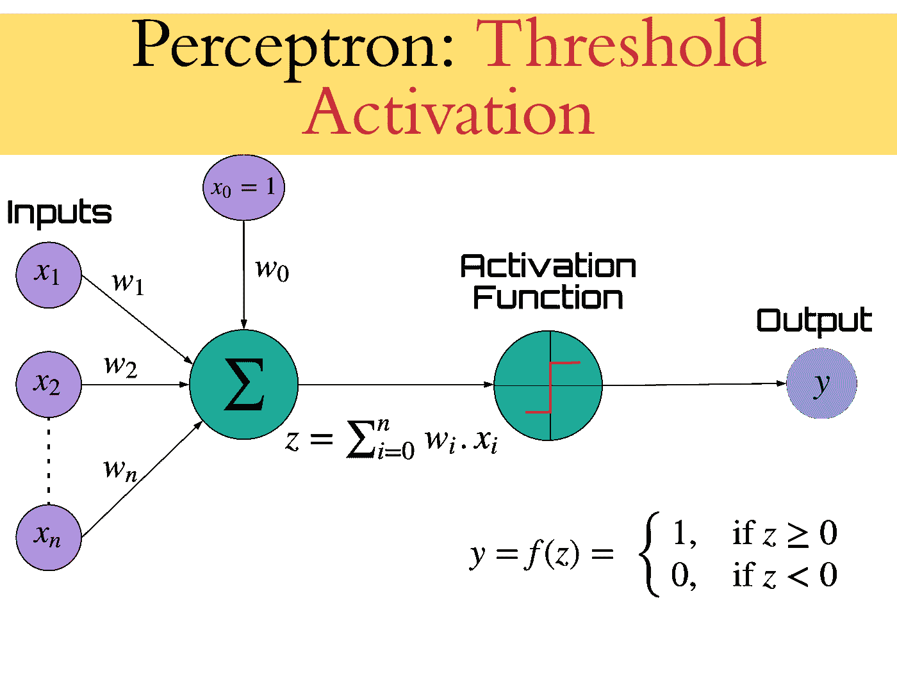

A Perceptron Model

从图中，您可以观察到感知器是生物神经元的反映。与权重( *wᵢ* )结合的输入类似于树突。这些值被求和并通过激活函数(类似于图 1 所示的阈值函数)。这类似于原子核。最后，激活的值被传输到下一个神经元/感知器，其类似于轴突。

潜在权重( *wᵢ* )乘以每个输入( *xᵢ* )描述了相应输入信号的重要性(强度)。因此，权重值越大，特征越重要。

您可以从这个架构中推断出，权重是感知器中学习的内容，以便达到所需的结果。还学习了附加偏置( *b* ，这里是 *w₀* )。

因此，当有多个输入(比如 *n* )时，等式可以概括如下:

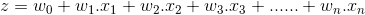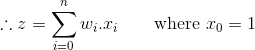

最后，求和的输出(假设为 *z* )被馈送到*阈值激活函数*，在此函数输出

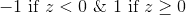

# 一个例子

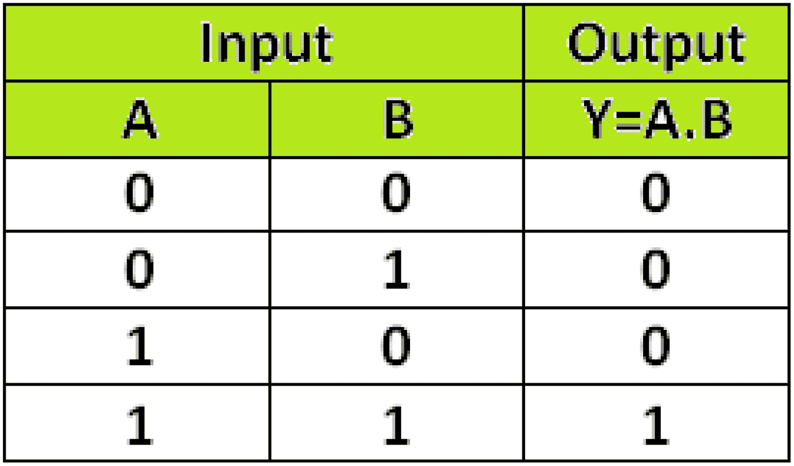

让我们考虑我们的感知器作为*逻辑门*来获得更多的直觉。

让我们选择一个*和门*。闸门的真值表如下所示:

用于*与门*的感知器可以如图所示形成。很明显，感知机有两个输入(这里 *x₁ = A* 和 *x₂ = B* )。

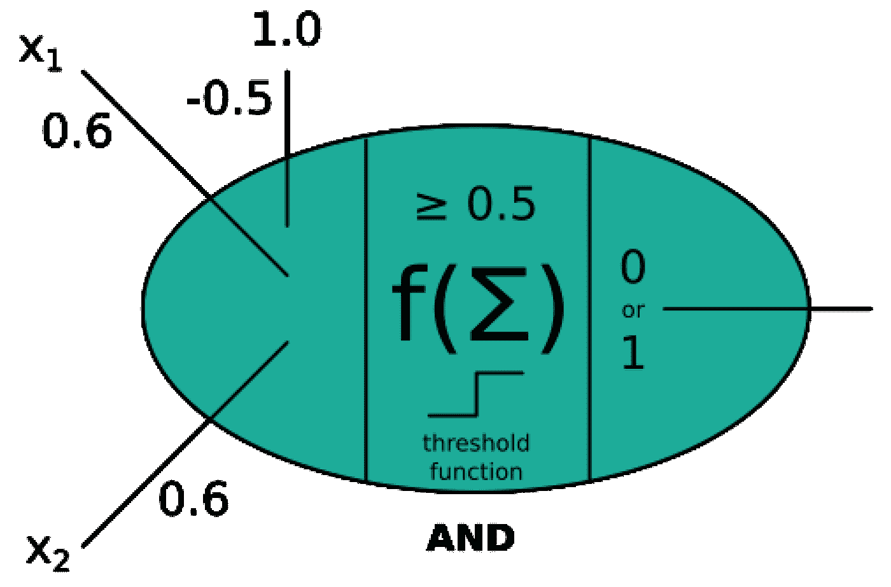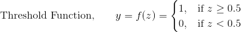

我们可以看到，对于输入 *x₁、x₂* 和 *x₀* = 1，设置它们的权重为

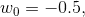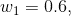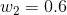

并且保持*阈值函数*作为激活函数，我们可以到达*与门*。

现在，让我们动手把它整理出来，并测试一下！

```
1
```

类似地，对于*或非门*，真值表为:

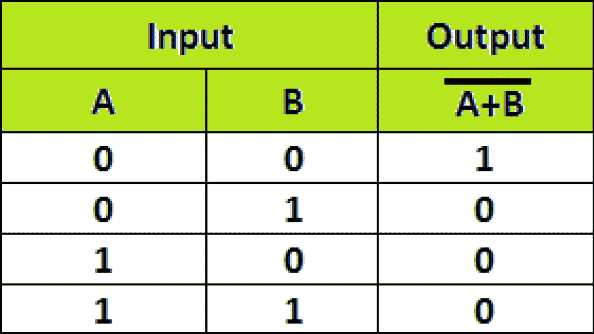

*或非门*的感知器如下:

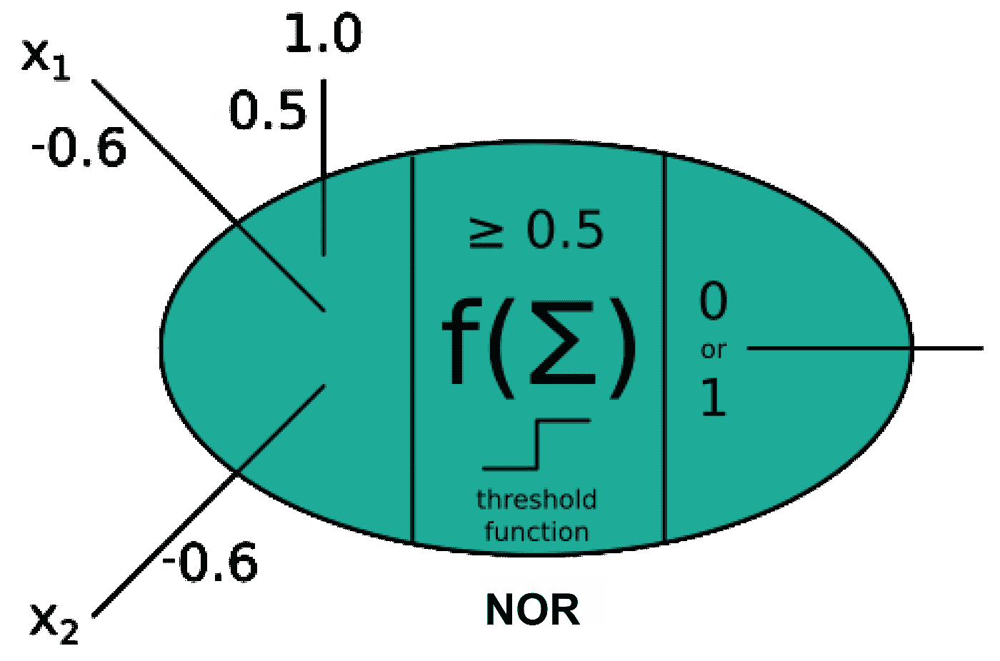

您可以将权重设置为

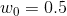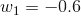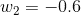

从而获得一个*或非门。*

您可以继续用代码实现它，如下所示:

```
0
```

# 你实际计算的…

如果你分析你在上面的例子中试图做的事情，你会意识到你实际上是在试图调整权重的值来获得所需的输出。

让我们考虑一下*或非门*的例子，并将其分解成非常小的步骤，以便获得更多的理解。

你通常首先要做的是简单地设置一些权重值，然后观察结果，比如说

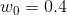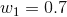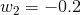

那么输出将如下表所示:

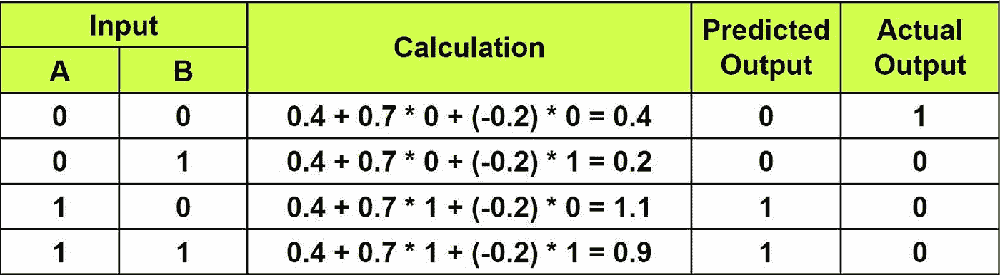

那么，如何固定权重值，以便获得正确的输出呢？

凭直觉，你可以很容易地观察到 *w₀* 必须增加而 *w₁* 和 *w₀* 必须减少或者更确切地说是变负，这样你就获得了实际的输出。但是，如果你打破这种直觉，你会发现你实际上是在寻找实际输出和预测输出之间的差异，并最终反映在重量上…

这是一个非常重要的概念，你将会更深入地挖掘它，它将会成为阐明*梯度下降*和*反向传播*背后的思想的核心。

# 你学到了什么？

*   神经元必须对某种模式敏感，才能识别它。
*   因此，类似地，在我们的感知器/人工神经元中，**权重是要学习的**。

在后面的文章中，你将完全理解如何训练权重来识别模式，以及现有的不同技术。

稍后您将会看到，神经网络与生物神经网络的结构非常相似。

虽然在本文的第一部分我们确实只学到了一些小概念(尽管非常重要),但它们将作为实现神经网络的坚实基础。此外，我将这篇文章写得短小精悍，这样太多的信息不会一下子被丢弃，会有助于吸收更多的信息！

在下一篇教程中，你将详细学习**线性回归**(也可以称为具有线性激活功能的感知器)并实现它们。详细描述并实现了帮助学习权重的**梯度下降算法。最后，在线性回归的帮助下，你将能够**预测事件**的结果。所以，请阅读下一篇文章来实现它吧！**

你可以点击这里查看文章的下一部分:

[](https://medium.com/@surajdonthi95/neural-networks-with-numpy-for-absolute-beginners-part-2-linear-regression-e53c0c7dea3a) [## 绝对初学者用的带 Numpy 的神经网络第 2 部分:线性回归

### 在本教程中，您将详细学习使用 Numpy 实现预测的线性回归，并可视化…

medium.com](https://medium.com/@surajdonthi95/neural-networks-with-numpy-for-absolute-beginners-part-2-linear-regression-e53c0c7dea3a)