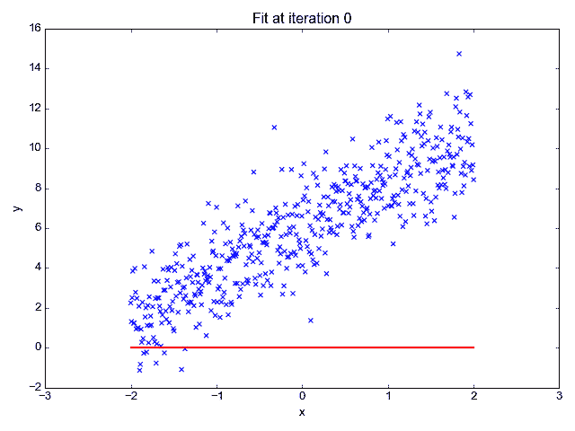
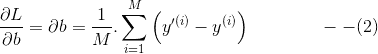
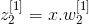

# 用 Numpy 从零开始的神经网络第 2 部分:线性回归

> 原文：<https://towardsdatascience.com/neural-networks-with-numpy-for-absolute-beginners-part-2-linear-regression-e53c0c7dea3a?source=collection_archive---------7----------------------->

## 在本教程中，您将详细学习使用 Numpy 实现预测的线性回归，并直观了解算法如何逐时段学习。除此之外，您将探索两层神经网络。

在上一个教程中，你对感知器有一个非常简单的概述。

[](/neural-networks-with-numpy-for-absolute-beginners-introduction-c1394639edb2) [## 神经网络从零开始与 Numpy:简介

### 在本教程中，您将简要了解什么是神经网络以及它们是如何发展起来的。在…

towardsdatascience.com](/neural-networks-with-numpy-for-absolute-beginners-introduction-c1394639edb2) 

在本教程中，您将深入研究实现一个线性感知器(线性回归),从中您将能够预测问题的结果！

本教程显然会包括更多的数学知识，因为这是不可避免的，但没有必要担心，因为我会解释它们。不管这些，必须认识到，所有的机器学习算法基本上都是最终以代码形式实现的数学公式。

在我们开始之前，还记得我们用阈值激活函数来模拟与门和或非门的功能吗？！

这里我们将使用另一个极其简单的激活函数，叫做线性激活函数(相当于没有任何激活！).

让我们来看看这个激活功能能带来什么样的奇迹吧！

# 线性激活函数

假设感知器只有一个输入和偏差，如下所示:


Computation graph of Linear Regression

得到的线性输出(即和)将是

。这是直线的方程式，如下图所示。


Graph of Linear Equation

这里必须注意，当没有使用激活函数时，我们可以说激活函数是线性的。

这是一个**多元(多变量)线性方程。**

让我们看看这是如何用于预测下一部分中的 ***y*** 的实际输出，即 ***线性回归*** 。

# 线性回归

在 ***n*** 维空间中对给定的一组数据拟合一个线性方程称为**线性回归**。下面的 GIF 图像显示了一个线性回归的例子。



Linear Regression [[Source Link](https://camo.githubusercontent.com/310f1cd8eb881d776474abb62acf1d17a911c2e4/68747470733a2f2f63646e2d696d616765732d312e6d656469756d2e636f6d2f6d61782f313630302f312a656549766c776b4d4e473177536d6a334652364d32672e676966)]

简单来说，你试着找出最符合上图所示点集的 ***m*** 和 ***b*** 的最佳值。当我们获得了可能的最佳拟合时，我们可以预测给定***×的 ***y*** 值。***

一个很通俗的例子就是*房价预测*问题。在这个问题中，给你一组值，比如房子的面积和房间的数量等等。你必须预测给定这些价值的房子的价格。

所以，最大的问题是…预测算法是如何工作的？它是如何学会预测的？

让我们边走边学吧！

让我们从导入所需的包开始。

您将使用`sklearn`数据集生成器来创建数据集。您还将使用该包将数据分为训练数据和测试数据。如果你不知道`sklearn`，它是一个丰富的包，有很多机器学习算法。尽管您获得了用于执行线性回归的预建函数，但在本教程中，您将从头开始构建它。

为了创建数据集，您必须首先设置一个超参数列表，而 ***m*** 和 ***b*** 是参数、样本数量、输入特征数量、神经元数量、学习速率、训练的迭代次数/次数等。被称为超参数。在实现算法时，您将了解这些超参数。

现在，您应该设置训练样本的数量、输入特征的数量、学习速率和时期。你很快就会明白学习的速度和时代。

您的第一个任务是导入或生成数据。在本教程中，您将使用`sklearn`的`make_regression`函数生成数据集。

出于学习的目的，我们将保持特征的数量最少，以便于可视化。因此，您必须只选择一个特征。

现在，是时候想象一下数据生成器做了什么了！


让我们检查矢量形状的一致性。

```
Shape of vector X: (200, 1) Shape of vector y: (200,)
```

我们需要将 ***y*** 的大小重置为`(200, 1)`，这样我们就不会在向量乘法过程中出错。

```
(200, 1)
```

接下来，您必须将数据集分为定型集和测试集，以便在定型模型后，可以使用数据集的一部分来测试回归模型的准确性。

现在让我们将数据分为训练集和测试集。

在我们的例子中，训练集是 80%，测试集是 20%。

让我们检查所创建的训练和测试数据集的形状。

```
(160, 1) (160, 1) (40, 1) (40, 1)
```

如您所见，80%的数据，即 200 个数据点中的 80%是正确的 160。

> 那么，到目前为止我们取得了什么成就？

我们已经完成了最初的**数据预处理**，并且**还通过可视化对数据**进行了探索。这通常是建模任何机器学习算法的第一步。我们还拆分了数据，以便在模型训练完成后测试其准确性。

> 我们下一步做什么？

清晰的如上面的线性回归 GIF 图所示，我们首先需要考虑一条随机线，然后通过训练将其拟合到数据上。

因此，下一步是随机**生成一条具有随机斜率和截距(偏差)**的直线。目标是实现与生产线的最佳匹配。

现在，给定***m***&***b***，我们就可以绘制生成的直线了。

让我们更新函数`plot_graph`来显示预测线。


由于现在已经生成了直线，您需要预测它为给定的 ***x*** 值产生的值。根据这个值，我们要做的就是计算它们的均方误差。为什么？

> 我们怎样才能发现实际产量和预测产量之间的差异呢？

最简单的方法是减去这两个差值。我们有一条随机线，它为每个给定的 ***x*** 给出一个输出`y_pred`，但它肯定不是实际输出。幸运的是，我们也有所有 ***x*** 的实际输出！因此，我们要做的不是直接取差(技术上称为绝对距离或 L1 距离)，而是将其平方(称为欧几里德距离或 L2 距离)，并取所有给定点的平均值&这称为*均方误差*。

现在让我们通过定义一个函数`forward_prop`根据参数***m***&***b***来预测`y_pred`的值。

# 成本/损失函数

如前所述，现在您已经得到了`X_train`的相应值和`y_pred`的预测值，您将计算成本/误差/损失函数。

*损失(均方误差)*为:


对所有 *M* 例求和，得到*损失 fn。*如下:


我们的目标是将*损失*明显降至最低，使回归线预测更准确。

让我们现在就把它编纂成法典。

您还可以保存 ***损耗*** 的每个值，这些值将被计算出来，以图形方式显示它在训练中的变化。

```
4005.265725705774
```

让我们修改上面定义的`plot_graph`函数来绘制损失。

您会看到由参数 ***m*** 和 ***b*** 创建的直线。


既然你已经计算了损失，让我们把它减到最小。

# 线性回归的梯度下降法

由于*损失*是因变量而***m***&***b***是自变量，我们将不得不更新***m***&***b***以便找到最小的 ***损失*** 。

所以，迫在眉睫的问题是…

> 如何更新参数 **m** 和 **b** ？

例如，让我们仅考虑如下所示的单个参数 ***p*** ，并让**(目标)*成为必须预测的值。我们看到，随着 ***成本*** 收敛到最小值，参数 ***p*** 达到一个称为最优值的特定值。假设 ***p*** 的最优值为 ***a*** 。*

**

*Gradient Descent w.r.t **p.** [[Source Link](https://camo.githubusercontent.com/a401a48f5503c52004369148a784e779aa7e3411/68747470733a2f2f63646e2d696d616765732d312e6d656469756d2e636f6d2f6d61782f313630302f312a70775049472d475748796150564d564747354f6841512e676966)]*

*你可以从这张图表中观察到一些情况。*

*从图中可以清楚地看到，随着 ***p*** 向***【a(minima)***移动，成本降低，随着远离它，成本增加。*

*现在，如何才能让 ***p*** 朝着*a 移动，而不管是如图所示的 ***a*** 的左边还是右边？**

**让我们考虑曲线的 ***p*** 。从微积分中我们知道，一条曲线在一点的**斜率** 由**d*y/*d*x*给出(这里是**d*L/*d*p****其中 ***L →损耗*** )。从图中可以看出，当 ***p*** 在 ***a*** 的左边时， ***斜率*** 显然是*而当它在右边时， ***斜率*** 就会是 ***+ve*** 。但是我们看到，如果 ***p*** 在 ***a*** 的左边，就必须给 ***p*** 加一些值。同样，当 ***p*** 在 ***a*** 的右边时，必须减去一些值。******

****

**Source: [https://imgflip.com/i/2dz47q](https://imgflip.com/i/2dz47q)**

**这就意味着当**是****ve****时就隐含着 ***p = p +(有些 val。)*** 和当 ***斜率*** *是****+ve****寓意***p = p ‖(有些 val。)*** 向 ***移动一个*** 。*******

****∴** 我们从 ***p*** 中减去 ***斜率*** 。这样， ***斜率*** 被取反，确保其始终向 ***a*** 移动。得到的等式将是，**

************

**还必须观察到，如果 ***成本*** 过高，则 ***斜率*** 也会过高。于是，当从****p***值中减去*斜率时，可能会过冲*。因此，有必要减小 ***斜率*** 的值，使得 ***p*** 不会过冲 ***a*** 。因此，我们给*斜率引入一个叫做 ***学习率【α】***的阻尼因子。稍后你会看到，通过改变*α，误差下降的速率会发生变化。*******

***我们最终得到的是，***

******

***如图所示， ***p*** 对 ***cost*** 所走的轨迹是一条钟形曲线。***

**这种方法叫做**梯度下降**。**

**在我们的例子中，我们使用两个参数 ***m*** 和 ***b*** 。因此，钟形曲线将是 *3-* 尺寸，如下图所示。**

****

**Gradient Descent w.r.t to parameters **m** and **b**.[[Source](https://camo.githubusercontent.com/b9d3586045436ffb04c29c82923bec26d494eb1c/68747470733a2f2f6d656469612e67697068792e636f6d2f6d656469612f4f3972635a566d5263454771492f67697068792e676966)]**

**如上所述，您将计算损失函数 w.r.t 对参数***m***&***b***的偏导数。【**注:**通常期望你知道偏导数的基本概念。然而，如果你没有，你可以参考这个奇妙的[可汗学院视频](https://www.khanacademy.org/math/multivariable-calculus/multivariable-derivatives/partial-derivatives/v/partial-derivatives-introduction)**

****************

**Source: [https://i.chzbgr.com/full/2689942016/h8B269F68/](https://i.chzbgr.com/full/2689942016/h8B269F68/)**

# **更新参数**

**现在我们从它们各自的导数中减去参数 ***m*** 和 ***b*** 的斜率以及阻尼因子 ***α(alpha)*** 。**

********

**从减小 ***m*** 和 ***b*** 的值开始，它们逐渐向最小值移动。因此，以这种方式更新参数必须进行多次迭代，这被称为 ***时期*** 。**

**让我们定义一个函数`grad_desc`，它同时调用`gradient`和`update_params`。**

**我们现在已经定义了我们需要的一切，所以让我们把所有的函数编译成一个，看看我们的算法是如何工作的。因此，在实际运行代码之前，您必须设置超参数。**

****

```
**Epoch: 0 
Loss = 2934.082243250548Epoch: 
10 Loss = 1246.3617292447889**
```

****

```
**Epoch: 20 
Loss = 546.310951004311**
```

****

```
**Epoch: 30 
Loss = 255.88020867147344**
```

****

```
**Epoch: 40 
Loss = 135.36914932067438**
```

****

```
**Epoch: 50 
Loss = 85.35744394597806**
```

****

```
**Epoch: 60 
Loss = 64.60029693013243**
```

****

**由于您已经训练了 60 个时期的参数，并且回归线看起来符合数据，您可以前进到最后一个阶段，即预测我们的测试数据并检查准确性。**

# **预言；预测；预告**

**为了检查准确性，您可以取所有测试数据点的百分比误差的平均值。**

****

```
**Prediction: 
Loss = 56.53060443946197 
Accuracy = 80.1676%Hence 
m = 82.34083095217943 
b = 0.46491578390750576**
```

**如上图所示，考虑到数据中的差异，准确度为 80%,这是“可以的”。**

**我希望在文章中引入一些真正有趣的东西，作为奖励，我还加入了神经网络的介绍。但这肯定伴随着一个陷阱！**

# **具有线性激活函数的两层神经网络**

**神经网络如下所示。**

****

**从图像中，我们观察到第一层中的两个神经元各有两个输入，第二层中有一个输出神经元。**

**我们将使用矩阵来表示上述方程。我们可以用向量(单列矩阵)形式将它们表示为:**

****

**在进行矩阵计算时，我们需要考虑维数和乘法。因此，我们重新排列一位以达到所需的输出。**

**方程的展开是不需要的，因此让我们坚持**

****

**同样，的价值**

********

**现在，2ⁿᵈ图层的输出将是:**

************

**从上面的一组方程中，我们看到一个具有线性激活函数的神经网络简化为一个*线性方程*。**

**神经网络的整个目的是创建一个非常复杂的函数，可以适应任何类型的数据，正如可以清楚地看到的那样，具有线性激活函数的神经网络没有达到目的。**因此，需要严格注意的是，线性函数不能用作神经网络的激活函数** *，尽管它只能用于回归问题的最后一层*。**

**那么我想你必须耐心等待下一个教程来实现它！**

# ****这里是 Jupyter 笔记本中完整实现的链接:****

> **继续克隆它，并开始在你的 Colab 上运行细胞，看看**梯度下降**的奇迹！！**

**[](https://github.com/SurajDonthi/Article-Tutorials/blob/master/NN%20with%20Numpy%202/Neural_Networks_for_Absolute_Beginners_Part_2_Linear_Regression.ipynb) [## SurajDonthi/文章-教程

### 神经网络相关的文章会贴在这里。-SurajDonthi/文章-教程

github.com](https://github.com/SurajDonthi/Article-Tutorials/blob/master/NN%20with%20Numpy%202/Neural_Networks_for_Absolute_Beginners_Part_2_Linear_Regression.ipynb) 

# 结论

在本教程中，您学习了

1.  线性激活函数执行回归任务，即学习预测和预报值。这种方法到处都叫*线性回归*。
2.  具有线性激活函数的 MLP(多层感知器)简化为正常的线性回归任务。因此，线性激活不能用于网络的隐藏层。但是，它可以在最后一层用于回归/预测任务。

在下一个教程中，您将学习 Sigmoid 激活函数并执行逻辑回归，这是实现神经网络的最重要的关键。

你可以在这里阅读下一篇关于逻辑回归的文章:

[](/neural-networks-with-numpy-for-absolute-beginners-part-3-logistic-regression-18b474096a4e) [## 用 Numpy 从零开始的神经网络第 3 部分:逻辑回归

### sigmoid 激活函数是神经网络中最基本的概念。在本教程中，您将学习…

towardsdatascience.com](/neural-networks-with-numpy-for-absolute-beginners-part-3-logistic-regression-18b474096a4e) 

你在做什么很酷的深度学习项目吗？

你可以在 Linkedin 上联系我:

[](https://www.linkedin.com/in/suraj-donthi/) [## Suraj Donthi | LinkedIn

### Suraj Donthi 是一名计算机视觉顾问|机器学习和深度学习实践者和培训师。和他联系...

www.linkedin.com](https://www.linkedin.com/in/suraj-donthi/) 

如有任何疑问，请在 Twitter 上给我发消息:

[](https://twitter.com/suraj_donthi) [## Suraj Donthi (@suraj_donthi) |推特

twitter.com](https://twitter.com/suraj_donthi)**