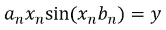
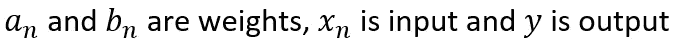
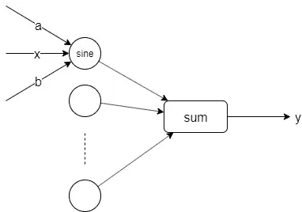

# 正弦基函数神经网络

> 原文：<https://towardsdatascience.com/neural-networks-with-sine-basis-function-c5c13fd63513?source=collection_archive---------14----------------------->

由于在各个领域的成功，神经网络证明了它们是我们这个世纪的趋势主题。今天我要讲的是用正弦函数代替线性函数作为基的神经网络。我们将实现一个使用正弦函数作为基础的神经网络，我们将评估结果。

# 这个想法是从哪里来的？


Photo by [Benjamin Lizardo](https://unsplash.com/@benji3pr?utm_source=medium&utm_medium=referral) on [Unsplash](https://unsplash.com?utm_source=medium&utm_medium=referral)

使用正弦函数作为神经网络基础的想法来自于我的信号处理背景。如果你以前听说过傅里叶变换，你知道你可以用余弦和正弦函数来表示任何函数，并且你可以在频域中清楚地显示求和函数。“你可以用余弦和正弦函数来表示任何函数”这句话打动了我。我把这个和神经网络联系起来，因为我们也可以用神经网络来表示任何函数。

## 说得够多了，我知道你想看到背后的数学，实现和结果。那么，让我们继续……

# 神经网络中的正弦基函数



Sine Basis Function for Neural Networks



Basic Structure

# 履行

我使用了 Python 中[如何从零开始构建自己的神经网络中的类和代码结构作为我的基础。](/how-to-build-your-own-neural-network-from-scratch-in-python-68998a08e4f6)

```
import numpy as npclass NeuralNetwork:
    #DEFINE INITIALS
    def __init__(self, x, y):
        self.input      = x
        self.y          = y
        self.weights_in = np.random.uniform(-1, 1,(self.y.shape[1],self.input.shape[1]))
        self.weights_out = np.random.uniform(-1, 1,(self.y.shape[1],self.input.shape[1]))     
        self.output     = np.random.uniform(-1, 1,self.y.shape)
        print('Output:',self.output)
        print('Y:',self.y)#DEFINE FEEDFORWARD
    def feedforward(self,cnt):
        self.output[cnt] = np.sum(self.weights_out*self.input[cnt]*np.sin(np.pi*self.input[cnt]*self.weights_in),axis = 1)

    #DEFINE BACKPROPAGATION
    def backprop(self,cnt):
        error = np.square(self.y[cnt]-self.output[cnt])
        derror_doutput = self.y[cnt]-self.output[cnt]
        doutput_dweights_in = self.weights_out * np.square(self.input[cnt]) * np.pi * np.cos(np.pi*self.input[cnt]*self.weights_in)
        doutput_dweights_out = self.input[cnt]*np.sin(np.pi*self.input[cnt]*self.weights_in)
        dweights_in = np.dot(derror_doutput,doutput_dweights_in)
        dweights_out = np.dot(derror_doutput,doutput_dweights_out)
        self.weights_in += dweights_in*0.05
        self.weights_out += dweights_out*0.05#PREDICT THE TEST DATA
    def predict(self,input_):
        predictions = []
        for elm in input_:
            predictions.append(np.sum(self.weights_out*elm*np.sin(np.pi*elm*self.weights_in),axis = 1).tolist())
        return np.array(predictions)

    #SAVE WEIGHTS
    def save_weights(self,dir_in = './weights_in.npy',dir_out = './weights_out.npy'):
        np.save(dir_in,self.weights_in)
        np.save(dir_out,self.weights_out)

    #IMPORT WEIGHTS
    def import_weights(self,dir_in = './weights_in.npy',dir_out = './weights_out.npy'):
        self.weights_in = np.load(dir_in)
        self.weights_out = np.load(dir_out)
```

我们定义了我们的阶级。测试时间到了。

我们将用我们的神经网络来表示逻辑门(AND、OR、XOR)(这意味着我们将从神经网络为每个逻辑门获得 3 个输出)。我将为每个输入样本给出 3 个值。输入不是整数，而是浮点数，比如 0.01 而不是 0，或者 0.99 而不是 1。

## 示例:

输入:[0.01，0.01，0.99]

与:0.01，或:0.99，异或:0.99

```
x = np.array([[0.01,0.1,0.01],[0.01,0.99,0.99],[0.99,0.99,0.01],[0.99,0.99,0.01],[0.9,0.9,0.9]])
y = np.array([[0.01,0.01,0.01],[0.01,0.99,0.99],[0.01,0.99,0.99],[0.01,0.99,0.99],[0.99,0.99,0.01]])nn = NeuralNetwork(x,y)
#TRAIN NETWORK FOR 2000 TIMES.
for gen_cnt in range(2000):
    for cnt in range(5):
        nn.feedforward(cnt)
        nn.backprop(cnt)#PREDICT THE TEST DATA
predictions = nn.predict(np.array([[0.01,0.2,0.2],[0.9,0.1,0.95]]))
print('Predictions:\n',np.around(predictions),'\nExpected:\n',[[0,0,0],[0,1,1]])
```

我给出的测试数据是[[0.01，0.2，0.2]，[0.9，0.1，0.95]]，而不是[[0.01，0.01，0.01]，[0.99，0.01，0.99]]，看看网络是否做出了概括。

# 结果

预言:
[[ 0。0.-0.][ 0.1.1.]]
预期:
[[0，0，0]，[0，1，1]]

## 在我训练了几次之后，我发现最好的重量是:

**权重 _ 输入:**

0.793539-0.866737 0.883148
1.32484-0.20837 0.214222
0.359695-1.21818-0.329374

**权重 _ 出:**

*   0.0841964-0.147961 0.854469
    -0.958252 0.0361619 1.2046
    0.73270.0986183-0.305971

# 结论

正如我们所看到的，“你可以用正弦函数表示任何函数”的概念也适用于神经网络。即使我们创建了一个没有任何隐藏层的神经网络，我们也证明了正弦函数可以代替线性函数作为基函数。因为它们是动态函数，我们不需要添加任何激活函数。由于正弦函数的性质，我们可以很容易地捕捉到非线性。我的下一步是实现深度神经网络的正弦基函数。这是一个复杂的问题，再次感谢正弦函数的性质，但挑战总是受欢迎的…