# 神经 ODEs:另一个深度学习突破的崩溃

> 原文：<https://towardsdatascience.com/neural-odes-breakdown-of-another-deep-learning-breakthrough-3e78c7213795?source=collection_archive---------0----------------------->

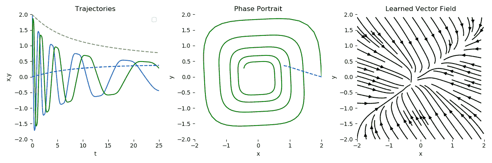

Visualization of the Neural ODE learning the dynamical system

大家好！如果你正在阅读这篇文章，很可能你正在赶上人工智能世界最近的进展。我们今天要复习的题目来自 NIPS 2018，讲的是来自那里的最佳论文奖:[神经常微分方程](https://arxiv.org/abs/1806.07366) (Neural ODEs)。在这篇文章中，我将尝试给出一个简短的介绍和这篇论文的重要性，但我将强调实际应用，以及我们如何和为了什么可以在应用中应用这种需要的神经网络，如果可以的话。和往常一样，如果你想直接进入代码，你可以查看[这个 GitHub 库](https://github.com/Rachnog/Neural-ODE-Experiments)，我推荐你在 Google Colab 中启动它。

# 我们为什么关心颂歌？

首先，让我们快速回顾一下什么是野兽常微分方程。它描述了依赖于一个变量(这就是为什么普通)的一些过程随时间的演变，这种随时间的变化通过导数来描述:

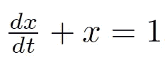

Simple ODE example

通常，我们可以讨论解这个微分方程，如果我们有一些初始条件(在这一点上过程开始)并且我们想看这个过程如何发展到一些最终状态。解函数也叫积分曲线(因为我们可以对方程积分得到解 *x(t)* )。让我们尝试使用 SymPy 软件包来解决上图中的方程:

```
from sympy import dsolve, Eq, symbols, Functiont = symbols('t')
x = symbols('x', cls=Function)
deqn1 = Eq(x(t).diff(t), 1 - x(t))
sol1 = dsolve(deqn1, x(t))
```

它将作为解决方案返回

```
Eq(x(t), C1*exp(-t) + 1)
```

其中 C1 是一个常数，可以在给定一些初始条件的情况下确定。如果以适当的形式给出，常微分方程可以解析求解，但通常是数值求解。最古老和最简单的算法之一是**欧拉法**，其核心思想是使用切线逐步逼近解函数；

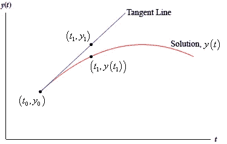

[http://tutorial.math.lamar.edu/Classes/DE/EulersMethod.aspx](http://tutorial.math.lamar.edu/Classes/DE/EulersMethod.aspx)

访问图片下面的链接可以得到更详细的解释，但是最后，我们得到了一个非常简单的公式，方程式

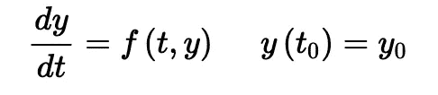

[http://tutorial.math.lamar.edu/Classes/DE/EulersMethod.aspx](http://tutorial.math.lamar.edu/Classes/DE/EulersMethod.aspx)

在 *n* 时间步长的离散网格上的解为

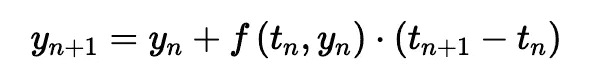

[http://tutorial.math.lamar.edu/Classes/DE/EulersMethod.aspx](http://tutorial.math.lamar.edu/Classes/DE/EulersMethod.aspx)

关于 ODEs 的更多细节，尤其是如何用 Python 对它们进行编程以及它们的解决方案，我推荐你去看看[这本书](https://www.springer.com/gp/book/9783319781440)，它也有很多化学、物理和工业领域中具有这种时间演化的过程的例子，可以用 ODEs 来描述。此外，与 ML 模型相比，有关微分方程的更多直观信息，请访问[该资源](https://julialang.org/blog/2019/01/fluxdiffeq)。与此同时，看看欧拉方程，难道不会让你想起最近的深度学习架构吗？

# ResNets 是 ODEs 解？

没错。 *y_{n+1} = y_n + f(t_n，y_n)* 不过是 ResNet 中的一个剩余连接，其中某一层的输出是该层 *f()* 本身的输出与该层的输入 *y_n* 之和。这基本上就是神经 ODE 的主要思想:**一个神经网络中的一串残差块，基本上就是用欧拉方法对 ODE 的一个求解！**在这种情况下，系统的初始条件是“时间” *0* ，这表示神经网络的第一层，并且作为 *x(0)* 将服务于正常输入，它可以是时间序列、图像，无论你想要什么！在“时间” *t* 的最终条件将是神经网络的期望输出:标量值、表示类的向量或任何其他东西。

如果我们记得，这些剩余连接是欧拉方法的离散化时间步骤，这意味着**我们可以调节神经网络**的深度，只需选择离散化方案，因此，使解决方案(又名神经网络)或多或少准确，甚至使其像无限层一样！

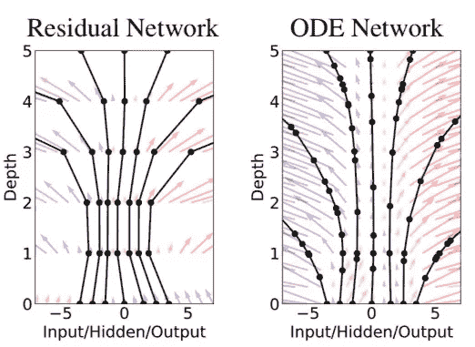

Difference between ResNet with a fixed number of layers and ODENet with a flexible number of layer

欧拉是不是太原始的 ODE 求解方法？的确是这样，所以让我们用一些抽象概念代替 ResNet / EulerSolverNet，如 ODESolveNet ，其中 ODESolveNet 将是一个函数，它提供了一个对 ODE(低调:我们的神经网络本身)的解决方案，比 Euler 的方法具有更好的准确性。网络架构现在可能如下所示:

```
nn = Network(
  Dense(...), # making some primary embedding
  ODESolve(...), # "infinite-layer neural network"
  Dense(...) # output layer
)
```

我们忘记了一件事…神经网络是一个可微分的函数，所以我们可以用基于梯度的优化例程来训练它。我们应该如何通过*ode solve()**函数**反向传播，在我们的例子中它实际上也是一个黑盒？特别地，我们需要输入和动力学参数的损失函数的梯度。数学窍门叫做**伴随灵敏度法**。更多细节我会参考[原论文](https://arxiv.org/pdf/1806.07366.pdf)和[本教程](https://nbviewer.jupyter.org/github/urtrial/neural_ode/blob/master/Neural%20ODEs%20(Russian).ipynb)，但本质描述在下图( *L* 代表我们要优化的主损失函数):***

*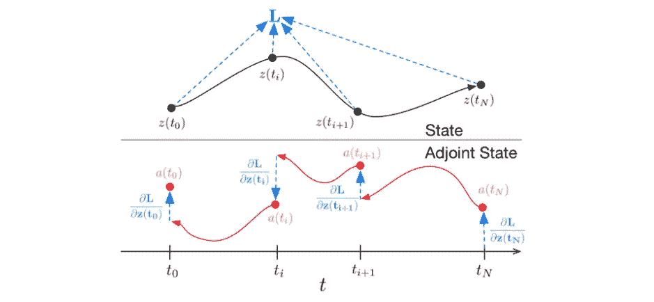*

*Making “backpropagation” gradients for the ODESolve() method*

*简而言之，伴随系统与描述过程的原始动力系统一起，通过链式法则(这就是众所周知的反向传播的根)向后描述过程中每个点的导数状态。正是从它，我们可以通过初始状态获得导数，并且以类似的方式，通过模拟动力学的函数的参数(一个“剩余块”，或“旧”欧拉方法中的离散化步骤)。*

*如需了解更多详情，我建议您也观看该论文作者之一的演示:*

# *神经微分方程的可能应用*

*首先，使用它们而不是“正常结果”的优势和动机:*

*   *内存效率:在反向传播时，我们不需要存储所有的参数和梯度*
*   *自适应计算:我们可以用离散化方案来平衡速度和精度，此外，在训练和推理时使其不同*
*   *参数效率:相邻“层”的参数自动绑定在一起(参见[论文](https://arxiv.org/pdf/1806.07366.pdf)*
*   *规范流新型可逆密度模型*
*   *连续时间序列模型:连续定义的动态可以自然地包含在任意时间到达的数据。*

*根据这篇论文，除了用 ODENet 代替 ResNet 用于计算机视觉之外，我认为现在有点不现实的应用程序是下一个:*

*   *将复杂的常微分方程压缩到单个动态建模神经网络中*
*   *将它应用于缺少时间步长的时间序列*
*   *可逆规范化流(超出了本博客的范围)*

*对于缺点，查阅原论文，有一些。理论够了，现在来查一些实际例子。提醒一下，[所有实验的代码都在这里](https://github.com/Rachnog/Neural-ODE-Experiments)。*

# *学习动力系统*

*正如我们之前看到的，微分方程被广泛用于描述复杂的连续过程。当然，在现实生活中，我们将它们视为离散的过程，最重要的是，时间步长 t_i 上的许多观察值可能会完全丢失。让我们假设你想用神经网络来模拟这样一个系统。在经典的序列建模范例中，你如何处理这种情况？以某种方式把它扔进循环神经网络，它甚至不是为它设计的。在这一部分，我们将检查神经 ode 如何处理它们。*

*我们的设置如下:*

1.  *定义**颂歌本身**我们将建模为 PyTorch nn。模块()*
2.  *定义一个简单的(或者不是真正的)**神经网络，该网络将对从 h_t 到 h_{t+1}的两个后续动态步骤之间的动态**进行建模，或者在动态系统的情况下，对 x_t 和 x_{t+1}进行建模。*
3.  *运行**优化过程**，该过程通过 ODE 解算器反向传播，并最小化实际动态和模拟动态之间的差异。*

*在所有下面的实验中，神经网络将只是下面的(它被认为足以模拟具有两个变量的简单函数):*

```
*self.net = nn.Sequential(
            nn.Linear(2, 50),
            nn.Tanh(),
            nn.Linear(50, 2),
        )*
```

*所有进一步的例子都受到了[这个知识库](https://nbviewer.jupyter.org/github/urtrial/neural_ode/)惊人解释的高度启发。在接下来的小节中，我将展示我们所模拟的动态系统在代码中是如何表现它们自己的，以及系统如何随着时间的推移而演化，并且相位图是如何被 ODENet 拟合的。*

## *简单螺旋函数*

*在这个和所有未来的可视化中，虚线代表试衣模型。*

```
*true_A = torch.tensor([[-0.1, 2.0], [-2.0, -0.1]])class Lambda(nn.Module):
    def forward(self, t, y):
        return torch.mm(y, true_A)*
```

*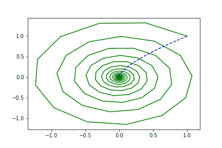**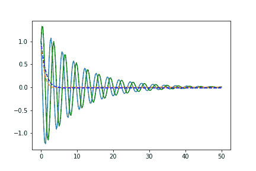

Phase space on the left, time-space on the right. The straight line stands for the real trajectory and dotted one — for the evolution of the learned by the Neural ODE system* 

## *随机矩阵函数*

```
*true_A = torch.randn(2, 2)/2.*
```

*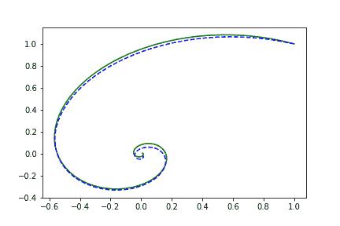**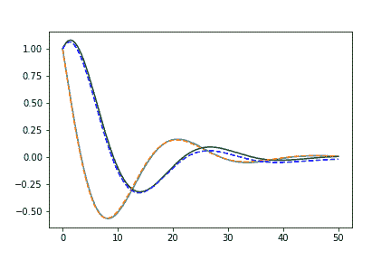

Phase space on the left, time-space on the right. The straight line stands for the real trajectory and dotted one — for the evolution of the learned by the Neural ODE system* 

## *沃尔泰拉-洛特卡系统*

```
*a, b, c, d = 1.5, 1.0, 3.0, 1.0
true_A = torch.tensor([[0., -b*c/d], [d*a/b, 0.]])*
```

*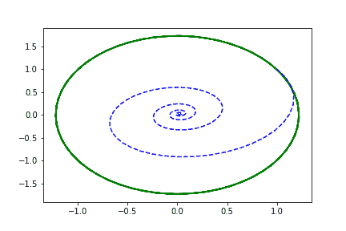**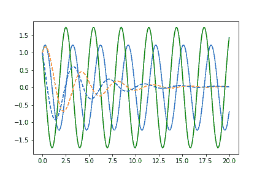

Phase space on the left, time-space on the right. The straight line stands for the real trajectory and dotted one — for the evolution of the learned by the Neural ODE system* 

## *非线性函数*

```
*true_A2 = torch.tensor([[-0.1, -0.5], [0.5, -0.1]])
true_B2 = torch.tensor([[0.2, 1.], [-1, 0.2]])class Lambda2(nn.Module):

    def __init__(self, A, B):
        super(Lambda2, self).__init__()
        self.A = nn.Linear(2, 2, bias=False)
        self.A.weight = nn.Parameter(A)
        self.B = nn.Linear(2, 2, bias=False)
        self.B.weight = nn.Parameter(B)

    def forward(self, t, y):
        xTx0 = torch.sum(y * true_y0, dim=1)
        dxdt = torch.sigmoid(xTx0) * self.A(y - true_y0) + torch.sigmoid(-xTx0) * self.B(y + true_y0)
        return dxdt*
```

*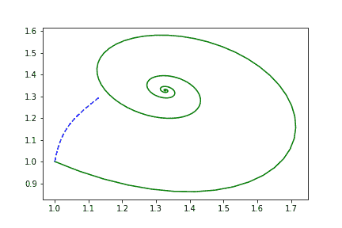**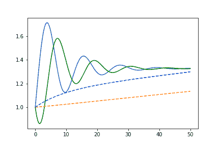

Phase space on the left, time-space on the right. The straight line stands for the real trajectory and dotted one — for the evolution of the learned by the Neural ODE system* 

*正如我们所看到的，我们的单个“剩余块”不能很好地学习这个过程，所以我们可能会使它在接下来的函数中变得更复杂。*

## *神经网络功能*

*让我们通过具有随机初始化权重的多层感知器来制作完全参数化的函数:*

```
*true_y0 = torch.tensor([[1., 1.]])
t = torch.linspace(-15., 15., data_size)class Lambda3(nn.Module):

    def __init__(self):
        super(Lambda3, self).__init__()
        self.fc1 = nn.Linear(2, 25, bias = False)
        self.fc2 = nn.Linear(25, 50, bias = False)
        self.fc3 = nn.Linear(50, 10, bias = False)
        self.fc4 = nn.Linear(10, 2, bias = False)
        self.relu = nn.ELU(inplace=True)

    def forward(self, t, y):
        x = self.relu(self.fc1(y * t))
        x = self.relu(self.fc2(x))
        x = self.relu(self.fc3(x))
        x = self.relu(self.fc4(x))
        return x*
```

*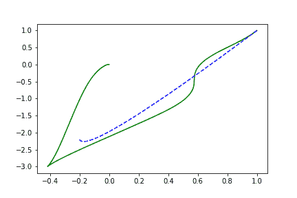**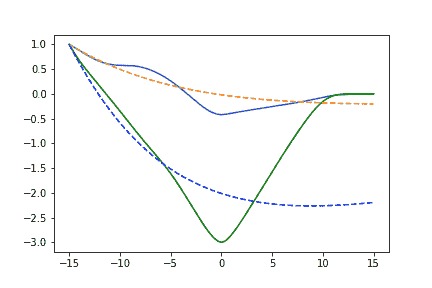

Phase space on the left, time-space on the right. The straight line stands for the real trajectory and dotted one — for the evolution of the learned by the Neural ODE system* 

*这里 2–50–2 网络**因为太简单**而可怕地失败，让我们增加它的深度:*

```
*self.net = nn.Sequential(
            nn.Linear(2, 150),
            nn.Tanh(),
            nn.Linear(150, 50),
            nn.Tanh(),
            nn.Linear(50, 50),
            nn.Tanh(),
            nn.Linear(50, 2),
        )*
```

***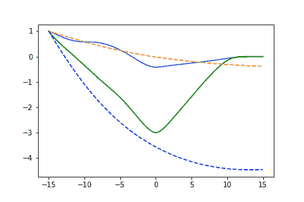

Phase space on the left, time-space on the right. The straight line stands for the real trajectory and dotted one — for the evolution of the learned by the Neural ODE system* 

*现在它或多或少像预期的那样工作了，不要忘记检查代码:)*

# *作为生成模型的神经微分方程*

*作者还声称，他们可以通过 VAE 框架建立一个生成时间序列模型，使用神经微分方程作为其中的一部分。它是如何工作的？*

*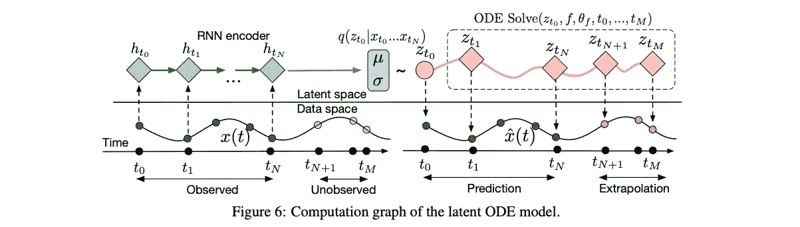*

*Illustration from [the original paper](https://arxiv.org/pdf/1806.07366.pdf)*

*   *首先，我们用一些“标准”时间序列算法对输入序列进行编码，比如说 RNN 算法，以获得过程的主要嵌入*
*   *通过神经 ODE 运行嵌入以获得“连续”嵌入*
*   *以 VAE 方式从“连续”嵌入中恢复初始序列*

*作为概念验证，我刚刚重新运行了来自[这个库](https://nbviewer.jupyter.org/github/urtrial/neural_ode/blob/master/Neural%20ODEs%20(Russian).ipynb)的代码，它看起来在学习螺旋轨迹方面工作得很好:*

*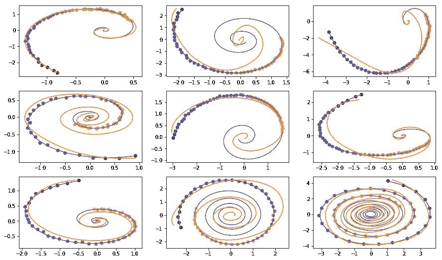*

*Dots are sampled noisy trajectories, Blue line is true trajectory, the orange line stands for recovered and interpolated trajectory*

*然后，我决定将心跳从心电图(ECG)转换为相位图，将 *x(t)* 作为时间-空间，将 *x`(t)* 作为导数-空间(如本作品所示)，并尝试适应不同的 VAE 设置。这个用例可能对像 [Mawi Band](https://mawi.band) 这样的可穿戴设备非常有用，在这些设备中，由于噪声或中断的信号，我们必须恢复它(实际上，我们是在深度学习的帮助下[完成的，但 ECG 是一个连续信号，不是吗？).不幸的是，它并没有很好地收敛，显示出过度适应单一形式节拍的所有迹象:](https://medium.com/mawi-band/towards-ai-based-only-biosignal-analysis-pipeline-39e6e31244a6)*

*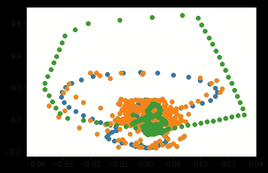**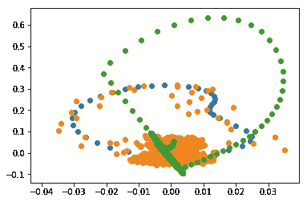

Phase spaces. Blue line — real trajectory, orange line — sampled and noisy trajectory, green line — auto-encoded trajectory* *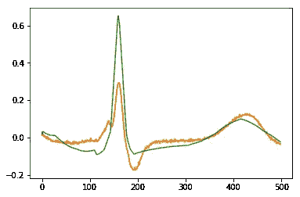**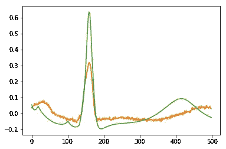

Time spaces. Blue line — real signal, orange line — sampled and noisy signal, green line — auto-encoded signal* 

*我还尝试了另一个实验:只在每次心跳的部分学习这个自动编码器，并从中恢复整个波形(也就是说，让我们外推一个信号)。不幸的是，无论我对超参数和数据预处理做了什么，**将这段信号向左或向右外推**—**都没有得到任何有意义的结果。或许，读者中的某个人可以帮助理解哪里出错了:(***

# *下一步是什么？*

*很明显，神经 ode 被设计用来学习相对简单的过程(这就是为什么我们甚至在标题中有*普通的*，所以我们需要一个能够建模更丰富的函数族的模型。已经有两种有趣的方法了:*

*   *增强神经颂:[https://github.com/EmilienDupont/augmented-neural-odes](https://github.com/EmilienDupont/augmented-neural-odes)*
*   *神经跳跃随机 DEs:[https://www . ground ai . com/project/neural-Jump-random-differential-equations/1](https://www.groundai.com/project/neural-jump-stochastic-differential-equations/1)*

*也需要一些时间来探索它们:)*

# *结论*

*依我看，神经微分方程还没有准备好用于实践。这个想法本身很棒，就创新水平而言，它让我想起了杰弗里·辛顿的《胶囊网络》,但它们现在在哪里？和神经 ode 一样，它们在玩具任务上表现出了良好的结果，但在任何接近真实应用或大规模数据集的任务上都失败了。*

*我目前只能看到两个实际应用:*

*   *使用 *ODESolve()* 层来平衡经典神经网络中的速度/精度权衡*
*   *将常规 ode“压缩”到神经架构中，以将其嵌入标准数据科学管道中*

*就我个人而言，我希望这个方向能有进一步的发展(我在上面展示了一些链接),让这些神经(O)DEs 能代表更丰富的函数类，我会密切关注它。*

***P.S.**
如果你觉得这个内容有用和有观点，你可以[在 Bitclout](https://bitclout.com/u/alexrachnog) 上支持我。也请在[脸书](https://www.facebook.com/rachnogstyle.blog)博客上关注我，在那里我会定期发布简短的人工智能文章或新闻，对于媒体来说太短了，在 [Instagram](http://instagram.com/rachnogstyle) 上发布个人信息，在 [Linkedin](https://www.linkedin.com/in/alexandr-honchar-4423b962/) 上发布！如果你想在可解释的人工智能应用或其他人工智能项目上合作，请联系我。*