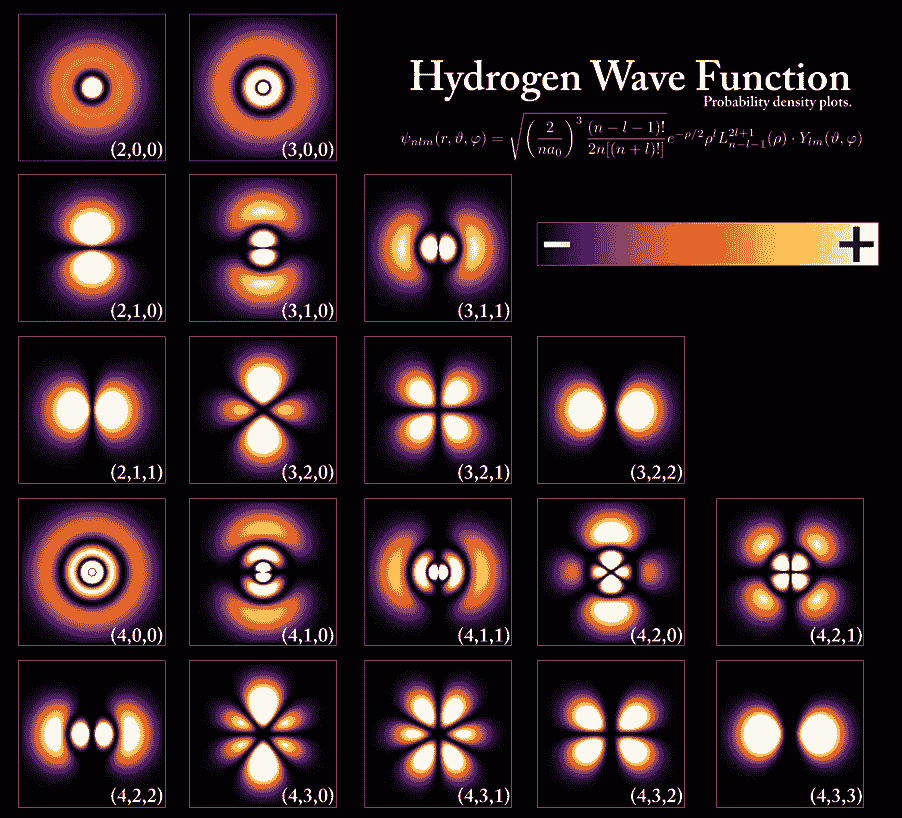

# 神经量子态

> 原文：<https://towardsdatascience.com/neural-quantum-states-4793fdf67b13?source=collection_archive---------3----------------------->

## 神经网络如何解决量子力学中高度复杂的问题

Image par [Colin Behrens](https://pixabay.com/fr/users/ColiN00B-346653/?utm_source=link-attribution&utm_medium=referral&utm_campaign=image&utm_content=2213009) de [Pixabay](https://pixabay.com/fr/?utm_source=link-attribution&utm_medium=referral&utm_campaign=image&utm_content=2213009)

现代理论物理中最具挑战性的问题之一是所谓的[多体问题](https://en.wikipedia.org/wiki/Many-body_problem)。典型的多体系统由大量强相互作用的粒子组成。很少有这样的系统可以进行精确的数学处理，并且需要数值技术来取得进展。然而，由于指定一个通用多体量子态所需的资源以指数方式取决于系统中的粒子数量(更准确地说，取决于自由度的数量)，即使是今天最好的超级计算机也缺乏足够的能力来**精确地**编码这样的状态(它们只能处理相对较小的系统，少于 45 个粒子)。

正如我们将看到的，机器学习技术(特别是人工神经网络)的最新应用已经被证明能够提供这种复杂状态的高效表示，使其压倒性的复杂性在计算上易于处理。

在这篇文章中，我将讨论如何应用(一种)人工神经网络来表示许多粒子的量子态。本文将分为三个部分:

*   基本量子力学概念的鸟瞰图。
*   机器学习概念的简要描述，特别关注一种称为受限玻尔兹曼机器(RBM)的人工神经网络
*   解释如何使用 RBM 来表示多粒子量子态。

# 序言

阿尔伯特·爱因斯坦的科学合作者之一，波兰物理学家利奥波德·英费尔德在他的自传中讲述了一个有趣的故事。

Einstein and Infeld in Einstein’s home ([source](http://www.fuw.edu.pl/~ajduk/inf.html)).

根据因菲尔德的说法，在两位物理学家花了几个月时间进行漫长而艰苦的计算后，爱因斯坦会做出如下评论:

> “上帝[自然]不关心我们的数学困难。他根据经验进行整合。”
> 
> —爱因斯坦(1942 年)。

爱因斯坦的意思是，虽然人类必须借助复杂的计算和符号推理来解决复杂的物理问题，但自然不需要这样做。

**快速提示**:爱因斯坦在这里使用了“积分”这个术语，因为许多物理理论都是用被称为“微分方程”的方程来表述的，为了找到这些方程的解，人们必须应用“积分”的过程。

# 多体问题

正如引言中提到的，理论物理中一个众所周知的难题是[多体问题](https://en.wikipedia.org/wiki/Many-body_problem)。这个问题已经在经典系统(基于[牛顿三大运动定律](https://en.wikipedia.org/wiki/Newton%27s_laws_of_motion)及其改进的物理系统)和量子系统(基于遵守量子力学定律的系统)中研究了很长时间。

第一个被广泛研究的(经典的)多体问题是涉及地球、月球和太阳的三体问题。

A simple orbit of a 3-body system with equal masses ([source](https://arxiv.org/pdf/math/0011268.pdf)).

第一个研究这个多体问题的科学家不是别人，正是艾萨克·牛顿在他的杰作《数学原理》中提到的:

> “行星每旋转一周，它就跟踪一个新的轨道[……]，而每个轨道都取决于所有行星的综合运动，更不用说它们之间的相互作用[……]。除非我大错特错，否则同时考虑如此多的运动原因，并通过精确的定律来定义运动，这将超出人类的智慧。”
> 
> 艾萨克·牛顿(1687 年)

Newton’s [*Principia Mathematica*](https://en.wikipedia.org/wiki/Philosophi%C3%A6_Naturalis_Principia_Mathematica)*, arguably the most important scientific book in history.*

因为本质上所有相关的物理系统都是由一组相互作用的粒子组成的，所以多体问题非常重要。

## 穷人的定义

人们可以把这个问题定义为“研究物体之间的相互作用对多物体系统行为的影响”。

Collisions of gold ions generate a quark-gluon plasma, a typical many-body system ([source](https://phys.org/news/2010-01-jetting-quark-gluon-plasma.html)).

“许多”在这个上下文中的含义可以是从 3 到无穷大的任何值。在最近的一篇论文中，我和我的同事表明，对于 N = 5 个自旋激发，已经可以找到量子多体行为的特征(下图)。

The density of states of a type of spin system (XX model). As the number of spin excitations increases from 2 to 5, a Gaussian distribution (typical of many-body systems with 2-body couplings) is approached ([source](https://iopscience.iop.org/article/10.1088/2058-9565/aad913/meta)).

在这篇文章中，我将重点关注 [**量子**多体问题](https://en.m.wikipedia.org/wiki/Many-body_problem)，这是[2013 年以来我的主要研究课题](https://scholar.google.com/citations?user=SaB1GO0AAAAJ&hl=en)。

# 量子多体系统

早在 20 世纪 30 年代，物理学家就发现了量子多体系统的复杂性。大约在那个时候，伟大的物理学家[保罗·狄拉克](https://en.wikipedia.org/wiki/Paul_Dirac) [预见了](https://royalsocietypublishing.org/doi/abs/10.1098/rspa.1929.0094)量子力学中的两大问题。

The English physicist Paul Dirac ([source](https://en.wikipedia.org/wiki/Paul_Dirac)).

根据他的说法，第一个是“与相对论思想的理论的精确拟合有关”。第二是“这些(量子)定律的精确应用导致方程过于复杂而无法求解”。第二个问题正是量子多体问题。

幸运的是，许多物理系统的量子态可以用比希尔伯特空间最大容量少得多的信息来描述。这一事实被一些数字技术所利用，包括著名的[量子蒙特卡罗](https://en.wikipedia.org/wiki/Quantum_Monte_Carlo) (QMC)方法。

## 量子波函数

简单来说，一个[量子波函数](https://en.wikipedia.org/wiki/Wave_function)在数学上描述了一个量子系统的状态。第一个接受精确数学处理的量子系统是氢原子。

The probability of finding the electron in a hydrogen atom (represented by the brightness) ([source](https://en.wikipedia.org/wiki/Wave_function)).

一般来说，量子态由复概率振幅ψ(*S*表示，其中自变量 *S* 包含了关于系统状态的所有信息。例如，在旋转 1/2 的链中:

A 1D spin chain: each particle has a value for σ in the z-axis ([source](https://esc.fnwi.uva.nl/thesis/centraal/files/f1660852177.pdf)).

从ψ(*S*)可以推导出与系统测量相关的概率。例如，正实数ψ(*S*)的平方模给出了与ψ(*S*)相关的概率分布:

## 哈密顿算符

量子系统的性质被系统的[哈密顿算符](https://en.wikipedia.org/wiki/Hamiltonian_(quantum_mechanics)) *H* 封装。后者是两项的总和:

*   系统中所有粒子的动能，它与它们的运动有关
*   系统中所有粒子的势能，与这些粒子相对于其他粒子的位置有关。

量子系统的允许能级(其能谱)可以通过求解所谓的[薛定谔方程](https://en.wikipedia.org/wiki/Schrödinger_equation)得到，薛定谔方程是描述量子力学系统行为的偏微分方程。

The Austrian physicist Erwin Schrodinger, one of the fathers of quantum mechanics ([source](https://en.wikipedia.org/wiki/Erwin_Schr%C3%B6dinger)).

薛定谔方程的时间无关版本由以下特征值系统给出:

本征值和相应的本征态是

最低能量对应于系统的所谓“基态”。

## 简单的例子

具体来说，让我们考虑下面的例子:量子谐振子。QHO 是经典谐振子的量子力学对应物(见下图)，这是一个系统，当它从初始位置位移时，会经历一个力，使其恢复到平衡位置。

A mass-spring harmonic oscillator ([source](https://en.wikipedia.org/wiki/Harmonic_oscillator))

下面的[动画比较了简谐振子的经典概念和量子概念。](https://en.wikipedia.org/wiki/Wave_function)

Wave function describing a [quantum harmonic oscillator](https://en.wikipedia.org/wiki/Quantum_harmonic_oscillator) ([Wiki](https://en.wikipedia.org/wiki/Wave_function)).

虽然在明确定义的轨迹中的简单振荡质量代表经典系统(上图中的块 A 和 B)，但相应的量子系统由复杂的波函数代表。在每个块中(从 C 开始)有两条曲线:蓝色的是ψ的实部，红色的是虚部。

## 量子自旋系统的鸟瞰图

在量子力学中，[自旋](https://en.wikipedia.org/wiki/Spin_(physics))可以粗略地理解为粒子和原子核所携带的“角动量的内禀形式”。虽然直观地认为自旋是一个粒子绕其自身轴的旋转，但这一图像并不完全正确，因为这样粒子会以超过光速的速度旋转，这违反了基本的物理原理。如果事实自旋是没有经典对应的量子力学物体。

Example of a many-body system: a spin impurity propagating through a chain of atoms ([source](https://idw-online.de/de/image?id=196973&size=screen))

量子自旋系统与[磁性](https://en.wikipedia.org/wiki/Magnetism)现象密切相关。磁铁是由原子构成的，原子往往是小磁铁。当这些原子磁铁变成平行取向时，就产生了我们所熟悉的宏观效应。

Magnetic materials often display spin waves, propagating disturbances in the magnetic order ([source](https://www.uni-muenster.de/Physik.AP/Demokritov/en/Forschen/Forschungsschwerpunkte/mBECwasw.html)).

我现在将提供机器学习算法的基本组件的快速总结，这将有助于读者理解它们与量子系统的联系。

# 机器学习=机器+学习

机器学习方法有两个基本组成部分( [Carleo，2017](https://gitlab.com/nqs/ictp_school/blob/7ff4fcc22a1685fec0972f291919090c79586012/notes.pdf) ):

*   **机器**，其可以是例如具有参数的人工神经网络ψ

*   使用例如随机优化算法执行的参数*W* 、的**学习。**

The two components of machine learning (NN cartoon from [here](http://science.sciencemag.org/content/355/6325/602.abstract)).

## 神经网络

人工神经网络通常是非线性多维嵌套函数。对它们的内部工作方式的理解仅仅是探索性的，对它们的结构的研究并不能产生关于它所近似的功能的见解。

Simple artificial neural network with two hidden layers ([source](/applied-deep-learning-part-1-artificial-neural-networks-d7834f67a4f6)).

由于网络参数和正在逼近的数学函数之间缺乏明确的联系，人工神经网络通常被称为“黑箱”。

 [## 神经网络的逼近能力(使用 Python 代码)

### 为什么神经网络可以预测(几乎)任何过程的结果

towardsdatascience.com](/the-approximation-power-of-neural-networks-with-python-codes-ddfc250bdb58)  [## 神经网络和纯数学之间的联系

### 一个深奥的定理如何给出关于人工神经网络能力的重要线索

medium.freecodecamp.org](https://medium.freecodecamp.org/connections-between-deep-learning-physics-and-pure-mathematics-part-i-947abeb3a5dd) 

有几种类型的人工神经网络，但对于我们目前的目的，我将集中于限制玻尔兹曼机器(RBM)的具体情况。

## 什么是受限玻尔兹曼机？

受限玻尔兹曼机器是生成型随机神经网络。它们有许多应用，包括:

*   协同过滤
*   降维
*   分类
*   回归
*   特征学习
*   主题建模

RBM 属于一类被称为[基于能源的模型](http://www.iro.umontreal.ca/~bengioy/ift6266/H14/ftml-sec5.pdf)的模型。它们不同于其他(更流行的)神经网络，后者基于输入估计一个**值**，而 RBM 估计输入的**概率密度**(它们估计许多点而不是单个值)。

RBM 具有以下属性:

*   它们是浅网络，只有两层(输入/可见层和隐藏层)
*   它们的隐藏单元 ***h*** 和可见(输入)单元 ***v*** 通常是二进制值
*   有一个权重矩阵 ***W*** 与隐藏和可见单元之间的连接相关联
*   有两个偏差项，一个用于由 ***a*** 表示的输入单元，一个用于由 ***b*** 表示的隐藏单元
*   每个配置都有一个相关的能量泛函*E*(***v***， ***h*** )，它在训练期间被最小化
*   它们没有输出层
*   没有层内连接(这是“限制”)。对于一组给定的可见单元激活，隐藏单元激活是相互独立的(反之亦然)。这个特性极大地方便了分析。

要最小化的能量泛函由下式给出:

Eq.1: Energy functional minimized by RBMs.

可见和隐藏单元的联合概率分布为:

Eq.2: Total probability distribution.

其中归一化常数 *Z* 称为[配分函数](https://en.m.wikipedia.org/wiki/Partition_function_(statistical_mechanics))。追踪隐藏单元，我们获得可见(输入)向量的边际概率:

Eq.3: Input units marginal probability distribution,

因为，如前所述，给定可见(隐藏)单元激活，隐藏(可见)单元激活是相互独立的，所以可以写:

Eq.4: Conditional probabilities becomes products due to mutual independence.

此外:

Eq. 5: Same as Eq.4.

最后，激活概率为:

Eq.6: Activation probabilities.

其中 *σ* 是 sigmoid 函数。

训练步骤是之后的[:](https://www.cs.toronto.edu/~hinton/absps/guideTR.pdf)

*   我们首先将可视单元状态设置为一个训练向量。
*   然后使用等式 6 左边的表达式计算隐藏单元的状态。
*   在为隐藏单元选择了状态之后，执行所谓的“重建”，根据等式 6 右边的表达式将每个可见单元设置为 1。
*   重量变化如下(主要变量是重建值):

# RBMs 如何处理输入，一个简单的例子

以下分析大量基于此[优秀教程](https://skymind.ai/wiki/restricted-boltzmann-machine)。下面的三幅图显示了 RBM 是如何处理输入的。

A simple RBM processing inputs ([source](https://skymind.ai/wiki/restricted-boltzmann-machine)).

*   在隐藏层的节点 1 处，输入 ***x*** 乘以权重 ***w*** ，添加偏差 ***b*** ，并将结果馈入激活，使输出*成为原点(见最左边的图)。*
*   *在中间的图中，所有输入在隐藏节点 1 处组合，并且每个输入 ***x*** 乘以其对应的 ***w*** 。然后对乘积求和，加上 bias ***b*** ，并将最终结果传递给激活函数，产生来自隐藏节点 1 的完整输出 ***a****
*   *在第三张图中，输入 ***x*** 被传递给隐藏层中的所有节点。在每个隐藏节点， ***x*** 乘以其对应的权重 ***w*** 。各个隐藏节点接收所有输入 ***x*** 的乘积以及它们各自的权重 ***w*** 。然后将偏差 ***b*** 加到每个和上，结果通过激活函数，为所有隐藏节点产生输出。*

## *RBM 如何学习重构数据*

*RBMs 执行一种称为“重建”的无人监督的过程。他们学习在数据的两层之间执行一长串的传递(向前和向后传递)来重构数据。在反向传递中，如下图所示，隐藏层中节点的激活函数成为新的输入。*

**

*这些输入和各自权重的乘积被求和，并且来自可视层的新偏差 ***b*** 被添加到每个输入节点。这种操作的新输出被称为“重建”，因为它是原始输入的近似。*

*自然地，重建和最初的输入非常不同(因为 ***w*** 的值是随机初始化的)。然而，随着误差相对于 ***w*** s 反复反向传播，它逐渐最小化。*

*因此，我们认为:*

*   *在前向传递中，RBM 使用输入来对节点的激活进行预测，并根据加权输入 ***x*** 来估计输出 ***a*** 的概率分布*
*   *在向后传递中，RBM 试图根据激活*来估计输入 ***x*** 的概率分布**

**结合两个条件分布，获得了联合概率分布 ***x*** 和 ***a*** ，即 RBM 学习如何近似原始数据(输入的结构)。**

# **如何连接机器学习和量子系统？**

**在最近发表在《科学》杂志上的一篇文章中，有人提出可以将量子多体系统的量子波函数ψ(*S*)视为一个黑箱，然后使用 RBM 对其进行近似。RBM 被训练成通过优化其参数来表示ψ(*S*)。**

****

**RBM used by [Carleo and Troyer (2017)](http://science.sciencemag.org/content/355/6325/602.abstract) that encodes a spin many-body quantum state.**

**问题是如何把(与时间无关的)薛定谔方程这个特征值问题重新表述为机器学习问题。**

## **变分法**

**事实证明，答案已经为人所知相当一段时间了，它基于所谓的[变分法](https://en.wikipedia.org/wiki/Variational_method_(quantum_mechanics))，这是波动方程的一种替代形式，可用于获得量子系统的能量。使用这种方法，我们可以将优化问题写成如下形式:**

****

**其中*E*【ψ】是依赖于本征态和哈密顿量的泛函。解决这个优化问题，我们得到基态能量和相应的基态。**

## **量子态和受限玻尔兹曼机**

**在 [Carleo 和 Troyer (2017)](http://science.sciencemag.org/content/355/6325/602.abstract) 中，RBM 被用来表示一个量子态ψ(*S*)。他们将 RBM 一般化，以允许复杂的网络参数。**

**很容易证明能量泛函可以写成**

****

**其中最后一个等号后面的期望值的自变量是局部能量。然后使用[随机重构](https://aip.scitation.org/doi/10.1063/1.2746035) (SR)的方法训练神经网络。相应的优化迭代如下:**

****

**The gradient descent update protocol.**

**其中 *η* 是学习率**S**是依赖于本征态及其对数导数的[随机重构矩阵](https://aip.scitation.org/doi/10.1063/1.2746035)。更多详情请查看本文。**

**[Carleo 和 Troyer (2017)](http://science.sciencemag.org/content/355/6325/602.abstract) 对自旋为 1/2 的量子系统特别感兴趣，他们将量子态写为:**

****

**在这个表达式中，ψ的 *W* 自变量是一组参数:**

****

**其中 ***a*** 和 ***b*** 上的组件是真实的但是 ***W*** 可以是复杂的。层内交互的缺失(RBMs 架构的典型特征)允许隐藏变量被求和(或追踪),从而将上述表达式大大简化为:**

****

**为了训练量子波函数，遵循与上述 RBMs 类似的[过程](http://cs230.stanford.edu/files_winter_2018/projects/6933119.pdf)(更多细节[在此](http://cs230.stanford.edu/files_winter_2018/projects/6933119.pdf))。**

## **令人印象深刻的准确性**

**下图显示了 NQS 基态能量估计的可忽略的相对误差。每个图对应于一个测试用例，它是一个具有已知精确解的系统。横轴是隐藏单元密度，即隐藏单元和可见单元的数量之比。请注意，即使使用相对较少的隐藏单元，模型的精度也已经非常令人印象深刻(百万分之一的误差！)**

****

**The error of the model ground-state energy relative to the exact value in three tests cases ([source](http://science.sciencemag.org/content/355/6325/602.abstract)).**

# **结论**

**在这篇简短的文章中，我们看到了受限玻尔兹曼机器(RBMs)，一种简单的人工神经网络，可以用来以极高的精度计算许多粒子的量子系统的基态能量。更多细节，我建议去查一下最早提出这种方法的[优秀论文](http://science.sciencemag.org/content/355/6325/602.abstract)。**

**感谢阅读！**

**我的 [Github](https://github.com/marcotav) 和我的个人网站 [www.marcotavora.me](https://marcotavora.me/) (希望)有一些关于数据科学和物理学的其他有趣的东西。**

**一如既往，欢迎建设性的批评和反馈！**