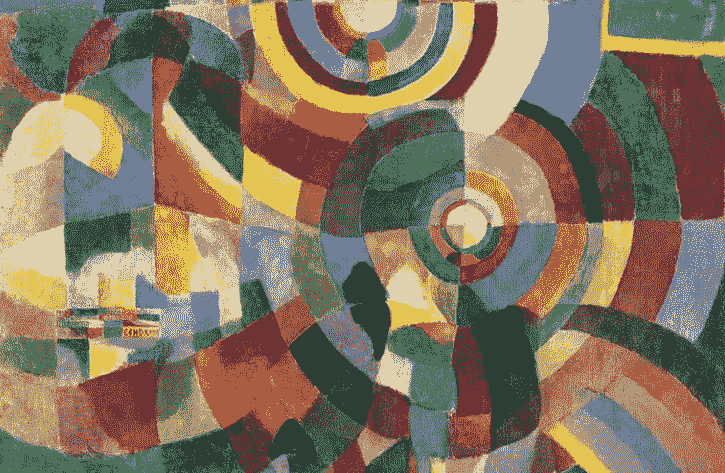

# 神经类型转移

> 原文：<https://towardsdatascience.com/neural-style-transfer-4d7c8138e7f6?source=collection_archive---------26----------------------->

风格转移是计算机视觉中一个令人兴奋的子领域。它旨在将一个图像的风格转移到另一个图像上，称为内容图像。这种技术允许我们结合不同图像的内容和风格来合成新的图像。在这个子领域已经取得了一些进展，但最值得注意的初步工作(神经类型转移)是由 [Gatys 等人](https://arxiv.org/abs/1508.06576)在 2015 年完成的。我应用这种技术得到的一些结果可以在下面看到。

Left to right: Content image, Style image, Generated image

这种方法相当直观，本文是在 Pytorch 和 Python 中实现神经类型转换的简单指南，前面还有对该方法的解释。这篇文章[的完整代码可以在我的 github](https://github.com/ksivaman/Transfer-image-styling) 上找到。

## 理解风格和内容

神经风格转移包括将一幅图像的风格转移到另一幅图像的内容上。这些东西是什么？

***内容*** 字面意思是图像由什么组成。它可能是一个风景，一个海滩环境，一只花园里的猫，一只动物园里的长颈鹿…..等等。在你典型的图像分类网络中，这基本上就是你的图像的*标签*。内容是图像组成的高级表示。卷积神经

***风格*** 一幅图像涉及更复杂的细节:笔触、颜色对比、整体纹理..等等。假设图像的内容是一只狗，那么你和我绘制“内容”即狗的方式将会不同。这种差异就是图像的风格。你的笔触可能会更粗、更有活力，而我的会更细、更暗淡。

这些定义有助于理解，但实际实现算法需要更精确的定义。这些定量定义可以使用下面概述的标准图像分类网络来获得。

卷积神经网络(CNN)常用于图像分类任务。对于分类，他们将图像作为输入，并应用一系列卷积滤波器、最大池和非线性激活，以给出输入图像的更密集表示。我假设读者熟悉 CNN:这里提供了更全面的 CNN 指南。

这些卷积网络丢失了大量的输入图像信息(尤其是汇集层)。这种丢失的信息主要与图像的风格有关，因为当处理图像分类任务时，风格是无用的信息。默认情况下，这些分类管道(CNN)非常擅长表示图像的内容。密集输出表示是要素地图的术语，从这些 CNN 获得的完全连接的图层保留了输入图像的大部分内容，但丢失了许多样式。这是因为 CNN 的任务是对图像进行分类，这自然与图像的内容有关，而不是真正的风格。因此，图像的内容可以直接定义为从任何预训练图像分类网络获得的最后卷积特征图的输出。

对于本文，我们将使用作者最初使用的原始**预训练** [**VGG19**](https://arxiv.org/abs/1409.1556) **网络**。因此，图像的内容表示将是 VGG19 网络中最后一个卷积层(块 5，层 4)的输出。目标图像，即我们希望最终实现的图像，将从内容图像开始，我们将迭代地修改它，以将我们的样式图像的样式合并到这个目标图像上。然而，当我们进行修改时，我们希望保留图像的内容表示。我们将最小化表示两个图像(内容图像和目标图像)的内容损失的损失函数。这种内容损失可以简单地视为两个图像的内容表示的均方误差(MSE)损失(上面提到的 VGG19 特征图输出)。

The content loss, the term T_subC is the target image content feature map, and the term C_subC is the content image content feature map, L_sub(Content) represents the MSE of the two. The term is divided by 2 only for obtaining lower numerical value.

图像上的风格在数量上表示起来有点复杂，因为网络本身并不保存这种风格信息。但是，正如我们对内容图像所做的那样，我们会提出一种样式表示，并在迭代转换期间最小化样式图像和目标图像之间的样式损失。

使用作为卷积特征图的一部分的不同矢量的输出的相关性来获得风格表示。这里的想法是，对于不同的风格，不同层的不同特征地图中的特征向量将以不同的方式相关。这种相关性将代表图像的风格，即不同的笔触、调色板和纹理。在数学上，特定特征映射的这种相关性是通过将特征映射与其自身的转置相乘来获得的。这很容易理解，因为这种乘法将给出原始特征图输出中每组向量之间的相关值。得到的合成矩阵称为 **gram 矩阵**。图像的整体风格是通过考虑 VGG19 中 5 个卷积层的所有 gram 矩阵而获得的。类似于内容损失，风格损失被定义为目标图像的 gram 矩阵和风格图像的相应 gram 矩阵的 MSE。然而，这一次，有 5 个特征图，即 5 个 gram 矩阵，即风格的 5 个损失，而不是仅仅 1 个(内容的)。因此，整体风格损失被视为内容损失的线性组合。

生成这些用于风格比较的 gram 矩阵背后的主要直觉是比较具有不同内容的不同特征图之间的关系，以查看特征图的风格是否相似。

The style loss, w_subi correspond to the weights given to each of the 5 gram matrix losses, T_sub(s, i) represents the target image style feature map, S_sub(s, i) represents the style image style feature map, a is the weight hyperparameter to assign relative importance of style and content losses, L_sub(style) is the overall weighted MSE.

我们现在的总体损失等于风格损失加上内容损失。使用这个损失作为我们的目标函数，我们可以开始使用标准的反向传播和梯度下降来优化我们的目标图像(初始化为内容图像)。这就是神经风格转移所需要的全部！

## 实施

**第一个**:包括所有必要的库

**第二个**:在 Pytorch 中初始化预训练的 VGG19 模型，并冻结所有模型参数，因为我们将不训练网络。如果 NVIDIA GPUs 可用，将模型移至 cuda。

**第三个**:定义一个函数，从 VGG19 网络中提取特征。*层*字典中的层名称是 Pytorch 预训练 VGG19 模型中预定义的名称。

**第四个**:定义一个函数，在给定特征图为张量的情况下，计算 gram 矩阵。

**第五个**:获取样式和内容图像的特征，获取样式损失的 gram 矩阵，将目标图像初始化为样式图像，为来自 5 个 gram 矩阵的损失的线性组合设置样式权重，为两个损失的相对重要性设置内容权重和样式权重(在上面的样式损失图像中为*a’*)，为反向传播选择优化器，并设置迭代和修改目标图像的步骤数。

**第六**:迭代修改目标图像，同时保持损失最小。修改为'*步数'*步数。

差不多就是这样！神经类型转移的完整实现和解释。你可以在[我的 github](https://github.com/ksivaman/Transfer-image-styling) 上查看结果和全部代码。

感谢您的阅读！