# 卷积网络的神经类型转移和可视化

> 原文：<https://towardsdatascience.com/neural-style-transfer-and-visualization-of-convolutional-networks-7362f6cf4b9b?source=collection_archive---------7----------------------->

## 使用迁移学习在 10 分钟内创建专业外观的艺术品。

> 同样，我们钦佩音乐家、艺术家、作家和每一个有创造力的人的故事，因为他们的个人奋斗，他们如何克服生活的挑战，并从他们经历的一切中找到灵感。这是人类艺术的真正本质。这是无法自动化的事情，即使我们实现了始终难以捉摸的通用人工智能。— [***雷·迪克森，BD tech talks***](https://bdtechtalks.com/2018/10/29/deep-learning-arts-music-literature/)

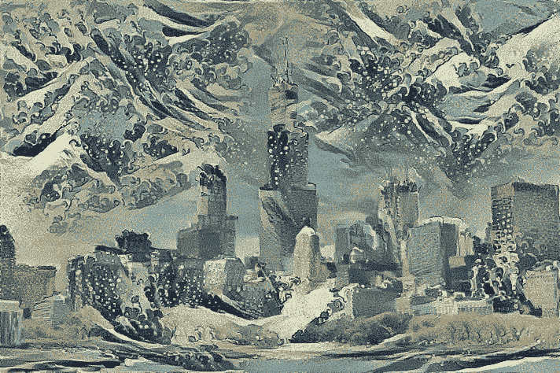

Neural style transfer using the style of famous “[Great Wave off Kanagawa](https://en.wikipedia.org/wiki/The_Great_Wave_off_Kanagawa)” and transferring to the skyline of Chicago.

这篇文章将是一个关于使用神经风格转移(NST)学习来生成像上面这样的专业外观的艺术品的教程。NST 已经存在有一段时间了，在你之前有一些网站执行所有的功能，但是，玩一玩和创建你自己的图像是非常有趣的。NST 是计算密集型的，所以在这种情况下，你不是被你的想象力所限制，而是主要被你的计算资源所限制。

本文中使用的所有代码都可以在我的神经网络 GitHub 页面上提供的 Jupyter 笔记本上找到。到本文结束时，您将拥有使用任何图像生成作品所需的所有资源。

 [## GitHub-mpstewart 1/神经网络

### 这个存储库包含与我的全连接神经网络系列相关的 Jupyter 笔记本内容。

github.com](https://github.com/mpstewart1/Neural-Networks) 

# 介绍

[神经类型转移](http://anvas.harvard.edu/courses/28991/files/folder/Lectures) (NST)可以总结如下:

*高感知质量图像的艺术生成，将某些输入图像的风格或纹理与不同图像的元素或内容相结合。*

从上面的定义可以清楚地看出，要使用 NST 生成一幅图像，我们需要**两幅**独立的图像。第一幅图像是我们希望转换风格的图像——这可能是一幅名画，例如我们看到的第一幅图像中使用的“*神奈川外的巨浪*”。然后，我们拍摄第二张图像，并使用第一张图像的样式来转换这张图像，以便变形这两张图像。下图说明了这一点，其中图像 A 是一个河边城镇的原始图像，第二个图像(B)是图像转换后的图像(样式转换图像显示在左下角)。

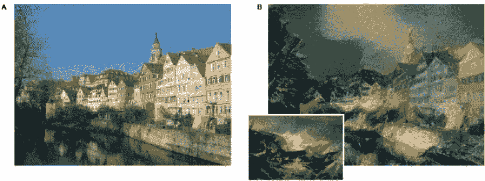

Leon A. Gatys, Alexander S. Ecker, and Matthias Bethge, “A neural algorithm of artistic style,” Aug. 2015\. [1]

本教程将充分详细地解释这个过程，以理解在引擎盖下发生了什么。为了理解这一点，我们首先要看看卷积神经网络的其他一些方面。将讨论以下主题:

*   **可视化卷积网络**
*   **图像重建**
*   **纹理合成**
*   **神经风格转移**
*   **深梦**

是时候开始了。

# 可视化卷积网络

为什么我们想要可视化卷积神经网络？主要原因是，有了神经网络，我们对学习和内部运作了解甚少

通过可视化，我们可以:

*   观察输入刺激如何激发个体特征图，
*   观察特征的演变
*   做出更有根据的设计。

在本文中，我们将使用类似于 AlexNet [2]的架构来解释 NST。

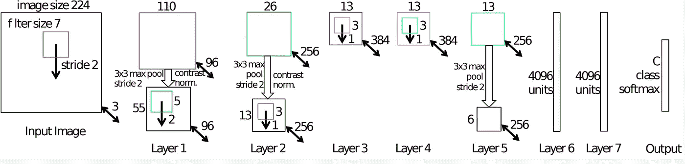

The architecture used for NST. [3]

详情见*“可视化和理解卷积网络”* [3]。该网络在 ImageNet 2012 培训数据库上接受 1000 个班级的培训。输入是大小为 256 x 256 x 3 的图像，网络使用卷积层和最大池层，最后是完全连接的层。

为了可视化，作者使用了一个**去进化网络**【4】。这样做的目的是将隐藏的特征映射投影到原始输入空间中。这使我们能够可视化特定过滤器的激活功能。“去卷积”网络的名称可能是不合适的，因为该网络不执行任何去卷积。

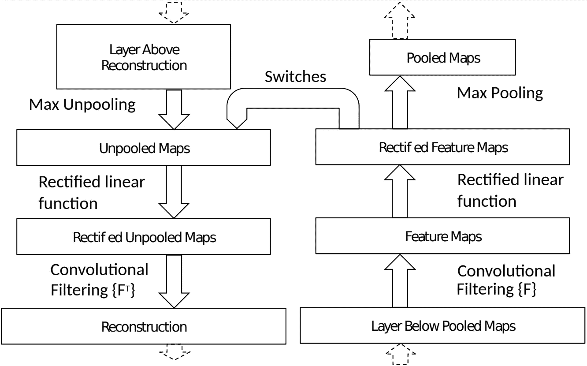

Deconvolutional network [4].

**解卷积网络描述**

这个反进化网络有几个方面:去极化、整流和过滤。

**取消 pooling**

*   最大池操作是不可逆的。
*   开关变量—记录最大值的位置。
*   它将重构的特征放入记录的位置。

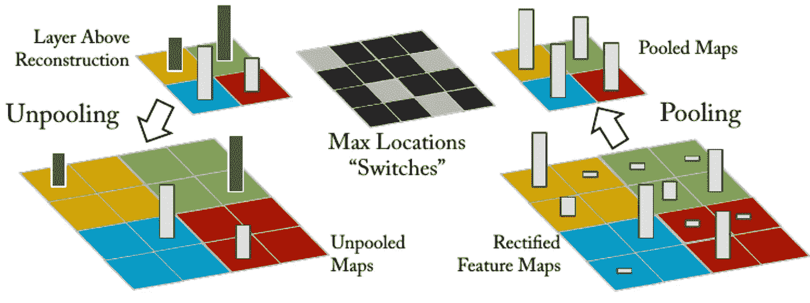

Unpooling layer.

**整流—** 信号经过 ReLu 操作。

**滤波** —使用转置卷积。

*   过滤器水平和垂直翻转。
*   转置卷积将要素映射回输入空间。
*   转置卷积对应于梯度的反向传播(类似于 MLPs)。

**我们如何进行特征可视化？**

(1)在训练好的网络上评估验证数据库。

(2)记录每个过滤器输出的九个最高激活值。

(3)将记录的九个输出投影到每个神经元的输入空间。

*   投影时，给定层中的所有其他激活单元都被设置为零。
*   该操作确保我们仅观察到单个通道的梯度。
*   开关变量用于非 pooling 层

我们现在可以使用这种技术来查看 AlexNet 各层的输出。

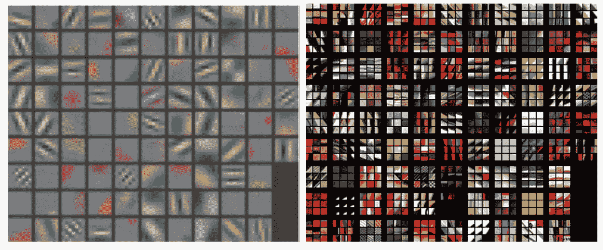

AlexNet first layer.

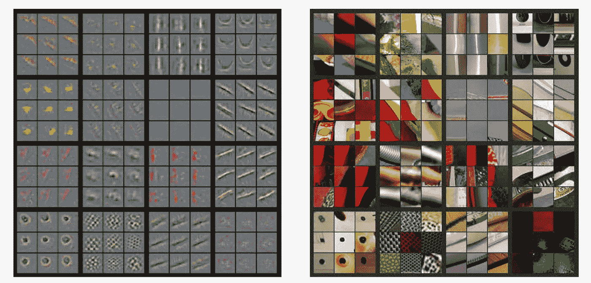

AlexNet second layer.

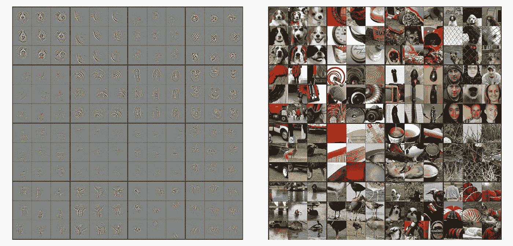

AlexNet fourth layer.

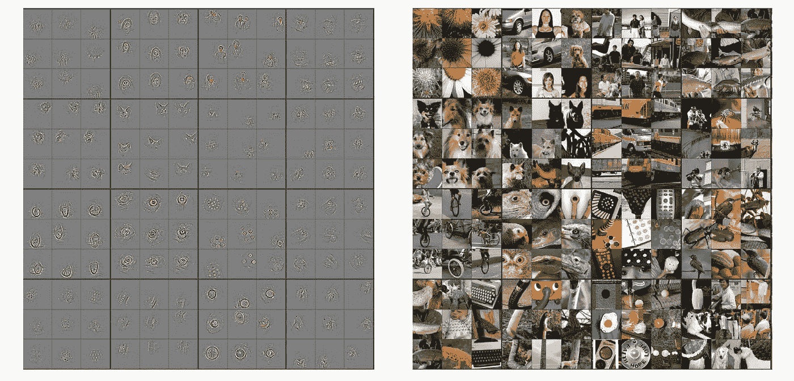

AlexNet fifth layer.

我们可以从上面的图像中看到，早期的层学习更多的基本特征，如线条和形状，而后面的层学习更复杂的特征。

我们如何在训练中测试特征进化？

我们可以查看五层中每一层在 1、2、5、10、20、30、40 和 64 个时期后的特征演变。

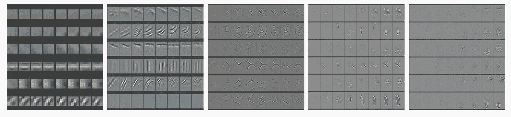

Example output of five layers at a specified number of epochs.

关于网络，我们可以注意到以下几点:

*   在几次单次通过后，低层很快会聚。
*   第五层直到非常大量的时期才收敛。
*   收敛后，下层可能会改变其特征对应关系。

我们如何知道这是最好的架构？

我们可以进行架构比较，我们实际上尝试两种架构，看看哪一种做得最好。我们可以通过检查不同架构对相同输入的响应是否相似或更强烈来做到这一点。

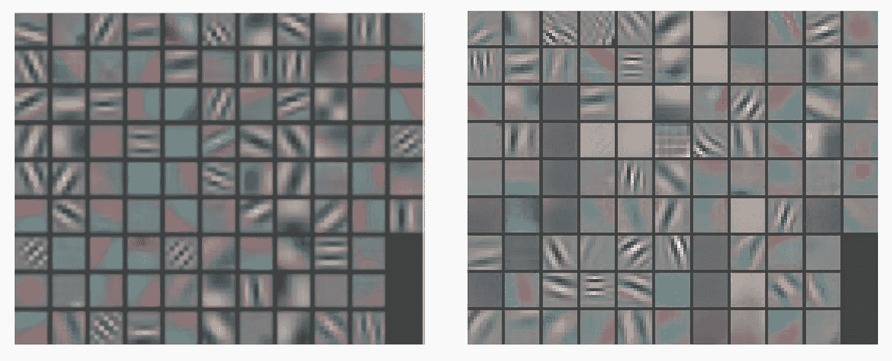

Left picture used filters 7 × 7 instead of 11 × 11, and reduced the stride from 4 to 2.

我们在上面的图像中看到，有证据表明，修改后的(左侧)网络上有更少的死单元，以及更多定义的功能，而 Alexnet 有更多的混叠效果。

# 图像重建

这就是数学上有点复杂的地方。如果您想了解 NST 的内部工作原理，这是很有必要的，如果不是，请随意跳过这一部分。本节将遵循*“通过反转理解深层图像表征”*【5】中给出的解释。

我们能够从潜在特征中重建图像。我们可以训练网络中的层来保留图像的精确照片表示，保留几何和光度不变性。为了清楚起见，下面等式中的符号*a【l】*对应于层 *l* 的潜在表示。我们的工作是解决最优化问题:

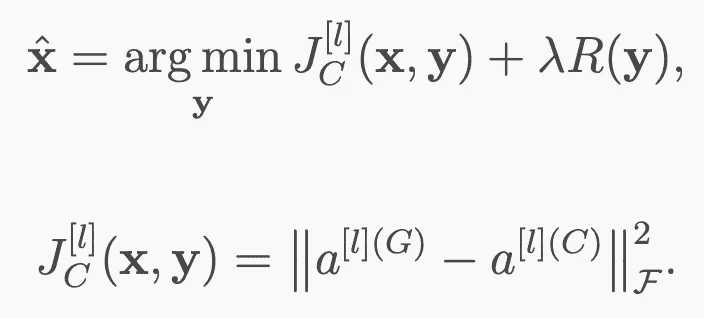

我们还可以使用α-范数正则化子来正则化这个优化过程:

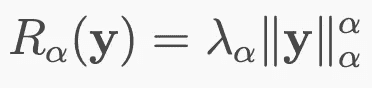

以及总变分正则化子:

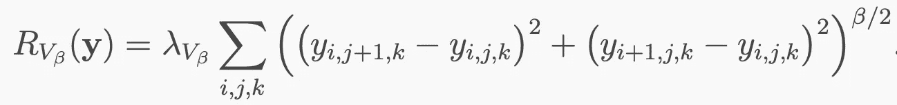

这将在后面的代码实现中变得更加清晰。

图像重建的步骤是:

*   用随机噪声初始化 ***y*** 。
*   前馈传递图像。
*   计算损失函数。
*   计算成本的梯度并反向传播到输入空间。
*   用梯度步长更新生成的图像 *G* 。

此过程用于生成下面的示例图像。

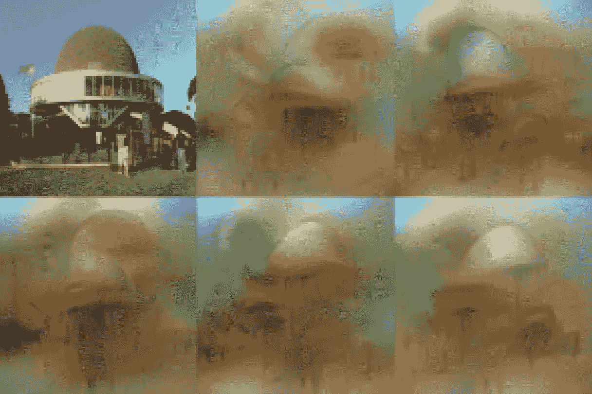

Example of image reconstruction.

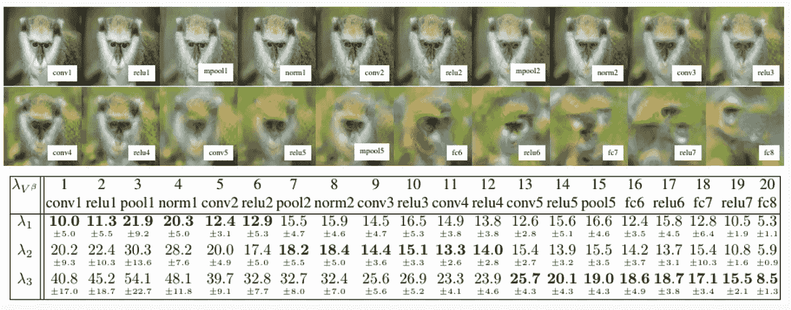

Example of image reconstruction.

# **纹理合成**

[纹理合成](https://en.wikipedia.org/wiki/Texture_synthesis)的目的是生成模仿给定纹理的高感知质量图像。这是使用用于对象分类的经过训练的卷积神经网络来完成的。我们将各层之间的特征关联作为一个生成过程。下面是一个纹理合成的例子:

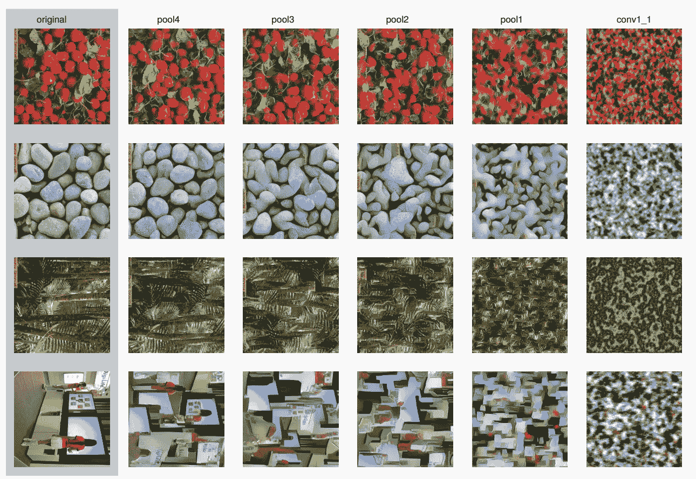

Example of texture synthesis.

给定图层的输出将如下所示:

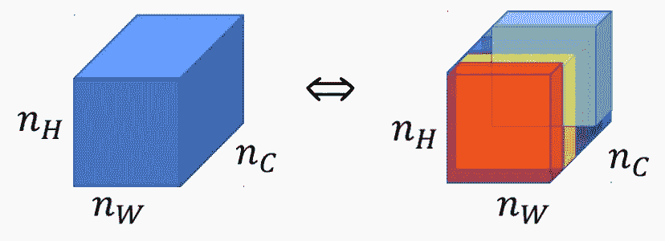

为了计算特征图的互相关，我们首先使用带有下标 *ijk* 和上标 *l* 的 *a* 来表示给定滤波器 *k* 在层 *l* 的输出。该输出与不同通道*k’*之间的互相关为:

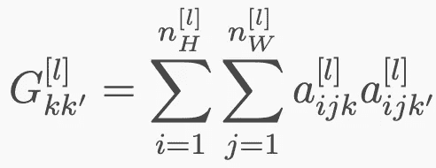

格拉姆矩阵定义为:

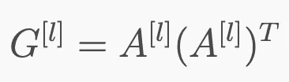

在哪里

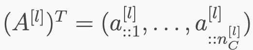

**生成新的纹理**

为了创建一个新的纹理，我们可以合成一个与我们想要再现的图像具有相似相关性的图像。 *G* 上标*【l】**【S】*是指样式图像的克矩阵， *G* 上标*【l】**【G】*是指新生成的图像。

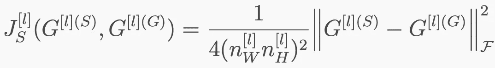

在哪里

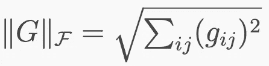

指的是 Frobenius 规范。我们将所有层损失合并到一个全局成本函数中:

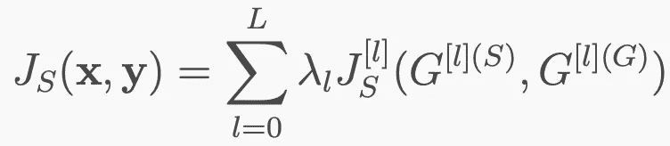

对于给定的权重λ1，.。。，λL。

**流程描述**

现在我们知道了所有的细节，我们可以完整地说明这个过程:

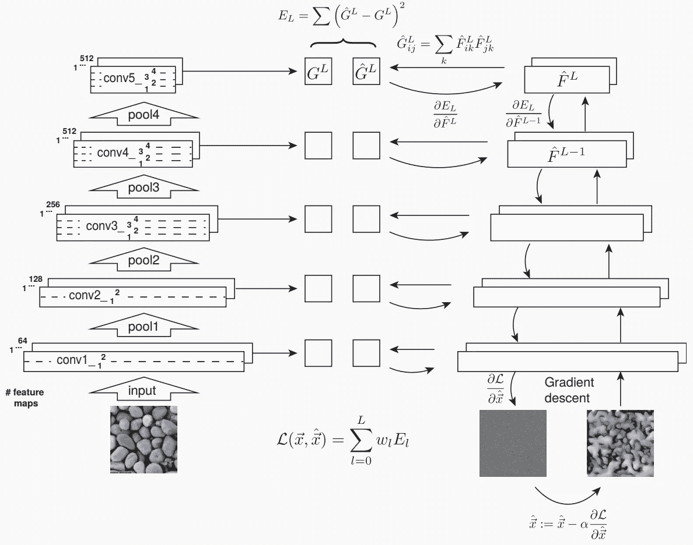

要了解更多细节，我建议你参考论文*“使用卷积神经网络的纹理合成”*【6】。

# **神经类型转移**

NST 最早发表于 Gatys 等人的论文《艺术风格的一种神经算法》，最初发布于[ArXiv](https://en.wikipedia.org/wiki/ArXiv)2015【7】。

几个移动应用程序使用 NST 技术，包括 [DeepArt](https://en.wikipedia.org/wiki/DeepArt) 和 [Prisma](https://en.wikipedia.org/wiki/Prisma_(app)) 。

这里有更多的样式化的例子，用来转换我们之前使用的河岸城镇的相同图像。

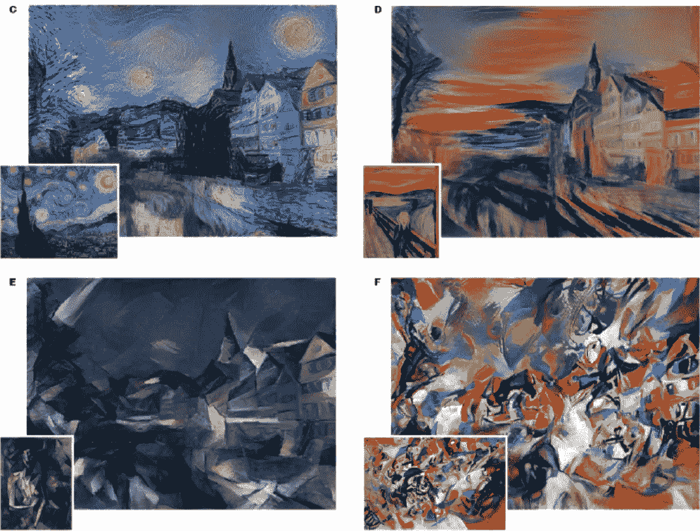

神经风格转移结合了内容和风格重建。要让 NST 发挥作用，我们需要做几件事:

*   选择一个层(或一组层)来表示内容-为了获得最佳效果，建议使用中间层(不要太应该，也不要太深)。
*   通过使用反向传播来最小化总成本。

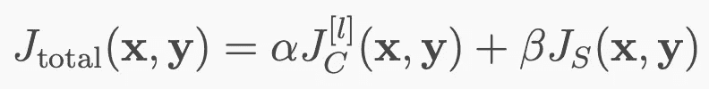

*   用随机噪声初始化输入(产生梯度所必需的)。
*   用平均池替换最大池层，以改善渐变流并生成更具吸引力的图片。

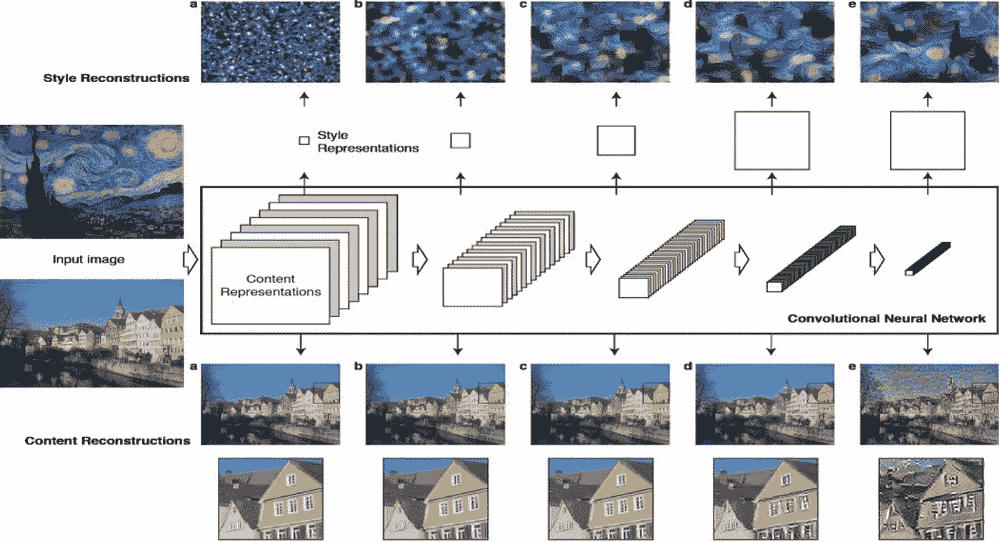

## 代码实现

现在到了你们期待已久的时刻，代码能够让你们自己制作这些图像。要更清楚地了解代码和数学符号之间的关系，请参阅 GitHub 资源库中的 Jupyter 笔记本。

**第 1 部分:导入必要功能**

**第二部分:内容丢失**

我们可以生成一个图像，它结合了一对的内容和风格以及包含这些信息的损失函数。这是通过两个术语实现的，一个术语模拟内容图像的特定层的特定激活，另一个术语模拟样式。损失函数中要优化的变量将是生成的图像，其目的是最小化建议的成本。注意，为了优化该函数，我们将对像素值而不是神经网络权重执行梯度下降**。**

我们将加载一个名为 VGG-16 的经过训练的神经网络，该网络在 [1](https://arxiv.org/pdf/1409.1556.pdf) 中提出，他们分别在 2014 年 ImageNet Challenge 的本地化和分类赛道上获得了第一名和第二名。这个网络已经被训练成可以从超过一百万张图片中识别超过 1000 个类别。我们将使用为感兴趣的图像获得的激活值来表示内容和样式。为了做到这一点，我们将前馈感兴趣的图像，并观察它在指示层的激活值。

内容损失函数测量生成图像的特征图与源图像的特征图有多大不同。我们将只考虑用一个单独的层来表示图像的内容。

**第 3 部分:风格损失**

该样式测量一组图层中过滤器之间的相似性。为了计算相似性，我们将计算样式层的激活值的 Gram 矩阵。Gram 矩阵与经验协方差矩阵相关，因此反映了激活值的统计。

输出是一个二维矩阵，它近似地测量给定层的不同滤波器之间的互相关。这在本质上构成了一层的风格。

**第 4 部分:风格损失—图层损失**

在实践中，我们计算一组层的风格损失，而不仅仅是一个层；则总风格损失是每层风格损失的总和:

**第 5 部分:全变差正则化子**

我们还将使用全变分正则化来提高图像的平滑度。这个惩罚项将减少相邻像素值之间的变化。

**第 6 部分:风格转移**

我们现在把它们放在一起，生成一些图像！下面的`style_transfer`函数结合了你在上面编码的所有损失，并对图像进行优化，使总损失最小化。阅读代码和注释以理解该过程。

**第六部分:生成图片**

现在我们准备制作一些图像，运行你自己的构图，测试超参数的变化，看看你能想出什么，下面我给你一个例子。要改变的超参数列表如下:

*   `base_img_path`是内容图像的文件名。
*   `style_img_path`是样式图像的文件名。
*   `output_img_path`是生成图像的文件名。
*   `convnet`是神经网络的权重，VGG-16 或 VGG-19。
*   `content_layer`指定哪个层用于内容丢失。
*   `content_weight`在整体复合损失函数中对内容损失进行加权。增加此参数的值将使最终图像看起来更真实(更接近原始内容)。
*   `style_layers`指定用于样式丢失的图层列表。
*   `style_weights`为 style_layers 中的每一层指定一个权重列表(每一层都将对整体样式损失产生影响)。我们通常为早期风格层使用较高的权重，因为它们描述了更多的局部/较小尺度的特征，这对于纹理来说比较大感受野上的特征更重要。一般来说，增加这些权重会使生成的图像看起来不太像原始内容，并且更偏向于样式图像的外观。
*   `tv_weight`指定总损失函数中总变差正则化的权重。增加该值会使生成的图像看起来更平滑，锯齿更少，但会降低样式和内容的保真度。

如果运行 50 次迭代，下面的代码将生成本文的正面图像。

下面是我自己在 50 次迭代后实现的几个粗略的例子:

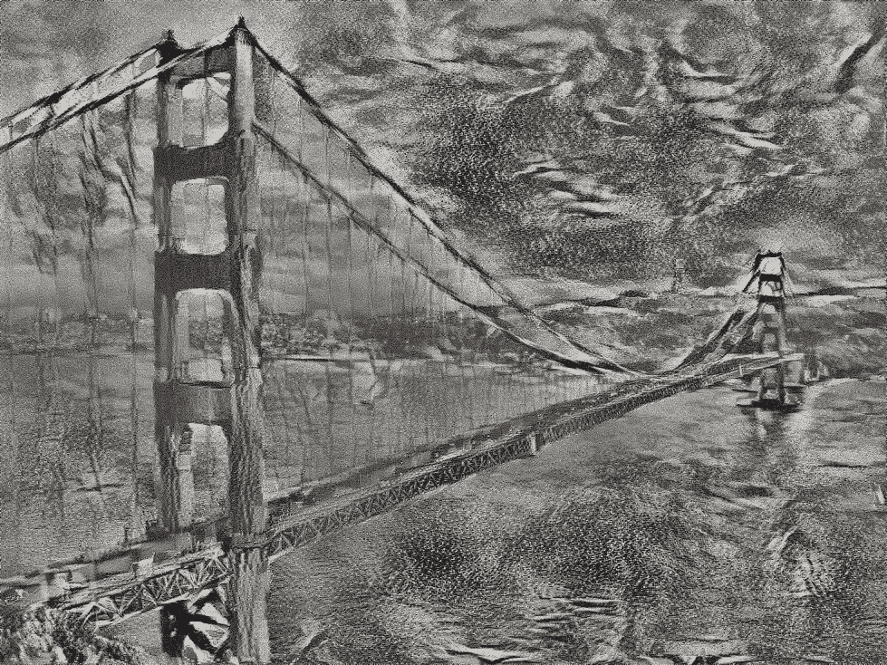

Style of ‘Escher Sphere’ used to transform an image of the Goldengate Bridge.

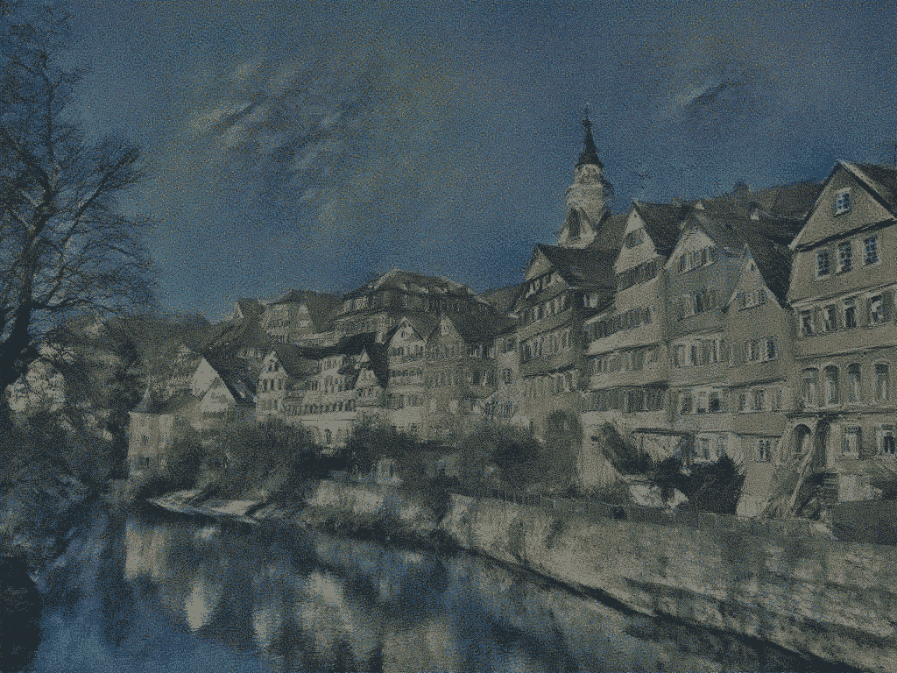

Style of ‘Seated Nude’ used to transform an image of the riverbank town image.

我建议在 GitHub 资源库(或您自己的资源库)中获取一些图像，并使用超参数，看看您能制作出什么样的图像。然而，警告你，训练时间相当长，除非你有一个 GPU，可能需要几个小时的一个图像。

# **深梦**

[**DeepDream**](https://deepdreamgenerator.com/) 是一个[计算机视觉](https://en.wikipedia.org/wiki/Computer_vision)程序，由 [Google](https://en.wikipedia.org/wiki/Google) 工程师 Alexander Mordvintsev 创建，它使用卷积神经网络通过算法 [pareidolia](https://en.wikipedia.org/wiki/Pareidolia) 寻找并增强图像中的模式，从而在故意过度处理的图像中创建一个梦幻般的迷幻外观。

谷歌的项目推广了术语(深度)“做梦”，指的是在经过训练的深度网络中产生预期激活的图像的生成，该术语现在指的是相关方法的集合。

这是一个由 DeepDream 转换的图像的例子。

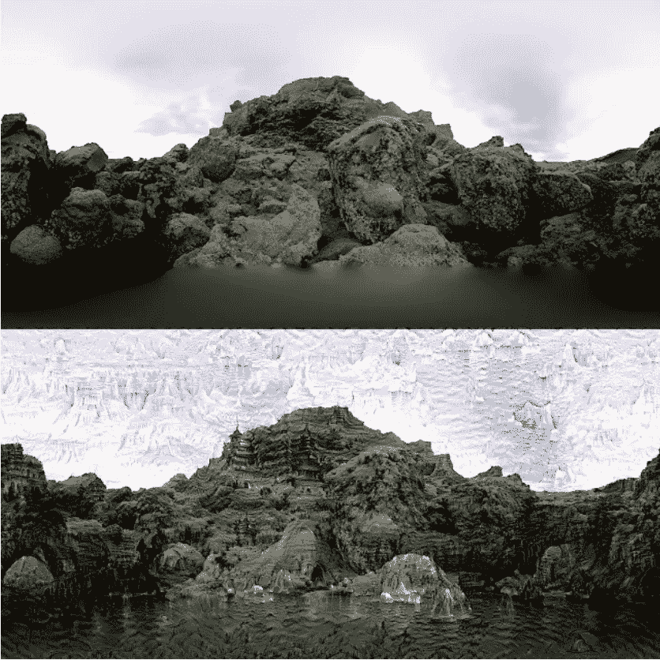

**概念主义:深入神经网络**

对于神经网络中的每一层封装了什么类型的特征，我们已经有了合理的直觉:

*   第一层可能寻找边缘或角落。
*   中间层解释基本特征，以寻找整体形状或组件，如门或树叶。
*   最后一层将它们组合成完整的解释:树、建筑等。

这对于判别模型来说很好，但是如果我们想要构建一个生成模型呢？比方说，你想知道哪种图像会产生一个香蕉。一种方法是将神经网络颠倒过来，从充满随机噪声的图像开始，然后逐渐将图像调整到神经网络认为是香蕉的方向。

就其本身而言，这并不能很好地工作，但是如果我们施加一个先验约束，即图像应该具有与自然图像相似的特征，例如相邻像素之间的相关性，这就变得更加可行了。

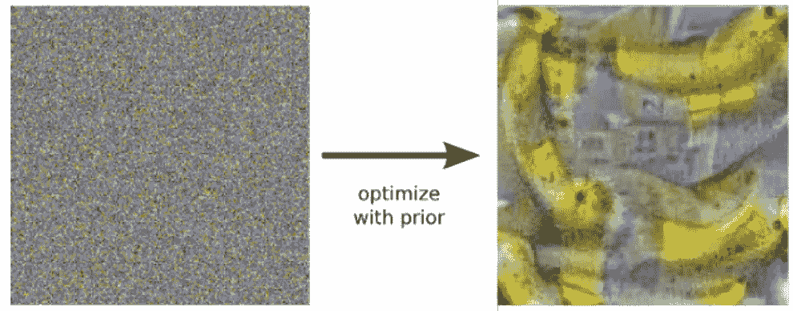

或许不足为奇的是，经过训练能够区分不同图像类别的神经网络也拥有生成图像所需的大量信息。

这可以用于类生成的目的，本质上是将判别模型转换成生成模型。但是我们为什么要这么做呢？

好吧，假设你训练一个神经网络来分类叉子。你拍摄了数千张叉子的图像，并用它们来训练网络，网络在数据上表现得相当好——但网络在做什么呢？网络用什么来表示分叉？这对于确保网络学习正确的特征而不是欺骗是有用的。

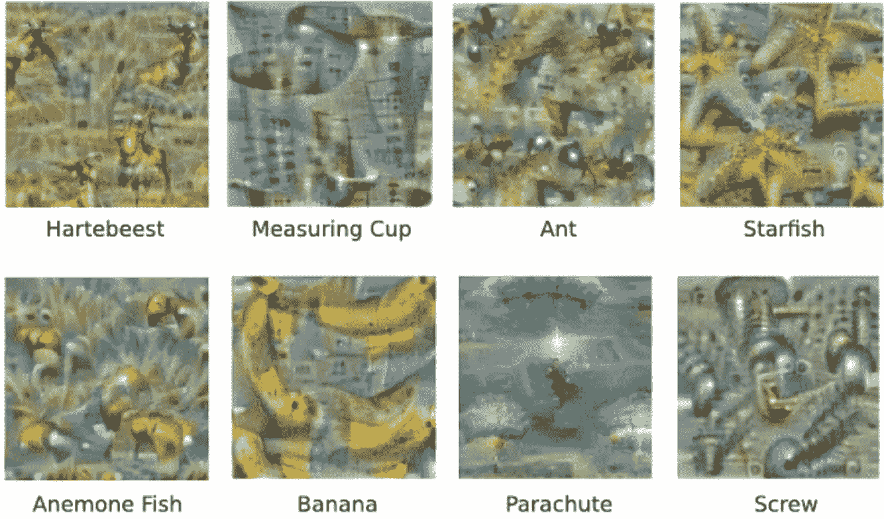

**可视化错误**

这种欺骗的一个很好的例子是哑铃。在一组哑铃图片上训练网络后，我们使用一些带有先验约束的随机噪声来“想象”一些哑铃，看看会弹出什么，结果如下:

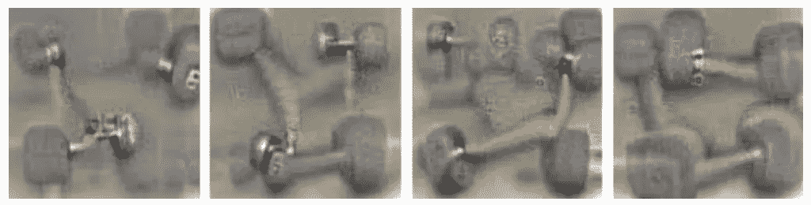

正如我们所看到的，网络总是生成带手臂的哑铃。然而，该网络未能完全提取哑铃的本质——例如，没有一张照片中有举重运动员。视觉化可以帮助我们纠正这种训练失误。

**增强特征地图**

我们也可以让网络做出决定，而不是规定我们希望网络放大哪个特征。

这可以通过向网络提供图像，然后选择一个层，并要求网络增强它检测到的任何内容来实现。较低的层倾向于产生笔画或简单的装饰性图案，例如:

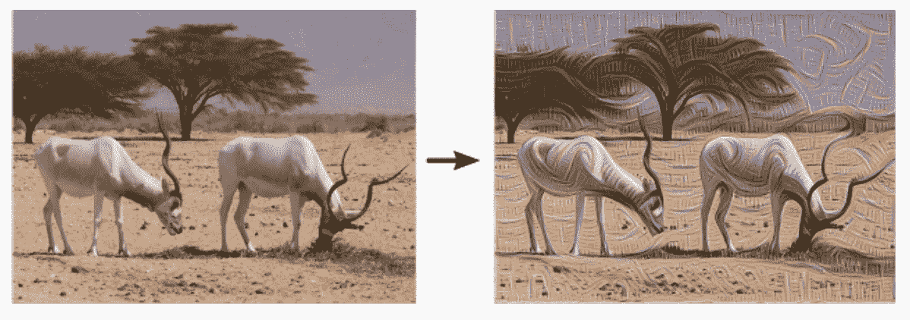

随着更高级别的层，复杂的特征甚至整个对象往往会出现。—这些识别更复杂的特征。这个过程创造了一个反馈循环:如果一朵云看起来有点像一只鸟，网络会让它看起来更像一只鸟。

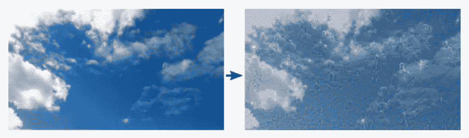

如果我们用动物的图片进行训练，网络会让它看起来更像动物:

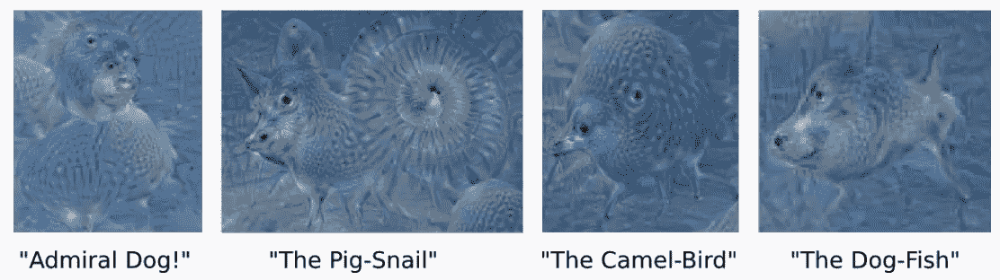

由于输入的特征会使网络偏向某些解释，因此结果会因图像类型的不同而有很大差异。例如，地平线上往往布满了塔和宝塔。岩石和树木变成了建筑。鸟和昆虫以树叶的形象出现。

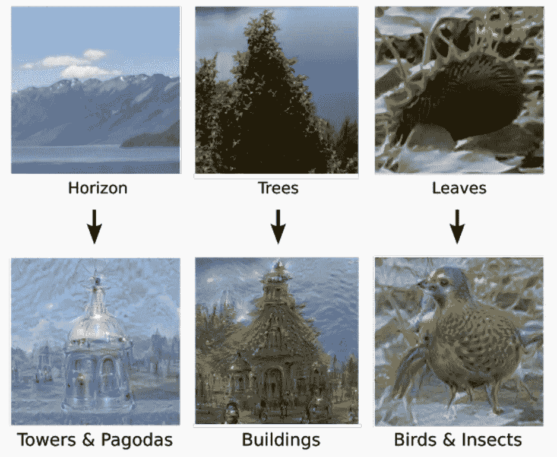

如果我们对它自己的输出迭代地应用算法，并在每次迭代后应用一些缩放，我们会获得源源不断的新印象，探索网络所知道的一系列事情。

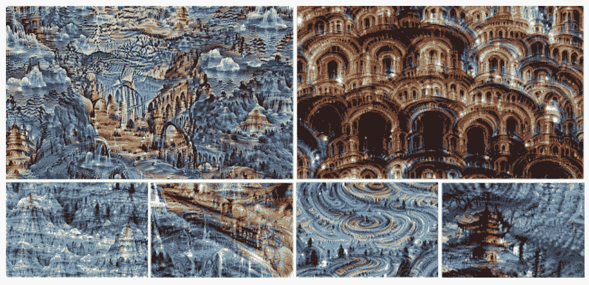

DeepDream 是一个迷人的项目，我鼓励读者如果感兴趣的话，可以更深入地了解它。

# 最终意见

我希望你喜欢这篇神经风格转移的文章，并学习了一些关于风格转移、卷积神经网络的新知识，或者可能只是喜欢看 DeepDream 的深度神经网络生成的迷人图片。

## 参考

[1] Leon A. Gatys，Alexander S. Ecker，和 Matthias Bethge，“艺术风格的神经算法”，2015 年 8 月。

[2] Alex Krizhevsky、Ilya Sutskever 和 Geoffrey E Hinton，“使用深度卷积神经网络的 Imagenet 分类”，载于《神经信息处理系统进展》，2012 年，第 1097–1105 页。

[3]马修·d·泽勒和罗布·弗格斯，《计算机视觉中的可视化和理解卷积网络》。2014，第 818–833 页，施普林格出版社。

[4]马修·D·泽勒、格雷厄姆·W·泰勒和罗布·弗格斯，“用于中高级特征学习的自适应去进化网络”，载于 IEEE 计算机视觉国际会议(ICCV)，2011 年，第 2018–2025 页。

[5] Aravindh Mahendran 和 Andrea Vedaldi，“通过反转理解深层图像表示”，2014 年 11 月。

[6] Leon A. Gatys、Alexander S. Ecker 和 Matthias Bethge，“使用卷积神经网络的纹理合成”。

[7]莱昂·加蒂斯；亚历山大·埃克；马蒂亚斯·贝斯吉(2015 年 8 月 26 日)。《艺术风格的神经算法》。