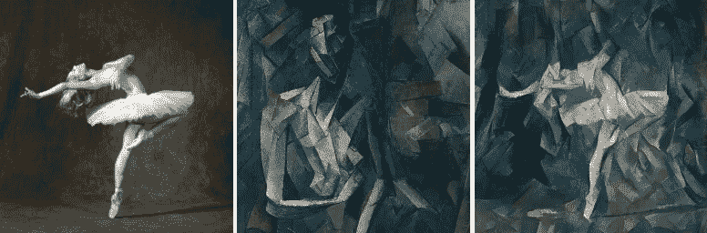
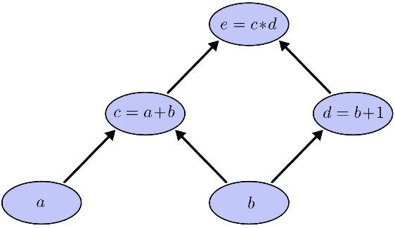

# 神经风格转移系列:第二部分

> 原文：<https://towardsdatascience.com/neural-style-transfer-series-part-2-91baad306b24?source=collection_archive---------18----------------------->

## 神经类型转换的 TensorFlow 和 pyTorch 实现

他的文章来自我们在第一篇文章中讨论的内容。虽然我们谈到了直觉和神经类型转移如何工作的理论，但我们现在将继续实现最初的论文。如果这是你阅读这个系列的第一篇文章，我恳求你阅读下面给出的前一篇文章。我们已经深入解释了 neural style 是如何工作的，这篇文章主要是关于如何实现它。理解理论上的细微差别也有助于理解实现。

[神经风格迁移教程—第一部分:神经风格迁移理论](/neural-style-transfer-tutorial-part-1-f5cd3315fa7f)

在解释整个代码之前，我将先浏览一下实现它们的框架。然后进入实现阶段。

实现的代码可以在这里找到。[ [Pytorch](https://github.com/Shashi456/Neural-Style/blob/master/Neural%20Style%20Transfer/train_Pytorch.py) ， [Tensorflow](https://github.com/Shashi456/Neural-Style/blob/master/Neural%20Style%20Transfer/train_TensorFlow.py)

注意:你一定注意到了，不是将代码模块化成一组损失，网络创建和培训文件。我们刚刚创建了两个名为 train_Pytorch.py 和 train_TensorFlow.py 的文件，我们可能会在未来的代码中更改此工作流。

在我们深入研究代码实现之前，现在让我们试着对深度学习框架有一个整体的看法。由于我们将使用 Python，我将坚持使用 Pytorch 和 Tensorflow 等主流框架。这将是一个非常全面的库视图，我们可以写另一篇文章，专门讨论不同的可用框架及其优缺点。您可能想看看其他几个框架，包括但不限于 Dynet、Chainer 和 Julia language 最近发布的框架 flux。另一件要注意的事情是，尽管这些是用于构建模型的框架，但还有更高级别的抽象，如 fastai、spacy 和 keras。

A computational graph

Pytorch 是由脸书借鉴 Lua 中的 torch 并在 caffe2 上构建而成的，而 Tensorflow 是由 google 创建的。Tensorflow 仍然是大多数人当前选择的框架，但 Pytorch 正在迅速加快速度，据说在某些方面更好。Pytorch 和 Tensorflow 都创建了被称为计算图的东西，两者的主要区别在于它们如何创建这些计算图。Pytorch 创建动态图，Tensorflow 创建静态图。这意味着，在 Pytorch 中，您可以随时操作您的图形，而在 Tensorflow 中，您必须事先完全定义它。Tensorflow2.0 正在尝试将动态图以急切执行的形式融入到语言中。Pytorch 更 pythonic 化，因此学习起来更直观，而 Tensorflow 有许多好的特性，如 Tensorboard(模型的可视化平台)，也更容易投入生产。

现在回到我们的文章，在这个代码解释中，我希望给出一些关于计算图的概述，并看到框架中的一些差异和相似之处。我想恳求你先理解代码，运行它，然后执行它，而不要看代码，如果有任何错误。我不会讨论为该程序编写的实用程序，因为它们只是数据加载函数，本质上大多是琐碎的。

首先要注意的是“内容层”和“风格层”，你可以用任何你想要的方式来尝试不同的表现。正如在原始文章中所解释的，这两个数组用于表示您将从中获取要素制图表达的图层。

在 pyTorch 中，创建网络的方法是重载 nn.Module。它通常有两个部分，首先是初始化所有层的 *__init__* 方法，然后是 *forward* 方法，forward 方法用于通过网络实际传递数据并获得输出。在这段代码中，我选择编写我自己的 VGG19 网络，但是也有一些方法可以导入内置的模型并加载权重。我选择以一种特殊的方式做的一些事情是保持平均池层，你也可以使用最大池层。

如果你想知道*变换*变量的用途是什么，它基本上是为了变换你的输入图像而存在的，无论原始分辨率是多少，都可以将其转换成可以馈入 VGG 网络的东西。我们对图像进行归一化处理，以便更详细地描述图像网络的含义。

在复制论文或制作模型时，框架内需要注意的一件事是，通常我们在 cpu 上有数据，但神经网络模型的效率训练是在 GPU 上进行的，因此正如你所见，我们使用了*。cuda()* 函数将我们的样式和内容图像等对象传输到 gpu 上。我们将预训练的 VGG 权重加载到模型上，这些预训练的权重来自在 Imagenet 上训练的 VGG。保存的重量文件的扩展名为*。pth* 需要注意的一件事是，当你编写你的网络并保存权重并尝试在我的网络上运行时，它可能不会工作虽然我们都在训练 vgg 网络，但不同的层名称等细节可能会或选择 max 而不是 average pooling 等层可能会在加载权重时引发错误。

谈到损失函数，首先我们有 gram 矩阵类。如前一篇文章所述，我们使用 Gram 矩阵提取特征层，即*。bmm()* 代表批量矩阵乘法。在批量矩阵乘法中，最后 2 个维度用于矩阵乘法，而其余维度被视为批量。我在变量后面的注释中写了一个例子来给出矩阵维数的概念。样式损失的计算方法是，首先传递图层以获取其 gram 矩阵表示，然后获取表示和目标之间的均方误差。一步一步地检查其余部分，我们从 VGG 网络中分离层，并将它们添加到各自的目标层。然后，我们开始定义损失、目标和损失层。最后，我们有风格权重和内容权重，你可以用任何你想要的方式进行实验，该文件建议 1000 和 5 是一个很好的开始方式，你的内容权重越高，你就越保留你的原始图像，你的风格权重越高，你会发现风格变得越来越突出，而内容退居其次。

最后是训练循环，训练循环是各种深度学习模型建立的关键部分。为了勾勒出一个通用的框架，我们在任何训练循环中做三件事，我们决定优化器，计算损失，然后反向推进。在上面的例子中，我们使用了 LBFGS 优化器。我们可以看到我们称之为*。zero_grad()* 函数这是因为，pytorch 默认情况下会累积梯度，所以我们需要每次在计算梯度之前将梯度设置为零。然后通过遍历所有的样式和内容层来累积总损失，之后是*。backward()* 函数用于计算梯度和*。步骤()*用于更新权重。我们将损失函数传递给*步骤()*的原因是，在 LBFGS 的情况下，需要多次计算损失。

现在，我将尝试指出主要的区别，而不是完整地浏览 Tensorflow 代码，因为代码的其余部分与 pyTorch 非常相似。其中一个基本区别是在 *run_style_transfer()* 中，我们可以观察到一个会话变量正在被创建，这就引出了一个事实，即由于 tensorflow 创建静态图，我们需要首先定义一个会话，然后在这个会话中训练模型。Adam 优化器用于训练模型，而不是 LBGFS。在训练循环中，会话是通过将优化器传递给相同的。并且只有在当前损失好于(即小于)先前损失的情况下，才更新损失。预加载重量的 VGG 模型是从 keras 导入的，而不是从头开始编写的。训练模型时，可能需要一段时间，因为如果本地没有权重，tensorflow 将下载权重。

好了，你已经成功地看到了神经类型转换的代码。接下来要做的是，运行代码并亲自查看输出。我们将继续快速神经风格转移系列，简单介绍一下，当你训练网络时，你可能会观察到，对于每种风格，你都需要重复训练整个网络。解决这个问题的一个更好的方法可能是学习样式权重，保存它们，然后随时加载您想要的任何内容图像。这可能听起来令人困惑，所以期待深入的文章。

非常感谢等待这篇文章。

感谢[瓦姆西克·谢蒂](https://medium.com/@vamshikdshetty)与我共同创作了这个系列。

您可以在这个[资源库](https://github.com/Shashi456/Neural-Style)中找到代码，在这里我们也将有本系列未来文章的代码。