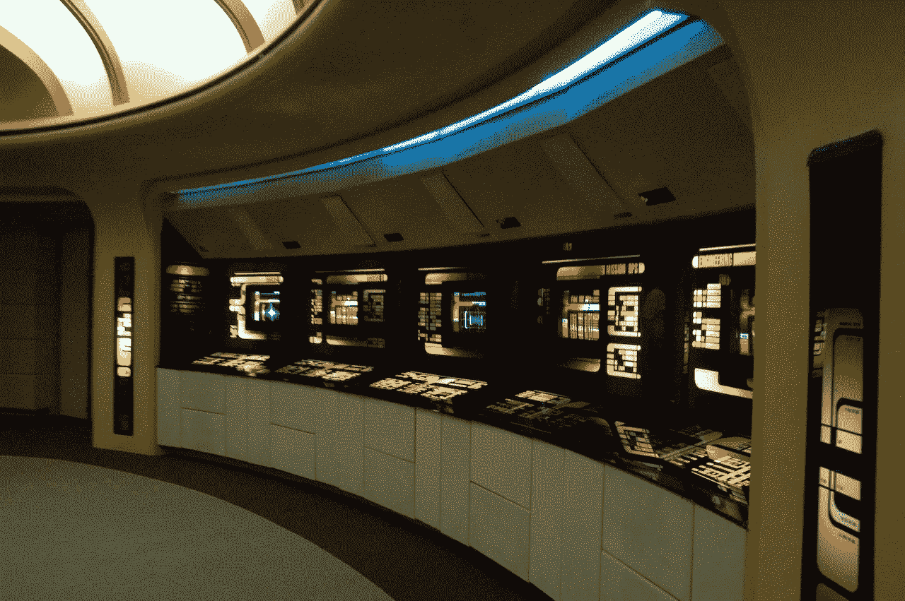
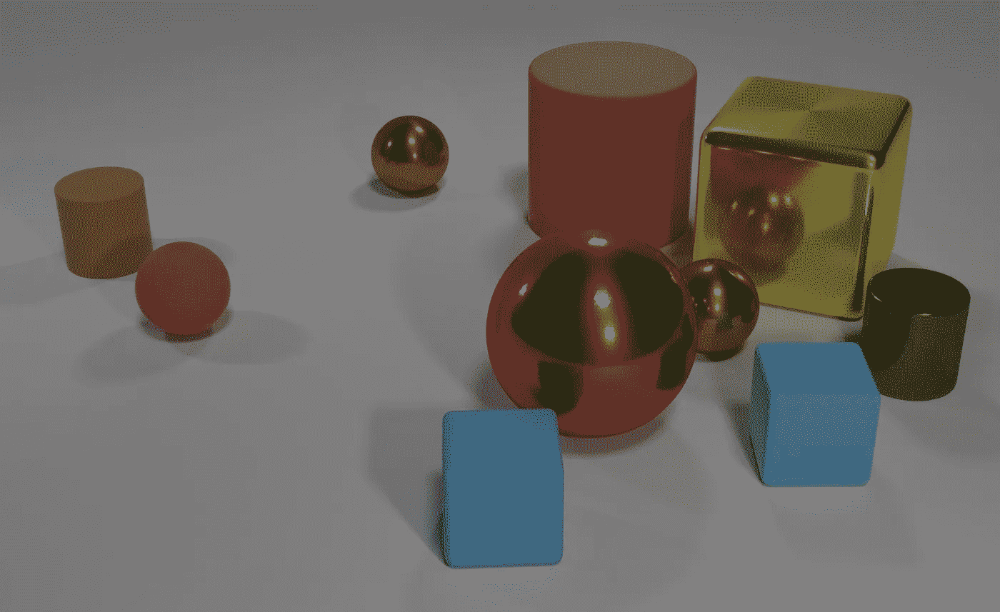
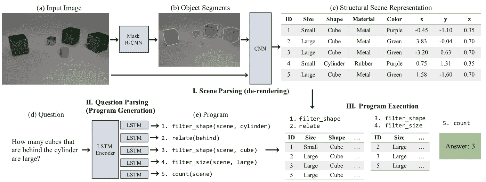

# 神经象征 VQN——非纠缠的推理——或者——答案是:非纠缠

> 原文：<https://towardsdatascience.com/neural-symbolic-vqn-disentagled-reasoning-or-the-answer-disentanglement-49f0fa0eb9c7?source=collection_archive---------12----------------------->

## 一个可解释的深度学习系统的解释。



Kreg Steppe [CC BY-SA 2.0 ([https://creativecommons.org/licenses/by-sa/2.0](https://creativecommons.org/licenses/by-sa/2.0))]

几乎每一项技术进步都始于科幻小说中的一个例子。因此，在我解释这些科学家的研究成果之前，我想让你们看一下经典电视剧《星际迷航——下一代，身份危机》中的一集。
播放时间索引 25:53 到时间索引 31:47 的嵌入视频，猜猜论文讲的是什么…
(当然你也可以看完整集；我会等你；)
(对于那些被 daily motion-video-player 弄糊涂的人:点击开始，然后【视频上的任何地方】点击并向右/向左拖动以调整时间索引。—知道这一点会节省我宝贵的两分钟……)

Star Trek TNG S04E18 Identity Crisis; ~ Stardate 40164.7

我希望你喜欢它；但是让我们来揭开我想要达到的目标的神秘面纱:

这一集提到的部分展示了计算机的视觉分析能力，以及如何使用这种能力:
当 Geordi La Forge 在视频中检测到阴影时，他想知道它的来源。计算机自然不知道他说的是什么影子，于是 Geordi 让计算机合成了一个全息程序，用于进一步分析。
在这个节目中，Geordi 告诉计算机从场景中移除一些物体，然后问了一个至关重要的问题:
*“计算机，使用矢量分析，识别这个阴影的来源”*受访者回答*“程序中没有可以产生阴影的物体”*。

这是一个真正了不起的例子，计算机根据某个场景响应查询。
由于我们生活在一个数据时代，已经有至少一个数据集适合训练算法来执行这样的任务:[CLEVR(组合语言和初级视觉推理)数据集](https://cs.stanford.edu/people/jcjohns/clevr/)。

数据集由场景图像、针对该场景的问题以及用于寻找每个问题答案的功能程序组成。
下面是一个例子:



对左边图片的一个问题可以是:
大金属立方体左边的大圆柱体是什么颜色？

答案当然是:红色。

该程序可以这样工作:

```
Filter the scene by metallic cubes -> 
filter by size -> 
take one of them if one exists -> 
filter the scene by objects left to its position -> 
filter by size -> 
filter by cylinders -> 
take one of them if one exists -> 
output its color
```

正如 DeepMind 的论文所指出的，已经有几种方法可以解决这个有趣的问题，但是，其中大多数都是端到端的方法，并且/或者它们的性能不如它们在企业的计算机核心中实现时应该表现的那样好。

## 因此，这里有一个解释，如何被称为神经符号 VQN 的新框架在这个数据集上达到 99.8%的准确率:

DeepMinds 系统由三个子系统精心组成:

*   场景解析器或去渲染引擎
*   问题解析器/程序生成器
*   程序执行环境



screenshot of the mechanics of NS-VQN; source: DeepMind paper

让我们逐一查看不同的组件，然后讨论它们的总体方法。

场景解析器本身由两个子系统组成(如上图所示)。第一部分检测场景中的对象。它在带标签的数据集上进行了预训练。“Mask R-CNN”获得图像的压缩版本，并被训练为用可见的框/覆盖物覆盖场景中的对象。

现在“标记的”(和压缩的)图像与原始(未压缩的)图像一起被送入 CNN，以提取物体的相应坐标。

第二步生成原始图像的表示，可以对其进行查询。然而，要真正查询它，我们需要一个程序。

这个(纯函数式)程序[ [这篇文章解释了函数式编程的基础知识](https://medium.com/@fabian.schneider/functional-programming-and-formal-software-verification-for-non-industry-applications-fefa24371856) ]是通过将问题输入双向 LSTM 编码器生成的。编码器输出被输入到 LSTM 解码器列表中。每个解码器的输出是一个函数。将这些函数与我们图像的表格表示一起使用，会产生(潜在的)正确结果。

好吧，最后一部分一开始可能不容易理解；让我再试一次:
你可以把 LSTM-编码器-解码器模式想象成类似于笔记本中的交叉引用系统。编码器为输入的问题生成一个抽象的表示，解码器提取这个“参考”并吐出它指向的东西；在这种情况下是一个函数。
系统作为一个整体被训练(如黑框所示)，因此编码器学习将查询翻译成抽象序列，每个解码器解释其部分(最终程序序列)以输出属于最终半功能程序的正确功能。[半功能性，因为它被解释为命令性的；然而，[人们可以把 executor 看作是一个 monad 实现，支持函数式程序的命令式符号](https://wiki.haskell.org/IO_inside)。

在程序生成之后，我们将程序以及表格图像表示交给程序执行者。
(这部分相当简单，因为它只是用正确的数据执行函数，这意味着将一个函数的输出作为参数传递给下一个函数，直到程序终止。)

如果您想了解性能和结果的详细信息，请查看论文中的其他图表。(他们的描述相当直接。)

上面描述的架构有很多有趣的特性。我们已经讨论了它的编译部分，但是对设计来说还有更有趣的东西:可解释性。

设计的深度学习算法无法解释它是如何得出特定结果的。这个解释隐藏在一层层相连的神经元中，对于人类用户来说是不可读的，也是不可理解的。由于上述架构使用了多种深度学习算法，我们可以假设它是通过设计一个黑盒来实现的。然而，我们大错特错了。

研究人员使用深度学习黑盒来生成输入数据的表示(例如，视觉标记图片中的对象，编辑带有图片中位置的对象列表，…)。所有这些表示都是人类可读的，因此是可以解释的。
用户可以(从算法中得到结果后)看一看程序和生成的表格，推断程序可能在哪里出错；或者(更重要的是)为什么输出是“小”而不是“大”，因为网络将一个立方体误认为一个球体(这可以在查看标记的图片、表格和输入图片时看到)。

我们可以把这种方法称为面向表示的学习:不是制作一个只使用一个巨大的主函数(比如一个巨大的神经网络)的程序，而是制作一个被很好地划分成更小部分的程序，可以更容易地解释和修复。

设计面向表征的学习系统的主要好处可能一开始并不太明显，但请保持关注:
可能永远不会有一个系统可以解决所有问题(除了，显然是巨型计算机“地球”，生命本身是其中的一部分，由 Magrathea 上的 Deep Thought 设计)。然而，已经有很多好的机器学习架构来解决特定的问题(例如，自然语言处理、图像识别、匹配音乐等)。).
使用面向表示的学习方法使我们能够将这些解决方案连接在一起，不是一个单一的系统，而是一个可以解释(不一定用自然语言)为什么以及如何得到答案(当然是 42)的系统。

另一个好处是子系统可以彼此独立地训练。如果系统作为一个整体缺乏一些性能，我们可以看到，例如，程序生成器需要更多的调整，我们不必再次训练整个系统。我们可以训练或替换程序生成器。

总之，DeepMind 提出的架构(当然还有 DeepThought[1]提出的架构)是可执行的、可解释的和高度模块化的。它也是独立于领域/技术的(这意味着我们可以想象这个系统也适用于声音，并与一些随机森林相结合)。

现在你也知道题目中问题的答案了。(对于现在迷茫的大家，管好自己的毛巾，是“可解释深度学习的关键是什么？”。)

[1]:deep thinks 提出的架构(地球)当然也主要是可解释的(你可以自己构建推理链)和模块化的(你是可替换的)，然而，由于我们的祖先长期以来一直决定在树上跳来跳去，所以性能不是很好。)