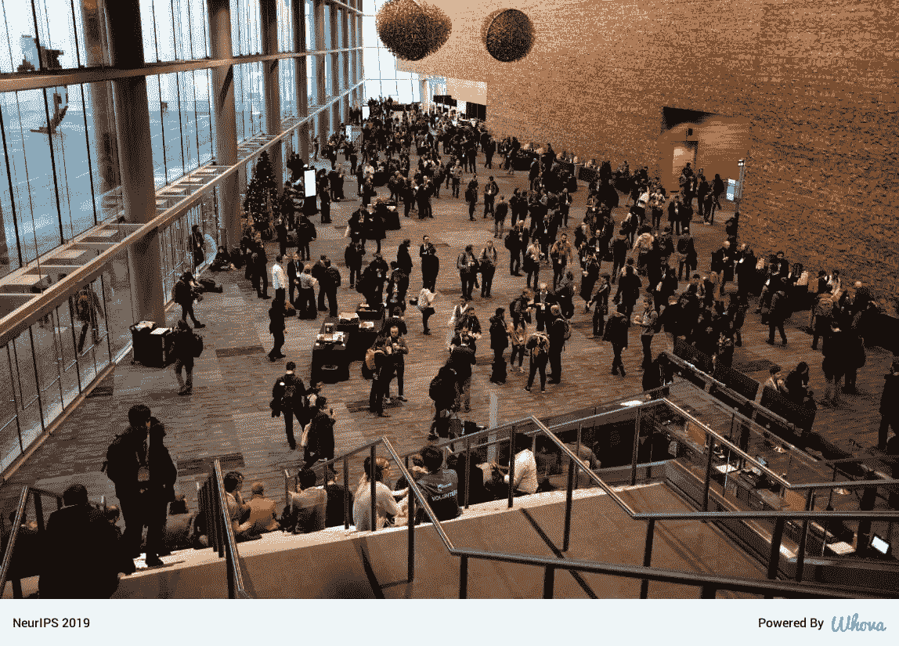
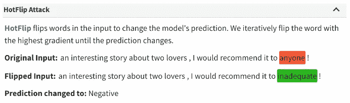
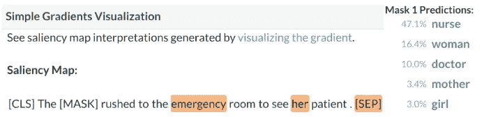

# NeurIPS 2019

> 原文：<https://towardsdatascience.com/neurips-2019-225fd7636ce5?source=collection_archive---------19----------------------->

[Vancouver Skyline](https://dailyhive.com/vancouver/vancouver-weekend-events-may-17-20-2019)

## 势不可挡。

是的，我再说一遍。势不可挡。如果我要用一个词来总结我在 2019 年第 33 届年度神经信息处理系统大会上的经历，“压倒性”几乎可以概括大部分。

接受 6743 篇提交的论文中的 1428 篇可能会让[神经信息处理系统会议](https://medium.com/u/f5c0769c2aa2?source=post_page-----225fd7636ce5--------------------------------)应接不暇。但在温哥华会议中心，13000 名人工智能研究人员的出席令人麻木。

Vancouver Convention Center

我要感谢亚马逊给我这个机会来参加会议，尽管只是作为一个与会者。尽管如此，这是一个很好的机会，让世界上最优秀和最伟大的研究人员聚集在一个巨大的建筑下。如果我不感谢组织者和主持人所做的大量工作，我肯定是失职的。在 7 天的时间里，我学到了很多东西，以下是我个人的亮点。

呼唤:再现性、公平性(伦理人工智能)和可解释性(可解释的人工智能)。

# 可解释性

[**AllenNLP 解读**](https://allennlp.org/interpret) :基于 [Allen NLP](https://allennlp.org/) 之上的工具包。这是一个解释 NLP 模型预测的框架。到目前为止，本[演示](https://demo.allennlp.org/)已经涵盖了 16 种不同的自然语言任务。这是一个介于可解释性和 NLP 之间的有趣的工作。我特别喜欢这两种可视化方式&解释:使用显著图的简单梯度和基于热翻转的对抗性攻击。

[**这个看起来是这样的:可解释图像识别的深度学习**](https://nips.cc/Conferences/2019/Schedule?showEvent=15772) :本文介绍了一种新的架构 ProtoPNet，它有一个原型层。它充当可解释层，同时仍然实现与 SOTA 深度学习模型相当的性能结果。[ [论文](http://papers.nips.cc/paper/9095-this-looks-like-that-deep-learning-for-interpretable-image-recognition) ] [ [3min 视频](https://youtu.be/k3IQnRsl9U4) ] [ [幻灯片](https://nips.cc/media/Slides/nips/2019/westballc(12-10-05)-12-10-25-15772-this_looks_like.pdf)

# 再现性

如果这项研究不可重复，那它还有什么意义呢？是的，我们经常听到人们谈论这一点。显而易见，研究团体和 NeurIPS 对这些主张做出了回应。可再生性正受到重视，至少已经开始受到重视。NeurIPS 首次组织了[再现性挑战](https://reproducibility-challenge.github.io/neurips2019/)，鼓励机构通过 [OpenReview](https://openreview.net/group?id=NeurIPS.cc/2019/Reproducibility_Challenge) 使用被认可的论文。浏览“[再现性清单](https://www.cs.mcgill.ca/~jpineau/ReproducibilityChecklist.pdf)”很有意思。

# 公平

众所周知，ML 模型是不公平的(到目前为止)。可能会有种族偏见、性别偏见和其他此类偏见渗透到模型中，导致灾难性的后果

首先，你会惊讶地发现:

*   [面部分析 AI 对深色皮肤表现较差](https://www.bostonmagazine.com/news/2018/02/23/artificial-intelligence-race-dark-skin-bias/)
*   [白人男性给出最低的错误匹配率(FMR ),而黑人女性给出最高的 FMR](https://www.wired.com/story/best-algorithms-struggle-recognize-black-faces-equally/)

NeurIPS 2019 见证了该领域的大量研究。几个有趣的例子:

*   不要问 AI 能做什么，要问 AI 应该做什么:走向一个任务可委派性的框架[[delegability . github . io](https://delegability.github.io/)][[论文](http://papers.nips.cc/paper/8301-ask-not-what-ai-can-do-but-what-ai-should-do-towards-a-framework-of-task-delegability) ] [ [海报](https://drive.google.com/file/d/1XPtyJeRA16tRzfe-qN1lkroLVMFYuKfB/view) ] [ [3 分钟视频](https://www.youtube.com/watch?v=diaYtomuQ24&feature=youtu.be) ]
*   公平近邻[ [论文](http://papers.nips.cc/paper/9476-near-neighbor-who-is-the-fairest-of-them-all)][幻灯片]
*   医疗保健公平 ML[[已接受论文](https://www.fairmlforhealth.com/accepted-papers)

# 特邀演讲人

*Celeste Kidd，*谈到 [**开幕当天如何认识**](https://slideslive.com/38921495/how-to-know) 。它受到了观众的热烈欢迎。在强调#metoo 运动后的性骚扰问题时，她的主题演讲引起了与会者的共鸣。

*Yoshua Bengio* ，做了题为 [**从系统 1 深度学习到系统 2 深度学习**](https://slideslive.com/38921750/from-system-1-deep-learning-to-system-2-deep-learning) 的远见演讲。虽然很高兴看到 ML 和 DL 快速发展，但强调它的缺陷、缺点以及未来需要的改进和适应也很重要。

# 很酷的演示

[**这张纸怎么进得去？**“](https://nips.cc/Conferences/2019/Schedule?showEvent=15445)——为顶级 AI 会议写作时给研究人员提建议的游戏。该项目的目的是建立一个自然语言分类+可解释的人工智能工具，用于分析论文并提出修改建议，以使其被顶级会议接受。出于演示的目的，他们将论文标题而不是整篇论文作为输入。

**将 AI 引入命令行** [ [演示](https://ibm.ent.box.com/v/bb-iaai-video)——这是我在 NeurIPS 2019 上发现的最酷的演示和想法之一。这可能会让软件开发人员、工程师和一般的计算机科学人员彻夜难眠。但是，CLAI(命令行人工智能)仍然是一个强大的想法。这个由 IBM Research AI 开发的工具利用了 NLP 和强化学习。自然语言支持、现场支持&故障排除、智能自动化是该工具的强大功能。看看它如何演变会很有趣。

来自*松下测试研究实验室*的人们展示了**智能家电:与你的冰箱聊天**。用户可以通过 Facebook Messenger 界面询问冰箱内的内容、物品数量、物品新鲜度等问题。尽管只是一个演示，我还是期待真实世界的数据和更丰富的体验。但是 DNN 模型是在一组特定的图像上训练的，并且数据集是限制性的。尽管如此，这是一个展示 CV+NLP 强大功能的好主意，有很大的潜力和适用性。

**与人工智能化身进行一对一的健身训练**:数字健身教练米莉(Millie)实时互动，观察用户的动作，并对其速度、准确性和形式进行评分。

[**机器人辅助梳头**](https://fortune.com/2019/12/11/robot-hair-brushing-elderly/) :南加州大学的研究人员开发了一种机器人，它使用摄像头来绘制人的头部和头发的 3D 地图。它可以被想象成一个点云。它随后创建计划好的路径并执行它们。[ [演示](https://www.youtube.com/watch?v=yDUqiuNJBIM)

**学习机可以卷曲——自适应深度强化学习使机器人 Curly 能够在冰冷的世界中战胜人类玩家**。由来自韩国大学和柏林理工学院的团队设计的名为卷毛的机器人。深度学习不仅在围棋、国际象棋等游戏中击败冠军，现在它还进军奥运项目。体育界暂停了一场革命。

# 车间

星期五和星期六是一个高度平行的问题。不幸的是，我的单线程引擎被证明是一个瓶颈。尽管如此，我还是鼓励每个人尝试用 ML 应对气候变化。12 个小时的工作坊，但有很多有趣的事情发生。季节性、雪崩和电动汽车(EV)的研究可以说“只是冰山一角”。

# 获奖论文

## 最佳论文奖

[具有 Massart 噪声的半空间的分布无关 PAC 学习](https://papers.nips.cc/paper/8722-distribution-independent-pac-learning-of-halfspaces-with-massart-noise)

## 荣誉奖:

1.  [*非参数密度估计&在 Besov IPM 损失下 GANs 的收敛速度*](https://papers.nips.cc/paper/9109-nonparametric-density-estimation-convergence-rates-for-gans-under-besov-ipm-losses)
2.  [*快速准确的最小均方解算器*](https://papers.nips.cc/paper/9040-fast-and-accurate-least-mean-squares-solvers)

## 杰出的新方向文件

[一致收敛可能无法解释深度学习中的泛化](https://papers.nips.cc/paper/9336-uniform-convergence-may-be-unable-to-explain-generalization-in-deep-learning)

## 荣誉奖:

1.  [*端到端的终结:表征的梯度隔离学习*](https://papers.nips.cc/paper/8568-putting-an-end-to-end-to-end-gradient-isolated-learning-of-representations)
2.  [*场景表示网络:连续 3D 结构感知神经场景表示*](https://papers.nips.cc/paper/8396-scene-representation-networks-continuous-3d-structure-aware-neural-scene-representations)

## 时间考验奖

[正则化随机学习和在线优化的双重平均方法](https://papers.nips.cc/paper/3882-dual-averaging-method-for-regularized-stochastic-learning-and-online-optimization)

为了理解获奖论文，我发现这篇[文章](https://www.analyticsvidhya.com/blog/2019/12/neurips-2019-best-papers/)很有帮助。

总而言之，这是在温哥华度过的精彩刺激的 7 天。没有进入炒作周期，我真的觉得，这只是旅程的开始。还有很多有待研究、发明和应用到工业中。活着是多么令人兴奋的时刻啊！