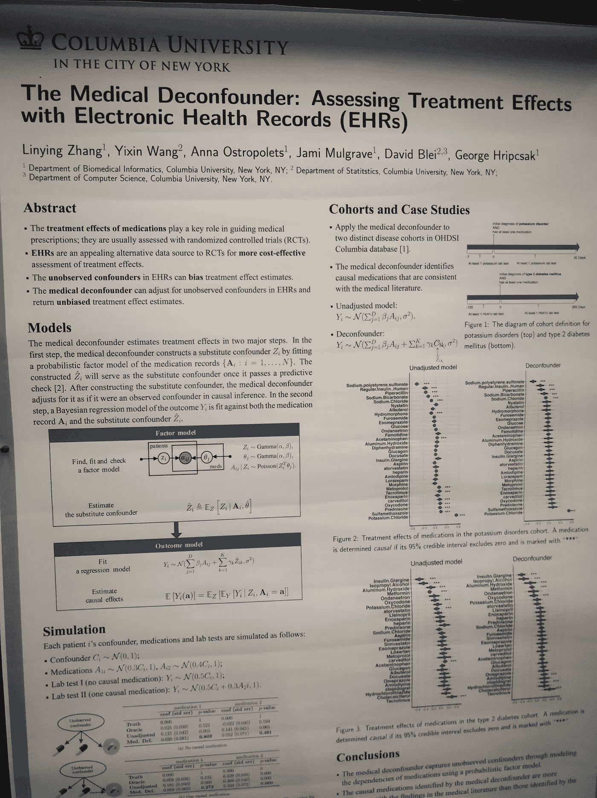
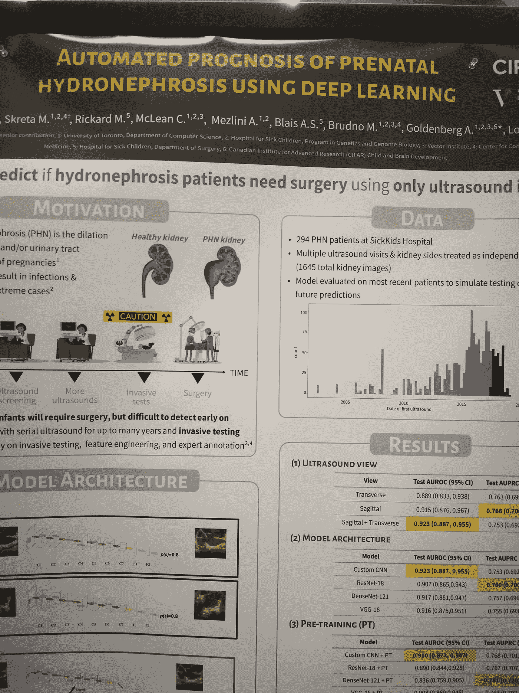
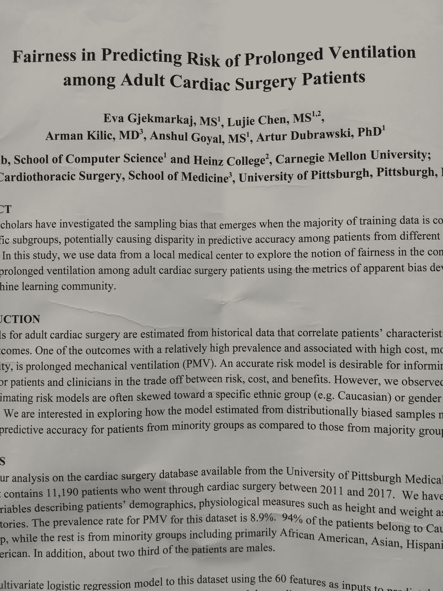

# NeurIPS 2019。第一天

> 原文：<https://towardsdatascience.com/neurips-2019-day-1-60393c6bc30d?source=collection_archive---------35----------------------->

## 辅导日

NeurIPS 被证明是机器学习社区中最重要的会议。今年是在美丽的加拿大城市温哥华，有超过 10，000 人参加。共提交了 6734 篇论文，其中 1428 篇被接受。你可以看到，人们不仅很容易被参加的人数淹没，也很容易被信息流淹没。

关于会议其他日期的信息可以在这里找到:

*   [第二天](https://medium.com/@michaellarionov/neurips-2019-day-2-5c6b88711274)
*   [第三天](https://medium.com/@michaellarionov/neurips-2019-day-3-334fa8a8536)
*   [第四天](https://medium.com/@michaellarionov/neurips-2019-day-4-eb2c03bafa03)
*   [第五天](https://medium.com/@michaellarionov/neurips-2019-day-5-38902b076285)
*   [第六天](https://medium.com/@michaellarionov/neurips-day-6-9be408a353b4)

第一天(星期一)是辅导课。有三个辅导轨道，每个辅导会议持续约两个小时。我决定参加三个教程:贝叶斯原则的深度学习，分布和模型的可解释比较以及综合控制。

第一个教程的幻灯片可以在[这里](https://emtiyaz.github.io/papers/Sep12_2019_epfl.pdf)找到。我注意到了两件事。首先，作者的注意力放在了优化算法上，而不是在神经网络上进行全面的贝叶斯推理(我们知道这是难以处理的)。事实上，他表明，许多优化算法可以从贝叶斯原理中推导出来。例如，梯度下降可以从具有同位素协方差的高斯模型中导出。RMSProp 对应于具有对角协方差矩阵的多元高斯。其他优化算法，如亚当，也可以追溯到贝叶斯原则。事实上，按照这种方法，可以推导出其他优化算法，如演示中所示。这些优化为某些任务提供了更好的结果。

作者提出的第二个有趣的观点是，使用贝叶斯原理，我们不仅可以探索参数空间，还可以通过分配每个例子的重要性来探索输入空间。每个例子的重要性不同的想法是非常古老的，并且是支持向量机(SVM)算法的基础。事实上，在建立决策边界时，边界示例比远离决策边界的示例更重要。有可能使用贝叶斯学习重新提出这个问题，其中在每一步都选择重要的例子。这类似于贝叶斯优化算法，但远远超出了简单的高斯过程假设。事实上，根据作者的说法，在每个学习步骤中选择最重要的例子是人类如何学习的。

让我跳到 Celeste Kidd 的第一天主题演讲，准确地说是关于人们如何学习的。她是加州大学伯克利分校基德实验室的创始人，在那里她研究婴儿的认知过程。他们的学习方式实际上是积极的，选择有助于他们形成更复杂信念的活动。该实验室使用眼球追踪和其他线索来判断婴儿的注意力。婴儿很少注意可预测的观察，因为他们从中学不到什么。他们也不太注意非常新奇的观察，从这些观察中他们不能学到很多东西。中间有一个最大化学习的金发区。同样，当面对歧义时，他们会采取行动解决或消除歧义。

回到教程，第二个是由三人小组提出的，范围很窄:发行版之间的比较。我没有找到这个的幻灯片，但是你可以稍后查看教程的第页。它对散度的类型进行了非常深入的理论回顾:积分概率度量是基于分布之间的差异，φ-散度是基于分布的比率。第一类的例子是 MMD 和瓦瑟斯坦距离。后者的一个例子是 KL-divergence。让我惊讶的是内核又回来了！在第一个教程中也使用了内核。在这里，它们被用来模拟 MMD 和同一家族的其他分歧。碰巧的是，内核的选择在这里非常重要，并且在社区中有许多想法，它们中的哪一个对于特定的任务工作得更好。显然，分布之间的差异必须根据数据样本进行估计，这就把我们带回了统计假设检验。这里的零假设是两个分布相同，但是 MMD 分布本身非常复杂，所以假设检验非常困难，社区里有很多想法如何克服困难。也可以使用相同的方法进行拟合优度测试，在这种情况下，可以使用 Stein 算子和核 Stein 差异来更容易地进行测试。

第三个教程也是由阿尔贝托·阿巴迪(Alberto Abadie)等三人组领导的，他开创了这个方法。幻灯片可以在[这里找到。](https://www.dropbox.com/sh/52b1ntw03v7uent/AADSaCQKf-Biju3JVyJdKv39a?dl=0)合成对照的主题非常重要，因为随机对照研究并不总是可行的。这是一个反现实的技术，只有一个问题:如果不进行干预会发生什么？例子，如果没有英国退出欧盟，英国经济将如何发展。这些方法出奇的简单，而且不需要微积分，因为它们是基于时间序列预测技术。这些模型的一些稳定性问题可以通过仔细选择未处理的例子和加强模型参数的稀疏特性来解决。

最后，在晚上举行了第一次海报发布会，不幸的是，它与招待会同时举行。组织者注意:这不是一个好主意。这里有一些引起我注意的海报。

我将在会议的剩余时间里发布更多信息——敬请关注！