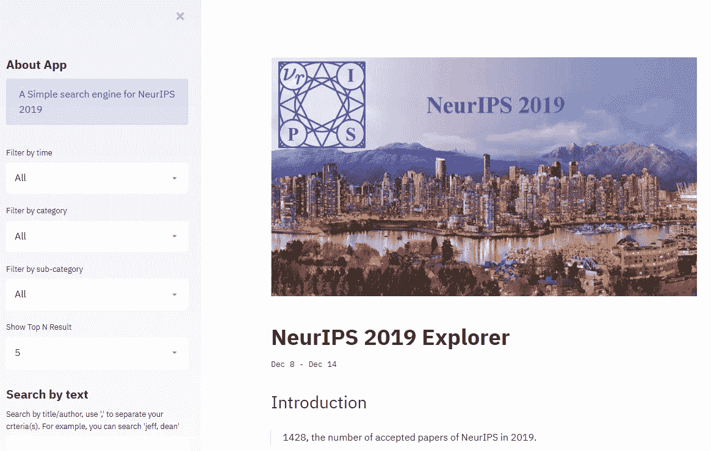

# NeurIPS 2019 论文浏览器—带 Streamlit

> 原文：<https://towardsdatascience.com/neurips-2019-exploration-app-with-streamlit-923efdd8ce01?source=collection_archive---------25----------------------->

screenshot of the app

NeurIPS 2019 explorer 帮助您找到需要阅读的论文。

[https://neurips2019exploration.herokuapp.com](https://neurips2019exploration.herokuapp.com)

# NeurIPS 2019 探索者应用

 [## 细流

### NeurIPS 2019 探索 App

neurips2019exploration.herokuapp.com](https://neurips2019exploration.herokuapp.com/) 

(点击上面的应用程序)

自从我知道了 streamlit，我总是想尝试用它来构建一些东西。所以我最终建立了一个小应用程序来探索 NeurIPS 2019 的论文，今年接受的论文数量惊人——1428 篇论文。

你可以在这里找到代码:【https://github.com/noklam/NeurIPS2019Exploration】T2

# 介绍

应用程序的创建并不复杂，我花了大部分时间解析数据(特别是在应用程序的创建过程中，他们更新了网站，所以我不得不重新编写一些脚本来解析数据。🙄).另一大部分时间花在了弄清 streamlit 的动态并使其工作上。

Streamlit 太棒了，它不需要太多思考就能完成大部分工作。但是他们也得到改进的空间，比如表格和文字的渲染不一致。它们有多种显示文本的方式，如果你把它们混合在一起，最终会有一些不太好的格式，你也没有一个简单的方法来配置。

另一个缺陷是您没有选项来配置 dataframe 的列宽，所以我最终不得不使用静态表(看起来有点奇怪)而不是动态表(这会截断文本并导致笨拙的水平滚动)。

最后，它仍然是一个伟大的图书馆，我相信他们会很快改进。建造这个很有趣。如果你发现了错误或者有什么建议，请告诉我。

附:当我建立这个应用程序时，他们不断地改变他们的网站，所以它只包括海报，但不包括教程和研讨会，我会很快将它们添加回来。

# 资源:

 [## NeurIPS 2019 日期和细节已公布

### NeurIPS(神经信息处理系统会议)的组织者今天宣布了日期和其他…

medium.com](https://medium.com/syncedreview/neurips-2019-dates-and-details-announced-a4958d938769) 

[https://towards data science . com/how-to-build-your-machine-learning-app-in-3-simple-steps-d56ed 910355 c](/how-to-build-your-machine-learning-app-in-3-simple-steps-d56ed910355c)